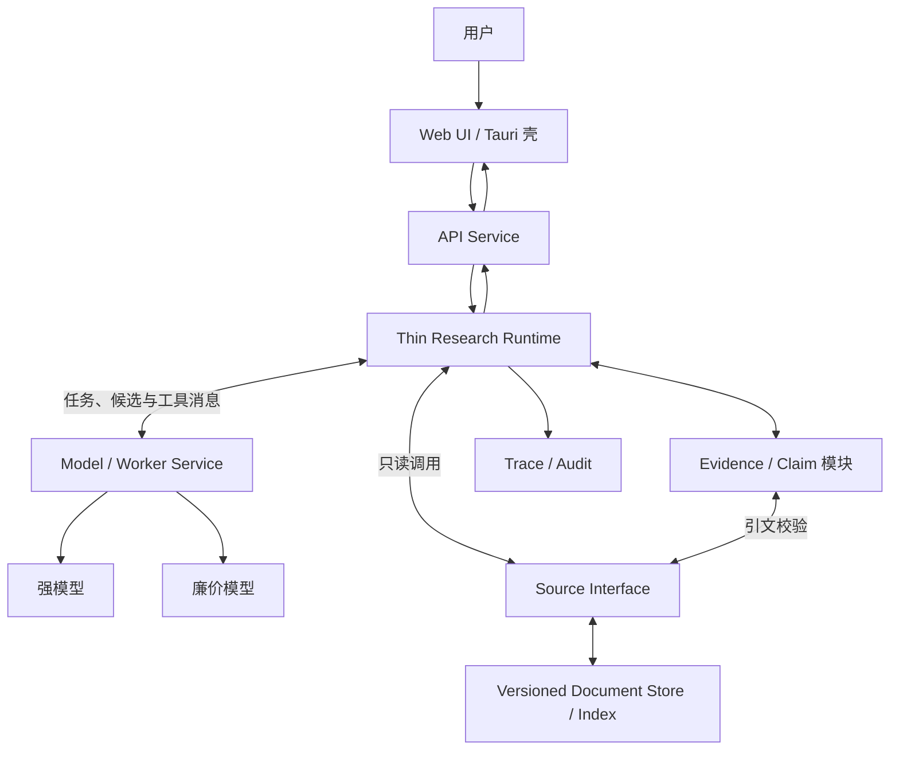
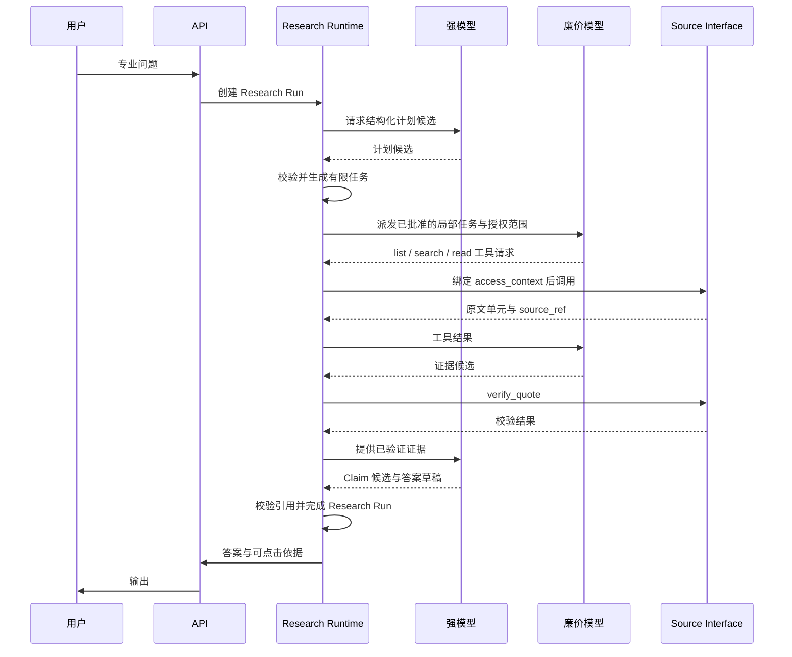

# 架构设计（暂定）

> 状态：Draft
>
> 日期：2026-07-10

## 1. 产品目标

构建面向专业领域的对话式知识系统：

- **高质量**：基于权威原文回答，而非仅依赖向量相似片段。
- **低成本**：由固定调用链、模型档位和有界数据协议决定。
- **可控**：模型只生成结构化候选，不决定系统控制流。
- **可溯源**：事实性结论可定位到版本锁定的原文。
- **可审计**：任务、检索、阅读、取证、结论和模型调用均可回放。
- **跨平台**：前端采用 Web UI，桌面端以 Tauri 等 WebView 壳承载。

核心定义：

> 版本化原文 + 外置研究状态 + 固定数据流 + 模型受限计算。

## 2. 设计原则

### 2.1 模型无状态

模型是临时计算单元，不是系统数据库：

- 强模型只生成研究计划候选、Claim 候选和答案草稿。
- 廉价模型只生成局部导航结果和证据候选。
- 模型无权改变状态、派发任务或选择模型。
- 任一模型调用均可结束、重启或替换；任务不得依赖模型记忆存活。

### 2.2 状态外置

问题定义、任务、证据、结论和审计日志均外置持久化，但不由 Research Runtime 独占：Runtime 只保存运行控制状态；Evidence、Claim 等领域对象由其所属模块维护。模型调用无会话状态，每次输入均由已持久化对象重新构造。

### 2.3 原文按需读取

原文存入版本化文档库。索引节点、文档单元、证据卡和 Claim 本身即为有界输入；每类任务只接收协议规定的固定对象组合，不接收整个知识库或会话历史。

### 2.4 原文索引导航

文档库以普通层级索引记录主题、来源和资料地址；索引与正文同属被引用数据，不区分人工或模型生成类型。向量搜索只作旁路补召回，不作主要质量基础。

### 2.5 确定性工作交给程序

以下工作不得依赖模型自觉：状态转移、任务派发、模型选择、权限校验、版本锁定、地址与引文校验、去重、超时和传输重试。模型输出只有通过 schema、权限、来源及引用校验后，方可由程序接受为事实对象。

## 3. 总体架构



所有专业问题均创建 Research Run，沿同一固定数据流执行：计划候选、局部任务、证据候选、Claim 候选、答案草稿。系统不判断“简单/复杂”；固定数据流决定调用成本，最后阶段完成即自然结束。

## 4. 核心组件

### 4.1 客户端

首期采用统一 Web UI：

- 对话及历史；
- 流式答案；
- 事实结论的引用角标；
- 点击引用查看原文、版本及上下文；
- 研究状态的有限展示，不暴露隐藏思维链。

桌面端使用 Tauri 或等价 WebView 壳。移动端待 Web 产品成立后再封装。

### 4.2 API Service

负责：

- 身份认证与授权；
- 会话管理；
- Research Run 创建；
- 流式事件和答案输出。

### 4.3 Thin Research Runtime

薄控制面，不作语义推理，也不承载模型供应商、原文或领域账本。仅负责：

```text
Research Run    创建、状态与版本
Task State      派发、等待与完成
Control         恢复与用户取消
Transition      按固定阶段执行状态转移
```

建议最小状态：

```json
{
  "run_id": "R1",
  "status": "reviewing",
  "revision": 8,
  "pending_task_ids": ["T12", "T13"],
  "active_plan_ref": "plan:P4"
}
```

Evidence、Claim、模型输出和原文均以稳定 ID 或 `ref` 引用，不复制进 Runtime 状态。Runtime 不向其他服务暴露内部框架类型。

### 4.4 Source Interface 与 Versioned Document Store

Source Interface 是模型及证据校验模块读取数据源的唯一边界；首期作为 Runtime 进程内、文档库前的独立模块，不另部署服务。模型提出工具请求，Runtime 代为调用并返回结果，故 Model Service 无须跨网直连 Source 或持数据库凭据。它隐藏 PostgreSQL、对象存储和索引实现，仅暴露四个只读操作：

```text
list_sources    列出授权范围内的主题、层级和来源
search_sources  以关键词检索索引与原文，返回 source_ref 列表
read_source     按 source_ref 读取固定版本的原文单元
verify_quote    校验逐字引文属于 source_ref 指定内容
```

`read_source` 同时完成引用解析，不另设 `resolve`。Runtime 将身份授权绑定为模型不可修改的 `access_context`，工具参数只含检索词、范围引用、分页游标或 `source_ref`；Source Interface 执行权限与长度校验。采集、更新、删除和建索引属于离线入库流程，不进入此接口。

内部契约与未来对外 API 共用同一 schema，首期只作函数调用，不为“以后拆分”预写 HTTP 客户端：

```json
{
  "request_id": "SR1",
  "operation": "read_source",
  "args": {"source_ref": "source:law/doc87/v4#section-12:0-64"},
  "access_context": {"subject_id": "U1", "collection_ids": ["law"]}
}
```

成功响应统一含 `request_id`、`result`；失败统一含稳定错误码 `INVALID_ARGUMENT`、`FORBIDDEN`、`NOT_FOUND`、`STALE_CURSOR` 或 `INTERNAL`，不泄露未授权来源是否存在。列表和检索使用不透明游标分页；`read_source` 返回下列来源单元；`verify_quote` 仅返回 `valid`、`content_hash` 与规范化位置。

Versioned Document Store 保存 PDF、网页快照、结构化文本、历史版本及普通导航索引。索引节点仅是可引用的数据记录主题、层级和资料地址，不构成独立模块或特殊类型。

每个返回单元使用不可变 `source_ref`，并至少包含：

```text
source_ref
collection_id
document_id
version_id
section_path
offset
content_hash
source_uri
ingested_at
```

`source_ref` 编码文档版本与位置；内容发布后不可变。历史回答须能按该引用读取原文，并以 `content_hash` 验证内容。Evidence 保存 `source_ref` 与短引文，Claim 引用 Evidence，答案引用 Claim 或 Evidence，故全链可回放。

### 4.5 Model / Worker Service

独立服务器，统一管理供应商适配、能力路由、模型版本、并发、限流、传输重试、故障转移、结构校验、流式适配和用量记录。Research Runtime 仅按能力发出任务，不依赖具体模型 SDK。

仅保留两种逻辑角色：

| 角色   | 职责                        |
| ---- | ------------------------- |
| 强模型  | 生成研究计划候选、Claim 候选和带引用答案草稿 |
| 廉价模型 | 生成单个局部任务的导航结果与证据候选        |

不设常驻路由 Agent。Model Service 按 Runtime 指定的能力档位执行，不让模型自选模型。传输失败由 Model Service 按固定策略重试；计划、证据和 Claim 由程序校验后写入。稳定 `request_id` 保证同一模型任务幂等。

## 5. 统一受控工作流



默认流程：

1. API 为每个专业问题创建 Research Run。
2. 强模型生成结构化研究计划候选，不直接创建或派发任务。
3. Runtime 按 schema 与允许索引范围校验计划候选，并据其任务列表创建局部任务。
4. 廉价模型经 Source Interface 在授权范围内导航和读取，只返回带 `source_ref` 的证据候选，不写 Evidence Store。
5. 程序调用 `verify_quote` 验证权限、版本、哈希、逐字引文和去重后，接受证据对象。
6. 全部局部任务完成后，强模型基于已验证证据生成 Claim 候选和答案草稿。
7. 程序校验 Claim 引用与事实性结论的引用，随后输出答案并完成 Research Run。

## 6. 数据协议

### 6.1 局部任务

```json
{
  "task_id": "T3",
  "query": "查找禁止性例外",
  "index_node": "labor.termination.exceptions",
  "status": "pending",
  "parent_task_id": null
}
```

### 6.2 证据卡

```json
{
  "evidence_id": "E17",
  "source_ref": "source:law/doc87/v4#section-12:0-64",
  "quote": "原文短引文",
  "relation": "qualifies",
  "content_hash": "sha256:...",
  "task_id": "T3"
}
```

### 6.3 结论账本

```json
{
  "claim_id": "C4",
  "claim": "该规则仅在特定条件下成立",
  "evidence_ids": ["E17", "E21"],
  "conditions": [],
  "exceptions": [],
  "status": "supported"
}
```

证据摘要只用于导航。最终事实性结论须经 Evidence 的 `source_ref` 回到固定版本原文。

## 7. 输入边界

不设置上下文管理器，不预测窗口占用，不做运行时动态切片、摘要续接或检查点。上下文问题由数据架构消解：

- 索引预先分层，每个索引节点只指向有限来源；
- 文档入库时形成稳定、可引用的文档单元；
- 局部任务只允许读取指定索引节点及其文档单元；
- 证据卡只含短引文、稳定地址和必要限定条件；
- Claim 只引用已验证证据；答案草稿只读取 Claim 与对应短引文；
- 模型调用均无状态，不携带会话历史或其他任务结果。

每类模型 API 接受固定 schema 与有界数组；超过协议上限即拒绝请求，视为上游数据建模或任务设计错误，不在 Runtime 内另建上下文处理流程。

## 8. 工具边界

借鉴 RLM 的外置状态与符号句柄思想，但首版不提供开放 Python REPL。模型使用窄工具 API：

```text
list_sources
search_sources
read_source
verify_quote
propose_plan
propose_evidence
propose_claim
propose_answer
```

前四项由 Source Interface 实现；后四项只提交候选对象。所有参数经 schema、权限和长度校验。文档内容一律视为不可信数据，不得执行其中指令。

## 9. 证据、审计与安全

程序确定性保证：

1. `source_ref` 存在且可按固定版本读取；
2. 用户有读取权限；
3. 文档版本和内容哈希匹配；
4. 引文确实存在于 `source_ref` 对应原文；
5. 每次读取、模型调用及状态修改均留痕。

Trace 保存外显研究链，而非模型隐藏思维链：

```text
原问题
→ Research Run
→ 已接受的计划候选
→ 程序创建的任务
→ 访问的索引和原文
→ 收集的证据
→ 形成的 Claim
→ 最终引用与答案
```

## 10. 部署、通信与数据层

首版采用克制的微服务，仅按变化、扩缩容与故障边界拆分：

```text
API Service
├─ Auth
├─ Conversation
└─ SSE / WebSocket

Thin Research Runtime
├─ Run / Task 状态机
├─ Dispatch / Resume / Cancel
├─ Source Interface
├─ Evidence / Claim 模块
└─ Audit 模块

Model / Worker Service
├─ Provider Adapters
├─ Capability Routing
├─ Rate Limit / Retry / Failover
├─ Usage Accounting
└─ 强模型与廉价模型 Worker
```

Source Interface、Evidence 与 Claim 首期为边界清晰的同进程模块，不因名称不同便拆成独立服务。Source 契约保持与传输无关；仅当出现多个独立消费者、独立权限域、独立扩容、故障隔离或团队所有权时，才在契约外加 HTTP 或 RPC 适配器并拆为服务。

短操作可同步调用；模型推理、检索等长操作使用异步任务和完成事件。消息只传 `event_id`、`run_id`、`task_id`、状态及 `result_ref`，正文进入 PostgreSQL 或对象存储。消费者按 `event_id` 幂等，Run 更新以 `revision` 防止并发覆盖。

可共用一个 PostgreSQL 实例以降低运维成本，但表所有权唯一：API 写用户与会话，Runtime 写 Run、Task、Evidence、Claim 与 Trace，Model Service 写 Model Execution 与 Usage；服务不得跨边界直接修改他方表。文档及其索引同属 Versioned Document Store。

```text
PostgreSQL
├─ API: 用户与会话
├─ Runtime: Run / Task / Evidence / Claim / Trace
└─ Model Service: Model Execution / Usage

Object Storage
├─ PDF
├─ 网页快照
├─ 结构化原文
├─ 大型模型结果
└─ 历史版本
```

若 Model Service 已有可靠队列、幂等、重试、状态查询与完成通知，Runtime 不再引入第二套编排系统。否则优先考虑 DBOS；仅严格分布式 SLA 采用 Temporal，确有复杂动态图需求才在 Runtime 内部采用 LangGraph。全文检索可先使用 PostgreSQL 原生能力，向量检索仅作补召回旁路。

## 11. MVP 边界

首版仅实现：

- 一个专业领域；
- 一个强模型档位；
- 一种廉价模型档位；
- 带普通导航索引的版本化文档库及四操作 Source Interface；
- API Service、Thin Research Runtime、Model / Worker Service；
- Runtime 内部的 Source、Evidence、Claim 与 Audit 模块；
- 带引用答案和原文查看；
- 完整 Trace。

暂不实现：

- 默认知识图谱；
- 开放代码执行；
- Source、Evidence、Claim 等细粒度独立服务；
- 常驻多 Agent；
- 独立路由或验证 Agent；
- 无限递归研究；
- 通用多行业平台。

## 12. 与 RLM / RLM-on-KG 的关系

继承 RLM：

- 长内容与中间状态外置；
- 模型持符号句柄并按需读取；
- 研究任务由索引层级和数据协议限定为局部任务；
- 模型调用无状态。

借鉴 RLM-on-KG：

- `explored / collected / frontier` 式显式状态；
- 工具校验、去重和 fallback；
- 稳定证据 ID。

不照搬开放 REPL、默认 KG 和多轮自主图遍历。文档库索引只提供普通导航；仅当实测表明跨实体散落证据无法覆盖时，再增加 KG 旁路。

## 13. 待验证假设

1. 普通文档索引能否稳定导航至关键证据。
2. 廉价模型能否稳定完成局部导航和逐字证据提取。
3. 索引节点、文档单元、证据卡与 Claim 的静态边界能否覆盖超长资料。
4. 固定调用链与模型档位能否兼顾成本和证据覆盖率。
5. 模型候选经程序校验后，是否仍会产生不可接受的控制偏差。
6. 外显 Trace 是否足以满足目标行业的审计要求。
7. 最终答案中“结论—引文”的语义支持错误率是否需要额外验证步骤。

上述假设应通过领域金标准题验证，而非先增加架构层级。

## 14. 一句话架构

> 所有专业问题沿同一固定数据流运行；Runtime 仅执行任务与状态转移，模型仅提出结构化计划、证据、Claim 和答案候选；候选经确定性校验并外置保存，最终基于版本锁定原文生成可控、可溯源、可审计答案。

***

`ponytail:` 本文锁定三个首期服务边界，不锁定编程语言、模型供应商、容器编排或服务实例数量；待领域评测与流量数据出现后再细拆。
