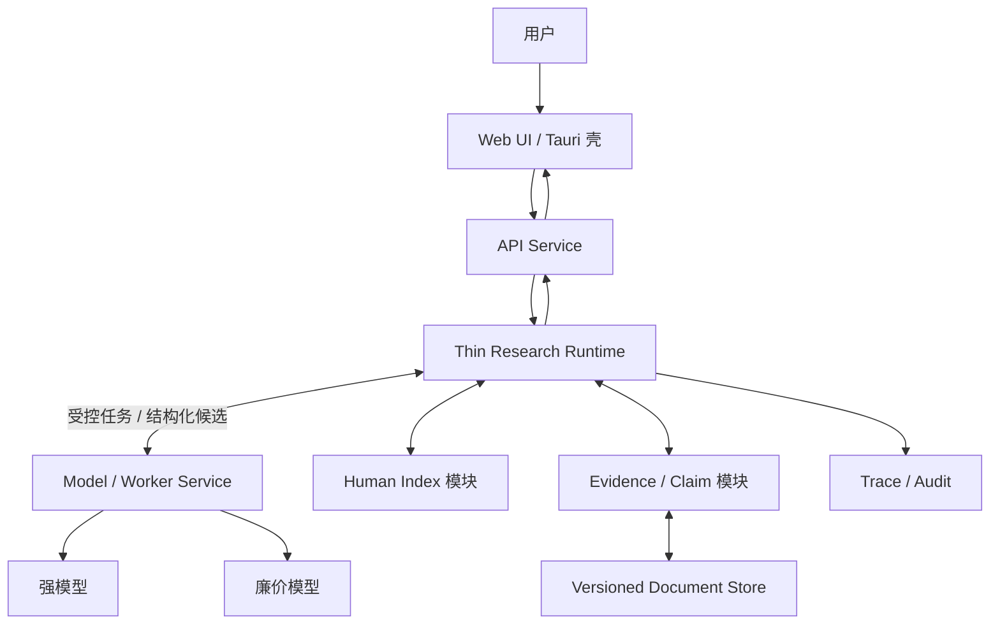
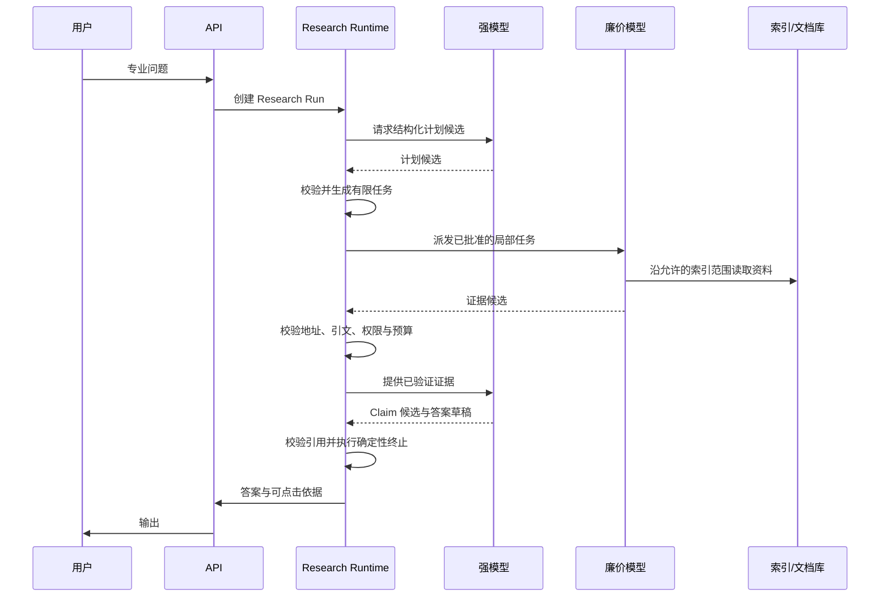

# 架构设计（暂定）

> 状态：Draft
>
> 日期：2026-07-10

## 1. 产品目标

构建面向专业领域的对话式知识系统：

- **高质量**：基于权威原文回答，而非仅依赖向量相似片段。
- **低成本**：统一流程按硬预算和确定性终止条件约束消耗。
- **可控**：模型只生成结构化候选，不决定系统控制流。
- **可溯源**：事实性结论可定位到版本锁定的原文。
- **可审计**：任务、检索、阅读、取证、结论和模型调用均可回放。
- **跨平台**：前端采用 Web UI，桌面端以 Tauri 等 WebView 壳承载。

核心定义：

> 人工专家索引 + 外置研究状态 + 程序确定性控制 + 模型受限计算。

## 2. 设计原则

### 2.1 模型无状态

模型是临时计算单元，不是系统数据库：

- 强模型只生成研究计划候选、Claim 候选和答案草稿。
- 廉价模型只生成局部导航结果和证据候选。
- 模型无权改变状态、派发任务、选择模型、扩大预算或决定终止。
- 任一模型调用均可结束、重启或替换；任务不得依赖模型记忆存活。

### 2.2 状态外置

问题定义、任务、证据、结论和审计日志均外置持久化，但不由 Research Runtime 独占：Runtime 只保存运行控制状态；Evidence、Claim 等领域对象由其所属模块维护。模型上下文只是本轮工作缓存。

### 2.3 原文按需读取

原文存入版本化文档库。模型通常只持稳定地址、短引文及当前需要的片段，不把整个知识库或全部历史塞入上下文。

### 2.4 人工索引优先

专家索引编码领域分类、权威来源、一般规则、例外和必查路径。向量搜索只作旁路补召回，不作主要质量基础。

### 2.5 确定性工作交给程序

以下工作不得依赖模型自觉：状态转移、任务派发、模型选择、token 计数、权限校验、版本锁定、地址与引文校验、去重、超时、重试、预算、补充轮次和终止。模型输出只有通过 schema、权限、来源及预算校验后，方可由程序接受为事实对象。

## 3. 总体架构



所有专业问题均创建 Research Run，进入同一有限状态机。系统不判断“简单/复杂”，只由程序根据固定阶段、已验证对象、硬预算和终止条件推进。问题较简单时自然少产生任务、较早满足确定性结束条件，而非绕过研究链路。

## 4. 核心组件

### 4.1 客户端

首期采用统一 Web UI：

- 对话及历史；
- 流式答案；
- 事实结论的引用角标；
- 点击引用查看原文、版本及上下文；
- 研究状态的有限展示，不暴露隐藏思维链。

桌面端使用 Tauri 或等价 WebView 壳。移动端待 Web 产品成立后再封装。

### 4.2 API Service

负责：

- 身份认证与授权；
- 会话管理；
- Research Run 创建；
- 流式事件和答案输出。

### 4.3 Thin Research Runtime

薄控制面，不作语义推理，也不承载模型供应商、原文或领域账本。仅负责：

```text
Research Run    创建、状态与版本
Task State      依赖、派发、等待与完成
Control         恢复、取消、截止时间、预算与轮次
Transition      根据结构化结果执行确定性状态转移
```

建议最小状态：

```json
{
  "run_id": "R1",
  "status": "reviewing",
  "revision": 8,
  "pending_task_ids": ["T12", "T13"],
  "active_plan_ref": "plan:P4",
  "supplement_round": 1,
  "budget_used": 3.72,
  "deadline": "2026-07-10T13:00:00Z"
}
```

Evidence、Claim、模型输出和原文均以稳定 ID 或 `ref` 引用，不复制进 Runtime 状态。Runtime 不向其他服务暴露内部框架类型。

### 4.4 Human Index

首版三级足矣：

```text
领域
└─ 主题
   └─ 资料地址
```

按真实需要增加子层，不预建固定五级结构。节点最小格式：

```json
{
  "id": "labor.termination.exceptions",
  "description": "劳动合同解除的限制、禁止及例外",
  "children": [],
  "sources": ["kb://law/doc87/v4"],
  "keywords": ["禁止解除", "例外", "特殊保护"]
}
```

模型只能按需读取当前节点、子节点和关联资料，不一次加载完整索引。

### 4.5 Versioned Document Store

保存 PDF、网页快照、结构化文本和历史版本。证据地址至少包含：

```text
collection_id
document_id
version_id
section_path
offset
content_hash
source_uri
ingested_at
```

地址必须稳定；历史回答须能按当时版本重放。

### 4.6 Model / Worker Service

独立服务器，统一管理供应商适配、能力路由、模型版本、并发、限流、传输重试、故障转移、结构校验、流式适配和用量记录。Research Runtime 仅按能力发出任务，不依赖具体模型 SDK。

仅保留两种逻辑角色：

| 角色   | 职责                        |
| ---- | ------------------------- |
| 强模型  | 生成研究计划候选、Claim 候选和带引用答案草稿 |
| 廉价模型 | 生成单个局部任务的导航结果与证据候选        |

不设常驻路由 Agent。Model Service 按 Runtime 指定的能力档位执行，不让模型自选模型。传输失败由 Model Service 按固定策略重试；计划、证据和 Claim 由程序校验后写入，补充研究与终止由 Runtime 的确定性规则决定。稳定 `request_id` 保证同一模型任务幂等。

## 5. 统一受控工作流



默认流程：

1. API 为每个专业问题创建 Research Run。
2. 强模型生成结构化研究计划候选，不直接创建或派发任务。
3. Runtime 按 schema、允许索引范围、任务上限和预算校验，生成有限任务。
4. 廉价模型只返回证据候选，不写 Evidence Store。
5. 程序验证权限、版本、地址、逐字引文和去重后，接受证据对象。
6. 强模型基于已验证证据生成 Claim 候选；程序校验引用关系后写入账本。
7. Runtime 仅按固定覆盖条件、预算、轮次和停滞阈值决定补充或终止。
8. 强模型生成答案草稿；程序校验事实性结论的引用后输出并保存完整外显研究链。

## 6. 数据协议

### 6.1 局部任务

```json
{
  "task_id": "T3",
  "query": "查找禁止性例外",
  "index_node": "labor.termination.exceptions",
  "status": "pending",
  "parent_task_id": null
}
```

### 6.2 证据卡

```json
{
  "evidence_id": "E17",
  "source": "kb://law/doc87/v4/section/12",
  "quote": "原文短引文",
  "relation": "qualifies",
  "content_hash": "sha256:...",
  "task_id": "T3"
}
```

### 6.3 结论账本

```json
{
  "claim_id": "C4",
  "claim": "该规则仅在特定条件下成立",
  "evidence_ids": ["E17", "E21"],
  "conditions": [],
  "exceptions": [],
  "status": "supported"
}
```

证据摘要只用于导航。最终事实性结论须能回到原文地址。

## 7. 上下文管理

### 7.1 强模型

每次调用仅加载：

```text
系统规则
+ 用户原问题
+ 当前研究目标
+ 结构化状态摘要
+ 当前 Claim Ledger
+ 本轮必要证据
```

不加载全部历史、全部工具输出或全部原文。后端确定性计算：

```text
input_tokens + reserved_output_tokens + safety_margin < context_limit
```

达到窗口约 60%–70% 时创建结构化检查点，结束当前调用，以新调用继续。检查点保存事实对象和引用关系，不以自由文本摘要替代原文。

### 7.2 廉价模型

每个调用只处理一个局部任务。上下文过大则由程序拆分：

```text
大索引分支 → 子分支
长文档 → 章节
长章节 → 自然段片段
```

调用完成即销毁；结果仅为候选，经程序验证后方写入 Evidence Store。

### 7.3 总证据超过窗口

按 Claim 分组处理：

```text
证据组 A → Claim A
证据组 B → Claim B
多个 Claim → 最终综合
```

最终模型读取 Claim Ledger、关键短引文和原文地址；存疑时定点回读。

## 8. 工具边界

借鉴 RLM 的外置状态、符号句柄和递归分片思想，但首版不提供开放 Python REPL。模型使用窄工具 API：

```text
list_index
search_index
list_sources
read_document
propose_plan
propose_evidence
propose_claim
propose_answer
```

所有参数经 schema、权限和长度校验。文档内容一律视为不可信数据，不得执行其中指令。

## 9. 证据、审计与安全

程序确定性保证：

1. 证据地址存在；
2. 用户有读取权限；
3. 文档版本和内容哈希匹配；
4. 引文确实存在于对应原文；
5. 每次读取、模型调用及状态修改均留痕。

Trace 保存外显研究链，而非模型隐藏思维链：

```text
原问题
→ Research Run
→ 已接受的计划候选
→ 程序创建的任务
→ 访问的索引和原文
→ 收集的证据
→ 形成的 Claim
→ 最终引用与答案
```

## 10. 成本与终止

成本控制不依赖模型分流，也不设计多级套餐状态机。所有 Research Run 使用同一组程序硬约束：

- 最大任务数；
- 最大模型调用数；
- 最大输入/输出 token；
- 最大运行时间；
- 最大补充检索轮数；
- 连续无新证据的停滞阈值。

无效工具调用由程序校验、去重并使用确定性 fallback；超预算时基于现有证据回答或明确说明证据不足。

## 11. 部署、通信与数据层

首版采用克制的微服务，仅按变化、扩缩容与故障边界拆分：

```text
API Service
├─ Auth
├─ Conversation
└─ SSE / WebSocket

Thin Research Runtime
├─ Run / Task 状态机
├─ Budget / Deadline
├─ Dispatch / Resume / Cancel
├─ Human Index 模块
├─ Evidence / Claim 模块
└─ Audit 模块

Model / Worker Service
├─ Provider Adapters
├─ Capability Routing
├─ Rate Limit / Retry / Failover
├─ Usage Accounting
└─ 强模型与廉价模型 Worker
```

Evidence、Claim 与 Retrieval 首期为边界清晰的模块，不因名称不同便拆成独立服务；仅在独立扩容、权限隔离、故障隔离或团队所有权出现后拆分。

短操作可同步调用；模型推理、检索等长操作使用异步任务和完成事件。消息只传 `event_id`、`run_id`、`task_id`、状态及 `result_ref`，正文进入 PostgreSQL 或对象存储。消费者按 `event_id` 幂等，Run 更新以 `revision` 防止并发覆盖。

可共用一个 PostgreSQL 实例以降低运维成本，但表所有权唯一：API 写用户与会话，Runtime 写 Run、Task、Evidence、Claim、Index 与 Trace，Model Service 写 Model Execution 与 Usage；服务不得跨边界直接修改他方表。

```text
PostgreSQL
├─ API: 用户与会话
├─ Runtime: Run / Task / Evidence / Claim / Index / Trace
└─ Model Service: Model Execution / Usage

Object Storage
├─ PDF
├─ 网页快照
├─ 结构化原文
├─ 大型模型结果
└─ 历史版本
```

若 Model Service 已有可靠队列、幂等、重试、状态查询与完成通知，Runtime 不再引入第二套编排系统。否则优先考虑 DBOS；仅严格分布式 SLA 采用 Temporal，确有复杂动态图需求才在 Runtime 内部采用 LangGraph。全文检索可先使用 PostgreSQL 原生能力，向量检索仅作补召回旁路。

## 12. MVP 边界

首版仅实现：

- 一个专业领域；
- 一个强模型档位；
- 一种廉价模型档位；
- 人工三级索引；
- 版本化文档库；
- API Service、Thin Research Runtime、Model / Worker Service；
- Runtime 内部的 Evidence、Claim、Index 与 Audit 模块；
- 带引用答案和原文查看；
- 完整 Trace。

暂不实现：

- 默认知识图谱；
- 开放代码执行；
- Evidence、Claim、Retrieval 等细粒度独立服务；
- 常驻多 Agent；
- 独立路由或验证 Agent；
- 无限递归研究；
- 通用多行业平台。

## 13. 与 RLM / RLM-on-KG 的关系

继承 RLM：

- 长内容与中间状态外置；
- 模型持符号句柄并按需读取；
- 大任务可递归拆成局部任务；
- 上下文可随时重建。

借鉴 RLM-on-KG：

- `explored / collected / frontier` 式显式状态；
- 工具校验、去重和 fallback；
- 停滞检测与最大预算；
- 稳定证据 ID。

不照搬开放 REPL、默认 KG 和 10–25 轮自主图遍历。人工专家索引负责预先编码高价值研究路径；仅当实测表明跨实体散落证据无法覆盖时，再增加 KG 旁路。

## 14. 待验证假设

1. 人工索引能否以可接受维护成本显著提高关键证据召回率。
2. 廉价模型能否稳定完成局部导航和逐字证据提取。
3. Claim 分组能否在不损失关键条件和例外的前提下控制上下文。
4. 统一流程的硬预算能否兼顾轻量问题成本与困难问题覆盖率。
5. 模型候选经程序校验后，是否仍会产生不可接受的控制偏差。
6. 外显 Trace 是否足以满足目标行业的审计要求。
7. 最终答案中“结论—引文”的语义支持错误率是否需要额外验证步骤。

上述假设应通过领域金标准题验证，而非先增加架构层级。

## 15. 一句话架构

> 所有专业问题进入同一持久研究运行时；程序掌握任务、预算、状态转移与终止，模型仅提出结构化计划、证据、Claim 和答案候选；候选经确定性校验并外置保存，最终基于版本锁定原文生成可控、可溯源、可审计答案。

***

`ponytail:` 本文锁定三个首期服务边界，不锁定编程语言、模型供应商、容器编排或服务实例数量；待领域评测与流量数据出现后再细拆。
