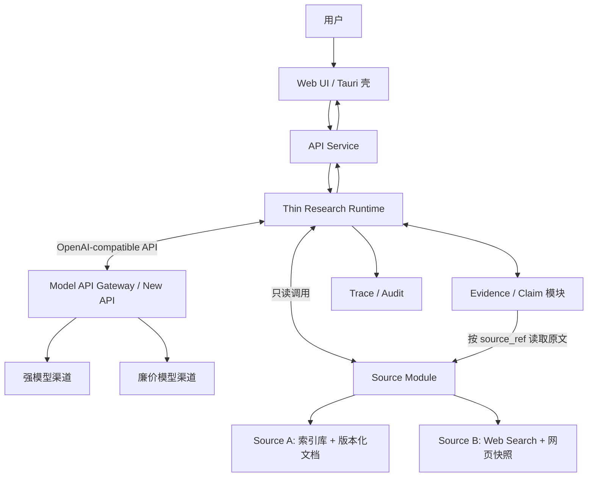
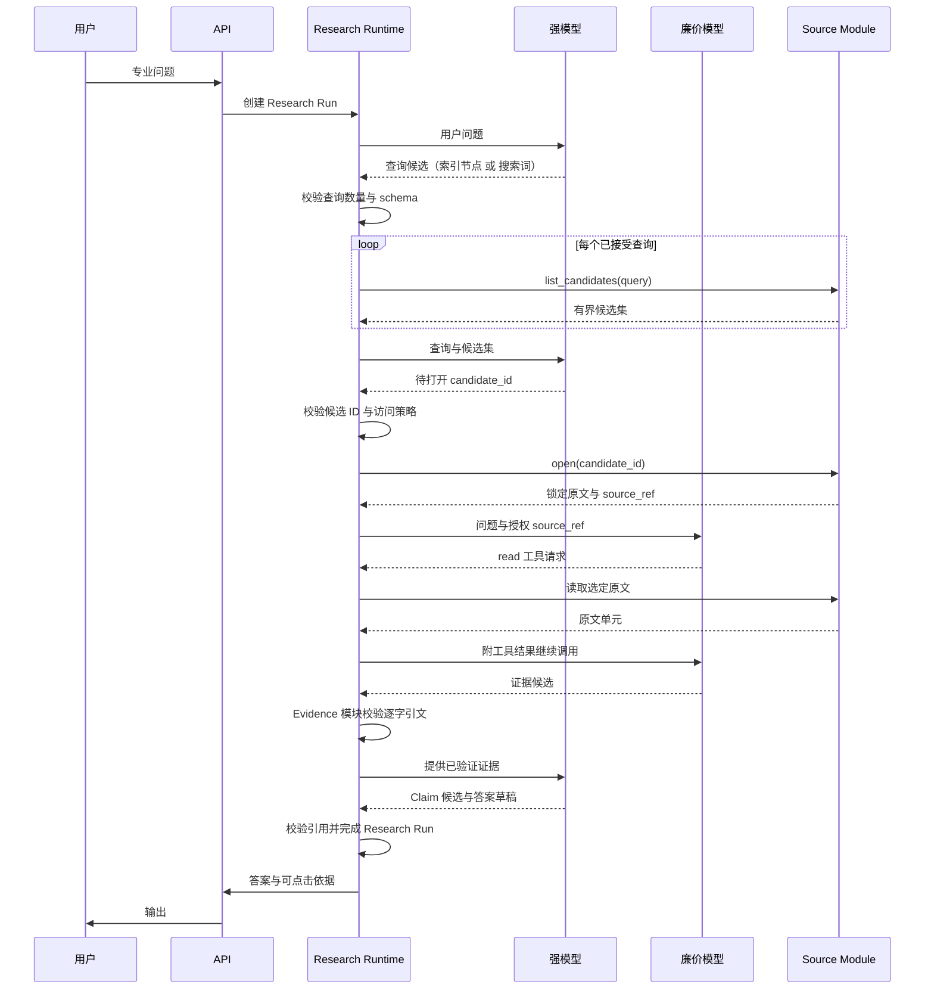

# 架构设计（暂定）

> 状态：Draft
>
> 日期：2026-07-10

## 1. 产品目标

构建面向专业领域的对话式知识系统：

- **高质量**：基于权威原文回答，而非仅依赖向量相似片段。
- **低成本**：由固定调用链、模型档位和有界数据协议决定。
- **可控**：模型只生成结构化候选，不决定系统控制流。
- **可溯源**：事实性结论可定位到版本锁定的原文。
- **可审计**：任务、检索、阅读、取证、结论和模型调用均可回放。
- **跨平台**：前端采用 Web UI，桌面端以 Tauri 等 WebView 壳承载。

核心定义：

> 版本锁定原文 + 外置研究状态 + 固定数据流 + 模型受限计算。

## 2. 两版架构与共享主干

本系统只有一个变量：**原文从哪里来**。除 Source 层外，Runtime、Evidence、Claim、Trace、模型网关与前端在两版中完全一致。

- **架构 A：结构化索引数据库版**。原文来自人工维护的分层索引库与版本化文档。强模型逐层选择索引节点，Runtime 展开直接子节点直至定位文档单元。来源可控、层级清晰、可审计性最强，但需先建设和维护索引库。
- **架构 B：Web Search 版**。原文来自公网。强模型生成搜索词，从每个搜索词的候选网页中选择要打开的页面，Runtime 抓取并存档网页快照。免建重型文档库、覆盖广，但来源质量、可抓取性与稳定性依赖公网。

两版共用同一抽象：

```text
生成候选查询 → 从有界候选集选择 → 读取选定原文单元 → 逐字取证 → 结论与答案
```

差异只落在 Source Module 的一个契约上（见第 5 节）。因此可先上线一版，后续增补另一版为可插拔 Source，而不改动 Runtime、Evidence、Claim 或 Trace 协议。

> 首期选择：以**架构 B（Web Search）**作为 MVP，工作量最小；架构 A 作为完整规格保留，按需接入。

## 3. 设计原则

### 3.1 模型无状态

模型是临时计算单元，不是系统数据库：

- 强模型只生成查询候选（索引节点或搜索词）、候选选择、Claim 候选和答案草稿。
- 廉价模型只生成选定原文单元内的证据候选。
- 模型无权改变状态、派发任务或选择模型。
- 任一模型调用均可结束、重启或替换；任务不得依赖模型记忆存活。

### 3.2 状态外置

问题定义、任务、证据、结论和审计日志均外置持久化，但不由 Research Runtime 独占：Runtime 只保存运行控制状态；Evidence、Claim 等领域对象由其所属模块维护。模型调用无会话状态，每次输入均由已持久化对象重新构造。

### 3.3 原文按需读取与版本锁定

原文一律按需读取，且引用前必须锁定不变版本：

- 架构 A：文档入库即形成稳定文档单元，`source_ref` 编码文档、版本与位置。
- 架构 B：搜索结果页只提供标题、摘要与 URL，属导航候选；选中网页被打开后，Source Module 保存正文快照、抓取时间和内容哈希，生成稳定 `source_ref`。

无论哪版，候选、证据卡和 Claim 均为有界输入；每类任务只接收协议规定的固定对象组合，不接收全部候选或会话历史。

### 3.4 浅层候选导航

强模型先生成有限查询候选，Runtime 校验后取回每个查询对应的有界候选集，强模型只能从当前集合中选择。其逻辑是逐层选枝，两版仅层级深度不同：

- 架构 A：`索引根 → 子节点 → …… → 文档单元`，层级可深。
- 架构 B：`搜索词 → 候选网页 → 网页原文`，层级浅。

模型不得自造节点 ID 或 URL；只有当前候选集合内、且成功定位/抓取并锁定版本的原文方可进入取证。

### 3.5 确定性工作交给程序

以下工作不得依赖模型自觉：状态转移、任务派发、模型选择、权限校验、版本锁定、地址与引文校验、去重、超时和传输重试。模型输出只有通过 schema、权限、来源及引用校验后，方可由程序接受为事实对象。

### 3.6 合规抓取，遇反爬即弃

抓取只取能光明正大获得的内容。遇到反爬封锁、验证码、登录墙或付费墙，不破解、不绕过、不接代理池打码——直接放弃该源，转候选中下一个可合规抓取的。`open_source` 抓取失败返回明确失败态，主模型据此改选其他候选，抓取失败是正常信号而非缺陷。

推论：抓取后端（trafilatura / 自托管 Firecrawl / Jina Reader 等）是 Source Module 内部可插拔实现，不影响三工具契约（`search_candidates / open_source / read_source`），可后期随意更换或并存。唯一硬约束——快照与 content_hash 的存档必须在自有信任边界内完成，不得把证据链托付给第三方托管抓取。

边界含义：合规抓不到、但又权威必需的源（如登录墙内的法律库），不属于架构 B（Web Search）的能力范围，归架构 A（结构化索引数据库）覆盖。PoC 运行中被跳过的源清单，即为架构 A 的需求来源。

## 4. 总体架构



所有专业问题均创建 Research Run，沿同一固定数据流执行：查询候选、候选选择、局部取证任务、证据候选、Claim 候选、答案草稿。系统不判断“简单/复杂”；固定数据流决定调用成本，最后阶段完成即自然结束。虚线框内的 `Source A / Source B` 是同一契约的两个实现，同一部署可只启用其一。

## 5. Source Module 与两个实现

Source Module 是 Runtime 内的数据访问边界，不是独立服务。首期代码可命名为 `SourceRepository`，集中封装原文来源，使模型不直接访问数据库或网络。它对 Runtime 只暴露三个稳定操作：

```text
list_candidates(query)  返回该查询的有界候选集（索引子节点 或 候选网页）
open(candidate_id)      校验候选并锁定原文，生成稳定 source_ref
read(source_ref)        读取锁定原文中的原文单元
```

强模型只能从 `list_candidates` 的返回集合中选择 `candidate_id`；不得提交集合外的节点 ID 或 URL。Runtime 规定查询数量、每查询候选数、可访问范围与安全策略。廉价模型只可 `read` 已 `open` 的原文单元。逐字引文校验属于 Evidence 模块。首期不预设 HTTP / RPC、请求封套或复杂分页；出现第二个独立消费者后再增加传输接口。

`open` 后每个可读单元至少包含：

```text
source_ref
unit_id            架构A为文档段ID / 架构B为快照段ID
section_path
offset
content_hash
source_uri         架构A为文档URI / 架构B为原始网页URL
locked_at          架构A为文档版本时间 / 架构B为抓取时间
```

`source_ref` 编码原文与位置；历史回答须能按该引用读取当时原文，并以 `content_hash` 验证内容一致。Evidence 保存 `source_ref` 与短引文，Claim 引用 Evidence，答案引用 Claim 或 Evidence，故全链可回放。

### 5.1 架构 A：结构化索引数据库

- `list_candidates(node_id)` 返回该节点的直接子节点（ID、标题、描述、排序），根查询返回一级索引。
- `open(node_id)` 在叶节点定位版本化文档，`source_ref` 形如 `source:doc/law87/v4#section-12`。
- 索引为人工维护的普通邻接表；主题树与法律效力、来源类型、适用地域、有效状态等正交属性分离存储。
- 文档单元入库即锁定版本，历史版本保留，回答始终引用当时版本。

### 5.2 架构 B：Web Search

- `list_candidates(query)` 执行 Web Search，返回该搜索词的候选网页卡（标题、摘要、URL）。
- `open(candidate_id)` 校验 URL 与访问策略后抓取网页，存档可重放快照，`source_ref` 形如 `source:web/snapshot-87#section-12`。
- Runtime 阻止内网地址、非 HTTP(S) 协议、重定向越界及超限响应。
- 搜索结果页不是证据；若网页因登录、动态渲染或禁止抓取而无法形成快照，则不得作为可审计证据。

### 5.3 可插拔性

两个实现共享 `list_candidates / open / read` 契约、`source_ref` 语义和上述单元字段。新增实现只需满足该契约，Runtime、Evidence、Claim 与 Trace 协议不变。同一部署可只启用一个 Source，也可同时挂载多个并按来源标记 Trace。

## 6. 核心组件

### 6.1 客户端

首期采用统一 Web UI：

- 对话及历史；
- 流式答案；
- 事实结论的引用角标；
- 点击引用查看原文、版本及上下文；
- 研究状态的有限展示，不暴露隐藏思维链。

桌面端使用 Tauri 或等价 WebView 壳。移动端待 Web 产品成立后再封装。

### 6.2 API Service

负责：

- 身份认证与授权；
- 会话管理；
- Research Run 创建；
- 流式事件和答案输出。

### 6.3 Thin Research Runtime

薄控制面，不作语义推理，也不承载模型供应商、原文或领域账本。仅负责：

```text
Research Run    创建、状态与版本
Task State      派发、等待与完成
Control         恢复与用户取消
Transition      按固定阶段执行状态转移
```

建议最小状态：

```json
{
  "run_id": "R1",
  "status": "reviewing",
  "revision": 8,
  "pending_task_ids": ["T12", "T13"],
  "selected_source_refs": ["source:web/snapshot-87#section-12"]
}
```

Evidence、Claim、模型输出和原文均以稳定 ID 或 `ref` 引用，不复制进 Runtime 状态。Runtime 与 Source 实现解耦，只知道抽象契约，不知道背后是数据库还是 Web Search。

### 6.4 Model API Gateway

独立部署现成统一模型网关，首选 New API 或等价 OpenAI-compatible gateway，不自研模型代理层。网关管理供应商渠道、模型映射、密钥、负载均衡、限流、传输重试和用量统计；Research Runtime 只调用稳定的模型别名，不依赖具体供应商 SDK。

```text
research-strong  → 当前选定的强模型渠道
research-cheap   → 当前选定的廉价模型渠道
```

模型别名到供应商模型的映射只在网关配置，切换渠道不改变 Runtime 协议。网关不承载 Research Run、业务任务队列、Source 工具执行、结构候选校验或 Evidence / Claim 写入；这些仍由 Runtime 掌握。

仅保留两种逻辑角色：

| 角色   | 职责                        |
| ---- | ------------------------- |
| 强模型  | 生成查询候选、选择候选、生成 Claim 与带引用答案草稿 |
| 廉价模型 | 在选定原文单元内读取并生成证据候选             |

不设常驻路由 Agent。廉价模型可理解为受控检索子任务执行者，类似 subagent，但无通用 Agent 自治权：任务、授权数据范围、可用工具、输出 schema 与完成条件均由 Runtime 固定；不得扩域、派生其他 Agent 或写数据库。Runtime 校验其证据候选后方可写入，并以稳定 `request_id` 记录模型调用。

## 7. 统一受控工作流

下图以抽象操作描述，两版仅 `list_candidates / open` 的语义不同（A 为索引节点，B 为搜索词与网页）。



默认流程：

1. API 为每个专业问题创建 Research Run。
2. 强模型返回有限查询候选（架构 A 为索引节点 ID，架构 B 为搜索词）；Runtime 校验数量与 schema。
3. Runtime 对每个查询调用 `list_candidates`，将有界候选集交给强模型；强模型只能返回当前集合中的 `candidate_id`。
4. Runtime 校验候选 ID 与访问策略，`open` 所选原文并锁定版本/存档快照；失败者不进入证据流程。
5. Runtime 按选定 `source_ref` 创建有限局部任务。廉价模型只能 `read` 授权原文并返回符合 schema 的证据候选；不得扩域、派生任务或写库。
6. Evidence 模块验证权限、版本/快照、哈希、逐字引文和去重后，接受证据对象；候选摘要不得充当证据。
7. 全部局部任务完成后，强模型读取问题、检索记录和已验证证据，生成 Claim 候选和答案草稿。
8. 程序校验 Claim 引用与事实性结论的引用，随后输出答案并完成 Research Run。

## 8. 数据协议

### 8.1 查询与候选

架构 A（索引节点）：

```json
{
  "query": "node:law.social.labor",
  "candidates": [
    {
      "candidate_id": "law.social.labor.termination",
      "title": "劳动合同解除",
      "description": "解除条件、程序、补偿与违法解除责任"
    }
  ]
}
```

架构 B（搜索网页）：

```json
{
  "query": "劳动合同解除 经济补偿 法律规定",
  "candidates": [
    {
      "candidate_id": "W12",
      "title": "中华人民共和国劳动合同法",
      "snippet": "……",
      "url": "https://example.gov.cn/law/..."
    }
  ]
}
```

强模型只能选择当前返回集合中的 `candidate_id`。Runtime 不接受模型自造节点 ID 或 URL，候选摘要不替代原文证据。

### 8.2 局部任务

```json
{
  "task_id": "T3",
  "query": "查找解除合同的补偿规则与例外",
  "source_ref": "source:web/snapshot-87#section-12",
  "status": "pending",
  "parent_task_id": null
}
```

### 8.3 证据卡

```json
{
  "evidence_id": "E17",
  "source_ref": "source:web/snapshot-87#section-12:0-64",
  "quote": "原文短引文",
  "relation": "qualifies",
  "content_hash": "sha256:...",
  "task_id": "T3"
}
```

### 8.4 结论账本

```json
{
  "claim_id": "C4",
  "claim": "该规则仅在特定条件下成立",
  "evidence_ids": ["E17", "E21"],
  "conditions": [],
  "exceptions": [],
  "status": "supported"
}
```

候选摘要只用于导航。最终事实性结论须经 Evidence 的 `source_ref` 回到锁定原文。

## 9. 输入边界

不设置上下文管理器，不预测窗口占用，不做运行时动态切片、摘要续接或检查点。上下文问题由数据架构消解：

- 强模型只读取有界查询集合及每查询有限候选，不接收无限候选或全树；
- Runtime 只展开已选查询的直接候选，不全量递归后代；
- 原文入库/抓取时形成稳定、可引用的原文单元；
- 局部任务只允许读取已授权原文单元；
- 证据卡只含短引文、稳定地址和必要限定条件；
- Claim 只引用已验证证据；答案草稿只读取 Claim 与对应短引文；
- 模型调用均无状态，不携带会话历史或其他任务结果。

每类模型 API 接受固定 schema 与有界数组；超过协议上限即拒绝请求，视为上游数据建模或任务设计错误，不在 Runtime 内另建上下文处理流程。

## 10. 工具边界

借鉴 RLM 的外置状态与符号句柄思想，但首版不提供开放 Python REPL。模型只使用 Runtime 暴露的窄工具：

```text
list_candidates
open
read
propose_evidence
propose_claim
propose_answer
```

`list_candidates`、`open` 与 `read` 由 Source Module 执行；其余工具只提交候选对象。查询生成与候选选择是强模型的结构化响应；廉价模型只可见 `read` 和已授权 `source_ref`。Runtime 固定每类模型可见工具、授权范围和参数 schema。原文内容一律视为不可信数据，不得执行其中指令（架构 B 的网页内容尤须警惕注入）。

## 11. 证据、审计与安全

程序确定性保证：

1. `source_ref` 存在且可按锁定版本/快照读取；
2. 用户有读取权限；
3. 原文版本/快照和内容哈希匹配；
4. 引文确实存在于 `source_ref` 对应原文；
5. 每次读取、模型调用及状态修改均留痕。

Trace 保存外显研究链，而非模型隐藏思维链：

```text
原问题
→ Research Run
→ 查询、候选与已接受 candidate_id
→ 程序创建的任务
→ 打开的原文（文档版本 或 网页快照）
→ 收集的证据
→ 形成的 Claim
→ 最终引用与答案
```

每条 Trace 记录 Source 类型，便于混挂多源时区分证据来源。

## 12. 部署、通信与数据层

首版采用克制的微服务，仅按变化、扩缩容与故障边界拆分：

```text
API Service
├─ Auth
├─ Conversation
└─ SSE / WebSocket

Thin Research Runtime
├─ Run / Task 状态机
├─ Dispatch / Resume / Cancel
├─ Source Module (`SourceRepository`：A 索引库 / B Web Search)
├─ Evidence / Claim 模块
└─ Audit 模块

Model API Gateway（New API）
├─ Provider Channels / Model Aliases
├─ API Keys / Access Policy
├─ Load Balance / Rate Limit / Retry
└─ Usage Accounting
```

Source、Evidence 与 Claim 首期皆为 Runtime 内的普通模块，不因名称不同便拆成服务。仅当 Source 出现第二个独立消费者、独立权限域或独立扩容需求时，才加 HTTP 或 RPC 接口并拆分。

API 创建 Research Run 后即可异步返回 `run_id`；Runtime 自行推进持久任务。模型调用在部署层经 New API 的同步或流式 OpenAI-compatible 接口完成，不改变研究工作流。首期不为模型调用另设消息队列或完成事件服务。

数据落位随 Source 实现而异，但表所有权唯一：

```text
Application PostgreSQL
├─ API: 用户与会话
├─ Runtime: Run / Task / Model Call / Evidence / Claim / Trace
└─ Source A: 索引节点 / 文档单元元数据 / 版本

New API Database
└─ 渠道 / 模型映射 / 密钥 / 用量

Object Storage
├─ Source A: 版本化文档正文与历史版本
├─ Source B: 网页快照
└─ 大型模型结果
```

API 与 Runtime 可共用一个 PostgreSQL 实例以降低运维成本：API 写用户与会话，Runtime 写 Run、Task、Model Call、Evidence、Claim 与 Trace，Source A 写索引与文档元数据；服务不得跨边界直接修改他方表。New API 使用其自身数据库保存渠道配置、密钥与用量，不作为研究状态库。

New API 仅是模型网关，不视为任务编排器。Runtime 的持久任务状态可先直接使用 PostgreSQL；仅需事务式工作流时考虑 DBOS，仅严格分布式 SLA 采用 Temporal，确有复杂动态图需求才采用 LangGraph。首期不建设全文检索或向量检索数据库。

## 13. 两版对比

| 维度       | 架构 A：结构化索引数据库              | 架构 B：Web Search           |
| -------- | -------------------------- | ------------------------- |
| 原文来源     | 人工维护的分层索引库 + 版本化文档         | 公网网页                       |
| 导航层级     | 深，`根 → 子节点 → 文档单元`         | 浅，`搜索词 → 网页 → 原文`         |
| `source_ref` | `source:doc/…/v4#…`（文档版本） | `source:web/snapshot-…#…`（抓取快照） |
| 前期工作量    | 高，需建设与维护索引库                | 低，接搜索供应商即可                 |
| 来源可控性    | 高，权威范围人工圈定                 | 中，依赖搜索排序与站点质量             |
| 覆盖广度     | 受索引库范围限制                   | 广，覆盖公网                     |
| 版本稳定性    | 强，文档版本长期可读                 | 中，须靠快照锁定，原页可能失效           |
| 注入与安全风险  | 低，来源受控                     | 较高，网页内容须视为不可信             |
| 适用场景     | 边界清晰、权威性要求高的封闭领域           | 快速起步、覆盖开放领域               |

两版可共存：先以 B 起步验证工作流，逐步为高价值领域建设 A 索引库，或对同一问题混挂两源交叉验证。

## 14. 与 RLM / RLM-on-KG 的关系

继承 RLM：

- 长内容与中间状态外置；
- 模型持符号句柄并按需读取；
- 研究任务由候选集合和数据协议限定为局部任务；
- 模型调用无状态。

借鉴 RLM-on-KG：

- `explored / collected / frontier` 式显式状态；
- 工具校验、去重和 fallback；
- 稳定证据 ID。

不照搬开放 REPL、默认 KG 和多轮自主图遍历。架构 A 的索引只提供普通导航，不预设 KG；架构 B 以浅层候选导航替代专用知识库。仅当实测表明来源控制、覆盖率或稳定性不足时，再增补另一版或加 KG 旁路。

## 15. MVP 边界

首版仅实现：

- 一个专业领域；
- 一个强模型档位、一种廉价模型档位；
- **一种 Source 实现（首选架构 B：Web Search + 网页快照）**，经抽象契约接入；
- API Service、Thin Research Runtime、独立 New API 模型网关；
- Runtime 内部的 Source、Evidence、Claim 与 Audit 模块；
- 带引用答案和原文查看；
- 完整 Trace。

暂不实现：

- 架构 A 与 B 同时上线（先落一版，另一版按契约增补）；
- 默认知识图谱；
- 开放代码执行；
- Source、Evidence、Claim 等细粒度独立服务；
- 常驻多 Agent、独立路由或验证 Agent；
- 无限递归研究；
- 通用多行业平台；
- 全文检索与向量检索。

## 16. 待验证假设

1. 选定的 Source（A 索引库 或 B Web Search）能否稳定召回权威且可读取的关键原文。
2. 强模型能否稳定生成查询并选中相关候选，廉价模型能否稳定提取逐字证据。
3. 查询候选、原文单元、证据卡与 Claim 的静态边界能否覆盖超长资料。
4. 固定调用链与模型档位能否兼顾成本和证据覆盖率。
5. 模型候选经程序校验后，是否仍会产生不可接受的控制偏差。
6. 外显 Trace 是否足以满足目标行业的审计要求。
7. 最终答案中“结论—引文”的语义支持错误率是否需要额外验证步骤。
8. 抽象 Source 契约能否在不改 Runtime / Evidence / Claim 协议的前提下同时容纳两版。

上述假设应通过领域金标准题验证，而非先增加架构层级。

## 17. 一句话架构

> 所有专业问题沿同一固定数据流运行；强模型生成查询并从有界候选中选择原文，Runtime 校验、锁定版本或存档快照，廉价模型在授权原文内提取证据；原文来源可为结构化索引库（架构 A）或 Web Search（架构 B），二者共享同一 Source 契约与证据、审计协议，最终生成可控、可溯源、可审计答案。

***

`ponytail:` 本文以单一抽象 Source 契约同时容纳“数据库版”和“Web Search 版”，MVP 先落 Web Search 一版；另一版按同契约增补，不改 Runtime、Evidence、Claim 或 Trace。不锁定编程语言、模型供应商、容器编排或服务实例数量。
