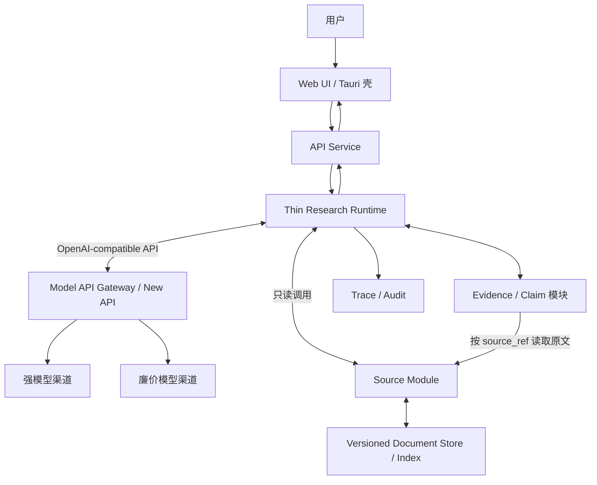
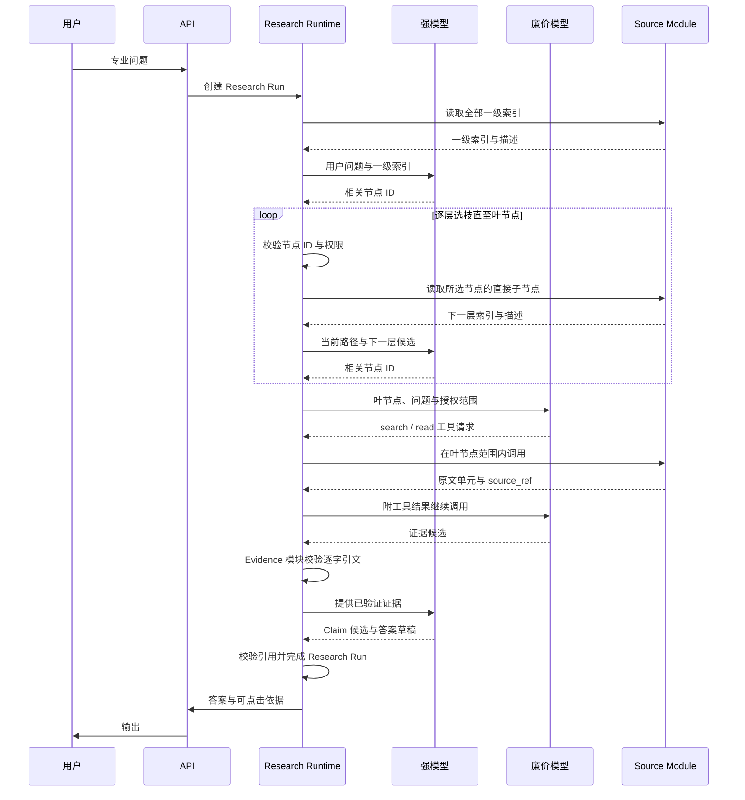

# 架构设计（暂定）

> 状态：Draft
>
> 日期：2026-07-10

## 1. 产品目标

构建面向专业领域的对话式知识系统：

- **高质量**：基于权威原文回答，而非仅依赖向量相似片段。
- **低成本**：由固定调用链、模型档位和有界数据协议决定。
- **可控**：模型只生成结构化候选，不决定系统控制流。
- **可溯源**：事实性结论可定位到版本锁定的原文。
- **可审计**：任务、检索、阅读、取证、结论和模型调用均可回放。
- **跨平台**：前端采用 Web UI，桌面端以 Tauri 等 WebView 壳承载。

核心定义：

> 版本化原文 + 外置研究状态 + 固定数据流 + 模型受限计算。

## 2. 设计原则

### 2.1 模型无状态

模型是临时计算单元，不是系统数据库：

- 强模型只生成逐层索引选择、Claim 候选和答案草稿。
- 廉价模型只生成限定叶节点内的证据候选。
- 模型无权改变状态、派发任务或选择模型。
- 任一模型调用均可结束、重启或替换；任务不得依赖模型记忆存活。

### 2.2 状态外置

问题定义、任务、证据、结论和审计日志均外置持久化，但不由 Research Runtime 独占：Runtime 只保存运行控制状态；Evidence、Claim 等领域对象由其所属模块维护。模型调用无会话状态，每次输入均由已持久化对象重新构造。

### 2.3 原文按需读取

原文存入版本化文档库。索引节点、文档单元、证据卡和 Claim 本身即为有界输入；每类任务只接收协议规定的固定对象组合，不接收整个知识库或会话历史。

### 2.4 分层索引导航

文档库以普通多叉树记录主题及资料地址。强模型先读取全部一级索引并选择相关根节点；Runtime 校验节点 ID 与权限后，只展开所选节点的直接子节点；强模型逐层选枝，Runtime 逐层校验，直至叶节点。不得由 Runtime 全量递归后代：程序只负责确定性的树结构读取，语义相关性仍由模型判断。

索引与正文同属可引用数据，不区分人工或模型生成类型。树仅表达从宽到窄的主题路径；法律效力、来源类型、适用地域和有效状态等正交属性另存字段，不以树层级推断。少量跨主题关系可用关联节点表达，不为此引入知识图谱。关键词全文搜索只作旁路补召回，不作主要质量基础。

### 2.5 确定性工作交给程序

以下工作不得依赖模型自觉：状态转移、任务派发、模型选择、权限校验、版本锁定、地址与引文校验、去重、超时和传输重试。模型输出只有通过 schema、权限、来源及引用校验后，方可由程序接受为事实对象。

## 3. 总体架构



所有专业问题均创建 Research Run，沿同一固定数据流执行：逐层索引选择、局部任务、证据候选、Claim 候选、答案草稿。系统不判断“简单/复杂”；固定数据流决定调用成本，最后阶段完成即自然结束。

## 4. 核心组件

### 4.1 客户端

首期采用统一 Web UI：

- 对话及历史；
- 流式答案；
- 事实结论的引用角标；
- 点击引用查看原文、版本及上下文；
- 研究状态的有限展示，不暴露隐藏思维链。

桌面端使用 Tauri 或等价 WebView 壳。移动端待 Web 产品成立后再封装。

### 4.2 API Service

负责：

- 身份认证与授权；
- 会话管理；
- Research Run 创建；
- 流式事件和答案输出。

### 4.3 Thin Research Runtime

薄控制面，不作语义推理，也不承载模型供应商、原文或领域账本。仅负责：

```text
Research Run    创建、状态与版本
Task State      派发、等待与完成
Control         恢复与用户取消
Transition      按固定阶段执行状态转移
```

建议最小状态：

```json
{
  "run_id": "R1",
  "status": "reviewing",
  "revision": 8,
  "pending_task_ids": ["T12", "T13"],
  "selected_index_paths": [["law", "law.social", "law.social.labor"]]
}
```

Evidence、Claim、模型输出和原文均以稳定 ID 或 `ref` 引用，不复制进 Runtime 状态。Runtime 不向其他服务暴露内部框架类型。

### 4.4 Source Module 与 Versioned Document Store

Source Module 是 Runtime 内的数据访问边界，不是独立服务。它集中数据库查询，隐藏 PostgreSQL、对象存储和索引细节，使模型和工作流均不直接接触数据库。首期代码可命名为 `SourceRepository`。Runtime 内部只需以下只读查询：

```text
roots(collection_ids)       读取授权范围内的全部一级索引
children(parent_id)         读取某节点的直接子节点
search(query, node_ids)     在已选叶节点内作关键词补召回
read(source_ref)            读取固定版本的原文单元
```

其中 `roots` 与 `children` 是程序读取树结构，不暴露为模型可任意调用的导航工具；模型仍只获得当前层候选节点，以及限定范围的 `search`、`read`。Runtime 决定 `collection_ids` 与 `node_ids`，模型不得扩大范围。采集、更新、删除和建索引属于离线入库流程；逐字引文校验属于 Evidence 模块。首期不预设 HTTP / RPC、请求封套、稳定错误码或复杂分页；出现第二个独立消费者后再增加传输接口。

Versioned Document Store 保存 PDF、网页快照、结构化文本、历史版本及普通导航索引。最小索引结构如下；普通邻接表足够，不采用二叉树或复杂递归协议：

```text
index_nodes
├─ id
├─ parent_id
├─ title
├─ description
├─ sort_order
└─ status

index_sources
├─ index_node_id
└─ source_ref
```

索引树仅组织主题。文档另存 `authority_level`、`source_type`、`jurisdiction` 与 `status`；例如“劳动法”是主题路径，“法律 / 司法解释”是来源与效力属性，两者不得混为一棵树。叶节点经 `index_sources` 关联一个或多个固定版本原文。

每个返回单元使用不可变 `source_ref`，并至少包含：

```text
source_ref
collection_id
document_id
version_id
section_path
offset
content_hash
source_uri
ingested_at
```

`source_ref` 编码文档版本与位置；内容发布后不可变。历史回答须能按该引用读取原文，并以 `content_hash` 验证内容。Evidence 保存 `source_ref` 与短引文，Claim 引用 Evidence，答案引用 Claim 或 Evidence，故全链可回放。

### 4.5 Model API Gateway

独立部署现成统一模型网关，首选 New API 或等价 OpenAI-compatible gateway，不自研模型代理层。网关管理供应商渠道、模型映射、密钥、负载均衡、限流、传输重试和用量统计；Research Runtime 只调用稳定的模型别名，不依赖具体供应商 SDK。

```text
research-strong  → 当前选定的强模型渠道
research-cheap   → 当前选定的廉价模型渠道
```

模型别名到供应商模型的映射只在网关配置，切换渠道不改变 Runtime 协议。网关不承载 Research Run、业务任务队列、Source 工具执行、结构候选校验或 Evidence / Claim 写入；这些仍由 Runtime 掌握。

仅保留两种逻辑角色：

| 角色   | 职责                        |
| ---- | ------------------------- |
| 强模型  | 逐层选择相关索引，生成 Claim 候选和带引用答案草稿 |
| 廉价模型 | 在选定叶节点内检索原文并生成证据候选           |

不设常驻路由 Agent。廉价模型可理解为受控检索子任务执行者，类似 subagent，但无通用 Agent 自治权：任务、授权数据范围、可用工具、输出 schema 与完成条件均由 Runtime 固定；不得扩域、派生其他 Agent 或写数据库。Runtime 校验其证据候选后方可写入，并以稳定 `request_id` 记录模型调用。

## 5. 统一受控工作流



默认流程：

1. API 为每个专业问题创建 Research Run。
2. Runtime 读取授权范围内的全部一级索引，将用户问题、节点 ID、标题和描述交给强模型。
3. 强模型返回相关节点 ID；Runtime 校验 ID、层级与权限，只读取所选节点的直接子节点，再交给强模型选择。此过程逐层重复至叶节点，不遍历未选分支。
4. Runtime 按最终叶节点创建有限局部任务；索引路径随任务保存，作为导航记录和输入优先级，不作为事实证据。
5. 廉价模型只能在指定叶节点关联的原文内 `search`、`read`，只返回符合 schema、带 `source_ref` 的证据候选；不得扩域、派生任务或写库。
6. Evidence 模块验证权限、版本、哈希、逐字引文和去重后，接受证据对象。关键词全文搜索可检查漏召回，但不得绕过节点范围。
7. 全部局部任务完成后，强模型读取问题、索引路径和已验证证据，生成 Claim 候选和答案草稿。
8. 程序校验 Claim 引用与事实性结论的引用，随后输出答案并完成 Research Run。

## 6. 数据协议

### 6.1 索引节点

```json
{
  "id": "law.social.labor.termination",
  "parent_id": "law.social.labor",
  "title": "劳动合同解除",
  "description": "劳动合同解除的条件、程序、补偿与违法解除责任",
  "sort_order": 30,
  "status": "active"
}
```

模型每轮只返回当前候选集合中的节点 ID。Runtime 不接受模型自造路径，也不让索引描述替代原文证据。

### 6.2 局部任务

```json
{
  "task_id": "T3",
  "query": "查找禁止性例外",
  "index_node": "labor.termination.exceptions",
  "status": "pending",
  "parent_task_id": null
}
```

### 6.3 证据卡

```json
{
  "evidence_id": "E17",
  "source_ref": "source:law/doc87/v4#section-12:0-64",
  "quote": "原文短引文",
  "relation": "qualifies",
  "content_hash": "sha256:...",
  "task_id": "T3"
}
```

### 6.4 结论账本

```json
{
  "claim_id": "C4",
  "claim": "该规则仅在特定条件下成立",
  "evidence_ids": ["E17", "E21"],
  "conditions": [],
  "exceptions": [],
  "status": "supported"
}
```

证据摘要只用于导航。最终事实性结论须经 Evidence 的 `source_ref` 回到固定版本原文。

## 7. 输入边界

不设置上下文管理器，不预测窗口占用，不做运行时动态切片、摘要续接或检查点。上下文问题由数据架构消解：

- 强模型每轮只读取当前层的有限候选节点，不接收整棵索引树；
- Runtime 只展开已选节点的直接子级，不全量递归后代；
- 文档入库时形成稳定、可引用的文档单元；
- 局部任务只允许读取最终叶节点关联的文档单元；
- 证据卡只含短引文、稳定地址和必要限定条件；
- Claim 只引用已验证证据；答案草稿只读取 Claim 与对应短引文；
- 模型调用均无状态，不携带会话历史或其他任务结果。

每类模型 API 接受固定 schema 与有界数组；超过协议上限即拒绝请求，视为上游数据建模或任务设计错误，不在 Runtime 内另建上下文处理流程。

## 8. 工具边界

借鉴 RLM 的外置状态与符号句柄思想，但首版不提供开放 Python REPL。模型只使用 Runtime 暴露的窄工具：

```text
search
read
propose_evidence
propose_claim
propose_answer
```

`search` 与 `read` 由 Source Module 执行；其余工具只提交候选对象。逐层索引选择是强模型对当前候选集合的结构化响应，不另设可遍历数据库的模型工具。Runtime 固定每类模型可见的工具、授权范围和参数 schema。文档内容一律视为不可信数据，不得执行其中指令。

## 9. 证据、审计与安全

程序确定性保证：

1. `source_ref` 存在且可按固定版本读取；
2. 用户有读取权限；
3. 文档版本和内容哈希匹配；
4. 引文确实存在于 `source_ref` 对应原文；
5. 每次读取、模型调用及状态修改均留痕。

Trace 保存外显研究链，而非模型隐藏思维链：

```text
原问题
→ Research Run
→ 每轮候选索引与已接受节点 ID
→ 程序创建的任务
→ 访问的索引和原文
→ 收集的证据
→ 形成的 Claim
→ 最终引用与答案
```

## 10. 部署、通信与数据层

首版采用克制的微服务，仅按变化、扩缩容与故障边界拆分：

```text
API Service
├─ Auth
├─ Conversation
└─ SSE / WebSocket

Thin Research Runtime
├─ Run / Task 状态机
├─ Dispatch / Resume / Cancel
├─ Source Module (`SourceRepository`)
├─ Evidence / Claim 模块
└─ Audit 模块

Model API Gateway（New API）
├─ Provider Channels / Model Aliases
├─ API Keys / Access Policy
├─ Load Balance / Rate Limit / Retry
└─ Usage Accounting
```

Source、Evidence 与 Claim 首期皆为 Runtime 内的普通模块，不因名称不同便拆成服务。仅当 Source 出现第二个独立消费者、独立权限域或独立扩容需求时，才加 HTTP 或 RPC 接口并拆分。

API 创建 Research Run 后即可异步返回 `run_id`；Runtime 自行推进持久任务。模型调用在部署层经 New API 的同步或流式 OpenAI-compatible 接口完成，不改变研究工作流。首期不为模型调用另设消息队列或完成事件服务；正文进入 PostgreSQL 或对象存储，Run 更新以 `revision` 防止并发覆盖。

API 与 Runtime 可共用一个 PostgreSQL 实例以降低运维成本，但表所有权唯一：API 写用户与会话，Runtime 写 Run、Task、Model Call、Evidence、Claim 与 Trace；服务不得跨边界直接修改他方表。New API 使用其自身数据库保存渠道配置、密钥与用量，不作为研究状态库。文档及其索引同属 Versioned Document Store。

```text
Application PostgreSQL
├─ API: 用户与会话
└─ Runtime: Run / Task / Model Call / Evidence / Claim / Trace

New API Database
└─ 渠道 / 模型映射 / 密钥 / 用量

Object Storage
├─ PDF
├─ 网页快照
├─ 结构化原文
├─ 大型模型结果
└─ 历史版本
```

New API 仅是模型网关，不视为任务编排器。Runtime 的持久任务状态可先直接使用 PostgreSQL；仅需事务式工作流时考虑 DBOS，仅严格分布式 SLA 采用 Temporal，确有复杂动态图需求才采用 LangGraph。全文检索可先使用 PostgreSQL 原生能力，向量检索仅作补召回旁路。

## 11. MVP 边界

首版仅实现：

- 一个专业领域；
- 一个强模型档位；
- 一种廉价模型档位；
- 带分层导航索引的版本化文档库及薄 Source Module；
- API Service、Thin Research Runtime、独立 New API 模型网关；
- Runtime 内部的 Source、Evidence、Claim 与 Audit 模块；
- 带引用答案和原文查看；
- 完整 Trace。

暂不实现：

- 默认知识图谱；
- 开放代码执行；
- Source、Evidence、Claim 等细粒度独立服务；
- 常驻多 Agent；
- 独立路由或验证 Agent；
- 无限递归研究；
- 通用多行业平台。

## 12. 与 RLM / RLM-on-KG 的关系

继承 RLM：

- 长内容与中间状态外置；
- 模型持符号句柄并按需读取；
- 研究任务由索引层级和数据协议限定为局部任务；
- 模型调用无状态。

借鉴 RLM-on-KG：

- `explored / collected / frontier` 式显式状态；
- 工具校验、去重和 fallback；
- 稳定证据 ID。

不照搬开放 REPL、默认 KG 和多轮自主图遍历。文档库索引只提供普通导航；仅当实测表明跨实体散落证据无法覆盖时，再增加 KG 旁路。

## 13. 待验证假设

1. 普通文档索引能否稳定导航至关键证据。
2. 强模型能否稳定逐层选中相关节点，廉价模型能否稳定提取逐字证据。
3. 索引节点、文档单元、证据卡与 Claim 的静态边界能否覆盖超长资料。
4. 固定调用链与模型档位能否兼顾成本和证据覆盖率。
5. 模型候选经程序校验后，是否仍会产生不可接受的控制偏差。
6. 外显 Trace 是否足以满足目标行业的审计要求。
7. 最终答案中“结论—引文”的语义支持错误率是否需要额外验证步骤。

上述假设应通过领域金标准题验证，而非先增加架构层级。

## 14. 一句话架构

> 所有专业问题沿同一固定数据流运行；强模型逐层选择索引，Runtime 校验并展开直接子节点，廉价模型在最终叶节点内提取证据；候选经确定性校验并外置保存，最终基于版本锁定原文生成可控、可溯源、可审计答案。

***

`ponytail:` 本文锁定三个首期服务边界，不锁定编程语言、模型供应商、容器编排或服务实例数量；待领域评测与流量数据出现后再细拆。
