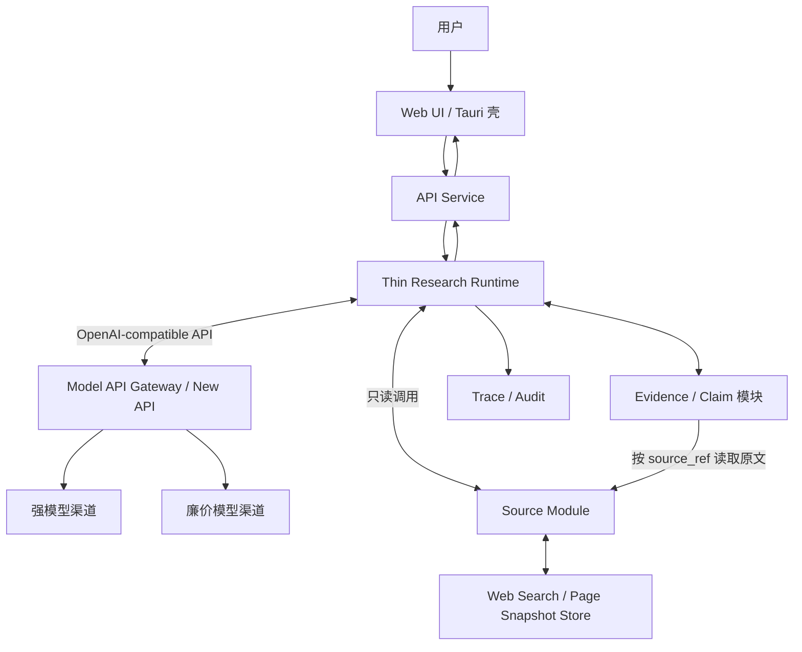
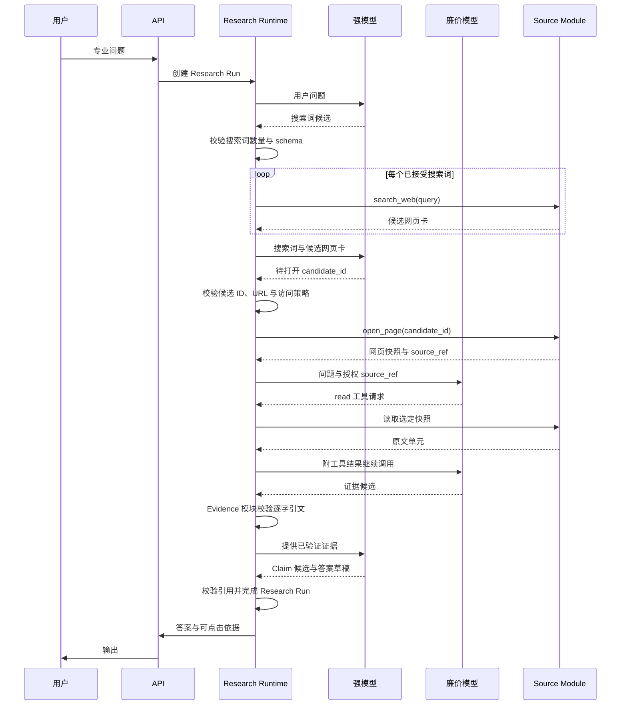

# 架构设计（暂定）

> 状态：Draft
>
> 日期：2026-07-10

## 1. 产品目标

构建面向专业领域的对话式知识系统：

- **高质量**：基于权威原文回答，而非仅依赖向量相似片段。
- **低成本**：由固定调用链、模型档位和有界数据协议决定。
- **可控**：模型只生成结构化候选，不决定系统控制流。
- **可溯源**：事实性结论可定位到版本锁定的原文。
- **可审计**：任务、检索、阅读、取证、结论和模型调用均可回放。
- **跨平台**：前端采用 Web UI，桌面端以 Tauri 等 WebView 壳承载。

核心定义：

> 版本化原文 + 外置研究状态 + 固定数据流 + 模型受限计算。

## 2. 设计原则

### 2.1 模型无状态

模型是临时计算单元，不是系统数据库：

- 强模型只生成搜索词、候选网页选择、Claim 候选和答案草稿。
- 廉价模型只生成选定网页内的证据候选。
- 模型无权改变状态、派发任务或选择模型。
- 任一模型调用均可结束、重启或替换；任务不得依赖模型记忆存活。

### 2.2 状态外置

问题定义、任务、证据、结论和审计日志均外置持久化，但不由 Research Runtime 独占：Runtime 只保存运行控制状态；Evidence、Claim 等领域对象由其所属模块维护。模型调用无会话状态，每次输入均由已持久化对象重新构造。

### 2.3 原文按需读取

首期原文来自 Web Search。搜索结果页只提供标题、摘要与 URL，属于导航候选；选中网页被打开后，Source Module 保存正文快照、抓取时间和内容哈希，生成稳定 `source_ref`。网页快照、证据卡和 Claim 均为有界输入；每类任务只接收协议规定的固定对象组合，不接收全部搜索结果或会话历史。

### 2.4 浅层候选导航

强模型先根据问题生成有限搜索词；Runtime 校验后执行 Web Search，并将每个搜索词对应的候选网页卡交给强模型；强模型选择需要打开的 URL，Runtime 校验 URL 后抓取网页快照。其逻辑仍是逐层选枝，只是首期仅有“搜索词—候选网页—原文”三层，无须先建设结构化数据库。

搜索摘要不得作为事实证据，模型自造 URL 亦不接受；只有当前候选集合内、成功抓取并固化快照的网页方可进入取证。未来若网页搜索的覆盖率、稳定性或来源控制不足，可在同一 Source 边界下增加结构化分层索引库；主题树与法律效力、来源类型、适用地域、有效状态等正交属性仍须分离。

### 2.5 确定性工作交给程序

以下工作不得依赖模型自觉：状态转移、任务派发、模型选择、权限校验、版本锁定、地址与引文校验、去重、超时和传输重试。模型输出只有通过 schema、权限、来源及引用校验后，方可由程序接受为事实对象。

## 3. 总体架构



所有专业问题均创建 Research Run，沿同一固定数据流执行：搜索词候选、网页候选选择、局部取证任务、证据候选、Claim 候选、答案草稿。系统不判断“简单/复杂”；固定数据流决定调用成本，最后阶段完成即自然结束。

## 4. 核心组件

### 4.1 客户端

首期采用统一 Web UI：

- 对话及历史；
- 流式答案；
- 事实结论的引用角标；
- 点击引用查看原文、版本及上下文；
- 研究状态的有限展示，不暴露隐藏思维链。

桌面端使用 Tauri 或等价 WebView 壳。移动端待 Web 产品成立后再封装。

### 4.2 API Service

负责：

- 身份认证与授权；
- 会话管理；
- Research Run 创建；
- 流式事件和答案输出。

### 4.3 Thin Research Runtime

薄控制面，不作语义推理，也不承载模型供应商、原文或领域账本。仅负责：

```text
Research Run    创建、状态与版本
Task State      派发、等待与完成
Control         恢复与用户取消
Transition      按固定阶段执行状态转移
```

建议最小状态：

```json
{
  "run_id": "R1",
  "status": "reviewing",
  "revision": 8,
  "pending_task_ids": ["T12", "T13"],
  "selected_source_refs": ["source:web/sha256:..."]
}
```

Evidence、Claim、模型输出和原文均以稳定 ID 或 `ref` 引用，不复制进 Runtime 状态。Runtime 不向其他服务暴露内部框架类型。

### 4.4 Source Module 与 Web Source

Source Module 是 Runtime 内的数据访问边界，不是独立服务。首期代码可命名为 `SourceRepository`，集中封装搜索供应商、网页抓取和快照存储，使模型不直接访问网络。Runtime 内部只需：

```text
search_web(query)       返回该搜索词的候选网页卡
open_page(candidate_id) 校验候选并抓取网页，生成 source_ref
read(source_ref)        读取固定快照中的原文单元
```

强模型生成搜索词并从 `search_web` 的返回集合选择 `candidate_id`；不得提交集合外 URL。Runtime 规定搜索词数量、每词候选数、可访问协议与域名策略，并阻止内网地址、非 HTTP(S) 协议、重定向越界及超限响应。廉价模型只可 `read` 已选网页。逐字引文校验属于 Evidence 模块。首期不预设 HTTP / RPC、请求封套或复杂分页；出现第二个独立消费者后再增加传输接口。

搜索结果页不是证据。`open_page` 须固化可重放快照；每个返回单元至少包含：

```text
source_ref
snapshot_id
section_path
offset
content_hash
source_uri
fetched_at
```

`source_ref` 编码快照与位置；历史回答须能按该引用读取当时原文，并以 `content_hash` 验证内容。Evidence 保存 `source_ref` 与短引文，Claim 引用 Evidence，答案引用 Claim 或 Evidence，故全链可回放。若网页因登录、动态渲染或禁止抓取而无法形成快照，则不得作为可审计证据。

结构化分层索引库是后续可插拔 Source，而非 MVP 前置条件。需要时可在同一接口后增加主题树和版本化文档；普通邻接表即可，无须改变 Runtime、Evidence 或 Claim 协议。

### 4.5 Model API Gateway

独立部署现成统一模型网关，首选 New API 或等价 OpenAI-compatible gateway，不自研模型代理层。网关管理供应商渠道、模型映射、密钥、负载均衡、限流、传输重试和用量统计；Research Runtime 只调用稳定的模型别名，不依赖具体供应商 SDK。

```text
research-strong  → 当前选定的强模型渠道
research-cheap   → 当前选定的廉价模型渠道
```

模型别名到供应商模型的映射只在网关配置，切换渠道不改变 Runtime 协议。网关不承载 Research Run、业务任务队列、Source 工具执行、结构候选校验或 Evidence / Claim 写入；这些仍由 Runtime 掌握。

仅保留两种逻辑角色：

| 角色   | 职责                        |
| ---- | ------------------------- |
| 强模型  | 生成搜索词、选择候选网页、生成 Claim 与带引用答案草稿 |
| 廉价模型 | 在选定网页快照内读取原文并生成证据候选             |

不设常驻路由 Agent。廉价模型可理解为受控检索子任务执行者，类似 subagent，但无通用 Agent 自治权：任务、授权数据范围、可用工具、输出 schema 与完成条件均由 Runtime 固定；不得扩域、派生其他 Agent 或写数据库。Runtime 校验其证据候选后方可写入，并以稳定 `request_id` 记录模型调用。

## 5. 统一受控工作流



默认流程：

1. API 为每个专业问题创建 Research Run。
2. 强模型根据用户问题返回有限搜索词；Runtime 校验数量与 schema 后执行 Web Search。
3. Runtime 将每个搜索词及其候选网页卡交给强模型；强模型只能返回当前集合中的 `candidate_id`。
4. Runtime 校验候选 ID、URL 与访问策略，打开所选网页并固化快照；失败网页不进入证据流程。
5. Runtime 按选定 `source_ref` 创建有限局部任务。廉价模型只能 `read` 授权快照并返回符合 schema 的证据候选；不得扩域、派生任务或写库。
6. Evidence 模块验证权限、快照、哈希、逐字引文和去重后，接受证据对象；搜索摘要不得充当证据。
7. 全部局部任务完成后，强模型读取问题、搜索记录和已验证证据，生成 Claim 候选和答案草稿。
8. 程序校验 Claim 引用与事实性结论的引用，随后输出答案并完成 Research Run。

## 6. 数据协议

### 6.1 搜索词与网页候选

```json
{
  "query": "劳动合同解除 经济补偿 法律规定",
  "candidates": [
    {
      "candidate_id": "W12",
      "title": "中华人民共和国劳动合同法",
      "snippet": "……",
      "url": "https://example.gov.cn/law/..."
    }
  ]
}
```

强模型只能选择当前返回集合中的 `candidate_id`。Runtime 不接受模型自造 URL，搜索摘要不替代网页原文证据。

### 6.2 局部任务

```json
{
  "task_id": "T3",
  "query": "查找解除合同的补偿规则与例外",
  "source_ref": "source:web/snapshot-87#section-12",
  "status": "pending",
  "parent_task_id": null
}
```

### 6.3 证据卡

```json
{
  "evidence_id": "E17",
  "source_ref": "source:web/snapshot-87#section-12:0-64",
  "quote": "原文短引文",
  "relation": "qualifies",
  "content_hash": "sha256:...",
  "task_id": "T3"
}
```

### 6.4 结论账本

```json
{
  "claim_id": "C4",
  "claim": "该规则仅在特定条件下成立",
  "evidence_ids": ["E17", "E21"],
  "conditions": [],
  "exceptions": [],
  "status": "supported"
}
```

搜索摘要只用于导航。最终事实性结论须经 Evidence 的 `source_ref` 回到固定网页快照。

## 7. 输入边界

不设置上下文管理器，不预测窗口占用，不做运行时动态切片、摘要续接或检查点。上下文问题由数据架构消解：

- 强模型只读取有界搜索词集合及每词有限候选网页，不接收无限搜索结果；
- Runtime 只展开已选节点的直接子级，不全量递归后代；
- 文档入库时形成稳定、可引用的文档单元；
- 局部任务只允许读取已授权网页快照中的原文单元；
- 证据卡只含短引文、稳定地址和必要限定条件；
- Claim 只引用已验证证据；答案草稿只读取 Claim 与对应短引文；
- 模型调用均无状态，不携带会话历史或其他任务结果。

每类模型 API 接受固定 schema 与有界数组；超过协议上限即拒绝请求，视为上游数据建模或任务设计错误，不在 Runtime 内另建上下文处理流程。

## 8. 工具边界

借鉴 RLM 的外置状态与符号句柄思想，但首版不提供开放 Python REPL。模型只使用 Runtime 暴露的窄工具：

```text
search_web
open_page
read
propose_evidence
propose_claim
propose_answer
```

`search_web`、`open_page` 与 `read` 由 Source Module 执行；其余工具只提交候选对象。搜索词生成与网页选择是强模型的结构化响应；廉价模型只可见 `read` 和已授权 `source_ref`。Runtime 固定每类模型可见工具、授权范围和参数 schema。网页内容一律视为不可信数据，不得执行其中指令。

## 9. 证据、审计与安全

程序确定性保证：

1. `source_ref` 存在且可按固定快照读取；
2. 用户有读取权限；
3. 网页快照和内容哈希匹配；
4. 引文确实存在于 `source_ref` 对应原文；
5. 每次读取、模型调用及状态修改均留痕。

Trace 保存外显研究链，而非模型隐藏思维链：

```text
原问题
→ Research Run
→ 搜索词、候选网页与已接受 candidate_id
→ 程序创建的任务
→ 打开的 URL、抓取结果与网页快照
→ 收集的证据
→ 形成的 Claim
→ 最终引用与答案
```

## 10. 部署、通信与数据层

首版采用克制的微服务，仅按变化、扩缩容与故障边界拆分：

```text
API Service
├─ Auth
├─ Conversation
└─ SSE / WebSocket

Thin Research Runtime
├─ Run / Task 状态机
├─ Dispatch / Resume / Cancel
├─ Source Module (`SourceRepository`)
├─ Evidence / Claim 模块
└─ Audit 模块

Model API Gateway（New API）
├─ Provider Channels / Model Aliases
├─ API Keys / Access Policy
├─ Load Balance / Rate Limit / Retry
└─ Usage Accounting
```

Source、Evidence 与 Claim 首期皆为 Runtime 内的普通模块，不因名称不同便拆成服务。仅当 Source 出现第二个独立消费者、独立权限域或独立扩容需求时，才加 HTTP 或 RPC 接口并拆分。

API 创建 Research Run 后即可异步返回 `run_id`；Runtime 自行推进持久任务。模型调用在部署层经 New API 的同步或流式 OpenAI-compatible 接口完成，不改变研究工作流。首期不为模型调用另设消息队列或完成事件服务；网页快照进入对象存储，元数据与运行状态进入 PostgreSQL，Run 更新以 `revision` 防止并发覆盖。

API 与 Runtime 可共用一个 PostgreSQL 实例以降低运维成本，但表所有权唯一：API 写用户与会话，Runtime 写 Run、Task、Model Call、Snapshot Metadata、Evidence、Claim 与 Trace；服务不得跨边界直接修改他方表。New API 使用其自身数据库保存渠道配置、密钥与用量，不作为研究状态库。

```text
Application PostgreSQL
├─ API: 用户与会话
└─ Runtime: Run / Task / Model Call / Evidence / Claim / Trace

New API Database
└─ 渠道 / 模型映射 / 密钥 / 用量

Object Storage
├─ 网页快照
└─ 大型模型结果
```

New API 仅是模型网关，不视为任务编排器。Runtime 的持久任务状态可先直接使用 PostgreSQL；仅需事务式工作流时考虑 DBOS，仅严格分布式 SLA 采用 Temporal，确有复杂动态图需求才采用 LangGraph。首期不建设全文检索或向量检索数据库。

## 11. MVP 边界

首版仅实现：

- 一个专业领域；
- 一个强模型档位；
- 一种廉价模型档位；
- 一种 Web Search 供应商、网页快照存储及薄 Source Module；
- API Service、Thin Research Runtime、独立 New API 模型网关；
- Runtime 内部的 Source、Evidence、Claim 与 Audit 模块；
- 带引用答案和原文查看；
- 完整 Trace。

暂不实现：

- 默认知识图谱；
- 开放代码执行；
- Source、Evidence、Claim 等细粒度独立服务；
- 常驻多 Agent；
- 独立路由或验证 Agent；
- 无限递归研究；
- 通用多行业平台；
- 结构化分层索引库、全文检索与向量检索。

## 12. 与 RLM / RLM-on-KG 的关系

继承 RLM：

- 长内容与中间状态外置；
- 模型持符号句柄并按需读取；
- 研究任务由搜索候选集合和数据协议限定为局部任务；
- 模型调用无状态。

借鉴 RLM-on-KG：

- `explored / collected / frontier` 式显式状态；
- 工具校验、去重和 fallback；
- 稳定证据 ID。

不照搬开放 REPL、默认 KG 和多轮自主图遍历。首期以 Web Search 的浅层候选导航替代专用知识库；仅当来源控制、覆盖率或稳定性不足时，再增加结构化分层索引 Source。

## 13. 待验证假设

1. Web Search 能否稳定召回权威且可抓取的关键网页。
2. 强模型能否稳定生成搜索词并选中相关网页，廉价模型能否稳定提取逐字证据。
3. 搜索候选、网页快照、证据卡与 Claim 的静态边界能否覆盖超长资料。
4. 固定调用链与模型档位能否兼顾成本和证据覆盖率。
5. 模型候选经程序校验后，是否仍会产生不可接受的控制偏差。
6. 外显 Trace 是否足以满足目标行业的审计要求。
7. 最终答案中“结论—引文”的语义支持错误率是否需要额外验证步骤。

上述假设应通过领域金标准题验证，而非先增加架构层级。

## 14. 一句话架构

> 所有专业问题沿同一固定数据流运行；强模型生成搜索词并选择候选网页，Runtime 校验、抓取并固化网页快照，廉价模型在授权快照内提取证据；候选经确定性校验并外置保存，最终生成可控、可溯源、可审计答案。

***

`ponytail:` 首期只接 Web Search，不建设结构化知识库；当召回、来源控制或网页稳定性不足时，在既有 Source 边界后增加分层索引与版本化文档。本文不锁定编程语言、模型供应商、容器编排或服务实例数量。
