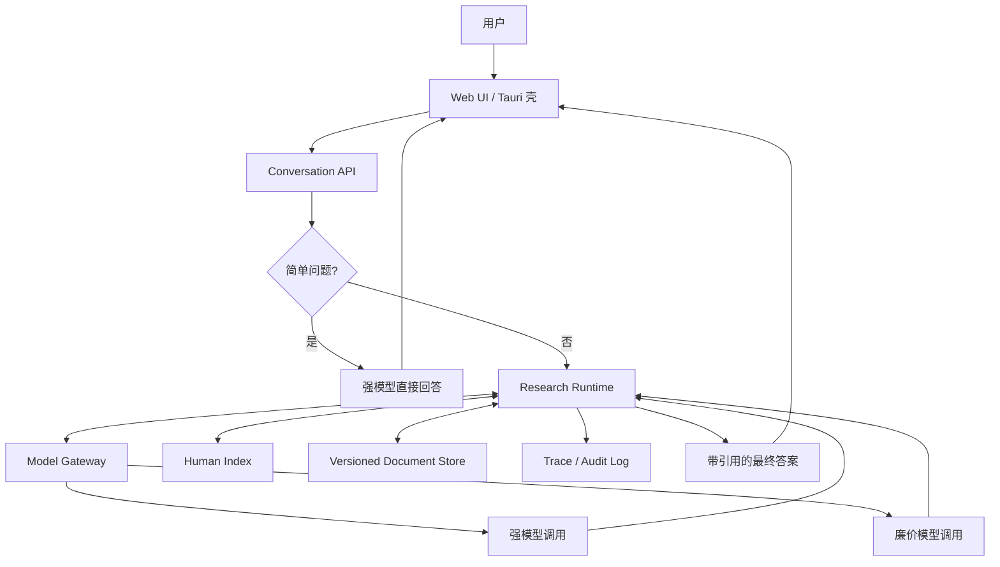
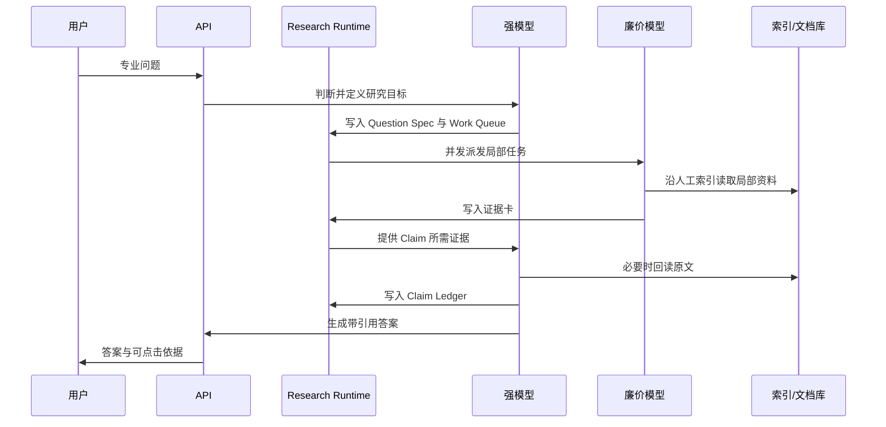

# 架构设计（暂定）

> 状态：Draft
>
> 日期：2026-07-10

## 1. 产品目标

构建面向专业领域的对话式知识系统：

- **高质量**：基于权威原文回答，而非仅依赖向量相似片段。
- **低成本**：简单问题直接回答，复杂问题才启动完整研究。
- **可溯源**：事实性结论可定位到版本锁定的原文。
- **可审计**：任务、检索、阅读、取证、结论和模型调用均可回放。
- **跨平台**：前端采用 Web UI，桌面端以 Tauri 等 WebView 壳承载。

核心定义：

> 人工专家索引 + 外置研究状态 + 强模型决策 + 廉价模型局部检索。

## 2. 设计原则

### 2.1 模型无状态

模型是临时计算单元，不是系统数据库：

- 强模型负责判断、规划、证据审阅和答案综合。
- 廉价模型负责局部索引导航、局部阅读和证据提取。
- 任一模型调用均可结束、重启或替换；任务不得依赖模型记忆存活。

### 2.2 状态外置

问题定义、任务队列、证据、结论和审计日志均保存在 Research Runtime。模型上下文只是本轮工作缓存。

### 2.3 原文按需读取

原文存入版本化文档库。模型通常只持稳定地址、短引文及当前需要的片段，不把整个知识库或全部历史塞入上下文。

### 2.4 人工索引优先

专家索引编码领域分类、权威来源、一般规则、例外和必查路径。向量搜索只作旁路补召回，不作主要质量基础。

### 2.5 确定性工作交给程序

以下工作不得依赖模型自觉：token 计数、权限校验、版本锁定、地址验证、引文存在性校验、去重、超时、重试、预算和停滞检测。

## 3. 总体架构



系统先作二级分流：

```text
简单问题 → 强模型直接回答
复杂问题 → 创建 Research Run，执行研究流程
```

无法可靠判定时按复杂问题处理。用户未来可显式选择“快速回答”或“深度研究”。

## 4. 核心组件

### 4.1 客户端

首期采用统一 Web UI：

- 对话及历史；
- 流式答案；
- 事实结论的引用角标；
- 点击引用查看原文、版本及上下文；
- 研究状态的有限展示，不暴露隐藏思维链。

桌面端使用 Tauri 或等价 WebView 壳。移动端待 Web 产品成立后再封装。

### 4.2 Conversation API

负责：

- 身份认证与授权；
- 会话管理；
- 问题分流；
- Research Run 创建；
- 流式事件和答案输出。

### 4.3 Research Runtime

系统核心。它不作语义推理，只可靠保存、调度研究状态：

```text
Question Spec   原问题、适用范围、研究目标
Work Queue      待办、执行中、完成或失败的局部任务
Evidence Store  版本锁定的证据卡
Claim Ledger    结论、条件、例外及其证据关系
Trace Log       所有外显研究动作和调用记录
```

建议最小状态：

```json
{
  "run_id": "R1",
  "question_spec": {},
  "work_queue": [],
  "evidence_store": [],
  "claim_ledger": [],
  "status": "researching"
}
```

### 4.4 Human Index

首版三级足矣：

```text
领域
└─ 主题
   └─ 资料地址
```

按真实需要增加子层，不预建固定五级结构。节点最小格式：

```json
{
  "id": "labor.termination.exceptions",
  "description": "劳动合同解除的限制、禁止及例外",
  "children": [],
  "sources": ["kb://law/doc87/v4"],
  "keywords": ["禁止解除", "例外", "特殊保护"]
}
```

模型只能按需读取当前节点、子节点和关联资料，不一次加载完整索引。

### 4.5 Versioned Document Store

保存 PDF、网页快照、结构化文本和历史版本。证据地址至少包含：

```text
collection_id
document_id
version_id
section_path
offset
content_hash
source_uri
ingested_at
```

地址必须稳定；历史回答须能按当时版本重放。

### 4.6 Model Gateway

统一封装模型供应商、能力档位、token 预算、超时、重试、并发和调用日志。

仅保留两种逻辑角色：

| 角色 | 职责 |
|---|---|
| 强模型 | 复杂度判断、研究规划、任务创建、证据审阅、Claim 形成、最终回答 |
| 廉价模型 | 单个局部任务中的索引导航、局部阅读、证据提取 |

不设常驻路由 Agent；路由能力并入强模型，调度交给程序。

## 5. 复杂问题工作流



默认流程：

1. 强模型定义问题范围与证据需求。
2. 强模型创建少量局部检索任务。
3. 后端并发调用廉价模型。
4. 廉价模型返回证据卡，而非长篇总结。
5. 强模型按 Claim 分批审阅证据，必要时定点回读原文。
6. 证据不足时允许有限补充检索；达到预算或停滞条件即停止。
7. 强模型依据 Claim Ledger 生成答案。
8. 后端保存完整外显研究链。

## 6. 数据协议

### 6.1 局部任务

```json
{
  "task_id": "T3",
  "query": "查找禁止性例外",
  "index_node": "labor.termination.exceptions",
  "status": "pending",
  "parent_task_id": null
}
```

### 6.2 证据卡

```json
{
  "evidence_id": "E17",
  "source": "kb://law/doc87/v4/section/12",
  "quote": "原文短引文",
  "relation": "qualifies",
  "content_hash": "sha256:...",
  "task_id": "T3"
}
```

### 6.3 结论账本

```json
{
  "claim_id": "C4",
  "claim": "该规则仅在特定条件下成立",
  "evidence_ids": ["E17", "E21"],
  "conditions": [],
  "exceptions": [],
  "status": "supported"
}
```

证据摘要只用于导航。最终事实性结论须能回到原文地址。

## 7. 上下文管理

### 7.1 强模型

每次调用仅加载：

```text
系统规则
+ 用户原问题
+ 当前研究目标
+ 结构化状态摘要
+ 当前 Claim Ledger
+ 本轮必要证据
```

不加载全部历史、全部工具输出或全部原文。后端确定性计算：

```text
input_tokens + reserved_output_tokens + safety_margin < context_limit
```

达到窗口约 60%–70% 时创建结构化检查点，结束当前调用，以新调用继续。检查点保存事实对象和引用关系，不以自由文本摘要替代原文。

### 7.2 廉价模型

每个调用只处理一个局部任务。上下文过大则由程序拆分：

```text
大索引分支 → 子分支
长文档 → 章节
长章节 → 自然段片段
```

调用完成即销毁，结果写入 Evidence Store。

### 7.3 总证据超过窗口

按 Claim 分组处理：

```text
证据组 A → Claim A
证据组 B → Claim B
多个 Claim → 最终综合
```

最终模型读取 Claim Ledger、关键短引文和原文地址；存疑时定点回读。

## 8. 工具边界

借鉴 RLM 的外置状态、符号句柄和递归分片思想，但首版不提供开放 Python REPL。模型使用窄工具 API：

```text
list_index
search_index
list_sources
read_document
spawn_task
add_evidence
write_claim
finish
```

所有参数经 schema、权限和长度校验。文档内容一律视为不可信数据，不得执行其中指令。

## 9. 证据、审计与安全

程序确定性保证：

1. 证据地址存在；
2. 用户有读取权限；
3. 文档版本和内容哈希匹配；
4. 引文确实存在于对应原文；
5. 每次读取、模型调用及状态修改均留痕。

Trace 保存外显研究链，而非模型隐藏思维链：

```text
原问题
→ 分流结果
→ 研究目标
→ 创建的任务
→ 访问的索引和原文
→ 收集的证据
→ 形成的 Claim
→ 最终引用与答案
```

## 10. 成本与终止

成本控制只保留二级分流，不设计多级套餐状态机。

复杂研究设置硬预算：

- 最大任务数；
- 最大模型调用数；
- 最大输入/输出 token；
- 最大运行时间；
- 最大补充检索轮数；
- 连续无新证据的停滞阈值。

无效工具调用由程序校验、去重并使用确定性 fallback；超预算时基于现有证据回答或明确说明证据不足。

## 11. 部署与数据层

首版采用模块化单体：

```text
Backend
├─ Auth
├─ Conversation
├─ Research Runtime
├─ Human Index
├─ Documents
├─ Model Gateway
└─ Audit
```

数据层暂定：

```text
PostgreSQL
├─ 用户与会话
├─ Research Run
├─ Work Queue
├─ Evidence
├─ Claim
├─ Index
└─ Trace

Object Storage
├─ PDF
├─ 网页快照
├─ 结构化原文
└─ 历史版本
```

全文检索可先使用 PostgreSQL 原生能力。向量检索仅作补召回旁路。

## 12. MVP 边界

首版仅实现：

- 一个专业领域；
- 一个强模型档位；
- 一种廉价模型档位；
- 人工三级索引；
- 版本化文档库；
- Research Runtime；
- Evidence Store 与 Claim Ledger；
- 带引用答案和原文查看；
- 完整 Trace。

暂不实现：

- 默认知识图谱；
- 开放代码执行；
- 微服务；
- 常驻多 Agent；
- 独立路由或验证 Agent；
- 无限递归研究；
- 通用多行业平台。

## 13. 与 RLM / RLM-on-KG 的关系

继承 RLM：

- 长内容与中间状态外置；
- 模型持符号句柄并按需读取；
- 大任务可递归拆成局部任务；
- 上下文可随时重建。

借鉴 RLM-on-KG：

- `explored / collected / frontier` 式显式状态；
- 工具校验、去重和 fallback；
- 停滞检测与最大预算；
- 稳定证据 ID。

不照搬开放 REPL、默认 KG 和 10–25 轮自主图遍历。人工专家索引负责预先编码高价值研究路径；仅当实测表明跨实体散落证据无法覆盖时，再增加 KG 旁路。

## 14. 待验证假设

1. 人工索引能否以可接受维护成本显著提高关键证据召回率。
2. 廉价模型能否稳定完成局部导航和逐字证据提取。
3. Claim 分组能否在不损失关键条件和例外的前提下控制上下文。
4. 二级分流能否兼顾复杂题召回率与总体成本。
5. 外显 Trace 是否足以满足目标行业的审计要求。
6. 最终答案中“结论—引文”的语义支持错误率是否需要额外验证步骤。

上述假设应通过领域金标准题验证，而非先增加架构层级。

## 15. 一句话架构

> 简单问题由强模型直接回答；复杂问题进入持久研究运行时，由强模型规划、廉价模型沿人工索引局部取证，任务、证据和结论均外置保存；上下文满时更换调用继续，最终基于版本锁定原文生成可溯源、可审计答案。

---

`ponytail:` 本文只定义 MVP 逻辑边界，不锁定编程语言、模型供应商或物理部署拓扑；待领域评测与流量数据出现后再定。
