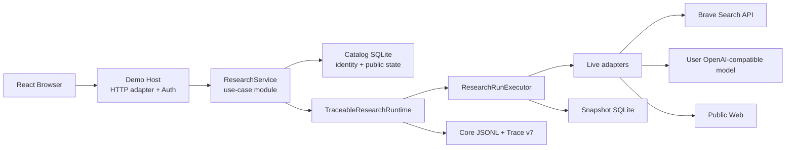
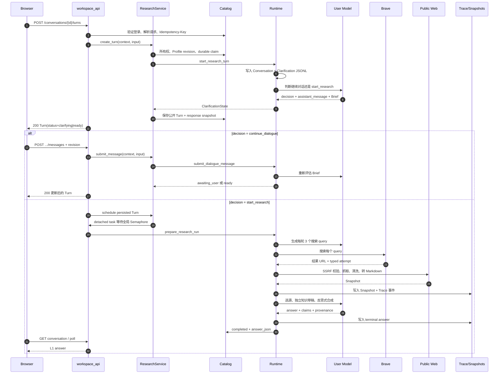
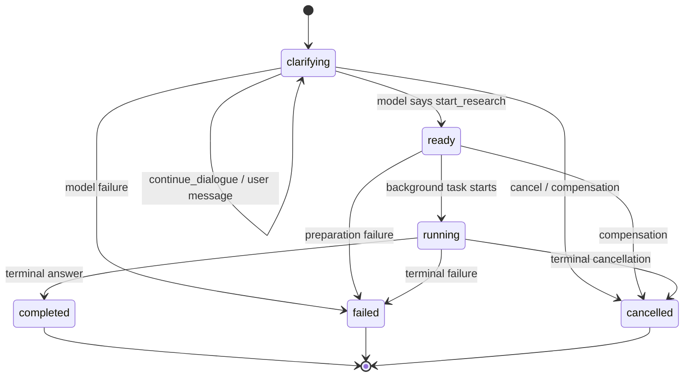

# 当前后端架构

> 面向第一次阅读后端代码的开发者
> 更新日期：2026-07-20
> 当前实现：`web-search` 分支，提交 `d3b1b94`

本文只回答一个主问题：**用户提交一个研究问题后，后端如何把它变成可恢复、可审计的答案？**

精确的 HTTP 字段看 [`workspace-http-api.md`](workspace-http-api.md)；完整的 Web 搜索设计看
[`web-search-architecture.md`](web-search-architecture.md)。本文是后端的导航图，不替代代码和契约。

## 1. 先看结论

后端可以先按下面五个模块理解：

| 模块 | 文件 | 一句话职责 |
| --- | --- | --- |
| HTTP Host | `demo-host/src/main.rs`、`workspace_api.rs` | 进程组装、认证、请求解析、返回 HTTP 响应 |
| ResearchService | `demo-host/src/research_service.rs` | 收敛 Conversation/Turn 主链：所有权、Profile revision、补偿、durable commit、调度与恢复 |
| Catalog | `demo-host/src/catalog.rs` | 保存账户、模型配置、公开 Conversation/Turn、幂等记录和状态 |
| Runtime | `src/runtime.rs` | 连接 Host 和 Core；驱动 Conversation、Clarification、Research Run |
| Research Run | `src/research_run.rs`、`src/research_trace.rs` | 执行查询、搜索、抓取、选源、合成，并记录 Trace |
| Adapters | `src/brave_search.rs`、`model_adapter.rs`、`web_snapshot.rs` | 连接 Brave、用户模型和公网页面 |

最重要的依赖方向只有这一条：



把它翻译成一句话就是：

> **Host 管“谁能做什么”，Runtime 管“当前研究走到哪”，Research Run 管“如何研究”，
> Adapter 管“如何访问外部服务”。**

## 2. 一次正常请求

浏览器创建 Turn 时，HTTP 请求只等待 Clarification 模型判断。模型决定可以开始研究后，
Host 立刻返回 `ready`，长时间研究在后台 Tokio task 中运行；浏览器通过轮询读取状态。



### 2.1 研究阶段顺序

`ResearchRunExecutor` 的实际顺序是：

```text
FrozenResearchBrief
  -> Explore 1..N
       -> query planning
       -> Brave search
       -> public page capture
       -> Snapshot archive
       -> RoundCompleted checkpoint
  -> evidence selection
  -> independent model-knowledge draft
  -> reflective synthesis
  -> terminal answer 或 terminal failure
```

模型只产生结构化候选。程序负责验证 JSON、query 数量、引用集合、URL、hash、轮数、预算、
状态转换和 Trace 顺序。

## 3. 五个核心模块

### 3.1 HTTP Host：`demo-host/src/`

`main.rs` 是进程入口，`workspace_api.rs` 是 HTTP 适配层，`research_service.rs` 是当前主链的业务 Module。

`main.rs` 负责：

- 从环境变量创建 `TraceableResearchRuntime`、`DemoCatalog`、`CredentialCipher` 和全局 `Semaphore`；
- 挂载 `/api`、静态资源和 `index.html` fallback；
- 拒绝不可信 Host/Origin；
- 限制 JSON body 为 16 KiB；
- 启动自动研究恢复任务；
- 提供只表示进程存活的 `GET /api/health`。

`workspace_api.rs` 负责：

- Auth：注册、登录、登出、当前账户；
- Model Profile：创建、更新、验证、设默认、归档、恢复；
- Conversation：创建、列表、重命名、归档、恢复；
- Conversation/Turn：请求解析、认证、幂等回放和响应封装；业务写入交给 `ResearchService`；
- Trace：按权限读取 L2 summary 和分页 L3 audit；
- 将内部错误映射为稳定的 HTTP 状态和 JSON 错误；
- 把内部对象投影成 L1/L2/L3 白名单 DTO。

它**不应该**实现搜索、网页抓取、模型 prompt、Catalog SQL 或 Turn 状态编排。

### 3.2 ResearchService：`demo-host/src/research_service.rs`

这是 Demo Host 主链的深 Module，当前暴露四个主链用例，并隐藏后台执行协调：

| Interface | 隐藏的复杂度 |
| --- | --- |
| `create_conversation` | Model Profile 选择、Core Conversation 幂等创建、Catalog durable commit、公开投影 |
| `create_turn` | 用户/Conversation 所有权、Profile revision fencing、Clarification 启动、失败补偿、Turn durable commit、公开投影 |
| `submit_message` | Turn 所有权、Profile revision、dialogue revision、Clarification 迁移、状态 durable commit、公开投影 |
| `load_conversation` | 所有权查询、Catalog Turn 列表、Clarification replay、L1 Turn 投影 |

`workspace_api.rs` 只负责把 HTTP 请求交给这个 Module。Service 自己判断是否调度已提交的 Turn，拥有并发槽等待、执行、失败终止和启动恢复；它不实现搜索算法、网页抓取或 Core reducer，这些仍由 Runtime 和 Research Run 负责。当前 durable claim/replay 的 HTTP 包装仍位于 Handler，下一阶段再把 claim 入口收进 Service，避免把 fencing token 暴露到业务 Interface。

### 3.3 Catalog：`demo-host/src/catalog.rs`

Catalog 是 Host 的身份和公开状态数据库，不是研究证据数据库。

它保存：

- `user_accounts`：账户和密码 hash；
- `login_sessions`：登录 token 的 SHA-256 hash、过期和撤销状态；
- `model_profiles`：端点、model ID、加密 API Key、revision、默认和归档状态；
- `research_conversations`：公开 Conversation ID 到 Core Conversation ID 的映射；
- `research_turns`：公开 Turn、Clarification ID、Run ID、状态和 answer snapshot；
- `idempotency_records`：request hash、operation ID、claim token、fencing 和 response JSON。

当前 schema 是 v7，启动时按 `docs/database/0001` 到 `0007` 逐步迁移。Catalog 使用
SQLite WAL、foreign keys、5 秒 busy timeout 和进程内 Mutex。

Catalog 的几个关键保证：

- 同一 Conversation 最多一个非终态 Turn；
- 活跃 Turn 锁定使用中的 Profile 和 Conversation；
- 归档资源保留 ID，恢复不会生成新 ID；
- durable write 的资源 mutation 与完成响应在同一个 fenced transaction 中提交；
- 旧 fencing owner 不能覆盖 takeover 后的新 owner。

### 3.4 Runtime：`src/runtime.rs`

`TraceableResearchRuntime` 是 Core 的应用门面，Host 不需要直接拼接多个 Core 模块。

主要命令：

| 命令 | 用途 |
| --- | --- |
| `create_conversation` / `load_conversation` | 创建或 replay Conversation |
| `start_research_turn` | 写入首条用户问题，调用 Clarification 模型 |
| `submit_dialogue_message` | 按 revision 追加普通用户消息 |
| `retry_clarification` / `cancel_clarification` | 恢复模型失败或取消当前 Clarification |
| `prepare_research_run` | 校验 ResearchReady，冻结 Brief、policy 和 answer style |
| `execute_prepared_research` | replay/恢复/执行 Research Run，并返回最终答案 |
| `project_chat_research_answer` | 将内部答案缩减为 L1 公开答案 |

Runtime 内部维护两类进程内锁：

- `ConversationLocks`：阻止同一 Conversation 并发写 Turn；
- `ClarificationLocks`：阻止同一 Clarification 并发写 dialogue/revision。

这些锁只覆盖一个进程，不是分布式锁；多副本部署不能仅靠它们保证一致性。

### 3.5 Research Run：`src/research_run.rs` + `src/research_trace.rs`

`research_run.rs` 是有界研究算法，`research_trace.rs` 是它的事实记录和恢复边界。

`ResearchRunExecutor` 每次运行接收一个 `FrozenResearchBrief` 和一个
`ResearchExecutionBackend`，不关心 HTTP 或用户账户。它负责：

- 3 到 5 轮 Explore；
- 每轮严格生成 3 个不重复 query；
- 记录每次搜索 attempt 和结果；
- 去重 URL、归档 Snapshot、控制最多 300 个 Snapshot；
- 选出模型允许使用的 Snapshot ref；
- 生成独立的 model-knowledge draft；
- 反思式合成 `model_knowledge` 与 `web_evidence` claim；
- 保证答案 claim 的引用属于当前 Run；
- 写入唯一 terminal answer 或 terminal failure。

`research_trace.rs` 的 Trace schema 是 v7。`replay_trace` 会验证：

- 第一条是正确的 header；
- sequence 从 1 连续且时间不倒退；
- query、attempt、result、RoundCompleted 顺序正确；
- terminal event 唯一且位于文件末尾；
- selection ref、Snapshot ref、答案 claim 都属于当前 Run；
- 只能从最后一个完整 `RoundCompleted` 恢复非终态 Run。

Host 的 L2/L3 读取也必须走 `replay_trace`，不能把单行 JSONL 直接当成可信状态。

### 3.6 Adapters：`src/*_adapter.rs` 和 `src/web_snapshot.rs`

`live_research_backend.rs` 把三个外部能力组装成 `ResearchExecutionBackend`：

| Adapter | 文件 | 负责什么 | 不负责什么 |
| --- | --- | --- | --- |
| Model | `model_adapter.rs` | OpenAI-compatible JSON 请求、completion 解析、端点安全 | Clarification/Run 状态 |
| Search | `brave_search.rs` | Brave `/res/v1/web/search`、15 秒 timeout、响应契约、typed outcome | fallback 策略和 Trace 编排 |
| Web Snapshot | `web_snapshot.rs` | public DNS/SSRF、最多 5 次 redirect、4 MB body、HTML sanitize、Markdown | 搜索结果排序和答案合成 |

`web_search.rs` 的 `WebSearch` trait 是测试接缝。真实生产实现是 `BraveSearchClient`，
测试使用 fixture adapter，不需要访问真实网络。

## 4. 三套持久化，不要混在一起

```text
TRACEABLE_SEARCH_DATA_DIR=/data
├── sessions/<core_conversation_id>.jsonl   # Conversation v2
├── intake/<clarification_id>.jsonl         # Clarification v5
├── traces/<run_id>.jsonl                   # Research Trace v7
└── snapshots.sqlite                         # Web Snapshot 正文

DEMO_CATALOG_PATH=/data/demo-catalog.sqlite  # Host Catalog v7
```

| 存储 | 谁写 | 谁读 | 它的权威范围 |
| --- | --- | --- | --- |
| Catalog SQLite | Host handlers / recovery | Host handlers | 账户、所有权、公开 ID、Turn 状态、L1 恢复副本 |
| Conversation JSONL | Runtime | Runtime replay | Conversation、Turn 顺序、已完成历史 |
| Clarification JSONL | Runtime | Runtime replay | dialogue、revision、Brief、准备/失败状态 |
| Trace JSONL | Research Run | Runtime + L2/L3 projector | 搜索、抓取、选源、合成和终态事实 |
| Snapshot SQLite | Research Run | Research Run resume | 经过 hash 验证的网页正文 |

没有跨这三类存储的全局事务。后端通过 durable operation、补偿、fenced Catalog transaction
和启动 reconciliation 降低错位风险，但不能把它描述成全局 exactly-once。

## 5. 状态只看这一层

对 Browser 来说，只需先看 Catalog 的 `ResearchTurnStatus`：



Core 内部的 Clarification 状态更细：
`MODEL_EVALUATION_PENDING`、`AWAITING_USER_MESSAGE`、`RESEARCH_READY`、
`MODEL_REQUEST_FAILED`、`RESEARCH_PREPARED`、`RESEARCH_FAILED`、`CANCELLED`。

把两套状态的关系记成：

| Core Clarification | Host Turn |
| --- | --- |
| pending / awaiting user | `clarifying` |
| research ready | `ready` |
| research prepared | `running` |
| research failed | `failed` |
| cancelled | `cancelled` |
| terminal answer 已写回 | `completed` |

## 6. 幂等和恢复：只理解两个概念

### 6.1 Idempotency-Key 保护 HTTP 写请求

以下操作要求 `Idempotency-Key`：

- 创建 Model Profile；
- 创建 Conversation；
- 创建 Research Turn；
- 提交 Dialogue Message。

Catalog 先保存 request hash。相同 key + 相同 body replay 原响应；相同 key + 不同 body 返回
`409 idempotency_key_reused`；其他 owner 正在处理时返回可重试的
`409 idempotency_request_in_progress`。

每次 claim 有 fencing token。五分钟后可以 takeover，但旧 owner 不能提交新 mutation。
资源 ID 从 operation ID 派生，所以重试不会创建第二个 Conversation、Clarification、Turn 或 Message。

### 6.2 Host 重启只恢复已进入 Catalog 的研究

启动恢复任务扫描 Catalog 中状态为 `ready` 或 `running` 的 Turn：

1. replay Clarification 和 Trace；
2. 如果 Trace 已有 terminal answer/failure，只修复 Catalog/Core 投影；
3. 如果没有终态，从最后完整 `RoundCompleted` 继续；
4. 完成后更新 Turn 为 `completed` 或 `failed`。

已知窗口：如果进程在 Core 已写入、但 Catalog Turn 还没有落库时退出，启动扫描看不到这个
对象，可能留下 Core pending Turn。这是当前实现限制。

## 7. 安全边界

| 对象 | 当前规则 |
| --- | --- |
| 登录 | HttpOnly、SameSite=Strict、30 天 Cookie；Catalog 只存 token hash |
| Model API Key | AES-256-GCM；AAD 绑定 `user_id + profile_id`；响应只有 `has_api_key` |
| Model endpoint | 默认要求 public DNS；禁止 redirect；private endpoint 必须显式开启 |
| Brave key | 只读入 Rust 进程；不进入 Browser、Trace、镜像和 response |
| Web URL | 仅 HTTP(S)；拒绝私网/特殊地址；每次 redirect 重新 DNS 校验 |
| HTML | 清洗后才转 Markdown；禁止脚本和子资源加载 |
| 请求 | Host/Origin allowlist；JSON body 16 KiB；DTO 拒绝未知字段 |
| 资源 | 3..=5 rounds、每轮 3 query、最多 300 snapshots、input budget <= 1,000,000 |

Prompt injection 不能仅靠 schema 消除。程序把历史、网页和模型输出当作不可信数据，并限制
结构化 JSON、引用集合、URL、hash 和状态转换；语义抵抗仍依赖上游模型。

## 8. 当前代码状态

### 已实现

- React 19 通过同源 HTTP 调用 Demo Host；Host 已提供 23 个产品端点。
- Auth、Profile、Conversation、Turn、Trace L1/L2/L3 投影和所有权隔离。
- Conversation v2、Clarification v5、Trace v7、Snapshot content addressing。
- Brave Search API 生产适配器；SearXNG 已从生产代码和 Compose 移除。
- 进程内网页抓取和 HTML-to-Markdown；不再依赖 crawl4ai。
- durable idempotency、operation resource ID、takeover fencing、归档恢复和启动 reconciliation。
- Core Rust `109` 项测试通过；Demo Host `59` 项测试通过；前端 Node `3` 项和 Vitest `61` 项通过。

### 仍是环境门禁或未完成项

- `tests/live_e2e.rs` 的真实 Brave/公网页面/模型测试默认 ignored；需要真实密钥和网络。
- Compose/fault-injected process restart E2E 尚未成为默认验证。
- 当前 WSL2 仍运行旧的 `traceable-search-dev-app` 和 SearXNG 容器；Brave 镜像已构建，但
  尚未用可用 `BRAVE_SEARCH_API_KEY` 完成替换和真实 smoke test。
- 多进程部署没有分布式锁；当前模型是单 Host + 单数据卷。
- JSONL、两个 SQLite 之间没有全局事务；外部模型也不一定支持 provider-level exactly-once。
- async handler 中存在同步 SQLite/JSONL I/O；当前通过低并发上限控制风险。
- `/health` 只表示 listener 存活，不代表外部依赖可用。

## 9. 出问题时从哪里开始

| 现象 | 检查顺序 |
| --- | --- |
| 401/403/404 | Cookie -> trusted Host/Origin -> Catalog ownership |
| 409 重试冲突 | `idempotency_records` 的 request hash、operation ID、fencing token |
| Turn 卡在 `clarifying` | `intake/<clarification_id>.jsonl` -> 模型端点 -> revision |
| Turn 卡在 `ready`/`running` | Host 日志 -> Semaphore -> Trace header/terminal event |
| Brave 搜索失败 | Trace Brave attempt -> API key/429/5xx -> DNS/代理/额度 |
| 网页抓取失败 | URL scheme -> DNS 地址 -> redirect -> body size -> Markdown 是否为空 |
| 完成答案无法恢复 | `answer_json` -> `replay_trace` -> Snapshot hash -> Turn 状态 |
| 重启后没恢复 | Catalog 是否 `ready/running` -> Trace 是否完整 -> Profile revision |
| Profile 无法解密 | 是否复用了原 `DEMO_CREDENTIAL_ENCRYPTION_KEY` |

## 10. 修改代码的入口

### 改 HTTP 接口

`workspace_api.rs` DTO/校验 -> `catalog.rs` 事务 -> `runtime.rs` 命令 -> projector/fixture ->
Router 和冲突测试 -> [`workspace-http-api.md`](workspace-http-api.md)。不要在 Handler 里实现研究算法或直接拼 Catalog SQL。

### 改状态或 Trace

先改 reducer/replay 和 schema 测试，再改 event producer；同时检查 terminal event、跨事件引用、
RoundCompleted resume 和旧数据的 fail-closed 行为。

### 换外部服务

保持 `ResearchExecutionBackend` 和 `WebSearch` seam。新 Adapter 必须定义 timeout、redirect、
schema failure、typed outcome、凭据边界和崩溃后重复调用语义，并用本地 HTTP fixture 测试。

## 11. 相关文档

- [后端范围收敛计划](plans/2026-07-20-backend-scope-convergence-plan.md)
- [HTTP API 契约](workspace-http-api.md)
- [Web Search 总体架构](web-search-architecture.md)
- [Search API provider 选择](decisions/2026-07-20-search-api-provider-comparison.md)
- [ADR 0002：Catalog 与研究审计存储分离](adr/0002-separate-host-catalogue-from-research-audit-storage.md)
- [ADR 0003：用户模型凭据加密](adr/0003-encrypt-user-model-credentials-with-a-server-key.md)
- [ADR 0006：模型主导对话与 Trace 分层披露](adr/0006-model-led-dialogue-and-tiered-trace-disclosure.md)
- [ADR 0007：对话请求外自动调度研究](adr/0007-schedule-model-approved-research-outside-dialogue-requests.md)
- [ADR 0009：完整回放 Trace v7 后再投影](adr/0009-require-complete-v7-trace-replay-before-projection.md)
