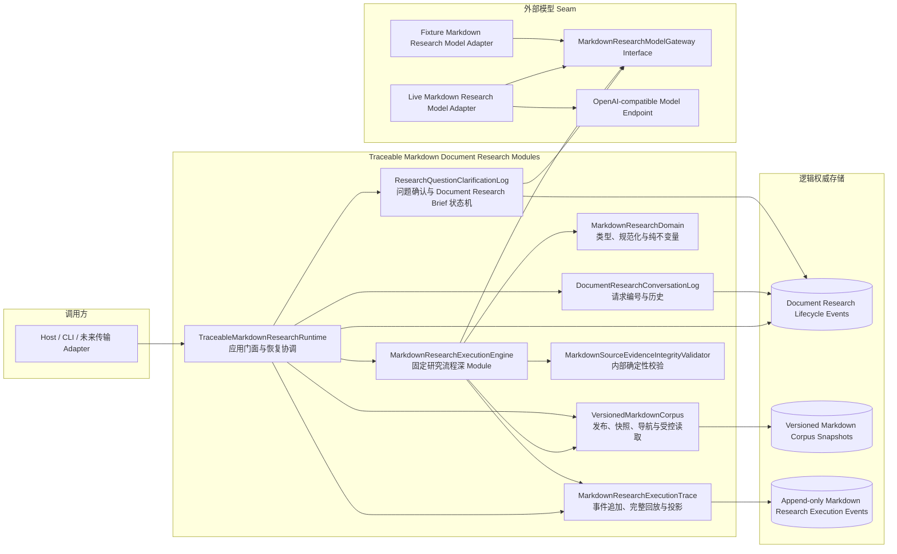
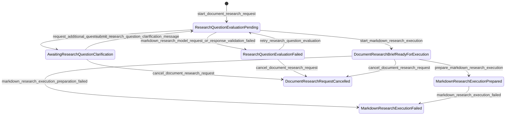
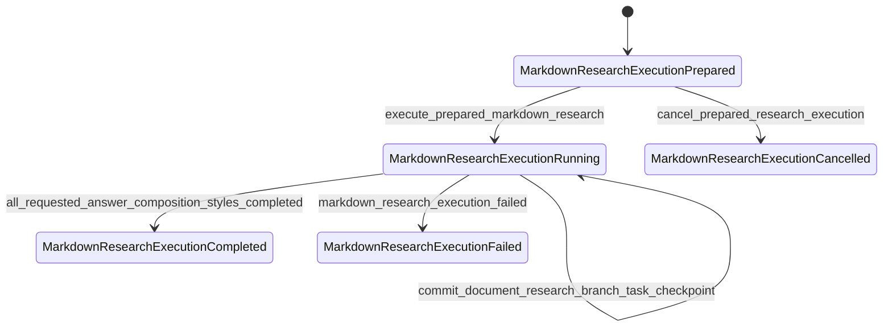
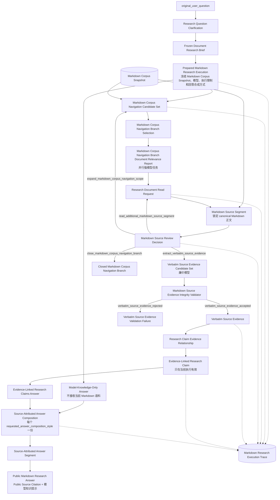

# Traceable Markdown Document Research Runtime 架构设计

> 状态：目标架构契约；Rust 0.1 后端已按本契约落地并通过 Gate B
>
> 更新日期：2026-07-18
>
> 本文参考姊妹项目 `C:\WorkSpace\project\traceable-research-runtime-web-search\docs\web-search-architecture.md` 的当前实现契约，复用其生命周期分离、应用门面、执行引擎、独立模型知识答案、append-only 执行记录、完整回放和答案来源归属原则。Web 搜索、网页抓取、URL、crawl4ai、搜索引擎路由和 Browser/Host 拓扑不属于本架构。

## 1. 目标、领域语言与命名规则

系统面向受控、版本化 Markdown 文档语料执行可恢复、可审计的研究。固定研究流程先确认问题，再进行范围发现和向下探索，从锁定正文中提取 Verbatim Source Evidence，形成当前执行内的 Evidence-Linked Research Claim，最后把 Evidence-Linked Research Claims Answer 与独立 Model-Knowledge-Only Answer 合成为带来源归属的最终答案。

模型负责受限的结构化建议和语义判断；程序负责候选归属、状态转换、正文授权、资源限制、版本锁定、逐字命中、持久化、恢复和公开投影。

### 1.1 领域语言

完整 glossary 见 [`CONTEXT.md`](../CONTEXT.md)。架构中的核心对象如下：

| 名称 | 含义 | 明确不是什么 |
| --- | --- | --- |
| Document Research Conversation | 可包含多个相关 Document Research Request 的长期上下文 | Markdown Research Execution、登录会话 |
| Document Research Request | 一个用户问题从 Research Question Clarification 到完成、失败或取消的工作单元 | 一条聊天消息 |
| Research Question Clarification | 消除会改变研究范围的歧义并形成 Document Research Brief 的过程 | 固定问卷、表单 |
| Frozen Document Research Brief | 已规范化、带内容哈希且不可再修改的研究语义 | 用户可编辑表单 |
| Markdown Research Execution | 对一个 Frozen Document Research Brief 和一个 Markdown Corpus Snapshot 的一次有界执行 | 长期对话、用户请求 |
| Markdown Corpus Snapshot | Markdown 文档版本、正文片段边界和导航关系的不可变发布视图 | SQL 数据库快照、搜索结果 |
| Markdown Corpus Navigation Node | 只服务渐进披露的导航分组 | 事实证据、知识图谱断言 |
| Verbatim Source Evidence | 锁定 Canonical Markdown Document Body 中经程序验证的逐字片段 | 模型总结、研究结论 |
| Evidence-Linked Research Claim | 当前执行内由模型解释 Verbatim Source Evidence 得出的结论 | 可跨执行复用的事实 |
| Model-Knowledge-Only Answer | 不读取当前 Markdown 语料、仅由模型自身知识生成的独立答案 | Verbatim Source Evidence、事实真源 |
| Evidence-Linked Research Claims Answer | 仅根据当前执行的 Evidence-Linked Research Claim 生成的答案 | 已被程序证明为真的答案 |
| Markdown Research Execution Trace | 一次执行的 append-only 可观察事件记录 | 调试日志、隐藏思维链 |

### 1.2 命名规则

1. **领域类型包含业务限定词。** 使用 `MarkdownSourceSegment`，不使用 `ContentUnit`；使用 `MarkdownResearchExecution`，不使用 `Run`。
2. **命令同时表达动作和对象。** 使用 `publish_markdown_corpus_snapshot`，不使用 `publish`；使用 `execute_prepared_markdown_research`，不使用 `execute`。
3. **字段表达所属对象和业务含义。** 使用 `markdown_research_execution_prepared_at`，不使用 `date`；使用 `source_attributed_answer_segment_text`，不使用 `text`。
4. **状态和事件表达完整事实。** 使用 `markdown_research_execution_completed`，不使用 `completed`；使用 `research_question_clarification_required`，不使用 `pending`。
5. **枚举值脱离上下文仍可理解。** 使用 `model_knowledge_led`，不使用 `knowledge_first`；使用 `evidence_linked_research_claims_and_model_knowledge`，不使用 `mixed`。
6. **只保留约定俗成的缩写。** `ID`、`JSON`、`HTTP`、`CLI`、`URI`、`UTF-8`、`UTC` 可以使用；不创造项目私有缩写。

### 1.3 设计规则

1. **模型提议，程序提交。** 模型不能直接读取存储、扩大权限、创建分支任务、写 Markdown Research Execution Trace 或推进状态。
2. **Markdown 是唯一事实真源。** Markdown Corpus Navigation Node、摘要、模型知识、选择理由、Evidence-Linked Research Claim 和历史答案都不能替代 Canonical Markdown Document Body。
3. **导航只负责发现。** 导航的生成和维护不属于本项目；`TraceableMarkdownResearchRuntime` 负责校验、存储并随 Markdown Corpus Snapshot 版本化。
4. **流程固定。** 问题确认、范围发现、向下探索、逐字取证、研究结论和双风格合成是固定状态机，不建设通用工作流引擎。
5. **模型固定二分。** 强模型掌握全部研究路径和答案判断；廉价模型只在已授权正文片段内逐字取证。
6. **历史只帮助理解。** 已完成 Document Research Request 的问题与最终答案可以帮助理解指代，但不自动成为当前执行的 Verbatim Source Evidence 或 Evidence-Linked Research Claim。
7. **执行输入冻结。** Frozen Document Research Brief、Markdown Corpus Snapshot、模型引用、Markdown Research Execution Limits 和 `requested_answer_composition_styles` 在执行开始后不可漂移。
8. **先完整回放，再恢复或投影。** `TraceableMarkdownResearchRuntime` 和公开审计视图只能消费经过全量校验的 `ReplayedMarkdownResearchExecution`。
9. **程序保证来源完整性，不保证语义真值。** 程序能证明引文真实、链接完整，不能证明 Verbatim Source Evidence 在语义上支持 Evidence-Linked Research Claim，也不能证明答案正确。
10. **公开面小于内部记录。** 最终用户只看到策略允许的答案、来源标识和 Public Source Citation；内部 ID、候选全集、Prompt、凭据和原始执行记录不公开。

## 2. 范围与非目标

本项目只处理符合第 5 节标准的 Markdown 文档集合。以下内容不在范围内：

- PDF、Wiki、邮件、网页或其他来源适配；
- 导航目录的生成、编辑和质量治理；
- Web Search、向量检索或通用数据库查询；
- 可由使用方任意定义阶段的工作流平台；
- 把历史 Evidence-Linked Research Claim 回写成跨执行知识；
- 用程序证明模型的语义理解或最终结论正确；
- 在当前阶段决定嵌入式代码库、独立 Runtime 进程、HTTP 传输或具体部署形态；
- 在当前阶段决定 Rust、Python 或 TypeScript。

本架构把“范围发现 + 向下探索能够提高研究质量”作为前提，不承担与其他检索范式做质量对照的研究任务。姊妹项目已经证明通用状态机、恢复、事件回放和答案合成机制可实现，但不构成本项目已有实现的证据。

## 3. 系统拓扑与依赖方向



依赖方向从调用方指向 `TraceableMarkdownResearchRuntime`，再指向内部深 Module 和外部模型 Seam。这些 Module 不依赖 HTTP、Cookie、账户目录或某种数据库；传输、身份和物理存储选择不能反向进入研究领域模型。

模型是当前唯一明确的外部 Seam：生产环境需要 Live Adapter，测试需要 Fixture Adapter。Markdown 文档和执行记录存储属于可本地替代依赖，物理存储 Seam 留在相应深 Module 内部，不为尚未存在的第二种生产存储暴露公共 Interface。

## 4. 深 Module 与 Interface

### 4.1 模块职责

| Module | Interface | 责任 | 明确不负责 |
| --- | --- | --- | --- |
| `MarkdownResearchDomain` | 领域对象构造、规范化和纯校验 | 维护 Frozen Document Research Brief、Answer Composition Style、Markdown Research Execution Limits、Verbatim Source Evidence、Evidence-Linked Research Claim 和事件载荷不变量 | I/O、模型调用、状态推进 |
| `TraceableMarkdownResearchRuntime` | 面向调用方的命令 Interface | 创建和加载研究对话、推进问题确认、幂等准备和执行研究、完整回放后恢复、生成公开投影 | HTTP、账户、Prompt、具体数据库 |
| `DocumentResearchConversationLog` | `append_document_research_conversation_event`、`replay_document_research_conversation` | 请求编号、单个未终止请求、合法终态和已完成历史 | 问题理解、研究执行 |
| `ResearchQuestionClarificationLog` | `append_research_question_clarification_event`、`replay_research_question_clarification` | 普通对话、`document_research_brief_revision`、Frozen Document Research Brief 和准备/失败/取消状态 | 正文读取、答案生成 |
| `VersionedMarkdownCorpus` | `publish_markdown_corpus_snapshot`、`open_markdown_corpus_snapshot` | 校验 Markdown 标准，保存文档版本、正文片段和导航，生成不可变快照并提供 `MarkdownCorpusSnapshotReader` | 导航生成、研究相关性判断 |
| `MarkdownResearchExecutionEngine` | `execute_prepared_markdown_research` | 编排固定双循环、分支任务、候选归属、资源限制、正文读取、取证、研究结论、答案合成、检查点和终态 | 传输、账户、模型 HTTP、导航生产 |
| `MarkdownResearchModelGateway` | `execute_strong_markdown_research_task`、`extract_verbatim_source_evidence_candidates` | 隐藏模型传输、Prompt、严格结构化响应和角色可见数据；提供 Live/Fixture Adapter | 执行状态、权限、持久化、资源计数 |
| `MarkdownSourceEvidenceIntegrityValidator` | 内部纯函数 Interface | 校验候选归属、正文授权、内容哈希、字节位置、逐字命中和引用完整性 | 判断 Verbatim Source Evidence 是否在语义上支持 Evidence-Linked Research Claim |
| `MarkdownResearchExecutionTrace` | `append_markdown_research_execution_event`、`replay_markdown_research_execution`、`project_detailed_markdown_research_audit` | 追加版本化事件，完整回放并校验跨事件关系，派生恢复状态和披露视图 | 决定下一步研究动作 |

`MarkdownResearchExecutionEngine` 是核心深 Module。删除它会让候选归属、资源限制、分支任务、正文授权、取证、研究结论、答案合成和恢复逻辑散落到 `TraceableMarkdownResearchRuntime`、模型 Adapter 和存储调用方。`MarkdownSourceEvidenceIntegrityValidator` 与 `MarkdownCorpusSnapshotReader` 是执行引擎的内部 Seam，不进入调用方 Interface。

### 4.2 TraceableMarkdownResearchRuntime 命令 Interface

| 命令 | 契约 |
| --- | --- |
| `publish_markdown_corpus_snapshot` | 校验并发布 Markdown 文档、导航和版本元数据，返回不可变 `markdown_corpus_snapshot_id` |
| `create_document_research_conversation` | 创建空 Document Research Conversation |
| `load_document_research_conversation` | 完整回放指定研究对话并返回当前生命周期状态 |
| `start_document_research_request` | 以用户问题和一个或两个 Answer Composition Style 创建研究请求，并启动问题确认 |
| `submit_research_question_clarification_message` | 在 `research_question_clarification_revision` 校验下继续自然语言确认 |
| `cancel_document_research_request` | 只取消尚未进入终态的研究请求 |
| `prepare_markdown_research_execution` | 冻结 Frozen Document Research Brief、Markdown Corpus Snapshot、模型引用、Markdown Research Execution Limits 和 `requested_answer_composition_styles`；重复调用幂等复用同一执行 |
| `execute_prepared_markdown_research` | 完整回放执行记录，返回既有终态或从最后已提交检查点继续执行 |
| `load_document_research_request` | 返回指定研究请求的完整内部状态，不直接等同于公开传输对象 |
| `project_public_markdown_research_answer` | 为一个 `requested_answer_composition_style` 生成带 Public Source Citation 和模型知识提示的公开答案 |
| `project_detailed_markdown_research_audit` | 从 `ReplayedMarkdownResearchExecution` 生成白名单审计投影 |

`PreparedMarkdownResearchExecution` 至少冻结：

```text
markdown_research_execution_id
document_research_conversation_id
document_research_request_id
frozen_document_research_brief
document_research_brief_content_hash
markdown_corpus_snapshot_id
strong_markdown_research_model_reference
verbatim_source_evidence_extraction_model_reference
markdown_research_execution_limits
requested_answer_composition_styles[]
markdown_research_execution_prepared_at
```

调用方不能在 prepare 后改写上述字段。任何试图为同一 Document Research Request 准备不同快照、模型、执行限制或回答合成方式的请求都必须失败，而不是隐式创建第二套执行契约。

### 4.3 MarkdownResearchModelGateway Seam

模型二分通过两个明确动作暴露：

```text
execute_strong_markdown_research_task(StrongMarkdownResearchTask)
    -> StrongMarkdownResearchResponse

extract_verbatim_source_evidence_candidates(VerbatimSourceEvidenceExtractionTask)
    -> VerbatimSourceEvidenceCandidateSet
```

`StrongMarkdownResearchTask` 是封闭枚举，覆盖问题确认、模型知识独立回答、导航分支选择、分支文档相关性报告、正文阅读决策、研究结论、Evidence-Linked Research Claims Answer 和来源归属答案合成。每个 variant 只携带该阶段允许看到的数据。

`extract_verbatim_source_evidence_candidates` 只能看到一个已授权 Markdown Source Segment、`clarified_research_question` 和具体取证目标。Adapter 负责模型请求、Prompt 和严格 JSON 解析；执行引擎仍须独立校验字段、数量、候选 ID、分支任务归属和资源限制。

## 5. Markdown 文档语料契约

### 5.1 单篇 Markdown Source Document 标准

```markdown
---
markdown_source_document_id: markdown-source-document-017
---

# 劳动合同解除时的经济补偿

劳动合同解除后经济补偿的适用情形、计算年限、工资基数与封顶规则。

劳动合同解除后，在下列情形中，用人单位应当向劳动者支付经济补偿……
```

- front matter 的 `markdown_source_document_id` 是跨版本稳定且无语义的文档 ID；
- 唯一一级标题解析为 `markdown_source_document_title`；
- 一级标题后的首个非空普通段落解析为 `markdown_source_document_abstract`；
- 其余 Markdown 源文本解析为 `canonical_markdown_document_body`；
- 文档不要求领域路径、关键词、facets、覆盖范围、例外关系或知识图谱边；
- canonical UTF-8 Markdown 源文件是事实真源，不以渲染后的文本替代。

Markdown schema、parser 和 canonicalization 都必须版本化。发布时拒绝非法 UTF-8、重复 `markdown_source_document_id`、缺少唯一一级标题、缺少 abstract、非法路径和逃逸语料根目录的符号链接。允许的 Markdown 语法细节由版本化 fixture 固定，不在运行时猜测修复。

### 5.2 Markdown Source Document、Version 与 Segment

```text
MarkdownSourceDocument
└─ MarkdownSourceDocumentVersion
   └─ CanonicalMarkdownDocumentBody
      └─ MarkdownSourceSegment[]
```

`MarkdownSourceDocumentVersion` 由 canonical Markdown 内容变化产生。`CanonicalMarkdownDocumentBody` 在语义上仍是一份完整正文；`MarkdownSourceSegment` 只按标题和段落机械切分，为有界读取和原文定位服务，不增加主题、摘要或父子语义。

每个 Markdown Source Segment 至少保存：

```text
markdown_source_segment_id
markdown_source_segment_section_heading
markdown_source_segment_start_byte_offset_in_document
markdown_source_segment_end_byte_offset_in_document
markdown_source_segment_hash
```

所有 byte offset 均以 canonical UTF-8 字节序列为坐标系。`markdown_source_segment_id` 只在一个 Markdown Source Document Version 内稳定，文档版本变化后重新生成。

### 5.3 Markdown Corpus Navigation 与 Markdown Corpus Snapshot

`TraceableMarkdownResearchRuntime` 接收抽象导航结果，负责校验、存储和版本化，但不负责生成导航。每个导航节点至少表达：

```text
markdown_corpus_navigation_node_id
markdown_corpus_navigation_node_label
markdown_corpus_navigation_node_summary
child_markdown_corpus_navigation_node_ids[]
linked_markdown_source_document_ids[]
```

Markdown Corpus Navigation Node 可以形成分层 directed acyclic graph（DAG），同一节点可由多个父节点引用。父子关系只服务浏览、分组和候选收缩，不宣称严格本体关系，也不能成为 Verbatim Source Evidence。

一次发布把以下内容共同固化为不可变 Markdown Corpus Snapshot：

- canonical Markdown 与解析后的 `markdown_source_document_title / markdown_source_document_abstract / canonical_markdown_document_body`；
- Markdown Source Document Version 和 Markdown Source Segment 边界；
- 完整导航节点、父子关系和文档关联；
- schema、parser、canonicalization 和 navigation schema 版本；
- 覆盖全部上述输入的 `markdown_corpus_snapshot_hash`。

Markdown Research Execution 创建时锁定一个 `markdown_corpus_snapshot_id`。其后所有导航候选、文档摘要、正文片段和 Public Source Citation 都来自该快照，不能在执行中漂移。

### 5.4 Internal Markdown Source Reference 与读取规则

内部引用固定形如：

```text
markdown-source:corpus-snapshot/markdown-corpus-snapshot-009/document-version/markdown-source-document-version-017#source-segment/markdown-source-segment-012
```

Verbatim Source Evidence 的 `verbatim_source_evidence_start_byte_offset / verbatim_source_evidence_end_byte_offset` 单独保存，不拼入 `internal_markdown_source_reference`。模型只看到当前分支任务中由执行引擎提供的不透明导航节点、文档和正文片段 ID，不接收、解析或生成 Internal Markdown Source Reference、文件路径或内部 URI。

`MarkdownCorpusSnapshotReader` 隐藏具体存储和对象解析。执行引擎通过它获得直接子导航节点、Markdown Source Document abstract、正文片段清单和指定正文；读取前后均重新确认对象属于锁定 Markdown Corpus Snapshot。

## 6. 研究生命周期状态

### 6.1 Document Research Conversation 与 Document Research Request

Document Research Conversation 保证 `document_research_request_number` 单调递增，并且同一对话最多只有一个未进入终态的 Document Research Request。完成、失败和取消必须匹配当前未终止请求；重复提交相同终态可幂等接受。

后续研究请求只继承已完成请求的 `original_user_question` 和公开最终答案，用于理解指代。历史 Verbatim Source Evidence、Evidence-Linked Research Claim、Research Coverage Gap、Markdown Research Execution Trace 和失败请求不自动进入新的 Markdown Research Execution。

### 6.2 Research Question Clarification 状态机



强模型根据 `original_user_question`、普通对话、当前 `document_research_brief_draft` 和已完成请求历史，决定请求更多上下文或开始 Markdown 研究。程序规范化并校验 Document Research Brief，不用原问题伪造模型失败时的 Document Research Brief，也不要求用户编辑内部 Frozen Document Research Brief 表单。

### 6.3 Markdown Research Execution 状态机



终态不可再追加业务事件。恢复不是单独业务状态：`execute_prepared_markdown_research` 先完整回放 Markdown Research Execution Trace；已终止则直接重建终态，未终止则从最后已提交检查点继续。

## 7. 固定 Markdown Research Execution

```text
冻结执行契约
→ 生成独立 Model-Knowledge-Only Answer
→ 发现相关导航范围
→ 并行生成 Markdown Corpus Navigation Branch Document Relevance Report
→ 强模型选择 Markdown Source Document 与 Segment
→ 横向扩大导航范围与纵向深入正文
→ 廉价模型提取 Verbatim Source Evidence
→ 强模型形成 Evidence-Linked Research Claim
→ 强模型生成 Evidence-Linked Research Claims Answer
→ 按 `requested_answer_composition_styles` 合成一个或两个最终答案
```

### 7.1 准备与冻结

`prepare_markdown_research_execution` 只接受 `DocumentResearchBriefReadyForExecution`。它校验 `research_question_clarification_revision`、`document_research_brief_content_hash`、Markdown Corpus Snapshot 可读性、模型引用、Markdown Research Execution Limits 和 `requested_answer_composition_styles`，然后持久化 `PreparedMarkdownResearchExecution` 并创建 `markdown_research_execution_started` 事件。

准备命令必须幂等：重复调用复用第一次冻结的 `markdown_research_execution_id` 和执行契约。准备成功但首个 Markdown Research Execution Trace 事件尚未落盘的崩溃窗口，由下一次 `prepare_markdown_research_execution` 使用同一执行 ID 修复。

### 7.2 独立 Model-Knowledge-Only Answer

执行引擎在向强模型暴露任何导航节点、文档摘要、Markdown Source Segment、Verbatim Source Evidence 或 Evidence-Linked Research Claim 前，使用 Frozen Document Research Brief 和允许的已完成研究请求历史生成 `ModelKnowledgeOnlyAnswer`。

该答案是最终合成的独立输入，不是 Verbatim Source Evidence，不反写 Markdown，也不进入后续执行。实现可以在物理执行上延迟生成，但模型任务 Interface 绝不能接收当前 Markdown 语料数据。

### 7.3 导航范围发现与分支文档报告

范围发现从 Markdown Corpus Snapshot 的导航根开始。每层由 `MarkdownCorpusSnapshotReader` 返回完整直接子节点集合，强模型只能从该集合产生：

```text
MarkdownCorpusNavigationBranchSelection
├─ markdown_corpus_navigation_node_id
├─ markdown_corpus_navigation_node_selection_status:
│  selected_for_markdown_research | deferred_for_later_markdown_research | excluded_from_current_markdown_research_scope
├─ markdown_corpus_navigation_node_relevance_explanation
├─ expected_research_information_to_resolve_question
└─ markdown_corpus_navigation_branch_priority
```

每个已选方向建立有界 Document Research Branch Task。强模型分支任务可并行读取该导航节点下的全部 `markdown_source_document_title / markdown_source_document_abstract`，返回 `MarkdownCorpusNavigationBranchDocumentRelevanceReport`、候选文档 ID、`markdown_source_document_abstract_quote`、可能遗漏方向和无匹配解释。强模型分支任务不能读取正文、派生任务、写状态或直接回答用户。

### 7.4 Research Document Read Request 与双循环

主强模型汇总分支文档报告，只能选择报告中出现的 `markdown_source_document_id`。每次正文读取前必须产生 `ResearchDocumentReadRequest`，明确 `unresolved_research_question`、`expected_research_information_to_resolve_question` 和 `markdown_source_document_selection_explanation`。

读取 Markdown Source Segment 后，强模型产生 `MarkdownSourceReviewDecision`，其 `markdown_source_follow_up_action` 只能为：

| 动作 | 含义 |
| --- | --- |
| `extract_verbatim_source_evidence` | 请求廉价模型在当前已授权正文片段内逐字取证 |
| `read_additional_markdown_source_segment` | 从当前文档的未读正文片段集合选择新片段并产生新读取请求 |
| `expand_markdown_corpus_navigation_scope` | 以已接受 Verbatim Source Evidence 为触发依据，回到锁定 Markdown Corpus Snapshot 根目录发现新方向 |
| `close_markdown_corpus_navigation_branch` | 以明确关闭原因终止当前导航分支 |

关闭原因只能为：

```text
markdown_corpus_navigation_branch_not_relevant_to_research_question
duplicates_existing_markdown_corpus_navigation_branch
all_relevant_markdown_source_segments_reviewed
markdown_research_execution_limits_exhausted
```

所有后续动作都由强模型提议、执行引擎校验并提交。廉价模型不能返回后续动作。导航范围发现与正文深入阅读互相反馈，但仍是两个独立循环。

### 7.5 Verbatim Source Evidence、Evidence-Linked Research Claim 与答案

廉价模型接收一个已授权 Markdown Source Segment 和明确取证目标，只返回 `VerbatimSourceEvidenceCandidateSet`。`MarkdownSourceEvidenceIntegrityValidator` 校验分支任务归属、文档版本、正文片段 hash、byte offset、逐字命中和重复项，接受后才形成 `VerbatimSourceEvidence`。

强模型先根据已接受 Verbatim Source Evidence 形成 `EvidenceLinkedResearchClaim` 和 `ResearchClaimEvidenceRelationship`。程序校验并提交这些对象后，强模型再以已提交的 Evidence-Linked Research Claim 为唯一事实输入生成 `EvidenceLinkedResearchClaimsAnswer`。这些对象都只属于当前 Markdown Research Execution，不得进入后续执行的来源集合。

同一执行最后按 `requested_answer_composition_styles` 分别合成：

| Answer Composition Style | 合成规则 |
| --- | --- |
| `model_knowledge_led` | Evidence-Linked Research Claim : 模型知识 = 2 : 8；以 Model-Knowledge-Only Answer 为基础，由研究结论修正、限定和补充 |
| `evidence_linked_research_claim_led` | Evidence-Linked Research Claim : 模型知识 = 8 : 2；以 Evidence-Linked Research Claims Answer 为基础，再加入模型知识补充 |

比例表达合成基底与内容主次，不由程序计算 token 或句子比例。两种方式共享同一研究过程、资源限制和 Evidence-Linked Research Claim 集合；任何语义冲突始终以 Evidence-Linked Research Claim 为准。

一次执行可以请求其中一种或同时请求两种方式。请求两种时只执行一次范围发现、正文读取、取证和研究结论生成，再从同一 Model-Knowledge-Only Answer 与 Evidence-Linked Research Claims Answer 生成两个 `SourceAttributedAnswerComposition`，不重复研究。

最终答案由 `SourceAttributedAnswerSegment[]` 组成，每段 `source_attributed_answer_segment_source_type` 只能为：

```text
evidence_linked_research_claims
model_knowledge_only
evidence_linked_research_claims_and_model_knowledge
```

包含 Verbatim Source Evidence 的回答段必须引用当前执行的 Evidence-Linked Research Claim；包含模型知识的回答段必须公开显示“模型补充，未由当前 Markdown 文档验证”。

## 8. 核心数据流



只有锁定 Canonical Markdown Document Body 能进入 Verbatim Source Evidence 链。历史研究对话只帮助确认问题和生成 Model-Knowledge-Only Answer，不直接进入最终答案合成；Model-Knowledge-Only Answer 只在最终答案合成阶段作为带明确来源类型的补充，不能进入 Verbatim Source Evidence 或 Evidence-Linked Research Claim。

### 8.1 示例前提

下面用一个完整问题推演数据流。用户最初提问：

> 公司解除劳动合同，经济补偿怎么算，有封顶吗？

这个问题故意保留了会改变研究范围的歧义。经过自然语言确认后，用户补充：工作地点是上海，解除发生在 2026 年 7 月，由公司提出协商解除；用户希望分别了解补偿年限、月工资基数和封顶规则。

这个例子只演示数据怎样在 Module 之间流动，不声明任何劳动法结论。文中假设锁定的 Markdown Corpus Snapshot 里存在两篇与问题相关的示例文档；文档标题、正文片段和引文内容都只是数据流占位。系统最终能引用什么，完全取决于该快照内实际存在的 Canonical Markdown Document Body。

研究开始前，`VersionedMarkdownCorpus` 已经完成一次 Markdown Corpus Snapshot 发布。发布过程把符合标准的 Markdown 文档转成不可变 Markdown Source Document Version，解析标题和摘要，机械划分 Markdown Source Segment，并把调用方提供的抽象导航一起存储和版本化。导航节点、文档摘要和正文片段边界可以帮助发现内容，但它们都不是 Verbatim Source Evidence。

### 8.2 从用户问题到冻结研究输入

#### 第一步：创建 Document Research Request

用户或调用方把原问题交给 `TraceableMarkdownResearchRuntime.start_document_research_request`。同时声明需要哪种回答合成方式。为了展示完整路径，假设用户同时请求：

- `model_knowledge_led`；
- `evidence_linked_research_claim_led`。

`TraceableMarkdownResearchRuntime` 不会直接开始搜索正文。它先在当前 Document Research Conversation 中创建一个新的 Document Research Request，分配连续的请求编号，并把原始问题保存为 `original_user_question`。已完成的旧请求可以帮助强模型理解“这个规定”“刚才那种情况”等指代，但旧答案、旧 Verbatim Source Evidence 和旧 Evidence-Linked Research Claim 都不会成为本次研究的事实输入。

#### 第二步：用自然语言消除会改变范围的歧义

`ResearchQuestionClarificationLog` 把原问题、已有确认对话、当前 `document_research_brief_draft` 和允许使用的已完成请求历史交给强模型。这个阶段不读取当前 Markdown Corpus Snapshot。

对于示例问题，强模型会发现至少三个会改变研究范围的信息缺失：适用地区、解除方式、需要回答的计算维度。于是它提出 `request_additional_question_context`，并生成一条面向用户的 `research_question_clarification_message`。程序先验证响应结构和 `research_question_clarification_revision`，再提交确认事件并把问题显示给用户。

用户用自然语言补充“上海、2026 年 7 月、公司提出协商解除，希望了解年限、工资基数和封顶规则”。这条消息再次进入同一确认循环。强模型更新 `document_research_brief_draft`；当剩余歧义已经不会实质改变研究范围时，它提出 `start_markdown_research_execution`。

模型只能提出开始研究。`TraceableMarkdownResearchRuntime` 负责规范化并校验 Document Research Brief，形成 Frozen Document Research Brief。示例中的冻结内容在自然语言上等价于：研究上海地区在指定时间和解除方式下的经济补偿计算；分别回答补偿年限、月工资基数和封顶规则；没有继续阻塞研究的未决歧义。

#### 第三步：冻结一次 Markdown Research Execution

`prepare_markdown_research_execution` 把以下内容绑定为一份不可修改的 Prepared Markdown Research Execution：

- Frozen Document Research Brief 及其内容哈希；
- 本次研究唯一允许读取的 `markdown_corpus_snapshot_id`；
- 强模型与廉价取证模型引用；
- Markdown Research Execution Limits；
- `model_knowledge_led` 和 `evidence_linked_research_claim_led` 两种请求方式；
- Document Research Conversation、Document Research Request 与本次 Markdown Research Execution 的归属关系。

从这一步开始，即使后台发布了更新的 Markdown 文档或导航，本次执行也不能切换快照。重复准备同一个 Document Research Request 必须复用第一次冻结的执行契约，不能悄悄换文档、模型或限制。准备成功后，程序追加 `markdown_research_execution_started` 事件。

### 8.3 两条答案输入流从这里分开

#### 第四步：先生成独立的 Model-Knowledge-Only Answer

`MarkdownResearchExecutionEngine` 完整回放现有 Markdown Research Execution Trace，然后要求强模型生成 Model-Knowledge-Only Answer。强模型此时只能看到 Frozen Document Research Brief 和允许使用的已完成请求历史，不能看到本次快照的导航节点、文档标题、文档摘要、正文片段、Verbatim Source Evidence 或 Evidence-Linked Research Claim。

因此，强模型可以根据自身知识先写出一个关于经济补偿计算框架的回答草稿，但这份草稿不具备 Markdown 来源资格。即使草稿恰好正确，也不能转成 Verbatim Source Evidence；即使稍后发现草稿与 Markdown 研究结论冲突，也不能覆盖研究结论。程序保存这份独立答案并追加 `model_knowledge_only_answer_generated` 事件。

这时数据流分成两路：Model-Knowledge-Only Answer 暂时等待最终合成；另一条路线进入锁定 Markdown Corpus Snapshot，生成可以追溯到正文的研究结论。两条路线在最终答案合成前不能互相污染。

### 8.4 在锁定快照中发现范围

#### 第五步：从完整的直接子导航节点集合中选择方向

`MarkdownResearchExecutionEngine` 通过内部 Seam `MarkdownCorpusSnapshotReader` 读取导航根的完整直接子节点集合。假设示例快照的根节点下有“劳动关系”“社会保险”“争议解决”等抽象方向。强模型只能从程序给出的候选 ID 中选择，不能自行编造导航节点、路径或 URI。

执行引擎先把这个完整候选集合写入 `markdown_corpus_navigation_child_candidates_presented`，再交给强模型。强模型可能把“劳动关系”标记为 `selected_for_markdown_research`，把暂时不需要的方向标记为 `deferred_for_later_markdown_research` 或 `excluded_from_current_markdown_research_scope`，并说明相关性和预计能找到的信息。执行引擎验证所有 ID 都来自已经提交的候选集合，随后提交 `markdown_corpus_navigation_branches_selected`。

如果“劳动关系”下面还有“劳动合同订立”“劳动合同解除”“经济补偿”等更窄方向，同样的过程逐层重复。所谓“向下探索”只是沿已经版本化的抽象导航逐渐缩小候选范围，不表示导航节点本身已经证明了任何事实。

#### 第六步：只用标题和摘要形成分支文档报告

每个已选导航分支形成一个有界 Document Research Branch Task。`MarkdownCorpusSnapshotReader` 返回该分支关联文档的完整标题和摘要集合。假设报告中出现两篇示例 Markdown Source Document：一篇摘要声称讨论经济补偿的计算年限和工资基数，另一篇摘要声称讨论上海地区的封顶口径。

强模型分支任务只能根据这些标题和摘要生成 Markdown Corpus Navigation Branch Document Relevance Report。报告可以推荐候选文档、引用逐字 `markdown_source_document_abstract_quote`、说明可能遗漏的方向，或者明确报告没有匹配文档；它不能读取正文、直接提取证据、创建新任务或回答用户。

主强模型汇总所有分支报告后，只能选择报告中实际出现的 `markdown_source_document_id`。这样，标题和摘要负责把正文候选收窄，但不会越过正文授权直接进入答案。

### 8.5 受控读取正文并形成逐字证据

#### 第七步：先说明读取目的，再读取正文片段

主强模型从已选文档的 Markdown Source Segment 清单中提出 Research Document Read Request。对于示例问题，第一次请求可以表达：尚未解决的问题是“月工资基数如何定义”，预计从示例文档的“工资基数”正文片段找到直接说明，选择该文档是因为它出现在已提交的分支文档报告中。

`MarkdownResearchExecutionEngine` 校验文档和正文片段都属于锁定快照、当前分支任务和已提交候选集合，先追加 `research_document_read_request_created`，再通过 `MarkdownCorpusSnapshotReader` 读取指定的 canonical 正文片段。读取返回 `canonical_markdown_source_segment_text` 和 `markdown_source_segment_hash`，程序随后追加 `markdown_source_segment_read`。

强模型只能审阅这一个已授权 Markdown Source Segment，并返回 Markdown Source Review Decision。它必须从四个后续动作中选择一个：请求逐字取证、读取同一文档的另一个未读片段、回到快照根部扩大导航范围，或者用明确原因关闭当前导航分支。程序验证动作合法后追加 `markdown_source_follow_up_decided`。

#### 第八步：廉价模型只提取候选引文

假设强模型认为当前正文片段包含工资基数的直接说明，于是提出 `extract_verbatim_source_evidence`。执行引擎先追加 `verbatim_source_evidence_extraction_requested`，再把以下最小数据交给廉价模型：当前已授权正文片段、`clarified_research_question` 和本次逐字取证目标。

廉价模型看不到其他文档、其他正文片段、导航控制权或最终回答任务。它只能返回 Verbatim Source Evidence Candidate Set，例如候选引文、开始和结束 byte offset。它不能决定继续读哪里、是否扩大范围，也不能把摘要或自身解释当作引文。

`MarkdownSourceEvidenceIntegrityValidator` 随后执行确定性校验：候选是否属于当前执行和分支任务，文档版本与正文片段是否属于锁定快照，`markdown_source_segment_hash` 是否一致，byte offset 是否有效，`verbatim_source_evidence_quote` 是否在对应 canonical UTF-8 字节范围内逐字连续出现，以及是否重复。

只有全部通过的候选才成为 Verbatim Source Evidence，并追加 `verbatim_source_evidence_accepted`。失败候选追加 `verbatim_source_evidence_rejected`，不会进入后续 Evidence-Linked Research Claim。这个校验只能证明“引文确实来自指定正文位置”，不能证明模型对引文含义的理解正确。

#### 第九步：范围发现和向下阅读互相反馈

示例中的工资基数正文片段可能已经回答一个子问题，但尚未回答封顶规则。强模型可以请求读取同一文档的“封顶规则”片段；如果已接受的 Verbatim Source Evidence 表明封顶值依赖地方标准，而当前分支没有地方标准文档，强模型可以提出 `expand_markdown_corpus_navigation_scope`，回到锁定快照根部重新查看完整直接子节点集合。

扩大范围不会切换 Markdown Corpus Snapshot，也不会让模型任意搜索文件系统。新方向仍要经过导航候选提交、分支文档报告、Research Document Read Request、正文授权、正文审阅和逐字取证。每个尚未解决且会影响答案的问题都形成或更新 Research Coverage Gap，例如“当前快照是否包含适用于指定时间的上海封顶基数”。

循环结束也不是由模型一句“信息够了”决定。所有已选导航分支必须有报告或明确失败，高优先级文档必须已读取或有拒绝理由，高优先级 Research Coverage Gap 必须解决、明确无法解决或准备在答案中披露，并且整个过程不能突破冻结的 Markdown Research Execution Limits。

### 8.6 从逐字证据到研究结论

#### 第十步：强模型解释证据，程序只校验引用完整性

完成相关读取后，强模型接收本次执行已经接受的 Verbatim Source Evidence 和 Research Coverage Gap。假设本次得到三条逐字证据：一条对应补偿年限，一条对应工资基数，一条对应封顶条件。强模型据此提出 Evidence-Linked Research Claim，并用 Research Claim Evidence Relationship 声明每条证据是支持、限定还是反驳某个研究结论。

例如，一条研究结论可以表达“工资基数规则存在适用条件”，同时引用正文证据 A 作为直接支持、正文证据 B 作为适用范围限定。这里的“A”和“B”必须是本次执行已经接受的 `verbatim_source_evidence_id`，不能引用摘要、旧请求答案、Model-Knowledge-Only Answer 或模型隐藏推理。

`MarkdownSourceEvidenceIntegrityValidator` 校验每个 Evidence-Linked Research Claim、Research Claim Evidence Relationship 和 Verbatim Source Evidence 属于同一次 Markdown Research Execution，并校验引用存在、枚举合法、关系完整。通过后，程序提交 `evidence_linked_research_claims_committed`。程序仍然不声称已经证明“证据在语义上支持结论”；语义解释属于强模型输出。

结论提交后，执行引擎发起一个独立强模型任务，只把这些已提交的 Evidence-Linked Research Claim 作为事实输入。这个任务的 Interface 不提供 Model-Knowledge-Only Answer，并要求强模型不得加入自身知识。程序可以验证答案引用的研究结论全部属于当前执行，却不能观察模型内部语义生成过程，因此不能证明模型绝对没有借用自身知识；违反约束的语义内容仍属于模型正确性风险。通过可观察校验后，程序保存答案并追加 `evidence_linked_research_claims_answer_generated`。

### 8.7 合成两种回答并投影给用户

#### 第十一步：同一研究结果只合成，不重复研究

因为用户同时请求两种 Answer Composition Style，系统会复用同一份 Model-Knowledge-Only Answer、Verbatim Source Evidence、Evidence-Linked Research Claim 和 Evidence-Linked Research Claims Answer，分别生成两个 Source-Attributed Answer Composition。不会为了第二种回答方式再次读取 Markdown 或重新提取证据。

`model_knowledge_led` 以 Model-Knowledge-Only Answer 为基底。强模型保留模型知识回答的大体结构，再用 Evidence-Linked Research Claim 修正、限定和补充它；2 : 8 表示研究结论与模型知识的内容主次，不要求程序计算句子数或 token 比例。

`evidence_linked_research_claim_led` 以 Evidence-Linked Research Claims Answer 为基底。强模型先保留有 Markdown 证据的研究结论，再加入必要的模型知识补充；8 : 2 同样只表达内容主次。如果模型知识与 Evidence-Linked Research Claim 冲突，两种方式都必须以 Evidence-Linked Research Claim 为准。

每个 Source-Attributed Answer Segment 必须标记为 `evidence_linked_research_claims`、`model_knowledge_only` 或 `evidence_linked_research_claims_and_model_knowledge`。包含研究结论的段落必须关联当前执行的 Evidence-Linked Research Claim 和 Public Source Citation；包含模型知识的段落必须显示“模型补充，未由当前 Markdown 文档验证”。

#### 第十二步：完成执行并生成公开答案

`MarkdownSourceEvidenceIntegrityValidator` 最后检查回答段来源类型、Evidence-Linked Research Claim 引用和 Public Source Citation 是否完整。`MarkdownResearchExecutionEngine` 还会检查所有请求的回答方式是否已经生成、停止条件是否满足，以及高优先级 Research Coverage Gap 是否已经解决或公开披露。

每个通过校验的 Source-Attributed Answer Composition 都追加 `source_attributed_answer_composed`。两种请求方式都完成后，执行引擎追加唯一的 `markdown_research_execution_completed`，`TraceableMarkdownResearchRuntime` 幂等完成对应 Document Research Request，再投影 Public Markdown Research Answer。

公开答案可以隐藏内部候选全集、内部对象 ID、模型配置和 Internal Markdown Source Reference，但不能抹掉回答段的来源差异。用户最终能看到回答文本、允许公开的 Public Source Citation、未验证模型知识提示，以及仍未解决但会影响结论的 Research Coverage Gap。

### 8.8 崩溃时数据怎样继续流动

上述每一次“提交”都会形成 append-only Markdown Research Execution Trace 事件。模型响应本身不能推进状态；只有执行引擎校验并提交事件后，下一步才可见。

假设系统在廉价模型已经返回候选引文、但 `verbatim_source_evidence_accepted` 尚未写入时崩溃。恢复时，`execute_prepared_markdown_research` 必须先读取并完整回放整个事件流。由于事件流里只有取证请求、没有已接受证据，执行引擎会从该检查点重新调用廉价模型。外部模型调用可能重复，但相同 `markdown_research_execution_command_id` 和 Document Research Branch Task 检查点不能重复提交同一条证据。

如果崩溃发生在 `markdown_research_execution_completed` 已经写入之后，恢复只重建并返回已有终态，不会再次研究。公开答案、研究概览和详细审计也只能从完整回放成功后的 `ReplayedMarkdownResearchExecution` 派生，不能直接拼接零散事件。

### 8.9 这个例子中的三条实际数据路线

把上面的过程压缩后，可以看到三条始终分离、最后汇合的数据路线：

1. **Markdown 受控取证路线**：锁定 Markdown Corpus Snapshot → 导航候选 → 分支文档报告 → Research Document Read Request → Markdown Source Segment → Verbatim Source Evidence → Evidence-Linked Research Claim → Evidence-Linked Research Claims Answer。导航和摘要只负责找到正文，只有 Canonical Markdown Document Body 可以产生 Verbatim Source Evidence。
2. **模型知识路线**：Frozen Document Research Brief → Model-Knowledge-Only Answer。它不能进入 Verbatim Source Evidence 或 Evidence-Linked Research Claim；最终合成时，程序只校验含模型知识回答段的来源类型和公开提示，不把模型知识改造成 Markdown 证据。
3. **恢复与审计路线**：每个提交的候选集合、模型判断、读取结果、校验结果、证据、结论和答案 → Markdown Research Execution Trace → 完整回放后的 `ReplayedMarkdownResearchExecution`。

前两条路线只在 Source-Attributed Answer Composition 汇合；第三条路线记录并约束前两条路线的所有可观察状态变化。这个分离关系是数据流正确性的核心。

## 9. 端到端时序

```mermaid
sequenceDiagram
    autonumber
    actor documentResearchRequester as 用户或调用方
    participant traceableMarkdownResearchRuntime as TraceableMarkdownResearchRuntime
    participant strongMarkdownResearchModelGateway as MarkdownResearchModelGateway（强模型）
    participant markdownResearchExecutionEngine as MarkdownResearchExecutionEngine
    participant versionedMarkdownCorpus as VersionedMarkdownCorpus
    participant evidenceExtractionMarkdownResearchModelGateway as MarkdownResearchModelGateway（廉价模型）
    participant markdownSourceEvidenceIntegrityValidator as MarkdownSourceEvidenceIntegrityValidator
    participant markdownResearchExecutionTrace as MarkdownResearchExecutionTrace

    documentResearchRequester->>traceableMarkdownResearchRuntime: start_document_research_request(original_user_question, requested_answer_composition_styles)
    loop Research Question Clarification 直到可以开始研究
        traceableMarkdownResearchRuntime->>strongMarkdownResearchModelGateway: original_user_question + research_question_clarification_dialogue + document_research_brief_draft + completed_document_research_request_history
        strongMarkdownResearchModelGateway-->>traceableMarkdownResearchRuntime: research_question_clarification_decision + research_question_clarification_message + document_research_brief_draft
        alt request_additional_question_context
            traceableMarkdownResearchRuntime-->>documentResearchRequester: research_question_clarification_message
            documentResearchRequester->>traceableMarkdownResearchRuntime: submit_research_question_clarification_message
        else start_markdown_research_execution
            traceableMarkdownResearchRuntime->>traceableMarkdownResearchRuntime: 规范化并校验 Frozen Document Research Brief 候选
        end
    end

    traceableMarkdownResearchRuntime->>traceableMarkdownResearchRuntime: 冻结 Frozen Document Research Brief、Markdown Corpus Snapshot、模型引用、执行限制和回答合成方式
    traceableMarkdownResearchRuntime->>markdownResearchExecutionTrace: append markdown_research_execution_started
    traceableMarkdownResearchRuntime->>markdownResearchExecutionEngine: execute_prepared_markdown_research

    markdownResearchExecutionEngine->>strongMarkdownResearchModelGateway: Frozen Document Research Brief + completed_document_research_request_history，不含当前 Markdown 语料
    strongMarkdownResearchModelGateway-->>markdownResearchExecutionEngine: ModelKnowledgeOnlyAnswer
    markdownResearchExecutionEngine->>markdownResearchExecutionTrace: append model_knowledge_only_answer_generated

    loop Markdown 导航范围发现
        markdownResearchExecutionEngine->>versionedMarkdownCorpus: list_direct_child_markdown_corpus_navigation_nodes
        versionedMarkdownCorpus-->>markdownResearchExecutionEngine: complete_child_markdown_corpus_navigation_node_candidate_set
        markdownResearchExecutionEngine->>markdownResearchExecutionTrace: append markdown_corpus_navigation_child_candidates_presented
        markdownResearchExecutionEngine->>strongMarkdownResearchModelGateway: execute_strong_markdown_research_task(MarkdownCorpusNavigationBranchSelectionTask)
        strongMarkdownResearchModelGateway-->>markdownResearchExecutionEngine: MarkdownCorpusNavigationBranchSelection
        markdownResearchExecutionEngine->>markdownResearchExecutionTrace: append markdown_corpus_navigation_branches_selected
    end

    par 每个已选导航分支独立扫描
        markdownResearchExecutionEngine->>versionedMarkdownCorpus: list_markdown_corpus_navigation_branch_document_abstracts
        versionedMarkdownCorpus-->>markdownResearchExecutionEngine: MarkdownSourceDocumentAbstractCandidateSet
        markdownResearchExecutionEngine->>strongMarkdownResearchModelGateway: execute_strong_markdown_research_task(MarkdownCorpusNavigationBranchDocumentRelevanceTask)
        strongMarkdownResearchModelGateway-->>markdownResearchExecutionEngine: MarkdownCorpusNavigationBranchDocumentRelevanceReport
        markdownResearchExecutionEngine->>markdownResearchExecutionTrace: append markdown_corpus_navigation_branch_document_report_committed
    end

    markdownResearchExecutionEngine->>strongMarkdownResearchModelGateway: execute_strong_markdown_research_task(ResearchDocumentReadRequestTask)
    strongMarkdownResearchModelGateway-->>markdownResearchExecutionEngine: ResearchDocumentReadRequest
    markdownResearchExecutionEngine->>markdownResearchExecutionTrace: append research_document_read_request_created

    loop 横向扩大范围与纵向深入正文
        markdownResearchExecutionEngine->>versionedMarkdownCorpus: read_authorized_markdown_source_segment
        versionedMarkdownCorpus-->>markdownResearchExecutionEngine: canonical_markdown_source_segment_text + markdown_source_segment_hash
        markdownResearchExecutionEngine->>markdownResearchExecutionTrace: append markdown_source_segment_read
        markdownResearchExecutionEngine->>strongMarkdownResearchModelGateway: execute_strong_markdown_research_task(MarkdownSourceReviewTask)
        strongMarkdownResearchModelGateway-->>markdownResearchExecutionEngine: MarkdownSourceReviewDecision + markdown_source_follow_up_action
        markdownResearchExecutionEngine->>markdownResearchExecutionTrace: append markdown_source_follow_up_decided
        opt Research Coverage Gap 新建或变化
            markdownResearchExecutionEngine->>markdownResearchExecutionTrace: append research_coverage_gap_updated
        end

        alt extract_verbatim_source_evidence
            markdownResearchExecutionEngine->>markdownResearchExecutionTrace: append verbatim_source_evidence_extraction_requested
            markdownResearchExecutionEngine->>evidenceExtractionMarkdownResearchModelGateway: authorized_markdown_source_segment_text + verbatim_source_evidence_extraction_goal
            evidenceExtractionMarkdownResearchModelGateway-->>markdownResearchExecutionEngine: VerbatimSourceEvidenceCandidateSet
            markdownResearchExecutionEngine->>markdownSourceEvidenceIntegrityValidator: validate candidate ownership, version, offsets, markdown_source_segment_hash and verbatim_source_evidence_quote
            markdownSourceEvidenceIntegrityValidator-->>markdownResearchExecutionEngine: accepted_verbatim_source_evidence or verbatim_source_evidence_rejection_explanation
            markdownResearchExecutionEngine->>markdownResearchExecutionTrace: append verbatim_source_evidence_accepted or verbatim_source_evidence_rejected
        else read_additional_markdown_source_segment
            markdownResearchExecutionEngine->>markdownResearchExecutionTrace: append research_document_read_request_created
        else expand_markdown_corpus_navigation_scope
            markdownResearchExecutionEngine->>markdownResearchExecutionTrace: append markdown_corpus_navigation_scope_expansion_requested
        else close_markdown_corpus_navigation_branch
            markdownResearchExecutionEngine->>markdownResearchExecutionTrace: append markdown_corpus_navigation_branch_closed
        end
    end

    markdownResearchExecutionEngine->>strongMarkdownResearchModelGateway: accepted_verbatim_source_evidence + research_coverage_gaps
    strongMarkdownResearchModelGateway-->>markdownResearchExecutionEngine: EvidenceLinkedResearchClaim + ResearchClaimEvidenceRelationship
    markdownResearchExecutionEngine->>markdownSourceEvidenceIntegrityValidator: validate execution ownership and reference integrity
    markdownSourceEvidenceIntegrityValidator-->>markdownResearchExecutionEngine: accepted_evidence_linked_research_claims or evidence_linked_research_claim_rejection_explanation
    markdownResearchExecutionEngine->>markdownResearchExecutionTrace: append evidence_linked_research_claims_committed

    markdownResearchExecutionEngine->>strongMarkdownResearchModelGateway: CommittedEvidenceLinkedResearchClaimSet only
    strongMarkdownResearchModelGateway-->>markdownResearchExecutionEngine: EvidenceLinkedResearchClaimsAnswer
    markdownResearchExecutionEngine->>markdownSourceEvidenceIntegrityValidator: validate answer references committed claim IDs
    markdownSourceEvidenceIntegrityValidator-->>markdownResearchExecutionEngine: accepted_evidence_linked_research_claims_answer or evidence_linked_research_claims_answer_rejection_explanation
    markdownResearchExecutionEngine->>markdownResearchExecutionTrace: append evidence_linked_research_claims_answer_generated

    loop 每个 requested_answer_composition_style
        markdownResearchExecutionEngine->>strongMarkdownResearchModelGateway: ModelKnowledgeOnlyAnswer + EvidenceLinkedResearchClaimsAnswer + requested_answer_composition_style
        strongMarkdownResearchModelGateway-->>markdownResearchExecutionEngine: SourceAttributedAnswerComposition + SourceAttributedAnswerSegment[]
        markdownResearchExecutionEngine->>markdownSourceEvidenceIntegrityValidator: validate source types, claim IDs and public citations
        markdownSourceEvidenceIntegrityValidator-->>markdownResearchExecutionEngine: accepted_source_attributed_answer_composition or source_attributed_answer_composition_rejection_explanation
        markdownResearchExecutionEngine->>markdownResearchExecutionTrace: append source_attributed_answer_composed
    end

    markdownResearchExecutionEngine->>markdownResearchExecutionTrace: append markdown_research_execution_completed
    markdownResearchExecutionEngine-->>traceableMarkdownResearchRuntime: RequestedSourceAttributedAnswerCompositionSet
    traceableMarkdownResearchRuntime->>traceableMarkdownResearchRuntime: 幂等完成 Document Research Request
    traceableMarkdownResearchRuntime-->>documentResearchRequester: Source-Attributed Answer Composition + Public Source Citation + 模型知识提示
```



`par` 只表示执行引擎可以并行派发受限强模型分支任务，不赋予这些任务自治权。所有模型响应都先返回执行引擎，再由程序校验和提交。

## 10. 数据协议

### 10.1 Frozen Document Research Brief

```json
{
  "original_user_question": "用户原问题",
  "clarified_research_question": "已消除实质歧义的问题",
  "known_document_research_context": [],
  "document_research_assumptions": [],
  "unresolved_research_question_ambiguities": [],
  "requested_research_answer_requirements": []
}
```

Document Research Brief 规范化后计算 `document_research_brief_content_hash`。Prepared Markdown Research Execution 引用 Frozen Document Research Brief，不复制或语义改写它。所有模型任务都携带 `markdown_research_execution_id / document_research_branch_task_id / markdown_research_model_task_schema_version`，并接受固定字段、长度和有界数组；未知字段、集合外 ID 或超限输出整体拒绝。

### 10.2 Verbatim Source Evidence 与 Evidence-Linked Research Claim

```json
{
  "verbatim_source_evidence_id": "verbatim-source-evidence-017",
  "internal_markdown_source_reference": "markdown-source:corpus-snapshot/markdown-corpus-snapshot-009/document-version/markdown-source-document-version-017#source-segment/markdown-source-segment-012",
  "verbatim_source_evidence_start_byte_offset": 0,
  "verbatim_source_evidence_end_byte_offset": 64,
  "verbatim_source_evidence_quote": "原文短引文",
  "markdown_source_segment_hash": "sha256:...",
  "document_research_branch_task_id": "document-research-branch-task-003"
}
```

```json
{
  "evidence_linked_research_claim_id": "evidence-linked-research-claim-004",
  "evidence_linked_research_claim_text": "该规则仅在特定条件下成立",
  "research_claim_evidence_relationships": [
    {
      "verbatim_source_evidence_id": "verbatim-source-evidence-017",
      "research_claim_evidence_relationship_type": "qualifies_evidence_linked_research_claim"
    }
  ],
  "evidence_linked_research_claim_applicability_conditions": [],
  "evidence_linked_research_claim_exceptions": [],
  "evidence_linked_research_claim_citation_status": "all_citations_linked_to_verbatim_source_evidence"
}
```

`research_claim_evidence_relationship_type` 只允许 `supports_evidence_linked_research_claim | qualifies_evidence_linked_research_claim | contradicts_evidence_linked_research_claim`，由强模型提出。程序校验枚举、执行归属和引用完整性，不把 Research Claim Evidence Relationship 当作已证明的语义事实。

### 10.3 Research Coverage Gap

```json
{
  "research_coverage_gap_id": "research-coverage-gap-006",
  "unresolved_research_question": "地方标准是否改变计算上限",
  "research_coverage_gap_priority": "high",
  "research_coverage_gap_resolution_status": "resolved_with_verbatim_source_evidence",
  "research_coverage_gap_resolution_verbatim_source_evidence_ids": ["verbatim-source-evidence-021"],
  "research_coverage_gap_resolution_explanation": "已找到直接回答该缺口的原文"
}
```

高优先级 Research Coverage Gap 必须已解决、明确无法解决，或在最终答案中披露。`research_coverage_gap_resolution_status` 只表示流程状态，不代表程序证明答案完整。

### 10.4 Source-Attributed Answer Composition

```json
{
  "source_attributed_answer_composition_style": "model_knowledge_led",
  "model_knowledge_only_answer_id": "model-knowledge-only-answer-001",
  "evidence_linked_research_claims_answer_id": "evidence-linked-research-claims-answer-001",
  "source_attributed_answer_segments": [
    {
      "source_attributed_answer_segment_text": "该规则在特定条件下成立。",
      "source_attributed_answer_segment_source_type": "evidence_linked_research_claims",
      "supporting_evidence_linked_research_claim_ids": ["evidence-linked-research-claim-004"],
      "supporting_public_source_citation_ids": ["public-source-citation-017"]
    },
    {
      "source_attributed_answer_segment_text": "模型根据自身知识提供的背景说明。",
      "source_attributed_answer_segment_source_type": "model_knowledge_only",
      "supporting_evidence_linked_research_claim_ids": [],
      "supporting_public_source_citation_ids": []
    }
  ]
}
```

完整内部答案集保存 Model-Knowledge-Only Answer、Evidence-Linked Research Claims Answer、每种 `requested_answer_composition_style` 的 Source-Attributed Answer Composition、Source-Attributed Answer Segment、Public Source Citation 和合成审阅理由。公开答案可以隐藏内部对象，但不能删除每段的来源差异。

## 11. 程序校验与保证范围

Markdown Research Execution Engine 在提交状态或终态前执行：

1. **候选归属**：导航节点、Markdown 文档、正文片段和 `verbatim_source_evidence_id` 必须来自当前分支任务持久化的候选集合。
2. **正文授权**：正文读取必须存在当前执行的有效 Research Document Read Request，并属于锁定 Markdown Corpus Snapshot。
3. **版本与内容哈希**：Markdown Source Document Version、Markdown Source Segment 和 canonical 正文必须与发布时内容地址一致。
4. **引文逐字命中**：`verbatim_source_evidence_quote` 必须在对应正文片段的 byte offset 范围内连续原样出现。
5. **研究结论引用完整**：Research Claim Evidence Relationship 只能引用当前执行已接受 Verbatim Source Evidence。
6. **回答段来源完整**：每个 Source-Attributed Answer Segment 必须声明 `source_attributed_answer_segment_source_type`，并满足对应研究结论、Public Source Citation 或模型知识提示规则。
7. **资源与状态合法**：模型输出数量、分支任务状态、后续动作、执行限制和终态顺序必须合法。
8. **研究覆盖缺口披露**：高优先级 Research Coverage Gap 必须解决或公开披露。

前四项保证来源和引文没有被伪造或替换；第五、六项保证答案具有明确追溯入口；第七、八项约束流程完整性。它们都不证明 Verbatim Source Evidence 在语义上支持研究结论，也不证明研究结论或最终答案正确。

## 12. 持久化、执行记录、回放与恢复

### 12.1 逻辑存储权威

物理数据库和部署形态暂不规定，但逻辑权威必须清晰：

| 逻辑存储 | 权威责任 | 唯一读取 Interface |
| --- | --- | --- |
| Document Research Lifecycle Events | Document Research Conversation、Document Research Request、Research Question Clarification、Prepared Markdown Research Execution 和终态 | 对应 lifecycle replay 方法 |
| Versioned Markdown Corpus | Markdown Source Document Version、Markdown Source Segment、导航和 Markdown Corpus Snapshot | `VersionedMarkdownCorpus.open_markdown_corpus_snapshot` |
| Markdown Research Execution Events | 执行候选、决策、Verbatim Source Evidence、Evidence-Linked Research Claim、答案和失败 | `MarkdownResearchExecutionTrace.replay_markdown_research_execution` |

三类逻辑存储可以落在同一数据库，也可以分开。架构只要求每个对象有唯一权威来源，不允许公开投影、副本或缓存反向覆盖权威状态。

### 12.2 Markdown Research Execution Event Envelope

每个 append-only 执行事件至少包含：

```json
{
  "markdown_research_execution_trace_schema_version": 1,
  "markdown_research_execution_id": "markdown-research-execution-001",
  "markdown_research_execution_event_sequence_number": 1,
  "markdown_research_execution_event_recorded_at": "2026-07-17T00:00:00Z",
  "markdown_research_execution_event_type": "markdown_research_execution_started"
}
```

事件类型至少包括：

```text
markdown_research_execution_started
model_knowledge_only_answer_generated
markdown_corpus_navigation_child_candidates_presented
markdown_corpus_navigation_branches_selected
markdown_corpus_navigation_branch_document_report_committed
research_document_read_request_created
markdown_source_segment_read
markdown_source_follow_up_decided
verbatim_source_evidence_extraction_requested
verbatim_source_evidence_accepted
verbatim_source_evidence_rejected
markdown_corpus_navigation_scope_expansion_requested
markdown_corpus_navigation_branch_closed
research_coverage_gap_updated
evidence_linked_research_claims_committed
evidence_linked_research_claims_answer_generated
source_attributed_answer_composed
markdown_research_execution_completed
markdown_research_execution_failed
markdown_research_execution_cancelled
```

执行记录保存可观察输入摘要、候选集合、结构化输出、审阅理由、校验结果和状态变化，不保存模型隐藏 chain-of-thought。Prompt、密钥和不必要的完整正文不写入执行记录。

### 12.3 完整回放

`replay_markdown_research_execution(markdown_research_execution_id)` 是唯一执行记录读取 Interface。它必须读取完整事件流并验证：

- schema version 受支持，首事件是唯一匹配的 `markdown_research_execution_started`；
- `markdown_research_execution_event_sequence_number` 从 1 连续，`markdown_research_execution_event_recorded_at` 不倒退，事件记录没有截断；
- 导航候选先于分支选择，Research Document Read Request 先于正文读取，Verbatim Source Evidence extraction request 先于接受或拒绝；
- Evidence-Linked Research Claim 只引用先前已接受 Verbatim Source Evidence；
- 事件流中恰有一个 Model-Knowledge-Only Answer 和一个 Evidence-Linked Research Claims Answer；所有答案合成都位于两者之后，且已生成方式集合与 `requested_answer_composition_styles` 完全相同；
- 终态 `markdown_research_execution_completed | markdown_research_execution_failed | markdown_research_execution_cancelled` 唯一且位于事件流末尾；
- 所有对象、分支任务和 Markdown Corpus Snapshot 都属于同一 `markdown_research_execution_id`。

成功后返回 `ReplayedMarkdownResearchExecution`。`TraceableMarkdownResearchRuntime` 恢复、公开研究概览、详细审计投影和已完成答案重建只能消费该对象，不能直接读取单条原始事件。

完整回放只重新验证格式和可观察跨事件关系，不重新调用模型证明语义，也不把 append-only 执行记录宣称为签名、防篡改账本。

### 12.4 检查点、幂等与恢复

准备研究执行、提交分支文档报告、接受 Verbatim Source Evidence、关闭导航分支、提交 Evidence-Linked Research Claim 和提交答案都使用完整、稳定的 `markdown_research_execution_command_id` 或 `document_research_branch_task_id`。重复命令必须返回第一次已提交结果或明确冲突，不能重复推进状态。

外部模型调用完成但提交事件前崩溃时，恢复可能重复该模型调用；系统保证重复响应不会被重复提交，但不承诺外部调用 exactly-once。恢复步骤为：

1. 完整回放研究生命周期事件和 Markdown Research Execution Trace；
2. 若已有执行终态，重建并返回终态；
3. 若未终止，从最后完整分支任务或阶段检查点重建候选、资源使用、正文授权、Verbatim Source Evidence、Research Coverage Gap 和分支状态；
4. 继续尚未提交的固定流程；
5. 执行终态事件写入后，幂等完成或失败对应 Document Research Request。

物理事务、锁和跨存储协调由实现选择，但不得削弱上述幂等和完整回放契约。

## 13. 执行记录披露

| 公开视图 | 返回内容 | 明确排除 |
| --- | --- | --- |
| Public Markdown Research Answer | 最终文本、每段来源类型、Public Source Citation、未验证模型知识提示、公开 Research Coverage Gap | 执行内部 ID、候选全集、模型配置、Prompt、原始事件 |
| Markdown Research Execution Overview | `clarified_research_question`、选择方向、分支文档报告摘要、读取/取证数量、选中文档、Research Coverage Gap、停止原因、答案合成方式 | 完整正文、Internal Markdown Source Reference、模型原始 JSON |
| Detailed Markdown Research Audit | 分页白名单投影的候选、选择、读取请求、正文审阅决策、Verbatim Source Evidence 与 Evidence-Linked Research Claim 关系、校验失败和状态转换 | 原始事件文件、隐藏推理、凭据、无关正文 |

三个公开视图都从已完整回放的内部状态确定性派生，而不是由客户端过滤原始执行记录。访问前必须验证调用主体拥有对应研究对话、研究请求和研究执行；无权限时不得通过存在性差异泄露对象。

## 14. 安全与授权

- **不可信数据隔离**：Markdown、导航 label/summary、title/abstract、历史研究对话和模型输出都作为数据传入，不与 system/developer 指令拼成同一指令段。
- **严格模型响应**：每个任务使用封闭字段、拒绝未知字段、限制数组和文本长度，并逐项验证候选 ID。
- **对象寻址**：模型不能提交路径、URI 或 Internal Markdown Source Reference；执行引擎只解析当前 Markdown Corpus Snapshot 和 Document Research Branch Task 的不透明 ID。
- **路径安全**：发布 Markdown 时规范化路径，限制语料根目录，拒绝 `..`、绝对路径、非法编码和逃逸符号链接。
- **授权链**：Document Research Conversation、Document Research Request、Markdown Research Execution、Document Research Branch Task、Markdown Corpus Snapshot、Markdown Source Document Version、Markdown Source Segment、执行记录和 Public Source Citation 都绑定调用主体；任一归属不一致即默认拒绝。
- **模型权限**：强模型只能提议结构化动作；廉价模型只能在单个已授权正文片段内取证。两者都不能写库、派生任务或扩大授权。
- **凭据最小化**：模型凭据只存在于调用 Adapter 所需配置，不进入 Prepared Markdown Research Execution 明文、执行记录、答案或公开投影。
- **Prompt injection 限制**：程序约束可观察控制面和引用来源，但对语义注入的完全抵抗仍依赖模型，不能由字段校验完全证明。

## 15. Markdown Research Execution Limits、并发与停止条件

执行限制至少包含：

```text
maximum_markdown_corpus_navigation_depth
maximum_selected_markdown_corpus_navigation_branches_per_level
maximum_active_document_research_branches
maximum_selected_markdown_source_documents
maximum_read_markdown_source_segments
maximum_strong_markdown_research_model_requests
maximum_verbatim_source_evidence_extraction_model_requests
maximum_total_model_input_token_estimate
maximum_markdown_research_execution_duration_seconds
```

同一 Document Research Conversation 最多一个未终止 Document Research Request，同一 Markdown Research Execution 的状态提交由单一执行引擎串行化。分支文档报告和独立分支的模型调用可以并行，但每个并行任务的候选、资源配额、正文授权和完成条件在派发前冻结，返回后仍由执行引擎顺序校验和提交。全局同时执行的研究数量属于 Host/部署配置，不进入领域状态机。

研究不能只因模型声称“信息足够”而完成。提交答案前至少检查：

- 所有 `selected_for_markdown_research` 导航分支都有 Markdown Corpus Navigation Branch Document Relevance Report 或明确失败；
- 高优先级候选文档已读取或有明确拒绝原因；
- 高优先级 Research Coverage Gap 已解决、明确无法解决或将在答案中披露；
- 当前无高优先级 `expand_markdown_corpus_navigation_scope` 请求；
- 每个 Evidence-Linked Research Claim 都有当前执行的 Verbatim Source Evidence 引用；
- 每个 Source-Attributed Answer Segment 都有合法 `source_attributed_answer_segment_source_type`；
- 已满足正常停止条件，或资源限制耗尽并公开未覆盖方向。

资源限制耗尽不是成功覆盖的同义词。系统可以生成带缺口披露的有限答案，也可以按执行限制失败，但不能把未完成研究伪装成完整答案。

## 16. 姊妹架构迁移与验证范围

### 16.1 迁移的架构骨架

| 姊妹项目设计 | 本项目采用方式 |
| --- | --- |
| 姊妹项目的 Conversation / Clarification / Frozen Brief / Research Run 分离 | 改名并保留生命周期语义，事实来源换为 Markdown Corpus Snapshot |
| 姊妹项目的 Runtime 应用门面 + `ResearchRunExecutor` | 实现为 `TraceableMarkdownResearchRuntime` 与 `MarkdownResearchExecutionEngine` 深 Module |
| 姊妹项目的 `ResearchExecutionBackend` Seam | 收窄为强/廉价二分的 `MarkdownResearchModelGateway` |
| 姊妹项目的独立 Model Knowledge Draft | 实现为 `ModelKnowledgeOnlyAnswer`，模型任务不允许当前 Markdown 语料输入 |
| 姊妹项目的 `web_first / knowledge_first` | 实现为 `evidence_linked_research_claim_led / model_knowledge_led`，研究结论始终覆盖冲突模型知识 |
| 姊妹项目的 claim provenance | 实现为 Verbatim Source Evidence → Research Claim Evidence Relationship → Evidence-Linked Research Claim → Source-Attributed Answer Segment |
| 姊妹项目的 append-only Trace + replay-before-projection | 保留原则，应用于恢复、公开概览、详细审计和终态重建 |
| 姊妹项目冻结 policy / style / model 的原则 | 冻结 Markdown Corpus Snapshot、Markdown Research Execution Limits、Answer Composition Styles 和两档模型引用 |

### 16.2 不迁移的 Web 设计

- Search Query、Search Engine Attempt、Google/Bing fallback；
- URL 归一化、公网页面抓取、SSRF、重定向和响应体限制；
- crawl4ai 与 Web Snapshot；
- Web Explore round、URL/reference 去重和 `RoundCompleted`；
- Browser workspace、Demo Host、Catalogue、Cookie 和 HTTP 路由；
- 姊妹项目当前具体 JSONL/SQLite 目录和部署代际。

### 16.3 目标架构验证面

本仓库当前只有目标架构，没有 Runtime Implementation，因此本文不声明已通过实现测试。未来测试应通过 Module Interface 验证行为，而不是穿透 Implementation：

| 验证面 | 应覆盖内容 |
| --- | --- |
| `MarkdownResearchDomain` | Document Research Brief 规范化与内容哈希、Answer Composition Style、Verbatim Source Evidence、Evidence-Linked Research Claim 和事件不变量 |
| `VersionedMarkdownCorpus` | Markdown fixture、拒绝规则、Markdown Corpus Snapshot hash、文档版本复用、Markdown Source Segment offset 与 snapshot-bound read |
| Conversation / Clarification event logs | revision、单个未终止 Document Research Request、幂等终态和历史过滤 |
| `MarkdownResearchExecutionEngine` | Fixture Model Adapter + 本地 Versioned Markdown Corpus / Markdown Research Execution Trace，覆盖双循环、候选归属、执行限制、强/廉价权限和停止条件 |
| `MarkdownSourceEvidenceIntegrityValidator` | hash、offset、逐字命中、跨执行/分支任务 ID 拒绝和回答段来源归属 |
| `MarkdownResearchExecutionTrace` | 事件顺序、截断、schema 代际、完整回放、终态恢复和公开白名单投影 |
| Research Execution Recovery | 每个分支任务/阶段检查点前后注入失败，验证不重复提交且可恢复终态 |

姊妹项目本地文档描述的实现和测试只证明通用机制已经有可工作的参考，不替代本项目的独立测试证据。

---

本架构的核心是：**以标准化 Markdown 和版本化导航组成唯一 Markdown Corpus Snapshot，以 TraceableMarkdownResearchRuntime 提供小而稳定的命令 Interface，以 MarkdownResearchExecutionEngine 隐藏固定双循环、模型二分、候选校验、逐字取证、研究结论、答案合成和恢复复杂度；所有公开回答段都明确区分 Evidence-Linked Research Claim 来源与未由当前 Markdown 文档验证的模型知识。**
