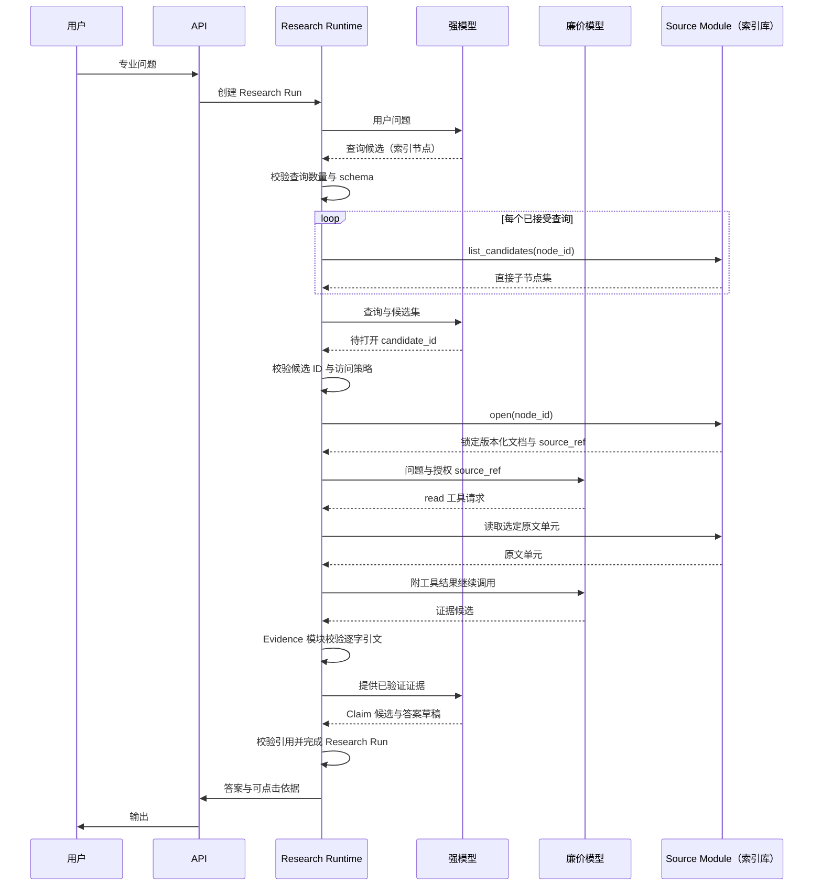

# 结构化索引数据库架构设计

> 状态：Draft
>
> 日期：2026-07-10
>
> 目的：为结构化索引数据库这一原文来源单独建模。原文来自人工维护的分层索引库与版本化文档，强模型逐层下降选择索引节点直至定位文档单元，在锁定版本的原文内逐字取证。本文按索引库自身规律独立描述，作为完整规格保留，尚未落地实现。

## 1. 索引库这一层的样子

结构化索引库有一棵人工维护的干净的树：目录、章节、条文层层可导航，命中即权威，版本由库自己锁定。这决定了它的骨架：

- **有干净的导航树**。入口是人工圈定的索引根，逐层下降到子节点，直到叶节点的文档单元。路径由索引结构给出，不靠对开放结果排序。
- **命中即权威**。来源范围人工维护、圈定，进入索引的都是权威原文。选枝只关心"选哪条分支最相关"，不必逐条判断真伪。
- **版本库自锁**。文档单元入库即锁定不变版本，历史版本保留，`source_ref` 编码文档、版本与位置，回答始终引用当时版本，无需另存快照。
- **来源受控，注入风险低**。原文来自受控库；即便如此，原文内容仍一律当数据处理，不执行其中指令。
- **代价是前期建设**。这棵树要人工建设和维护，覆盖范围受索引库边界限制。

因此结构化索引库的骨架是：**逐层下降选索引节点 → 叶节点定位版本化文档 → 在锁定原文内逐字取证 → 程序校验 → 带引用作答**。这条链是一棵可深的多层树，深度由索引层级决定。

## 2. 产品目标

- **高质量**：答案基于版本锁定的权威原文，而非向量相似片段或模型记忆。
- **可溯源**：每条事实结论都能定位到锁定版本文档中的逐字原文。
- **可审计**：导航、选择、打开、取证、结论、模型调用全过程逐步落 trace，可回放。
- **可控**：模型只产出结构化候选（索引节点 `candidate_id`、引文、Claim），系统控制流由程序把持，模型不决定流程。
- **低成本**：有界的查询数、每查询候选数、读取数，加上强/廉两档模型分工，压住调用量。

## 3. 索引库取证的三个动作

原文获取收敛成三个动作，共享统一的 Source 契约 `list_candidates / open / read`，按索引树语义落地：

| 动作 | 签名 | 职责 | 返回 |
| --- | --- | --- | --- |
| 逐层导航 | `list_candidates(node_id)` | 取该节点的直接子节点，仅供选枝 | `[{candidate_id, title, description}]` |
| 定位+锁版本 | `open(node_id)` | 在叶节点定位版本化文档并锁定版本 | `{source_ref, source_uri, content_hash, locked_at}` |
| 读取 | `read(source_ref)` | 读回锁定文档中的原文单元 | 原文单元 |

关键约束：强模型只能选择当前 `list_candidates` 返回集合中的 `candidate_id`，不得自造节点 ID。

### 3.1 逐层导航：`list_candidates`

- 返回该节点的直接子节点（ID、标题、描述、排序），根查询返回一级索引。
- Runtime 只展开已选节点的直接子节点，不全量递归后代，也不把整棵树交给模型。
- 逐层下降 `索引根 → 子节点 → …… → 文档单元`，层级可深；模型每层只在有界候选集内选枝。

### 3.2 定位与锁版本：`open`

- `open(node_id)` 在叶节点定位版本化文档，锁定不变版本，生成稳定 `source_ref`，形如 `source:doc/law87/v4#section-12`。
- 文档单元入库即锁定版本，历史版本保留，回答始终引用当时版本。
- `open` 后每个可读单元至少包含：

```text
source_ref
unit_id            文档段 ID
section_path       章节路径
offset             单元在文档内偏移
content_hash       内容哈希
source_uri         文档 URI
locked_at          文档版本时间
```

### 3.3 读取：`read`

- `read(source_ref)` 读回锁定文档中的原文单元，供廉价模型取证。
- 读的是锁定版本，`content_hash` 保证读到的就是入库时那份。

## 4. 索引库的构成

- 索引为人工维护的普通邻接表；主题树与法律效力、来源类型、适用地域、有效状态等正交属性分离存储。
- 索引只提供普通导航，不预设知识图谱。
- 文档单元入库即锁定版本，历史版本保留；`source_ref` 编码文档、版本与位置，历史回答按该引用可读回当时原文。

## 5. 受控工作流

一次问答是一个 Research Run，沿固定阶段执行。模型只产结构化候选，状态转移、任务派发、校验由程序把持。



默认流程：

1. API 为每个专业问题创建 Research Run。
2. 强模型返回有限查询候选（索引节点 ID）；Runtime 校验数量与 schema。
3. Runtime 对每个查询调用 `list_candidates` 取直接子节点，交给强模型；强模型只能返回当前集合中的 `candidate_id`。
4. Runtime 校验候选 ID 与访问策略，`open` 所选节点定位版本化文档并锁定版本；失败者不进入证据流程。
5. Runtime 按选定 `source_ref` 创建有限局部任务。廉价模型只能 `read` 授权原文并返回符合 schema 的证据候选，不得扩域、派生任务或写库。
6. Evidence 模块验证权限、版本、哈希、逐字引文和去重后，接受证据对象；候选描述不得充当证据。
7. 全部局部任务完成后，强模型读取问题、检索记录和已验证证据，生成 Claim 候选和答案草稿。
8. 程序校验 Claim 引用与事实性结论的引用，随后输出答案并完成 Research Run。

## 6. 程序校验

质量不靠模型自觉，靠程序在关键节点卡死：

1. **候选归属**：`open` 只接受本 run `list_candidates` 产生过的 `candidate_id`，杜绝模型自造节点 ID。
2. **版本与哈希匹配**：取证时校验读回原文的 `content_hash` 与锁定版本一致，确保读的就是入库那份。
3. **引文逐字命中**：引文必须是原文单元里连续原样出现的片段，否则判不通过。
4. **Claim 有据**：每条 Claim 的 `evidence_ids` 必须都指向已通过前三关的 Evidence，否则该 Claim 不成立。

四道全过的事实句才进最终答案；证据不足宁可拒答。

## 7. 模型分工

两档模型，各司其职，均经 OpenAI 兼容网关调用稳定别名（`research-strong` / `research-cheap`），映射在网关配置，切换渠道不改 Runtime 协议：

| 角色 | 职责 |
| --- | --- |
| 强模型 | 生成查询候选（索引节点）、选择候选、生成 Claim 与带引用答案草稿 |
| 廉价模型 | 在选定原文单元内读取并生成证据候选 |

廉价模型是受控检索子任务执行者，无通用 Agent 自治权：任务、授权数据范围、可用工具、输出 schema 与完成条件均由 Runtime 固定。模型全程无状态，每次调用的输入都由持久对象重建，只产结构化候选，不碰控制流。

## 8. 数据协议

每类模型 API 接受固定 schema 与有界数组，超过协议上限即拒绝。

查询与候选：

```json
{
  "query": "node:law.social.labor",
  "candidates": [
    {
      "candidate_id": "law.social.labor.termination",
      "title": "劳动合同解除",
      "description": "解除条件、程序、补偿与违法解除责任"
    }
  ]
}
```

局部任务：

```json
{
  "task_id": "T3",
  "query": "查找解除合同的补偿规则与例外",
  "source_ref": "source:doc/law87/v4#section-12",
  "status": "pending",
  "parent_task_id": null
}
```

证据卡：

```json
{
  "evidence_id": "E17",
  "source_ref": "source:doc/law87/v4#section-12:0-64",
  "quote": "原文短引文",
  "relation": "qualifies",
  "content_hash": "sha256:...",
  "task_id": "T3"
}
```

结论账本：

```json
{
  "claim_id": "C4",
  "claim": "该规则仅在特定条件下成立",
  "evidence_ids": ["E17", "E21"],
  "conditions": [],
  "exceptions": [],
  "status": "supported"
}
```

候选描述只用于选枝导航。最终事实性结论须经 Evidence 的 `source_ref` 回到锁定原文。

## 9. 存储与审计

两层持久化，职责分开：

```text
Application PostgreSQL
├─ Runtime: Run / Task / Model Call / Evidence / Claim / Trace
└─ Source A: 索引节点 / 文档单元元数据 / 版本

Object Storage
└─ Source A: 版本化文档正文与历史版本
```

Trace 保存外显研究链，而非模型隐藏思维链：

```text
原问题
→ Research Run
→ 查询、候选与已接受 candidate_id（索引节点）
→ 程序创建的任务
→ 打开的原文（文档版本）
→ 收集的证据
→ 形成的 Claim
→ 最终引用与答案
```

Evidence、Claim、原文都以 `source_ref` / `content_hash` 引用，不把正文复制进运行态。

## 10. 安全边界

- **来源受控**：原文来自人工维护的受控索引库，注入风险低；原文内容仍一律当数据，不执行其中指令。
- **权限校验**：读取前校验用户对 `source_ref` 的读取权限。
- **有界资源**：查询数、每查询候选数、读取数均有上限，压住成本与被滥用面。
- **确定性归程序**：状态转移、版本锁定、哈希与引文校验、去重均由程序执行，不依赖模型自觉。

## 11. 边界与局限

- 需人工建设与维护索引库，覆盖范围受库边界限制；权威范围人工圈定既是可控性来源，也是覆盖上限。
- 深度不足时靠索引树的层级下钻加深，不引入多轮自主图遍历。
- 作为完整规格保留，尚未落地实现。

***

`ponytail:` 本文按结构化索引库自身规律独立描述这一层的取证链；索引库尚未落地实现，为完整规格保留。
