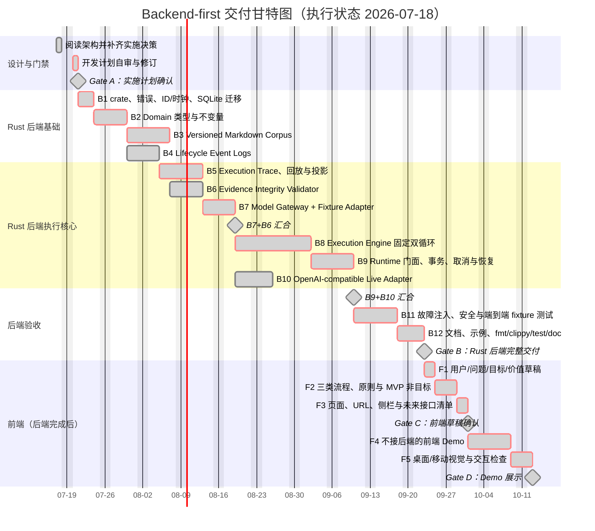
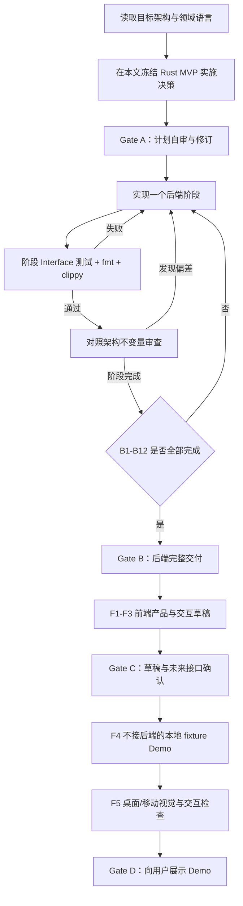

# Traceable Markdown Document Research Runtime 开发与交付计划

> 状态：Gate D 已通过；后端与独立 fixture Demo 均已交付
>
> 基线日期：2026-07-17
>
> 实施顺序：Rust 后端完整交付并通过 Gate B，随后才开始前端产品草稿和独立 Demo
>
> 架构依据：[`../curated-document-research-architecture.md`](../curated-document-research-architecture.md) 与 [`../../CONTEXT.md`](../../CONTEXT.md)

## 1. 目标与范围

本计划把目标架构转换为可执行、可审查、可验收的开发顺序。首个正式交付物是一个 Rust 2024 edition 的 library crate，提供 `TraceableMarkdownResearchRuntime` 命令 Interface、SQLite 持久化、OpenAI-compatible 模型 Adapter、Fixture Model Adapter、完整事件回放、恢复、审计投影和接口级测试。

后端交付不包含 HTTP、CLI、账户系统或部署进程。架构明确暂不选择传输与部署形态，因此首版以 in-process Rust Interface 为交付面；模型是唯一远程 Seam。未来传输 Adapter 只能调用 Runtime Interface，不得绕过它读取 SQLite 或原始事件。

后端 Gate B 通过前，不创建前端工程、不定义页面视觉方案，也不以 UI 需求反向削弱后端不变量。Gate B 通过后，先完成产品与交互草稿，再确定未来可能需要的 wire interface，最后实现一个只使用本地 fixture 数据、完全不接入后端的前端 Demo。

### 1.1 后端范围

- `MarkdownResearchDomain`：领域类型、规范化、内容寻址、纯不变量和错误分类。
- `VersionedMarkdownCorpus`：Markdown 解析、canonicalization、机械分段、导航 DAG 校验、不可变快照发布和受控读取。
- `DocumentResearchConversationLog` 与 `ResearchQuestionClarificationLog`：append-only 生命周期事件、合法状态转换、幂等与完整回放。
- `MarkdownResearchExecutionTrace`：版本化执行事件、完整回放、恢复状态、Overview、Detailed Audit 和公开答案投影。
- `MarkdownSourceEvidenceIntegrityValidator`：候选归属、授权、hash、byte offset、逐字命中、结论引用与回答来源校验。
- `MarkdownResearchModelGateway`：封闭强模型任务、廉价逐字取证任务、Fixture Adapter 和 OpenAI-compatible Live Adapter。
- `MarkdownResearchExecutionEngine`：固定双循环、分支任务、limits、检查点、证据、结论、答案合成、取消和恢复。
- `TraceableMarkdownResearchRuntime`：调用方唯一命令 Interface 与跨逻辑存储协调。

### 1.2 明确不做

- 不接入 PDF、网页、邮件、Wiki、向量数据库、全文搜索或通用 SQL 查询。
- 不生成、编辑或治理 Markdown Corpus Navigation。
- 不建设可配置工作流引擎，不允许调用方重排研究阶段。
- 不把历史答案或 Evidence-Linked Research Claim 回写为事实来源。
- 不实现 HTTP/REST/GraphQL/MCP、登录、Cookie、租户目录或部署脚本。
- 不承诺模型答案语义正确；程序只保证可观察来源、引用、状态和恢复契约。
- 前端 Demo 不请求 Runtime、不启动 mock HTTP server，也不以“临时接入”方式耦合后端。

## 2. 架构审查结论与实施决策

### 2.1 权威来源与冲突处理

1. 当前权威是 `docs/curated-document-research-architecture.md`、`CONTEXT.md` 和与其一致的 `README.md`。
2. 已删除的历史 `docs/database-search-architecture.md` 描述另一套数据库搜索方案，不作为实现依据，也不恢复。
3. 姊妹 Web Search 项目只提供生命周期、事件回放和恢复机制的参考；不复制 Web Search、URL、抓取、Browser/Host 或其具体存储布局。
4. 本文只补齐实现必须明确、但目标架构有意留空的物理与协议决策；若本文与目标架构的领域不变量冲突，以目标架构为准并暂停相关实现。

### 2.2 Rust MVP 决策记录

| 决策点 | Rust MVP 决策 | 原因与约束 |
| --- | --- | --- |
| 交付形态 | 单个 Rust library crate，edition 2024 | 保持 Runtime Interface 小而稳定，不提前锁定传输和部署 |
| 公开 Module | crate root 只重导出 Runtime 命令、命令/结果类型、投影类型和 Model Gateway Interface | 执行引擎、SQLite schema、reader、validator 和事件 payload 保持内部 Locality |
| 物理存储 | 单个 SQLite 数据库，WAL + `synchronous=FULL`；生命周期事件、Corpus 与执行事件分表、分逻辑所有者 | 同库事务可原子协调 prepare/terminal，同时不混淆三类权威来源 |
| Schema 迁移 | `schema_migrations` 表按单调版本迁移；事件表加 SQL trigger 拒绝 UPDATE/DELETE | 保持 append-only；测试覆盖新库、重复打开和不支持版本 |
| 幂等账本 | `command_commits(scope, command_id, request_hash, result_json, first_sequence, last_sequence)` 使用表级唯一约束 | 同 command ID + 同 request hash 返回首个结果；同 ID + 不同 hash 返回冲突；事件与账本同事务提交 |
| 同步/异步 | Runtime 命令为 async；所有 rusqlite 工作进入 Tokio `spawn_blocking`；外部模型调用期间不持有事务、DB guard 或 keyed lock | 明确 blocking storage boundary，避免阻塞调用方 executor 或让 guard 跨 `await` |
| 并发 | keyed mutex 只覆盖 replay/校验/提交短临界区，SQLite `BEGIN IMMEDIATE` + 唯一约束兜底；等待模型期间释放锁 | 允许取消先持久化；满足单执行串行提交；首版不承诺多进程 active-active |
| 主体与授权 | 每个命令接收 `ResearchPrincipal { subject_id, capabilities }`；Host 负责认证，Runtime 默认拒绝跨主体对象 | 补齐架构授权链，同时不把登录系统引入领域 |
| ID 与时钟 | UUID v7 opaque ID；UTC RFC3339 毫秒时间；内部 `IdGenerator`/`Clock` Seam 供确定性测试 | 生产可排序、测试可复现；模型永远不能生成权威 ID |
| 错误 | typed `RuntimeError`，含稳定 `error_code`、stage、retryable；无权限与不存在统一为 `object_not_available` | 调用方可可靠处理，且不泄露对象存在性 |
| Model Seam | `MarkdownResearchModelGateway` 有 Fixture 与 OpenAI-compatible 两个 Adapter | 两个真实 Adapter 证明 Seam 必要；模型不能访问存储或写事件 |
| Live 重试 | 只重试超时、连接错误、HTTP 429/5xx，指数退避且总次数受配置限制；schema/候选错误不重试 | 避免把确定性非法输出伪装成瞬时失败 |
| Prompt/凭据 | Prompt 在 Live Adapter 内版本化；API key 只在 Adapter config；事件只记录模型 reference、task schema version 和可公开审计摘要 | 不把 Prompt、密钥、隐藏思维链写入冻结执行或事件 |
| 公开投影 | 只能从 `ReplayedMarkdownResearchExecution` 派生；Detailed Audit 使用 opaque cursor 和最大页大小 200 | 阻止客户端直接过滤原始事件 |
| 取消 | `cancel_document_research_request` 适用于任一非终态；prepared/running execution 先持久化 cancellation request；Engine 在派发前和响应提交前检查，取消先到则丢弃未提交模型响应并写唯一 cancelled 终态 | 统一命令表与状态机；模型等待不占 keyed lock，不在提交一半时截断事务 |
| 确认重试 | 暴露 `retry_research_question_evaluation`；只允许从 evaluation failed 回到 pending | 补齐状态机中已有但命令表遗漏的动作 |
| 分支失败 | 增加版本化 `markdown_corpus_navigation_branch_document_report_failed` 事件 | 让“分支有报告或明确失败”的停止条件可回放 |

### 2.3 Markdown canonicalization v1

发布输入是 `{ relative_path, markdown_source_bytes }`，而不是让模型或 Runtime 任意遍历文件系统。v1 规则固定如下，并由 fixture 锁定：

1. 严格 UTF-8；拒绝 UTF-8 BOM、NUL、孤立 CR 和非法编码。CRLF 规范化为 LF；文件结尾规范化为恰好一个 LF。
2. 相对路径统一使用 `/`；拒绝空路径、绝对路径、盘符、`..`、`.` 空洞段、反斜线和重复规范化后冲突。目录导入 Adapter 若未来增加，必须先解析 real path 并拒绝越出语料根目录的符号链接。
3. 文件必须以 YAML front matter 开始；v1 只允许唯一字段 `markdown_source_document_id`，拒绝未知字段、重复 key、空 ID 和重复文档 ID。
4. front matter 后必须恰有一个 ATX 一级标题；使用 `pulldown-cmark 0.13.4`、`Options::empty()` 和 offset iterator 解析。metadata text 只拼接 `Text`/`Code`，soft/hard break 变为一个 ASCII 空格，Unicode whitespace 连续段折叠为一个 ASCII 空格并 trim；保留其余 Unicode code point，不做 NFC/NFKC；拒绝 title/abstract 内的 raw HTML、footnote 和非普通段落结构。一级标题后的首个非空普通段落是 abstract；拒绝缺少 abstract、第二个一级标题或空正文。
5. `canonical_markdown_document_body` 是 abstract 结束后的剩余 Markdown 源文本：移除前导空行、保留内部 Markdown 与空白、结尾固定一个 LF。
6. Segment 按 canonical body 中的 ATX 二至六级标题与空行分隔的 Markdown block 机械切分；每个非空 block 是连续 segment，并携带最近 section heading。代码围栏内部的标题和空行不切分。
7. Segment 的 start/end byte offset 以 canonical body UTF-8 字节为坐标，区间为 `[start, end)`。空白分隔符不进入 quote，但 hash 覆盖 segment 的完整连续源文本。
8. 廉价模型候选 offset 相对当前 segment；程序验证后换算并保存为 canonical body 的绝对 evidence offset。持久化的 `verbatim_source_evidence_start/end_byte_offset` 始终是 canonical body 的 `[start, end)`。
9. front matter 由 `serde_yaml_ng 0.10.0` 解析为 `deny_unknown_fields` struct；parser/front-matter crate 的精确版本由 `Cargo.lock` 锁定，升级必须增加对应 schema version 和 fixture。
10. 所有 hash preimage 使用 RFC 8785 JCS，由 `serde_json_canonicalizer 0.3.2` 生成 UTF-8 bytes，再计算 SHA-256。对象 key 由 JCS 排序；语义有序数组保持顺序；集合型数组在构造时按 opaque ID 排序并拒绝重复。Unicode code point 原样进入 JCS，不另做 Unicode normalization。
11. 文档版本 hash 覆盖 canonical source，以及 `markdown_source_document_schema_version`、`markdown_parser_schema_version`、`markdown_canonicalization_schema_version`；相同文档 ID 与相同 hash 复用版本。Markdown Corpus Snapshot hash 还覆盖 offset 顺序的 segments、按 ID 排序的 documents/navigation nodes/edges，以及 `markdown_corpus_navigation_schema_version` 和 `markdown_corpus_snapshot_hash_schema_version`。五个 version 字段都显式进入 preimage。

### 2.4 导航 DAG v1

- 发布命令必须声明且只声明一个 root node；root 入度为 0。
- node ID 全局唯一；child 和 linked document 列表内部不得重复。
- 所有 child node 和 linked document 必须存在于同一发布输入。
- 拒绝环、自环、不可从 root 到达的 orphan node；允许非 root node 有多个父节点。
- 导航 node 只包含 ID、label、summary、children 和 linked documents；拒绝路径、URI、事实断言扩展字段。
- 发布限制：最多 10,000 文档、50,000 nodes、每 node 1,000 children、1,000 linked documents、全 Snapshot 1,000,000 条 child/document edges；超限整体失败，不发布半个 Snapshot。

### 2.5 输入与记录大小上限 v1

所有长度按 UTF-8 byte 计数；在分配大集合、解析 YAML/Markdown、持久化事件或调用模型前检查。

| 对象 | v1 hard cap |
| --- | ---: |
| 单 Markdown 源文件 | 16 MiB |
| 单次发布全部 Markdown 源文件 | 512 MiB |
| document ID / navigation node ID / opaque ID | 128 bytes |
| document title / navigation label | 512 bytes |
| document abstract / navigation summary | 4 KiB |
| 单 Markdown Source Segment | 256 KiB；不可安全机械切分的超大 block 整体拒绝 |
| 单 Verbatim Source Evidence quote | 64 KiB |
| 单 Source-Attributed Answer Segment | 64 KiB |
| 单事件 payload JSON | 16 MiB |
| 单模型 task serialized input | 16 MiB |
| 单模型 HTTP response body / parsed response | 4 MiB |
| Detailed Audit page | 200 items 且 serialized page 不超过 4 MiB |

### 2.6 执行 limits v1

所有值必须大于零且在代码定义的 hard cap 内。默认值只用于调用方明确选择 default profile 时，最终仍完整冻结进 Prepared Execution。

| Limit | 默认值 | Hard cap | 计数时点 |
| --- | ---: | ---: | --- |
| `maximum_markdown_corpus_navigation_depth` | 8 | 32 | 提交新深度前 |
| `maximum_selected_markdown_corpus_navigation_branches_per_level` | 4 | 32 | 提交 branch selection 前 |
| `maximum_active_document_research_branches` | 8 | 64 | 创建 branch task 前 |
| `maximum_selected_markdown_source_documents` | 32 | 1,000 | 首次提交 document selection 前 |
| `maximum_read_markdown_source_segments` | 128 | 10,000 | 创建 read request 前 |
| `maximum_strong_markdown_research_model_requests` | 128 | 10,000 | 首次提交 logical strong task dispatch checkpoint 前 |
| `maximum_verbatim_source_evidence_extraction_model_requests` | 128 | 10,000 | 首次提交 logical extraction task checkpoint 前 |
| `maximum_total_model_input_token_estimate` | 1,000,000 | 50,000,000 | 首次派发 logical task 前，使用冻结 estimator version |
| `maximum_markdown_research_execution_duration_seconds` | 1,800 | 86,400 | 每个安全检查点，以持久化 running 事件时间为起点 |

资源耗尽策略也被执行契约冻结：默认 `produce_limited_answer_with_gap_disclosure`。若至少有一条已接受 evidence 和一条合法 claim，可继续生成明确披露缺口的有限答案；否则以 `markdown_research_execution_limits_exhausted_without_usable_evidence` 失败，不能伪装为完整答案。

计数口径是可回放的 logical model task，而不是 HTTP attempt：

1. 首次进入 running 时追加唯一 `markdown_research_execution_running`，其 UTC 时间是 duration 起点。
2. 每个强模型 logical task 在网络调用前原子追加 `strong_markdown_research_model_request_dispatched`，包含稳定 model task ID、task kind、冻结 token estimator version、input hash 和 token estimate；廉价任务沿用 `verbatim_source_evidence_extraction_requested` 并补同等字段。
3. 同一个 model task 因崩溃恢复而重新调用不再次增加 request/token limit；Adapter 内 HTTP retry 也不增加领域 limit，但仍受 Adapter max attempts、execution duration 和 cancellation 约束。
4. 新 logical task 的 checkpoint 一经提交即消耗额度，即使网络调用最终失败。完整 replay 直接从 dispatch checkpoint 重建计数，不能依赖内存计数器。

### 2.7 模型任务可见数据矩阵 v1

`MarkdownResearchModelGateway: Send + Sync`。每个 task 使用独立 request type，不提供“包含所有字段的通用上下文”。`MK` 表示 Model-Knowledge-Only Answer，`C` 表示当前 Markdown Corpus 数据，`E` 表示已接受 Verbatim Source Evidence，`RC` 表示已提交 Evidence-Linked Research Claim。

| Strong task variant | Frozen Brief/允许的历史 | C | MK | E | RC |
| --- | --- | --- | --- | --- | --- |
| Research Question Evaluation | 是 | 否 | 否 | 否 | 否 |
| Model-Knowledge-Only Answer Generation | 是 | 否 | 否 | 否 | 否 |
| Navigation Branch Selection | 是 | 仅完整直接子节点集 | 否 | 仅 scope expansion 触发 evidence IDs，不含 quote | 否 |
| Branch Document Relevance Report | 是 | 仅本 branch 全部 title/abstract | 否 | 否 | 否 |
| Research Document Read Request | 是 | 仅已提交 reports 与 segment metadata | 否 | 已接受 evidence | 否 |
| Markdown Source Review | 是 | 仅一个已授权 segment | 否 | 当前执行已接受 evidence | 否 |
| Evidence-Linked Research Claim Generation | 是 | 否 | 否 | 是 | 否 |
| Evidence-Linked Research Claims Answer Generation | 是 | 否 | 否 | 否 | 是，且为唯一事实输入 |
| Source-Attributed Answer Composition | 是 | 否 | 是 | 仅 Public Citation 投影 | 是及 Claims Answer |

廉价 extraction task 只看到一个已授权 segment、clarified question 和 extraction goal。每个 variant 都有 allowed-field 与 forbidden-field contract test；两条答案输入路线只能在 Source-Attributed Answer Composition 汇合。

### 2.8 投影协议 v1

`PublicSourceCitation` 至少包含 citation ID、稳定 document ID、document title、section heading、逐字 quote、document version content hash；不包含路径、Internal Markdown Source Reference、branch task ID、模型配置或原始事件。

`PublicMarkdownResearchAnswer` 包含回答方式、按顺序排列的 answer segments、每段 source type、允许公开的 citations、模型知识未验证提示和需披露的 Research Coverage Gap。`MarkdownResearchExecutionOverview` 只返回架构白名单摘要。`DetailedMarkdownResearchAuditPage` 返回白名单 audit item、opaque next cursor 和 schema version；cursor 不作为授权凭据。

## 3. 甘特图

日期是实施排序和工作量基线，不是牺牲门禁换取日期的承诺。后续任务只能在前置 Gate 通过后开始。



## 4. 交付顺序与详细开发步骤

### Gate A：实施文档确认

1. 对照架构逐项检查 Module、命令、状态机、事件、授权、limits、恢复和验证面。
2. 检查本文补齐的决策是否缩小了未决空间，但没有改变“模型提议、程序提交”“Markdown 唯一真源”“先完整回放再投影”等核心契约。
3. 检查后端和前端是否由 Gate B 强制隔离。
4. 修复审查发现后，将文档状态保持为“允许进入后端实现”，开始 B1。

### B1：crate、工具链与持久化骨架

**实现**

- 创建 Rust 2024 library crate；设置 `unsafe_code = "forbid"`、稳定 rustfmt 与严格 clippy。
- 建立 `domain`、`corpus`、`conversation`、`clarification`、`execution_trace`、`integrity`、`model_gateway`、`execution_engine`、`runtime`、`storage`、`error` Module。
- 定义 typed `RuntimeError`、stage、stable error code、retryable 分类。
- 定义 `ResearchPrincipal`、typed opaque IDs、`Clock` 与 `IdGenerator` 内部 Seam。
- 建立 SQLite migration runner、WAL/`synchronous=FULL`/foreign keys/busy timeout、append-only event trigger 和三类逻辑表空间。
- 建立 `command_commits` 幂等账本；request hash、结果与对应 event sequence range 在同一事务写入。
- 建立 `spawn_blocking` storage boundary；任何 rusqlite connection/transaction/guard 都不能跨 `.await`。
- 将 README 的语言选择更新为“本次实现采用 Rust”，但保留 library-only、传输未定和非目标说明。

**测试与退出条件**

- 新库创建、重复打开、migration 顺序、未来 schema 拒绝、event UPDATE/DELETE 拒绝。
- ID/UTC 时间确定性 fixture；无权限与不存在错误不可区分。
- 同 command ID/同 hash 返回首结果；同 ID/不同 hash 冲突；checkpoint event batch 与 command ledger 要么全提交、要么全回滚。
- `cargo fmt --all -- --check`、`cargo clippy --all-targets --all-features -- -D warnings`、`cargo test --all-targets` 通过。

**交付物**：可编译 crate、schema v1、错误与测试基础设施。

### B2：MarkdownResearchDomain

**实现**

- Frozen Document Research Brief 规范化、canonical JSON 与 SHA-256 content hash。
- Answer Composition Style、Source-Attributed Answer Segment Source Type、Research Coverage Gap、Verbatim Source Evidence、Evidence-Linked Research Claim、Research Claim Evidence Relationship、各类完整 Answer 和 Markdown Research Execution Limits 类型。
- 所有模型输入/输出和事件 payload 使用封闭 serde schema，拒绝未知字段。
- 构造函数集中验证长度、非空、枚举、去重、所有权和 immutable field。

**测试与退出条件**

- hash 对 map 顺序、换行和数组顺序的预期稳定；非法 brief/limits/关系/来源段拒绝。
- 两种 composition style 可单独或同时请求，拒绝空集合和重复值。
- public item 有 rustdoc；调用方不能绕过构造函数制造非法冻结对象。

**交付物**：被后续 Module 共同使用的稳定领域 Interface。

### B3：VersionedMarkdownCorpus

**实现**

- 按 2.3 实现 parser/canonicalization/segment v1 与 fixture corpus。
- 按 2.4 校验导航 DAG；以单事务发布 immutable Snapshot。
- 复用未变化 document version；内容变化创建新 version 和 segments。
- `open_markdown_corpus_snapshot` 返回 snapshot-bound reader，只提供直接子 nodes、标题/摘要、segment metadata 和授权 segment read。
- 每次读取校验 owner、snapshot、version、segment 与 hash；不暴露文件系统路径给模型。

**测试与退出条件**

- UTF-8/BOM/front matter/H1/abstract/body/path/DAG 全部拒绝矩阵。
- 中英文与多字节 UTF-8 byte offset、代码围栏、标题、段落、CRLF fixture。
- Markdown Corpus Snapshot hash 确定、相同版本复用、旧 Markdown Corpus Snapshot 不漂移、跨 owner/snapshot read 拒绝。
- 发布失败无部分行写入。

**交付物**：可独立发布与读取的版本化 Markdown Corpus。

### B4：Conversation 与 Clarification Lifecycle Logs

**实现**

- versioned lifecycle event envelope 与 payload；append 只接受 expected revision。
- Conversation reducer：request number 单调、最多一个 active request、终态幂等。
- Research Question Clarification reducer：使用架构完整状态名校验 `ResearchQuestionEvaluationPending`、`AwaitingResearchQuestionClarification`、`ResearchQuestionEvaluationFailed`、`DocumentResearchBriefReadyForExecution`、`MarkdownResearchExecutionPrepared` 和各完整终态之间的合法转换。
- 已完成历史只投影 original question 和 public final answer；失败、证据、claim、trace 不进入新执行。
- 支持 submit、retry、cancel；相同 command ID 返回第一次结果，不同 payload 冲突。

**测试与退出条件**

- revision race、双 active request、非法终态、重复 command、事件截断/乱序/未来 schema。
- clarification 模型失败不能用原问题伪造 Frozen Brief。
- 取消覆盖所有非终态，并保持唯一 terminal fact。

**交付物**：可完整回放的研究请求生命周期。

### B5：MarkdownResearchExecutionTrace、回放与投影

**实现**

- 为架构事件列表及 `markdown_research_execution_running`、strong model dispatch、branch report failure、cancellation request 定义 versioned payload。
- 追加时在同一 execution 内分配连续 sequence；记录 UTC、command ID、owner 和必要审计摘要。
- 全量 replay 校验首事件、sequence/time、先后关系、对象归属、requested styles 和唯一末尾终态。`markdown_research_execution_completed` 必须恰有一个 Model-Knowledge-Only Answer、一个 Evidence-Linked Research Claims Answer，并覆盖全部 requested composition styles；failed/cancelled 只要求合法事件前缀、中间单例产物至多一个和唯一末尾终态，不要求尚未到达的答案存在。
- append 与 replay 复用同一个 reducer；一个 checkpoint 的关联事件以单事务 batch 提交，不保留再忽略“半阶段尾巴”。
- 从 `ReplayedMarkdownResearchExecution` 派生 recovery checkpoint、Overview、Detailed Audit page 和 Public Answer；禁止直接投影 raw row。

**测试与退出条件**

- 每种相邻顺序错误、截断、重复、跨 execution ID、终态后追加、未来 schema 都拒绝。
- raw event 中的 Prompt/credential/full unrelated body 永远不进入序列化结果。
- 投影 golden tests 证明白名单字段，cursor 分页无重复/遗漏且不可越权。

**交付物**：执行事件权威、完整回放和三类安全投影。

### B6：MarkdownSourceEvidenceIntegrityValidator

**实现**

- 校验 candidate 属于 persisted candidate set、branch task、locked Snapshot 和 authorized read request。
- 校验 segment/document hash、segment-relative candidate offset、换算后的 body offset 和逐字 UTF-8 命中。
- 拒绝重复 evidence；验证 claim relationships 只引用当前 execution accepted evidence。
- 验证 Claims Answer 和 Source-Attributed Answer Segment 的 claim/citation/source type/模型提示规则。

**测试与退出条件**

- 多字节字符边界、非 char boundary、同 quote 多次出现、off-by-one、hash drift。
- 跨 owner/execution/branch/snapshot/document/segment ID 全部拒绝。
- 程序只声明完整性，不把关系类型当作语义证明。

**交付物**：纯确定性完整性 Module。

### B7：MarkdownResearchModelGateway 与 Fixture Adapter

**实现**

- 强模型封闭 task variants：Research Question Evaluation、Model-Knowledge-Only Answer Generation、Markdown Corpus Navigation Branch Selection、Branch Document Relevance Report、Research Document Read Request、Markdown Source Review、Evidence-Linked Research Claim Generation、Evidence-Linked Research Claims Answer Generation、Source-Attributed Answer Composition。
- 廉价模型动作只接受一个 authorized segment、clarified question 和 extraction goal。
- 每个 task 只携带该阶段可见数据；模型响应只能引用候选 opaque ID。
- Fixture Adapter 以稳定 model task ID / document research branch task ID 匹配脚本响应，不依赖并发完成顺序；记录收到的数据并在 ID 或 task kind 不匹配时立即失败。

**测试与退出条件**

- 按 2.7 对每个 task variant 做 allowed/forbidden-field contract tests；特别验证 Model-Knowledge-Only Answer 不进入导航选择、分支报告、读取请求、正文审阅、Evidence-Linked Research Claim 或 Claims Answer，廉价模型看不到导航、其他 segment 或控制动作。
- unknown field、数组/文本超限、编造 ID 和错误 task response 整体拒绝。

**交付物**：可驱动完整离线测试的真实 Model Seam。

### B8：MarkdownResearchExecutionEngine

**实现**

- 从完整 replay 开始；若已有完整终态直接返回，未终止则从最后原子 checkpoint 继续。
- 依序执行 model-only answer、导航逐层发现、branch reports、document/segment read 双循环、廉价取证、claims、claims-only answer 和每种 composition。
- 所有模型响应先验证再单事务提交；外部调用可重复，提交受 command/checkpoint 幂等约束。模型等待期间不持有 keyed lock；响应返回后重新 replay，并在 cancellation request 先到时丢弃响应。
- 每次派发前冻结候选/配额/授权；独立 branch report 可并发，返回后按稳定 branch ID 顺序提交。
- 实现可由 dispatch/running 事件回放的 limits 计数、Research Coverage Gap 更新、停止条件、有限答案/失败策略和 cooperative cancellation。
- 强制候选/授权链：完整直接子导航节点集先提交再选择；每个 branch 的完整 title/abstract 集先冻结再生成报告；文档只能来自已提交报告；每次 segment 读取前必须有当前 execution 的有效 Research Document Read Request；scope expansion 必须由当前 execution 已接受 Verbatim Source Evidence 触发。

**测试与退出条件**

- happy path 同时生成两种 style，但研究、evidence 与 claims 只执行一次。
- 横向 expand 与纵向 additional segment 两个循环均被 fixture 驱动覆盖。
- 负向测试逐项证明：不能选择未提交 node、不能从报告外选择文档、不能无 Research Document Read Request 读取、不能跨 branch/snapshot 读取、不能无已接受 Verbatim Source Evidence 扩大范围、不能越权创建 Evidence-Linked Research Claim；limit 在 dispatch checkpoint 前阻止超支。
- 高优先级 gap 未解决/未披露时不能完成；模型一句“足够”不能绕过停止条件。

**交付物**：通过 Fixture Adapter 运行完整固定研究流程的核心深 Module。

### B9：TraceableMarkdownResearchRuntime

**实现**

- 实现完整架构命令 Interface：`publish_markdown_corpus_snapshot`、`create_document_research_conversation`、`load_document_research_conversation`、`start_document_research_request`、`submit_research_question_clarification_message`、`retry_research_question_evaluation`、`cancel_document_research_request`、`prepare_markdown_research_execution`、`execute_prepared_markdown_research`、`load_document_research_request`、`project_public_markdown_research_answer`、`project_detailed_markdown_research_audit`。
- prepare 在一个事务中冻结 brief、Snapshot、model references、limits 和 styles；重复调用复用原 execution，冲突参数失败。
- Runtime 协调 lifecycle 与 execution terminal 的同库事务；公开方法始终验证 principal ownership。
- keyed locks 只负责单进程串行化，不泄露到公开 Interface；SQLite constraint 是持久化兜底。

**测试与退出条件**

- 只通过 Runtime Interface 的 integration tests 覆盖完整生命周期。
- prepare 的 lifecycle state、Prepared Markdown Research Execution 与首个 Trace 事件同事务全提交或全回滚；完整终态 execute 不重复模型调用；覆盖 cancel 与 execute race、重复命令同结果。
- 重启新 Runtime 实例后能从同一 SQLite 恢复，不依赖内存状态。

**交付物**：调用方唯一、稳定、可恢复的后端 Interface。

### B10：OpenAI-compatible Live Adapter

**实现**

- 配置 endpoint、API key、strong/cheap model name、timeout、retry policy 和 prompt/schema version。
- task variant 对应独立 system instruction + data JSON；不可信 Markdown/历史/模型输出保持 data message。
- 请求严格 structured output；响应先解析封闭 schema，再交 Engine 做候选/所有权/limit 校验。
- HTTP error、timeout、429/5xx、invalid JSON/schema、refusal 分别映射稳定 RuntimeError。

**测试与退出条件**

- 本地 HTTP fixture 覆盖 auth header、payload 数据隔离、timeout、429/5xx retry、4xx 不重试、malformed response。
- 日志/错误/Debug 不输出 API key、Prompt 内容或完整正文。
- 默认测试不访问公网；live smoke test 必须显式 opt-in 环境变量。

**交付物**：可配置生产模型 Adapter，不改变 Runtime Interface。

### B11：端到端、故障注入与安全验证

**实现与测试矩阵**

- 在每个模型调用后/事件提交前、每个 branch checkpoint 前后、claim/answer/terminal 提交前后注入崩溃。
- 每次恢复使用新 Runtime 实例和同一 SQLite；验证外部调用可重复但对象、事件和 terminal 不重复。
- 篡改 fixture 覆盖 event sequence、payload ownership、Markdown Corpus Snapshot hash、segment hash、offset、citation 和 cursor。
- 并发 fixture 覆盖双 start、双 prepare、双 execute、cancel race 和 branch response 乱序。
- 大小上限 fixture 验证 2.4 与 2.5 的文档、Corpus、node、edge、segment、event payload、model task/response 和审计分页 hard cap。

**退出条件**

- 架构 16.3 的七个验证面全部有接口级自动化证据。
- 没有通过访问私有 SQLite row 或私有 Engine state 才能验证的核心行为。
- 所有测试离线、可重复；临时数据库和 fixture 自动清理。

**交付物**：恢复、安全、并发和来源完整性的独立测试证据。

### B12 与 Gate B：后端收尾和完整交付

**收尾**

- 更新 README：实际 Module、最小使用示例、保证/非保证、运行测试和 live Adapter 配置。
- 提供 `examples/fixture_research.rs`，演示发布 Corpus、创建请求、确认、prepare、execute 和公开投影。
- 生成 rustdoc；检查所有 public type/method 的不变量、错误和幂等说明。
- 删除过期“尚无 Runtime 实现”表述，但不覆盖用户已有架构/领域文档改动。

**Gate B 必须全部满足**

```text
cargo fmt --all -- --check
cargo clippy --all-targets --all-features -- -D warnings
cargo test --all-targets --all-features
cargo test --doc
```

- Runtime 全部命令、Fixture 与 Live Adapter、SQLite migration、恢复和三类投影已实现。
- B1-B11 的退出条件全部通过；没有 ignored 核心测试、默认联网测试或仅写在 TODO 的架构命令。
- README 与实现一致，`git diff --check` 通过。
- 记录后端已知限制：library-only、单进程 active execution 串行化、不证明模型语义正确。

Gate B 未通过时，不得开始 F1，也不得把前端 Demo 当作后端完成证据。

## 5. 前端阶段（仅在 Gate B 后开始）

### F1-F3：先写产品与交互草稿

草稿必须按以下顺序形成并单独审查：

1. **用户**：主要用户、研究经验、文档管理权限、可信度需求和使用环境。
2. **用户问题**：问题确认成本、范围不确定、来源核验、长任务等待、失败恢复和审计需求。
3. **产品目标与核心价值**：让用户看到“研究正在做什么、结论依据什么、哪些内容仍未验证”，而不是把 Runtime 包装成普通聊天框。
4. **首次使用流程**：进入产品、选择已有 Corpus Snapshot、创建 Conversation、提交问题、补充确认、查看执行和答案。
5. **正常研究流程**：请求列表、clarification、研究进度、Coverage Gap、双风格答案、citation 与 audit 之间的导航。
6. **失败恢复流程**：模型失败、limit 耗尽、取消、恢复中、Snapshot 不可用和权限不可用的界面状态与下一步动作。
7. **产品原则**：来源差异始终可见；内部复杂度按需展开；破坏性动作明确；失败不伪装为成功；历史答案不是新证据。
8. **MVP 明确不做**：Corpus 编辑/导航生成、协作权限管理、实时多人、后台管理、计费、模型配置中心、真实后端接入。
9. **页面清单**：Conversation 列表、Research workspace、Request detail、Answer comparison、Execution overview、Detailed audit、Corpus snapshot picker，以及必要的 empty/error/loading states。
10. **建议 URL**：为页面定义稳定层级；Demo 使用客户端路由，但不承诺后端 HTTP path。
11. **侧栏定义**：一级导航、Conversation/Request 层级、当前执行状态、收起/移动端行为。
12. **未来接口清单**：从已确认页面状态反推 command/query，不把 Rust struct 直接等同于 wire JSON；标明 polling/streaming、分页、错误和授权需求。

完成上述草稿并通过 Gate C 后，才能创建 Demo 代码。

### F4-F5：独立前端 Demo

- Demo 只使用本地 typed fixtures，覆盖首次使用、正常研究、失败恢复三条可切换场景。
- 展示真实目标状态：clarification、导航/读取进度、Coverage Gap、两种回答方式、逐段来源、citation 和 audit。
- 不调用后端、不创建伪 HTTP 接口、不要求运行 Rust Runtime。
- 桌面与移动视口均做浏览器截图和交互检查；检查溢出、重叠、键盘焦点、空/加载/错误状态。
- 启动本地开发服务器并向用户提供 URL；Gate D 以可操作 Demo 和截图为展示结果。

## 6. 开发与审查流程



每个后端阶段遵循同一提交前循环：

1. 从本阶段退出条件写接口级失败测试或 fixture。
2. 只实现让该阶段通过所需的最小完整行为。
3. 运行目标测试，再运行全量 fmt/clippy/test。
4. 审查 public Interface 是否变浅、内部 Seam 是否泄露、事件是否能完整回放、错误是否稳定。
5. 审查 diff 是否覆盖用户现有改动、是否引入 Web Search/HTTP 等越界内容。
6. 更新本文阶段状态和实际偏差；偏差必须写原因与替代验证，不能静默漂移。

## 7. 实施前审查记录

首轮自审与独立架构复审日期：2026-07-17。首轮复审发现的失败 Trace 答案基数、limits 可回放计数、取消锁粒度、甘特汇合、模型输入隔离、授权链、hash 决定性、大小上限、并发 Fixture、blocking SQLite、prepare 原子性和完整领域命名问题，已在 2.2-2.8 与 B1-B11 中逐项修订；2026-07-18 完成关闭性复审。

| 审查项 | 结论 |
| --- | --- |
| 后端是否先于前端 | 通过；Gate B 是 F1 的强前置条件 |
| 是否覆盖架构全部核心 Module | 通过；B2-B10 对应 Domain、Corpus、Lifecycle、Trace、Validator、Gateway、Engine、Runtime |
| 是否补齐物理存储与事务选择 | 通过；单 SQLite、分逻辑权威、`synchronous=FULL`、blocking boundary、同库事务、command ledger、append-only trigger |
| 是否补齐 Markdown/offset/hash 决定性 | 通过；2.3 定义 parser、Unicode、RFC 8785 JCS、数组顺序、schema versions 与 offset 坐标系 |
| 是否补齐授权主体 | 通过；Host 提供 Principal，Runtime 对所有对象默认拒绝跨主体访问 |
| 是否补齐失败/取消 Trace 基数 | 通过；completed 要求完整答案集，failed/cancelled 只要求合法前缀和唯一末尾终态 |
| 是否补齐取消、重试和分支失败事件 | 通过；取消可在模型等待时先提交，Engine 响应提交前重新检查 |
| 是否完整覆盖 limits 与停止策略 | 通过；默认、hard cap、logical task dispatch、running 起点、恢复/HTTP retry 计数和资源耗尽结果已冻结 |
| 是否保持模型权限最小化 | 通过；2.7 为每个 task variant 定义 allowed/forbidden fields，两条路线只在最终合成汇合 |
| 是否保持先 replay 后恢复/投影 | 通过；B5、B8、B9 和 B11 均把完整 replay 设为前置条件 |
| 是否误加公共 HTTP 传输或真实前端接入 | 通过；只保留模型 Seam 内的 OpenAI-compatible HTTP client，未增加 Runtime HTTP 传输；前端仍不接后端 |
| 是否定义可执行验收 | 通过；每阶段有实现、测试、退出条件与交付物，Gate B 有四条质量命令 |
| 前端草稿是否覆盖用户指定内容 | 通过；F1-F3 逐项包含用户、问题、价值、三类流程、原则、MVP 非目标、页面、URL、侧栏和未来接口 |

Gate A 结论：通过。关闭性复审确认没有阻止 B1 的剩余问题，随后按 B1 → B12 完成 Rust 后端。

Gate B 结论：2026-07-18 通过。`cargo fmt --all -- --check`、严格 Clippy、74 项全目标测试、doc tests、rustdoc、离线示例与 `git diff --check` 均成功。后端交付保持 library-only；同一 Runtime 实例按 execution ID 串行化模型工作流，SQLite 保证事件与终态唯一，但多个进程或多个独立 Runtime 实例仍可能重复发送外部模型请求。跨进程恰好一次模型调用需要未来增加持久化 lease/claim 协议，不属于本次 MVP。Gate B 通过后进入 F1-F3，先形成并审查前端产品与交互草稿，再创建独立 fixture Demo。

Gate C 结论：2026-07-18 通过。产品与交互草稿覆盖用户指定的全部内容，并冻结“证据装订台”视觉方向、页面/URL/侧栏、三类 fixture 场景和未来 wire interface。草稿明确未来真实接入前必须新增安全的 Snapshot/Conversation 列表投影与持久化异步作业协调层；Demo 不承担这些工作。

Gate D 结论：2026-07-18 通过。`frontend/` 使用 React、TypeScript、Vite 与 Lucide 实现纯本地 Demo；4 项交互测试和生产构建成功，静态扫描确认不存在网络调用或 mock API。应用内浏览器完成 1440×900 桌面、1024px 中间断点和 390×844 移动验收，覆盖答案对照、来源账页、审计定位/加载、首次流程、恢复和取消；没有横向溢出、控制台 warning/error 或不可操作控件。
