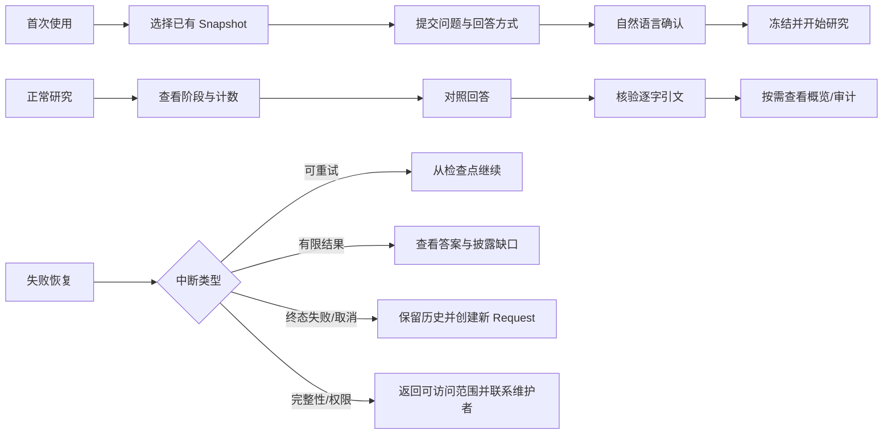

# 前端 Demo 产品、交互与未来接口草稿

> 状态：Gate D 已通过；独立 fixture Demo 已交付
>
> 日期：2026-07-18
>
> 前置条件：Rust 后端 Gate B 已通过
>
> 交付约束：前端仅使用本地 typed fixtures，不请求 Rust Runtime，不创建 mock HTTP 服务，也不把 Demo 数据结构承诺为未来 wire contract

## 1. 产品定义

产品暂定名为 **迹研**，定位是面向合规、法务、政策和内部知识研究人员的可追溯 Markdown 研究工作台。它不是通用聊天框，也不是语料管理后台。

主页面只有一个首要任务：让用户读答案时能立即核验依据、识别模型补充和未验证缺口，并在研究中断后采取合法的下一步动作。

Demo 选择一个具体主题承载真实内容：用户在锁定的“中国劳动政策汇编”Markdown Corpus Snapshot 中研究“解除劳动合同时，经济补偿月工资基数如何计算，是否存在封顶”。资料、回答和引用均为本地演示 fixture，不构成法律建议。

## 2. 用户

### 2.1 主要用户：受控资料研究者

- 法务、合规、政策、知识运营或内部研究人员，需要从既有 Markdown 资料形成可复核结论。
- 熟悉业务问题和来源核验，但不需要理解 Runtime、事件回放或模型任务等内部实现。
- 具备研究执行权限，可选择已有且可访问的 Markdown Corpus Snapshot；不默认具备语料发布或导航维护权限。
- 主要在桌面端完成研究，移动端用于查看状态、答案和引用。
- 对可信度的核心要求不是“模型保证正确”，而是能区分文档证据、模型解释和未验证补充，并能回到逐字来源复核。

### 2.2 次要用户：复核者与审计查看者

- 关注答案依据、尚未解决的问题、执行停止原因和操作顺序。
- 需要安全的执行记录，而不是原始 Prompt、隐藏推理或内部事件载荷。
- Demo 仅提供查看体验，不实现审批、协作批注或权限分配。

## 3. 用户问题

1. 原始问题可能存在影响研究范围的歧义，直接执行会得到方向正确但条件错误的答案。
2. 普通聊天界面难以说明回答究竟基于哪个不可变资料版本。
3. 文档事实、模型知识、模型形成的结论和历史答案容易被混成同一种“可信内容”。
4. 研究路径会在范围发现和向下阅读之间往返，不存在可信的完成百分比，但用户仍需要看到当前阶段和已完成工作。
5. 用户需要从结论直接核验文档标题、章节、逐字引文和版本 hash。
6. Corpus 可能无法覆盖问题；高优先级缺口必须持续可见，有限结果不能伪装为完整成功。
7. 可重试中断、终态失败、取消和完整性异常对应不同动作，不能统一显示“重试”。
8. 复核者需要按顺序查看白名单审计摘要，同时不能接触原始 Trace payload、Prompt 或隐藏推理。

## 4. 产品目标与核心价值

### 4.1 产品目标

让用户在锁定的 Markdown Corpus Snapshot 中提出并澄清问题，观察有界研究执行，查看逐段标注来源的答案，并从答案进入逐字引用、执行概览和详细审计。

### 4.2 核心价值

| 价值 | 产品表现 |
| --- | --- |
| 来源可见 | 每个回答段持续标明“文档关联结论”“模型知识补充”或二者结合 |
| 范围可控 | 开始研究后，问题、Snapshot、回答方式和执行限制只读展示 |
| 缺口诚实 | 资料不足或资源耗尽时公开 Coverage Gap，不把有限结果包装成完整答案 |
| 过程可恢复 | 可重试中断从检查点继续；失败、取消与完成保持唯一终态 |
| 结果可比较 | 同一次研究可对照“证据优先”和“综合解读”，共享同一批证据和结论 |
| 审计安全 | 只展示白名单事件摘要，不泄露 Prompt、正文全集、模型推理或密钥 |

产品证明可观察的来源、引用、授权、状态和恢复契约；不承诺模型结论正确，也不证明逐字引文在语义上必然支持模型形成的结论。

## 5. 三类用户流程



### 5.1 首次使用

1. 进入研究工作台的空状态；页面直接提供“新建研究”，不展示营销 Hero。
2. 从已有 Snapshot 中选择一个版本，查看名称、发布时间、文档数量、版本 hash 和可用状态；不提供上传或编辑。
3. 创建一个 Document Research Conversation。
4. 输入原始问题，并选择“证据优先”“综合解读”或同时生成两种回答。
5. 系统评估问题；存在影响范围的歧义时，以自然语言提出一个具体补充问题。
6. 用户补充上下文，直到问题变为“可开始研究”。界面展示只读的明确问题、已知上下文、假设和回答要求，不把 Frozen Brief 设计成可任意编辑的表单。
7. 用户开始研究后，Snapshot、问题和回答方式进入锁定状态；界面转入阶段与真实计数视图。
8. 完成后默认进入答案页，先看到来源分段、引用和高优先级缺口，再按需查看执行概览与详细审计。

Demo 的“首次”场景允许完成 Snapshot 选择、输入问题、回答确认问题并进入模拟运行状态。所有状态仅保存在浏览器内存，刷新后恢复 fixture 初始状态。

### 5.2 正常研究

1. Conversation 下的 Request 按编号倒序显示；同一 Conversation 最多只有一个非终态 Request。
2. 活跃 Request 按领域生命周期显示为问题评估、等待补充、可开始、已准备、研究中、已完成、失败或已取消。
3. 研究中展示当前阶段、已选导航方向、已选文档、正文读取数、已接受逐字证据数和 Coverage Gap；不显示百分比或虚构预计完成时间。
4. 完成后使用分段控件切换两种回答；宽桌面可进入对照模式。界面明确二者来自同一次研究，而不是两次检索。
5. 每个回答段持续显示来源类型。点击 Claim 或引用后，右侧来源账页展示文档标题、章节、逐字引文和版本 hash。
6. Coverage Gap 独立于正文显示，区分未解决、已由逐字证据解决、Corpus 无法解决和已在答案中披露。
7. 执行概览用于理解研究范围与停止原因；详细审计按事件序号分页展示安全摘要。
8. 后续问题创建新的 Request。历史答案只帮助理解指代，不自动继承历史引文、结论、缺口或 Trace 作为新证据。

### 5.3 失败恢复

| 场景 | 界面状态 | 合法动作 |
| --- | --- | --- |
| 问题评估失败 | 保留原问题与补充对话，显示安全原因 | 重试评估或取消 |
| 可重试模型/存储中断 | 显示“研究暂时中断”和已保存检查点，保留真实计数 | 继续研究或取消 |
| 页面重新进入运行中 Request | 短暂显示“正在恢复执行信息” | 自动加载后回到运行视图 |
| 资源耗尽但已有有限答案 | 持续标记“有限结果”，突出高优先级缺口 | 查看答案、引用与停止原因 |
| 非重试模型错误或失败策略耗尽 | 进入终态失败，不展示不存在的答案 | 查看安全原因并创建新 Request |
| 用户取消 | 进入终态取消 | 创建新 Request；原 Request 不可恢复 |
| Snapshot 不可用或完整性异常 | 阻止继续，避免盲目重试 | 联系资料维护者；选择可用 Snapshot 新建 Request |
| 对象不存在或无权访问 | 统一显示“内容不可用” | 返回研究记录，不泄露对象是否存在 |

“恢复中”只是页面加载或重新调度时的界面状态，不新增领域生命周期。已冻结的 Request 在恢复时不能更换 Snapshot、问题或回答方式。

## 6. 产品原则

1. Canonical Markdown 正文是唯一可形成逐字证据的事实来源。
2. 导航节点、摘要、模型知识、模型形成的结论和历史答案均不标成证据。
3. 来源差异在段落层持续可见，不能只在页尾放统一免责声明。
4. “逐字引文已校验”不等于“结论已证明”或“答案正确”。
5. 冻结契约只读展示；需要改变问题、Snapshot 或回答方式时创建新 Request。
6. 进度使用阶段、活动和计数表达，不为动态双循环伪造百分比。
7. 可重试中断、有限完成、终态失败和取消使用不同视觉状态与动作。
8. 默认展示答案与关键缺口，执行复杂度通过概览与审计逐层展开。
9. 审计只展示安全摘要，不显示原始 Prompt、隐藏推理或内部载荷。
10. 状态和来源同时使用文字、图形与颜色编码，不能只依赖颜色。
11. Demo 所有交互由本地 typed fixtures 驱动，不请求 Runtime，也不创建伪 HTTP 服务。

## 7. MVP 明确不做

- 不真实接入 Rust Runtime，不实现 HTTP、SSE、轮询、持久化或任何模型请求。
- 不上传、编辑、发布 Corpus，不生成或维护 Corpus Navigation。
- 不支持 Markdown 之外的文件、数据库检索或 Web Search。
- 不实现登录、账户、权限管理、实时协作、审批、多人批注或分享链接。
- 不实现后台管理、计费、模型配置中心或自定义研究工作流。
- 不自动证明模型结论正确，也不证明引文在语义上充分支持结论。
- 不把 Demo URL、组件状态或 fixture TypeScript 类型承诺为未来后端协议。
- 不实现可靠的后台执行、浏览器刷新恢复或跨设备同步。

## 8. 页面清单

| 页面/表面 | 核心任务 | 必备状态 |
| --- | --- | --- |
| 研究记录 | 查找 Conversation、最近 Request 与当前状态 | 空、加载、可用、内容不可用 |
| 新建研究 | 输入问题、选择回答方式并进入 Snapshot 选择 | 初始、校验失败、提交中 |
| Snapshot 选择器 | 只读选择已有 Snapshot | 可用、不可用、空、加载 |
| Conversation 工作区 | 查看 Request 时间线并创建后续 Request | 无 Request、活跃 Request、全部终态 |
| Request 详情 | 随生命周期显示确认、准备、运行、失败或结果入口 | 九种领域状态及恢复中界面状态 |
| 答案对照 | 阅读两种回答、段落来源、引用和 Coverage Gap | 单模式、双模式、有限结果、无答案 |
| 来源账页 | 核验当前 Claim 对应的逐字引文与版本 | 未选择、已选择、引用不可用 |
| 执行概览 | 查看方向、文档、读取/证据计数、缺口与停止原因 | 运行中、完成、失败、取消 |
| 详细审计 | 按事件序号查看白名单摘要 | 首屏、加载更多、末页、游标失效 |
| 失败恢复带 | 说明失败检查点、已保存内容和唯一合法动作 | 可重试、有限结果、终态、完整性异常 |

页面不使用嵌套卡片组织。首次使用沿用研究工作台骨架，来源账页在产生证据后才出现。

## 9. 建议 URL

这些 URL 只定义前端信息架构，不承诺未来 HTTP API path。

| 页面 | 建议 URL |
| --- | --- |
| 研究记录 | `/research` |
| 新建研究 | `/research/new` |
| Snapshot 选择 | `/research/new/corpus` |
| Conversation 工作区 | `/research/conversations/:conversationId` |
| Request 默认详情 | `/research/conversations/:conversationId/requests/:requestId` |
| 答案 | `/research/conversations/:conversationId/requests/:requestId/answer` |
| 执行概览 | `/research/conversations/:conversationId/requests/:requestId/execution` |
| 详细审计 | `/research/conversations/:conversationId/requests/:requestId/audit` |

Demo 使用客户端路由或等价的本地 view state。直接打开未知 ID 时展示“内容不可用”，不伪造授权差异。

## 10. 侧栏定义

### 10.1 桌面

```text
新建研究
研究记录
  Conversation：经济补偿规则
    请求 #3 · 研究中
    请求 #2 · 已完成
    请求 #1 · 已取消
  Conversation：记录保留政策
当前资料版本
```

- 一级侧栏固定宽度 248px，可收起为 56px 图标栏。
- Conversation 可折叠，Request 按编号倒序；状态用图标、文字和色彩共同表达。
- Answer、Execution、Audit 是当前 Request 的页内标签，不进入一级导航。
- “当前资料版本”表示新 Request 的默认选择；已冻结 Request 显示“本次锁定版本”，不能暗示切换会修改历史执行。
- Demo 场景切换放在顶栏的三段式控件中：首次、研究、恢复。它只切换本地 fixture。

### 10.2 移动端

- 侧栏变为全高抽屉；主区保持单列。
- 顶部保留 Request 编号、状态与场景菜单，问题标题允许换行。
- 页内导航变为“答案 / 证据 / 执行”三项分段控件；Audit 位于执行视图内。
- 来源账页变为全屏抽屉；正文滚动位置在关闭后保留。
- 发送、继续研究和开始研究可固定到底部安全区域；取消放入更多菜单并二次确认。

## 11. 关键界面文案与状态规则

| 内部概念 | 用户界面用语 | 禁止用语 |
| --- | --- | --- |
| Evidence-Linked Research Claim | 文档关联结论 | 已验证事实 |
| Verbatim Source Evidence | 逐字引文已校验 | 结论已证明 |
| Model-Knowledge-Only | 模型补充，当前资料未验证 | AI 事实 |
| Resource exhaustion with answer | 有限结果 | 已完整完成 |
| Detailed Audit | 执行记录 | 思考过程、推理链 |
| Retryable interruption | 研究暂时中断 | 研究失败 |
| Snapshot frozen | 本次锁定版本 | 当前可切换资料 |

两种回答的用户名称固定为：

- **证据优先**：以当前执行的文档关联结论为主体，加入明确标记的模型补充。
- **综合解读**：以独立模型知识回答为骨架，由当前执行的文档关联结论纠正和补充。

不要把 8:2 或 2:8 显示成精确字数比例，也不要暗示两种回答来自两次研究。

## 12. 未来 Wire Interface 清单

本节仅反推未来真实接入所需边界。实现真实传输 Adapter 前，必须先在 Runtime 增加安全的 Snapshot/Conversation 列表读模型，并增加持久化异步作业协调层；传输层不得直接读取 SQLite 或原始事件。

### 12.1 边界原则

- 长命令使用 `Idempotency-Key`，快速返回 `202 Accepted` 和 operation location，不让 HTTP 请求等待模型工作流。
- 领域 Request 状态与传输 operation 状态分离。
- 页面查询使用独立 wire DTO，不直接序列化 Rust 的完整 `DocumentResearchRequestSnapshot`。
- 列表和 Audit 使用不透明 cursor；Audit 默认 50，最大 200。
- GET 投影是事实来源；SSE 只加速体验，断线后必须重新查询。
- 不流式输出答案 token、原始 Trace、Prompt 或模型推理。公开答案只在完整 replay 与投影校验后出现。
- 客户端不能提交 `subjectId`、capabilities、模型引用、API key 或完整 execution limits。

### 12.2 Command

| 建议接口 | 行为 | 幂等/状态要求 |
| --- | --- | --- |
| `POST /api/v1/conversations` | 创建空 Conversation | 可同步 `201`；支持幂等键 |
| `POST /api/v1/conversations/:cid/requests` | 提交问题、回答方式并启动评估 | 异步 `202`；Conversation 不能已有非终态 Request |
| `POST .../:rid/clarification-replies` | 提交自然语言补充 | 带 `expectedRevision`，防止覆盖新状态 |
| `POST .../:rid/question-evaluation-retries` | 重试失败的问题评估 | 只在 evaluation failed 时允许 |
| `POST .../:rid/execution` | 冻结契约并排队执行 | 服务端选择模型与 limits；重复调用复用首次结果 |
| `POST .../:rid/execution-resume` | 重新调度可恢复 checkpoint | 不创建新 execution，不修改冻结契约 |
| `POST .../:rid/cancellation` | 幂等取消 | 随后重新 GET，接受完成/失败已先获胜的竞态结果 |

### 12.3 Query 与 Stream

| 建议接口 | 页面用途 | 说明 |
| --- | --- | --- |
| `GET /api/v1/session` | 能力与入口显示 | 服务端从会话/JWT 构造 Principal |
| `GET /api/v1/corpus-snapshots?cursor&limit` | Snapshot picker | 需要新增安全列表投影 |
| `GET /api/v1/conversations?cursor&limit&state` | 研究记录 | 需要新增列表投影；稳定倒序 |
| `GET /api/v1/conversations/:cid` | Conversation 时间线 | 只返回摘要，不内嵌全部历史答案 |
| `GET .../:rid` | Request 主页面 | 返回页面导向的 `RequestView` 聚合 |
| `GET .../:rid/execution` | 运行计数与停止原因 | 可在运行中读取安全 Overview |
| `GET .../:rid/answer?mode=evidence_first` | 答案阅读 | 仅完整 replay 后返回，保留 block 来源边界 |
| `GET .../:rid/audit?cursor&limit` | 审计列表 | after-sequence opaque cursor，客户端不解析 |
| `GET /api/v1/operations/:operationId` | 命令调度状态 | 不等同于领域生命周期 |
| `GET .../:rid/stream` | 可选投影更新 | SSE，支持 `Last-Event-ID` 与 heartbeat |

轮询从前台约 2 秒开始，逐步退避到 10 秒，使用 ETag/`If-None-Match`。SSE 断线不改变领域状态，也不能成为唯一事实来源。

### 12.4 面向页面的 DTO

`RequestView` 至少包含：

- `phase`: `clarifying | ready | queued | running | completed | failed | cancelled`
- `activity`: `evaluating_question | awaiting_user | researching | needs_attention`
- `allowedActions`
- 原问题、只读 Brief 摘要、澄清消息、锁定 Snapshot 摘要
- 安全进度计数、Coverage Gap、终态说明、答案/执行/审计链接
- `revision` 与 `updatedAt`

答案必须按 block 保留来源边界：

```json
{
  "mode": "evidence_first",
  "blocks": [
    {
      "kind": "corpus_supported",
      "markdown": "...",
      "citationIds": ["cit_..."]
    },
    {
      "kind": "unverified_model_context",
      "markdown": "...",
      "notice": "当前资料未验证"
    }
  ],
  "citations": [],
  "coverageGaps": []
}
```

不得合并两类 block，也不能删除模型知识未验证提示。逐字 quote 必须原样保留；版本 hash 只作为来源指纹。若 wire 允许 Markdown，渲染端必须禁用 raw HTML 并净化链接。

### 12.5 错误与授权

统一错误 envelope：`code`、安全 `message`、`retryable`、`correlationId`，以及可选的 `fieldErrors`、`retryAfterMs`。

| 情况 | HTTP 建议 |
| --- | --- |
| 未认证 | `401` |
| 对象不存在、无权或跨主体 | 统一 `404` |
| 生命周期冲突、重复活动 Request、对象已终止 | `409` |
| 输入校验 | `422` |
| 传输限流 | `429` |
| 上游模型非法响应/非重试传输 | `502` |
| 可重试模型传输或存储 | `503` + `Retry-After` |
| 完整性失败或内部错误 | `500`，不返回内部原因 |

所有 ID 查询先按主体过滤，不能依赖 ID 不可猜测性。SSE 重连和 Audit 查询执行相同授权，token 不放 URL query。

## 13. Demo Fixture 场景

| 场景 | 初始状态 | 可操作内容 | 目标展示 |
| --- | --- | --- | --- |
| 首次 | 无 Conversation | 选 Snapshot、输入问题、选择方式、回答确认、开始研究 | 首次使用与冻结契约 |
| 研究 | Request 已完成 | 切换/对照回答、选 Claim、查逐字引用、看 Gap、概览与 Audit | 正常研究与来源核验 |
| 恢复 | 可重试中断 | 继续研究、查看已保存计数、取消并确认 | 失败分类与恢复动作 |

正常研究 fixture 包含一个高优先级缺口：“当前 Snapshot 未包含适用年度的上海市职工月平均工资公告”，因此答案只能说明计算规则，不能给出当年封顶金额。该缺口必须在两个回答方式中持续披露。

## 14. 视觉与交互方向

本节按 `frontend-design` 的“brainstorm → critique → build”流程冻结 Demo 视觉方案。实现不得另起一套无关视觉语言。

### 14.1 方向比较

方向 A：证据装订台

```text
+----------------------+--------------------------------+--------------------+
| Snapshot / Requests  | Question + status              | SOURCE LEDGER      |
+----------------------+--------------------------------+--------------------+
| 新建研究              | |C03| 文档关联结论正文           | 逐字引文            |
| Conversation         | |M02| 模型补充，资料未验证        | 文档 / 章节 / hash  |
| Request #3           | Coverage gaps                 | 校验状态 / Trace    |
| Request #2           | [证据优先 | 综合解读]            |                    |
+----------------------+--------------------------------+--------------------+
```

方向 B：执行航迹台

```text
+----------------------+------------------------------------------------+
| Request / Snapshot   | Brief -> Scope -> Read -> Evidence -> Answer   |
+----------------------+------------------------------------------------+
| 阶段列表              | 事件时间线 / checkpoint / failure              |
| 当前证据计数          | 有限答案预览 / Coverage gap                     |
+----------------------+------------------------------------------------+
```

选择方向 A。方向 B 对恢复和审计清晰，但会把产品塑造成运维控制台，使正常用户误以为执行过程比研究答案更重要。方向 A 以答案为主阅读面，同时保留按需展开的执行信息。

### 14.2 Token 系统

| Token | 值 | 用途 |
| --- | --- | --- |
| `canvas` | `#FFFFFF` | 主阅读面 |
| `mist` | `#F1F4F3` | 侧栏与次级平面 |
| `ink` | `#17211F` | 主文字与分隔派生 |
| `evidence` | `#087866` | 文档证据与逐字校验 |
| `model` | `#3459A6` | 模型补充与综合解读 |
| `exception` | `#B4473A` | 中断、失败与高风险动作 |
| `gap` | `#A45C08` | Coverage Gap 与有限结果 |

不使用渐变、彩色光斑或大面积单色主题。所有语义色同时配合图形、线型和文字。

字体角色：

- 显示：`Source Han Serif SC Semibold` 或系统宋体回退，只用于问题标题和答案章节名，目标 `24/32px`。
- 正文：`Source Han Sans SC`、`Microsoft YaHei UI` 或系统无衬线回退，`15/24px`。
- 数据：`IBM Plex Mono`、`Cascadia Mono` 或等宽回退，用于时间、版本、hash 和序号，`12/18px`。
- 字距固定为 `0`；不按 viewport 宽度缩放字体。

桌面布局为 `248px / minmax(560px, 1fr) / 336px`。低于 1200px 时来源账页变为抽屉；移动端使用单列和“答案 / 证据 / 执行”分段控件。页面依靠连续平面、整行分隔和稳定栏宽组织，卡片圆角不超过 4px，不嵌套卡片。

### 14.3 Signature：证据装订线

答案左侧贯穿一条纵向来源线：

- 实心方形标签表示文档关联结论。
- 空心圆形标签表示模型补充。
- 双线标签表示文档结论与模型知识结合。
- 断点和琥珀标记表示 Coverage Gap。

默认只显示标签和线型。选中一个 Claim 时，只绘制一条连接到右侧逐字引文的关系线，形成“结论 → 原文 → 执行摘要”的可见链路。移动端不绘制跨栏连线，改为就地按钮打开来源抽屉。

### 14.4 动效与可访问性

- 仅在场景切换、来源账页进入和恢复成功时使用 120-180ms 的单次位移/淡入。
- 遵守 `prefers-reduced-motion`，关闭非必要动画。
- 所有图标按钮使用 Lucide 图标、可见焦点和 tooltip/accessible name。
- 键盘可完成侧栏导航、回答方式切换、Claim 选择、来源关闭和 Audit 加载更多。
- 固定栏、分段控件和计数器使用稳定尺寸，加载或 hover 不引发布局跳动。

### 14.5 自我批判与修订

初稿三栏同时常驻并绘制多条 Claim 连线，容易像 IDE，也会产生视觉噪声。修订后：

1. 首次使用只显示两栏；有证据后才出现来源账页。
2. 默认不绘制连接线，只有当前选中的 Claim 显示一条。
3. Detailed Audit 不常驻主阅读面，只在执行视图中展开。
4. 失败恢复采用标题下方的常驻异常带，明确检查点、已保存内容和动作，不使用短暂 toast 代替。
5. 以白、冷灰和墨色为主，证据绿、模型蓝、Gap 琥珀和失败红只承担语义，避免一色到底。

最终方向是“安静的研究阅读面 + 按需出现的来源账页 + 克制但常驻的恢复带”。

## 15. Gate C 关闭性审查

| 审查项 | 验收标准 |
| --- | --- |
| 用户要求覆盖 | 用户、用户问题、目标/价值、三类流程、原则、MVP 非目标、页面、URL、侧栏与未来接口均有明确章节 |
| 后端边界 | Demo 不调用 Runtime、不创建 mock server；未来接口明确标记为未实现 |
| 领域一致性 | 不把导航、摘要、模型知识、Claim 或历史答案误标为逐字证据 |
| 状态一致性 | 不新增伪领域状态；可重试、有限结果、失败与取消动作不同 |
| 来源一致性 | 每个答案段保留来源类型和模型未验证提示；引用只使用公开字段 |
| 进度诚实 | 只使用阶段、活动和计数，不显示百分比 |
| 信息架构 | Answer/Execution/Audit 属于 Request，Snapshot 锁定语义清楚 |
| 接口深度 | wire DTO 面向页面，不直接暴露 Rust struct、SQLite 或原始事件 |
| 安全 | 统一 object unavailable、Principal 服务端构造、SSE/Audit 同授权、错误不泄露内部内容 |
| 视觉独特性 | 证据装订线服务于来源核验；无营销 Hero、卡片堆叠、渐变或装饰性光斑 |
| 响应式与可访问性 | 桌面/移动结构已定义；键盘、焦点、reduced motion 和非颜色编码有验收要求 |

关闭性审查日期：2026-07-18。全部审查项通过，未发现阻止 Demo 实现的问题。审查明确否决“以执行时间线作为首页”和“直接把 Rust `DocumentResearchRequestSnapshot` 序列化给页面”两种方案，并补充了未来真实接入前必须新增的列表读模型与异步作业协调层。

Gate C 结论：通过。随后按第 13-14 节创建独立 fixture Demo；任何实现偏离必须先回写本文并说明原因。

## 16. Gate D 实现与视觉复审记录

实现日期：2026-07-18。Demo 位于 [`../../frontend/`](../../frontend/)，使用 React、TypeScript、Vite、Lucide 和本地 typed fixtures。

实现与本文保持一致：

- 首次、研究、恢复三个场景可在顶栏切换；首次场景完成 Snapshot、问题、补充、冻结与启动五步流程。
- 正常研究提供证据优先、综合解读与双栏对照；每个 block 保留 evidence/model/hybrid 来源边界。
- 来源账页展示逐字引文、文档、章节、版本 hash、Claim 和审计序号；移动端为全屏抽屉。
- 执行视图只显示阶段与真实计数；Audit 初始显示 8 条并可继续加载安全摘要。
- 恢复场景区分可重试中断、恢复中、完成、取消确认和取消终态。
- 源码静态扫描不存在 `fetch`、XHR、WebSocket、EventSource、HTTP URL 或 `/api/` path。

浏览器复审发现并关闭两项问题：

1. 来源账页打开时启用双栏对照会压缩阅读列。修订为两种模式互斥：对照时关闭来源账页，打开来源时退出对照；桌面双栏最终各 516px。
2. 移动端基础壳层使用 `100vw`，垂直滚动条出现后产生 15px 水平溢出。移动断点改用容器 `100%`，390×844 视口的文档水平溢出归零。

最终验收：

| 验收面 | 结果 |
| --- | --- |
| 组件交互 | 5 项通过：答案切换/对照、首次五步、定时恢复、取消确认与终态、未知 ID 统一不可用状态 |
| TypeScript / build | `npm run build` 通过，Vite 生产产物成功生成 |
| 桌面 | 1440×900；正常、首次、恢复三视图无重叠或水平溢出 |
| 中间断点 | 1024px；阅读面自适应，来源账页按需变为抽屉，无水平溢出 |
| 移动 | 390×844；单列答案、全屏来源、304px 侧栏抽屉、首次与恢复按钮均不重叠 |
| 运行日志 | 应用内浏览器无 warning 或 error |
| 后端隔离 | Rust Runtime 与 mock server 均未启动、未调用 |

Gate D 结论：通过。Demo 可在 `http://127.0.0.1:5173/` 直接操作。
