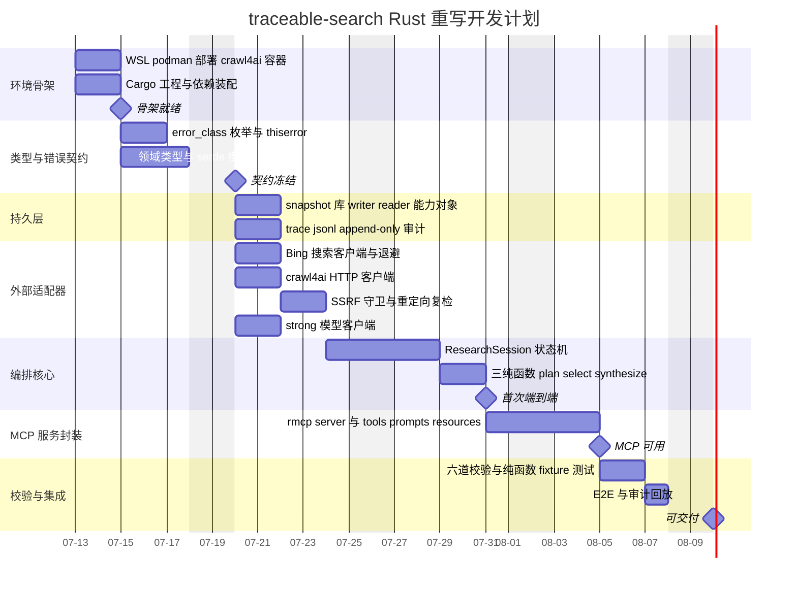

# traceable-search 开发计划（develop.md）

> 状态：Rust 重写规划（设计已冻结，代码未动）
>
> 日期：2026-07-11
>
> 前置文档：`docs/web-search-architecture.md`（Target Design）

## 1. 技术栈决策

- **主程序语言：Rust**。把 `error_class` 写进类型系统，用 `Result` 与枚举穷尽匹配在编译期约束错误处理，取代 Python 的运行时异常散落。
- **对外形态：MCP 服务**，用官方 `rmcp` SDK。
- **crawl4ai：本地 WSL 用 podman 容器化**，主程序经 HTTP 调用（端口 11235，端点 `/crawl`）。容器化让抓取器与主程序语言解绑，Rust 侧只当它是一个 HTTP 后端。

## 2. 开发用 skill（`skills/` 目录）

vibecoding 时把对应 `SKILL.md` 作为上下文喂给模型。六张按阶段分工，覆盖全流程：

| skill | 服务阶段 | 用途 |
|---|---|---|
| `systems-programming-rust-project` | P0 | Cargo 工程结构、模块组织、测试脚手架 |
| `rust-mcp-server-generator` | P0 / P5 | `rmcp` 项目模板、tools/prompts/resources 骨架 |
| `rust-error-handling` | P1 / P2 / P3 | `thiserror`/`anyhow`、`error_class` 枚举建模 |
| `rust-guide` | P1 / P4 / P6 | ownership、测试、clippy 护栏 |
| `rust-async-patterns` | P3 / P4 | tokio、并发、异步错误、`reqwest` |
| `mcp-server-best-practices` | P5 / P6 | MCP 架构、安全、性能、生产实践 |

`sqlite`/`serde` 无优质 skill 命中，直接查官方文档：`rusqlite`（轻）或 `sqlx`（异步 + 编译期查 SQL）、`serde_json`。

## 3. 阶段拆解

- **P0 环境骨架**：podman 起 crawl4ai 容器；cargo 建工程并装依赖（`rmcp`/`tokio`/`reqwest`/`serde`/`rusqlite`）。产出可编译空壳。
- **P1 类型与错误契约**：定 `error_class` 枚举（`external | internal`）与 `thiserror`；领域类型（`Query`/`SearchResult`/`SnapshotRef`/`Answer`/`Claim`）与 serde 模型。产出冻结的类型契约，下游全部依赖它。
- **P2 持久层**：`snapshot.sqlite` 的 writer/reader 能力对象（reader 无 `.save()`，writer 无 `.get()`）；`trace/<run_id>.jsonl` append-only 审计写入。依赖 P1。
- **P3 外部适配器**：Bing 搜索客户端（退避 1/3/5/9s）、crawl4ai HTTP 客户端、strong 模型客户端、SSRF 守卫（解析所有地址拦内网 + 重定向复检）。依赖 P1，与 P2 并行。
- **P4 编排核心**：`ResearchSession` 状态机（run_id/轮次/预算/停止原因）+ Explore N 轮 + Synthesize；三纯函数 `plan_queries`/`select_sources`/`synthesize_answer`（只收纯数据、返纯数据，可用 fixture 独立测试）。依赖 P2 + P3。
- **P5 MCP 服务封装**：`rmcp` server 暴露工具，装配 schema/prompts/resources。依赖 P4。
- **P6 校验与集成**：§6 六道校验、纯函数 fixture 测试、E2E（2024 诺奖物理）、审计回放。依赖 P5。

## 4. 甘特图

## 5. 关键路径

P0 → P1 → P3 → P4 → P5 → P6。P2 与 P3 只依赖 P1 的类型契约，可并行；P4 是二者汇合点。

契约冻结（`m_freeze`）是最重要的里程碑：类型定错会波及全部下游，进入 P2/P3 前应确认 `error_class` 与领域类型稳定。

<!-- ponytail: 甘特工期为 AI 辅助 vibecoding 的粗估工作日，非承诺档期；跑起来后按实际速度校准。skill 到阶段的映射是建议非强制。天花板：真出现并发或多研究策略，再把三纯函数提成独立模块并加压测阶段。 -->
