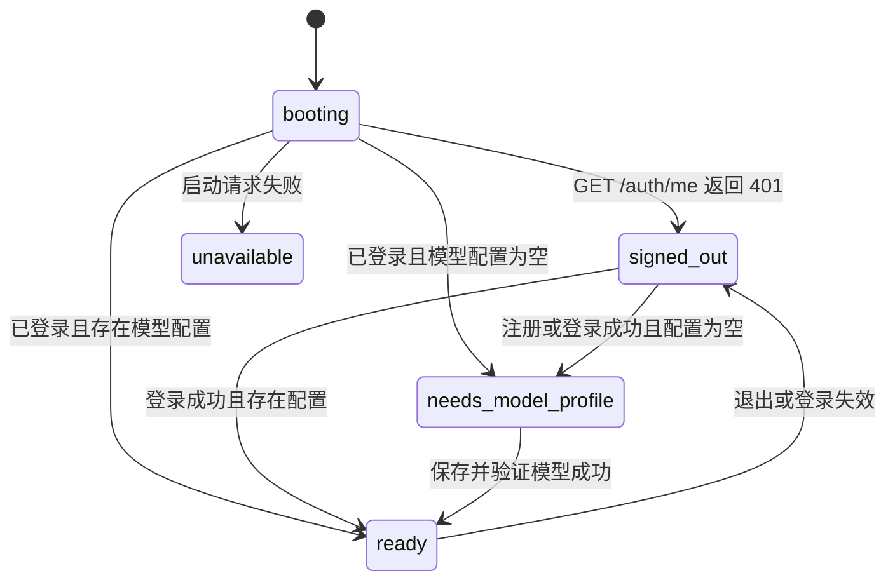

# 前端 API 与状态对照表草案

- 状态：接口需求已确认，待后端实施
- 日期：2026-07-17
- 产品名称：Traceable Search
- 依据：[产品说明与页面导航](2026-07-17-frontend-product-and-navigation-draft.md)、
  [桌面与手机低保真线框图](2026-07-17-frontend-low-fidelity-wireframes-draft.md)
- 当前实现参考：`demo-host/src/workspace_api.rs`、`web/src/research-workspace-client.ts`
- 范围：正式前端 MVP 使用的 HTTP 契约、前端状态、错误处理、轮询和缓存失效
- 暂不包含：框架选型、组件实现、视觉样式、后端数据库实现

## 文档目的

这份文档回答四个问题：

1. 某个页面首次进入时需要请求哪些 API。
2. API 请求中、成功、空结果和失败时，前端应该显示什么。
3. `ResearchTurn.status` 与 `dialogue.status` 的组合如何决定输入区、轮询和下一步动作。
4. 当前后端缺少哪些正式前端已经确认需要的契约。

前端不得根据文案、是否存在 `run_id` 或等待时间猜测研究状态；所有状态都由明确字段派生。

## 契约标记

| 标记 | 含义 |
| --- | --- |
| 当前 | 后端和 Demo Client 已经实现，可以直接对接 |
| 调整 | 已有接口需要收紧或修改响应，才能满足产品边界 |
| 新增 | 已确认的前端流程需要，但后端尚未提供 |

## 通用 HTTP 约定

- 项目仍处于开发阶段，当前 Demo API 不构成向后兼容承诺。正式前端需要更清晰或更安全的契约时，
  可以新增接口或直接调整现有响应，不为维持临时接口而增加前端复杂度。
- 所有工作区接口位于 `/api` 下，使用同源 Cookie 登录态和 `credentials: same-origin`。
- 带 JSON 请求体的接口必须发送 `Content-Type: application/json`；业务响应统一为 JSON 或明确的 `204`。
- 所有 `/api` 响应使用 `Cache-Control: no-store`，浏览器 HTTP 缓存不保存账户和研究数据。
- 除注册、登录和健康检查外，所有业务接口都要求有效登录态。
- ID 是不透明字符串，前端只能比较和传回，不能解析或依赖长度。
- 所有时间字段当前为 Unix 秒；前端统一在展示层转换，不在 API Client 中改写。
- 创建接口当前返回 `200`，不是 `201`；无响应体的成功操作返回 `204`。
- 错误响应统一为 `{ code, message, retryable }`。
- 无权访问其他用户的资源与资源不存在都返回 `404 not_found`，前端不得区分。
- 浏览器不读取原始 JSONL、完整快照正文、系统提示词、隐藏推理或 API Key。
- GET 请求可以安全重试；POST、PATCH、DELETE 在没有幂等保证前不得自动重试。
- 页面切换、账户切换或请求被 `AbortController` 取消时，不展示错误 Toast。

### Idempotency-Key 约定

正式 API 对可能创建资源或追加消息的写请求使用 `Idempotency-Key`：

- 前端为一次用户动作生成一个 UUID，并在该动作的所有网络重试中复用。
- 服务端作用域为 `user_id + HTTP method + route resource + Idempotency-Key`。
- 相同作用域、相同请求体返回首次执行的状态码与响应体，不再次执行副作用。
- 相同作用域、不同请求体返回 `409 idempotency_key_reused`。
- 缺少必需 Key 返回 `400 idempotency_key_required`；格式无效返回 `400 invalid_idempotency_key`。
- 相同请求仍在执行时返回 `409 idempotency_request_in_progress` 且 `retryable=true`；客户端稍后以同一个 Key 重试。
- 服务端至少保留幂等结果 24 小时。
- 必须携带：创建模型配置、创建研究对话、创建研究轮次、提交补充消息。
- 恢复资源和连接验证也接受该请求头，方便安全重试；登录、退出、设为默认不要求。

## 正式 API 总览

正式前端共需要 23 个业务端点：

| 领域 | Method | Path | 契约状态 | 用途 |
| --- | --- | --- | --- | --- |
| 认证 | `GET` | `/api/auth/me` | 当前 | 恢复当前账户 |
| 认证 | `POST` | `/api/auth/register` | 调整错误码 | 注册并登录 |
| 认证 | `POST` | `/api/auth/login` | 当前 | 登录 |
| 认证 | `POST` | `/api/auth/logout` | 当前 | 退出 |
| 模型 | `GET` | `/api/model-profiles` | 当前 | 获取可用模型配置 |
| 模型 | `POST` | `/api/model-profiles` | 调整幂等 | 创建模型配置 |
| 模型 | `PATCH` | `/api/model-profiles/{profile_id}` | 调整错误码 | 编辑模型配置 |
| 模型 | `POST` | `/api/model-profiles/{profile_id}/default` | 当前 | 设为默认 |
| 模型 | `POST` | `/api/model-profiles/{profile_id}/verify` | 当前 | 验证连接 |
| 模型 | `DELETE` | `/api/model-profiles/{profile_id}` | 调整错误码 | 归档配置 |
| 模型 | `GET` | `/api/archives/model-profiles` | 新增 | 获取已归档配置 |
| 模型 | `POST` | `/api/model-profiles/{profile_id}/restore` | 新增 | 恢复配置 |
| 对话 | `GET` | `/api/conversations` | 当前 | 获取活跃研究列表 |
| 对话 | `POST` | `/api/conversations` | 调整幂等/L1 DTO | 创建研究对话 |
| 对话 | `GET` | `/api/conversations/{conversation_id}` | 调整 L1 DTO | 获取对话及轮次 |
| 对话 | `PATCH` | `/api/conversations/{conversation_id}` | 调整错误码 | 重命名或切换模型 |
| 对话 | `DELETE` | `/api/conversations/{conversation_id}` | 调整错误码 | 归档对话 |
| 对话 | `GET` | `/api/archives/conversations` | 新增 | 获取已归档研究 |
| 对话 | `POST` | `/api/conversations/{conversation_id}/restore` | 新增 | 恢复研究对话 |
| 轮次 | `POST` | `/api/conversations/{conversation_id}/turns` | 调整幂等/L1 DTO | 发送新研究问题 |
| 轮次 | `POST` | `/api/conversations/{conversation_id}/turns/{turn_id}/messages` | 调整幂等/冲突码 | 补充当前轮次 |
| Trace | `GET` | `/api/conversations/{conversation_id}/turns/{turn_id}/trace/summary` | 调整模型摘要 | 获取 L2 研究概览 |
| Trace | `GET` | `/api/conversations/{conversation_id}/turns/{turn_id}/trace/audit` | 调整 DTO/校验 | 获取 L3 审计详情 |

`GET /health` 属于部署健康检查，不是浏览器产品流程的一部分，不计入上述业务端点。

## 公共数据契约

以下 TypeScript 只描述 HTTP JSON，不代表前端内部 ViewModel。

```ts
type UnixSeconds = number;

interface ApiErrorResponse {
  code: string;
  message: string;
  retryable: boolean;
}

interface UserAccount {
  user_id: string;
  email: string;
  display_name: string;
  created_at: UnixSeconds;
}

interface ModelProfile {
  profile_id: string;
  display_name: string;
  api_base_url: string;
  model_id: string;
  revision: number;
  is_default: boolean;
  has_api_key: boolean;
  verified_at: UnixSeconds | null;
  created_at: UnixSeconds;
  updated_at: UnixSeconds;
}

interface ArchivedModelProfile extends ModelProfile {
  is_default: false;
  archived_at: UnixSeconds;
}

type ResearchTurnStatus =
  | "clarifying"
  | "ready"
  | "running"
  | "completed"
  | "failed"
  | "cancelled";

type DialogueStatus =
  | "thinking"
  | "awaiting_message"
  | "research_started"
  | "failed"
  | "cancelled";

interface DialogueMessage {
  role: "user" | "assistant";
  text: string;
}

interface TurnDialogue {
  revision: number;
  status: DialogueStatus;
  messages: DialogueMessage[];
  failure: string | null;
}

interface EvidenceSource {
  title: string;
  url: string;
}

interface ChatResearchAnswer {
  // Markdown text; raw HTML is not part of the contract.
  answer: string;
  sources: EvidenceSource[];
}

interface ChatResearchTurn {
  turn_id: string;
  turn_number: number;
  user_question: string;
  status: ResearchTurnStatus;
  answer: ChatResearchAnswer | null;
  dialogue: TurnDialogue | null;
  created_at: UnixSeconds;
  updated_at: UnixSeconds;
  completed_at: UnixSeconds | null;
}

interface ResearchConversationSummary {
  conversation_id: string;
  title: string;
  model_profile_id: string;
  model_profile_name: string;
  turn_count: number;
  latest_turn_status: ResearchTurnStatus | null;
  created_at: UnixSeconds;
  updated_at: UnixSeconds;
}

interface ResearchConversationDetail extends ResearchConversationSummary {
  turns: ChatResearchTurn[];
}

interface ArchivedConversationSummary extends ResearchConversationSummary {
  archived_at: UnixSeconds;
  model_profile_available: boolean;
}
```

L1 的 `ChatResearchTurn` 明确不返回 `run_id`、`answer_style`、模型 API 地址、API Key、知识草稿、
Claim rationale、比较过程或快照引用。`sources` 由服务端从最终答案所需证据中去重并稳定排序。

### Trace DTO

```ts
interface TraceModelSummary {
  // 轮次创建时锁定的模型 ID，而不是模型配置当前值。
  model_id: string;
}

interface TraceUnderstanding {
  message: string;
  rationale: string;
}

interface TraceRoundSummary {
  round: number;
  directions: string[];
  search_result_count: number;
}

interface TraceSourceSummary {
  title: string;
  url: string;
  rationale: string;
}

interface ResearchTraceSummary {
  model: TraceModelSummary;
  understanding: TraceUnderstanding | null;
  rounds: TraceRoundSummary[];
  archived_source_count: number;
  skipped_source_count: number;
  selected_sources: TraceSourceSummary[];
  synthesis_rationale: string | null;
  failure: { stage: string; message: string } | null;
}

type TraceAuditStage =
  | "dialogue"
  | "setup"
  | "planning"
  | "search"
  | "archive"
  | "selection"
  | "synthesis"
  | "failure";

interface TraceAuditEntry {
  stage: TraceAuditStage;
  label: string;
  detail: string;
  rationale: string | null;
}

interface ResearchTraceAuditPage {
  next_cursor: number | null;
  entries: TraceAuditEntry[];
}
```

正式 Trace DTO 不向浏览器返回内部 `run_id` 或 schema 审计标记。若运营或兼容诊断确实需要这些字段，
应放在受限运维接口，而不是用户工作区接口。

## 认证接口契约

### `GET /api/auth/me`

- 请求体：无。
- 成功：`200 UserAccount`。
- 未登录或 Cookie 失效：`401 authentication_required`。
- 前端用途：只用于启动恢复和重新认证后的账户确认。

### `POST /api/auth/register`

```ts
interface RegisterAccountRequest {
  email: string;        // 最长 320 字符，服务端 trim + lowercase
  password: string;     // 12..200 字符
  display_name: string; // 1..80 字符，服务端 trim
}
```

- 成功：`200 UserAccount`，同时设置 HttpOnly、SameSite Cookie。
- 稳定错误：`invalid_email`、`invalid_password`、`invalid_display_name`、
  `email_already_registered`、`internal_error`。
- 不返回登录 Token，不允许 JavaScript 读取 Cookie。

### `POST /api/auth/login`

```ts
interface LoginRequest {
  email: string;
  password: string;
}
```

- 成功：`200 UserAccount`，设置新的登录 Cookie。
- 邮箱不存在和密码错误统一返回 `401 invalid_credentials`，不得泄露账户是否存在。

### `POST /api/auth/logout`

- 请求体：无。
- 成功：`204`，撤销当前登录会话并删除 Cookie。
- 没有 Cookie 时仍返回 `204`，保证退出操作幂等。

## 模型配置接口契约

### 请求 DTO

```ts
interface CreateModelProfileRequest {
  display_name: string; // 1..80
  api_base_url: string; // 最长 2048；HTTP(S)，无凭据、query、fragment
  model_id: string;     // 1..200
  api_key: string;      // 1..4096；必填，只在请求中出现
  make_default?: boolean;
}

interface UpdateModelProfileRequest {
  display_name?: string;
  api_base_url?: string;
  model_id?: string;
  api_key?: string; // 缺省表示保留当前密钥
}
```

### 行为对照

| Method / Path | 请求 | 成功响应 | 明确行为 | 主要稳定错误码 |
| --- | --- | --- | --- | --- |
| `GET /api/model-profiles` | 无 | `200 ModelProfile[]` | 只返回活跃配置；默认项优先，其余按更新时间 | `authentication_required` |
| `POST /api/model-profiles` | DTO + `Idempotency-Key` | `200 ModelProfile` | 规范化 URL；加密密钥；第一项自动默认；`verified_at=null` | 字段错误、`invalid_api_key`、`profile_name_already_exists`、`idempotency_key_reused` |
| `PATCH /api/model-profiles/{id}` | 至少一个可编辑字段 | `200 ModelProfile` | 未传 Key 则保留；任何编辑增加 revision 并清空 `verified_at` | 字段错误、`model_profile_in_use_by_active_turn`、`profile_name_already_exists` |
| `POST /api/model-profiles/{id}/default` | 无 | `204` | 取消其他默认项并设当前项为默认 | `not_found` |
| `POST /api/model-profiles/{id}/verify` | 无，可带幂等键 | `204` | 真实调用模型；成功后写入 `verified_at` | `model_verification_failed`、`not_found` |
| `DELETE /api/model-profiles/{id}` | 无 | `204` | 软归档；不可再从活跃接口读取 | `model_profile_in_use_by_active_turn`、`model_profile_in_use_by_conversation` |
| `GET /api/archives/model-profiles` | 无 | `200 ArchivedModelProfile[]` | 仅当前账户；按 `archived_at DESC` | `authentication_required` |
| `POST /api/model-profiles/{id}/restore` | 无，可带幂等键 | `200 ModelProfile` | 恢复凭据；无其他活跃配置时自动默认，否则非默认 | `not_found`、`profile_name_already_exists` |

更新请求 `{}` 返回 `400 invalid_request`，不能无变化地增加 revision。归档和恢复不回显 API Key，
恢复后保留原 `verified_at`；用户仍可以主动再次验证。

## 研究对话接口契约

### 请求 DTO

```ts
interface CreateConversationRequest {
  title?: string;            // 缺省使用“新研究”
  model_profile_id?: string; // 缺省使用默认模型
}

interface UpdateConversationRequest {
  title?: string;
  model_profile_id?: string; // 只影响之后创建的轮次
}

interface RestoreConversationRequest {
  // 原模型仍可用时可以省略；原模型已归档时必须提供可用替代项。
  model_profile_id?: string;
}
```

### 行为对照

| Method / Path | 请求 | 成功响应 | 明确行为 | 主要稳定错误码 |
| --- | --- | --- | --- | --- |
| `GET /api/conversations` | 无 | `200 Summary[]` | 只返回活跃对话，按 `updated_at DESC` | `authentication_required` |
| `POST /api/conversations` | DTO + `Idempotency-Key` | `200 Detail` | 创建空对话并锁定当前模型选择 | `model_profile_required`、`not_found`、`idempotency_key_reused` |
| `GET /api/conversations/{id}` | 无 | `200 Detail` | 返回最小 L1 Turn；归档对话视为不存在 | `not_found` |
| `PATCH /api/conversations/{id}` | 至少一个字段 | `200 Summary` | title 可随时改；活动轮次期间不能切换模型 | `invalid_conversation_title`、`conversation_has_active_turn`、`not_found` |
| `DELETE /api/conversations/{id}` | 无 | `204` | 软归档；当前活动轮次存在时拒绝 | `conversation_has_active_turn`、`not_found` |
| `GET /api/archives/conversations` | 无 | `200 ArchivedSummary[]` | 按 `archived_at DESC`；不返回轮次正文 | `authentication_required` |
| `POST /api/conversations/{id}/restore` | 可选 DTO + 幂等键 | `200 Summary` | 恢复原模型或改绑一个活跃模型 | `conversation_model_profile_archived`、`not_found` |

恢复接口规则：

- 原模型仍活跃且请求未指定替代模型：直接恢复。
- 原模型已归档且未指定替代模型：`409 conversation_model_profile_archived`。
- 指定替代模型：必须属于当前账户且处于活跃状态；恢复成功后只影响未来轮次，历史轮次不变。
- 已经活跃的对话再次恢复：返回 `404 not_found`，避免泄露资源状态；同一个幂等键重试除外。

## 研究轮次接口契约

### `POST /api/conversations/{conversation_id}/turns`

请求头：必须提供 `Idempotency-Key`。

```ts
interface CreateResearchTurnRequest {
  question: string;            // trim 后 1..4000
  answer_style?: "web_first"; // 正式前端固定 web_first
}
```

- 成功：`200 ChatResearchTurn`。
- 模型决定继续对话时，返回 `clarifying + awaiting_message`。
- 模型决定开始研究时，返回 `ready`，后台自动执行；浏览器不再发送“开始研究”命令。
- 稳定错误：`invalid_question`、`conversation_has_active_turn`、`conversation_model_profile_changed`、
  `model_profile_changed`、`idempotency_key_reused`、`not_found`、`internal_error`。

### `POST /api/conversations/{conversation_id}/turns/{turn_id}/messages`

请求头：必须提供 `Idempotency-Key`。

```ts
interface SubmitDialogueMessageRequest {
  revision: number;
  message: string; // trim 后 1..4000
}
```

- 成功：`200 ChatResearchTurn`，返回该轮完整最新投影。
- 只允许 `clarifying + awaiting_message/failed` 的轮次接收消息。
- revision 不是最新值：`409 dialogue_revision_conflict`。
- 轮次已经进入研究或终态：`409 turn_not_accepting_messages`。
- 其他稳定错误：`invalid_dialogue_message`、`model_profile_changed`、`idempotency_key_reused`、
  `not_found`、`internal_error`。

## Trace 接口契约

### `GET /api/conversations/{conversation_id}/turns/{turn_id}/trace/summary`

- 请求体：无。
- 成功：`200 ResearchTraceSummary`。
- 澄清阶段也可以返回部分概览；尚无研究运行时 rounds、sources 和 synthesis 可以为空。
- `model.model_id` 是该轮创建时锁定的值。
- 失败：`401 authentication_required`、`404 not_found`、`500 internal_error`。

### `GET /api/conversations/{conversation_id}/turns/{turn_id}/trace/audit`

Query：

```ts
interface TraceAuditQuery {
  stage?: TraceAuditStage;
  cursor?: number; // 缺省 0；前端视为不透明值
  limit?: number;  // 1..100，缺省 40
}
```

- 成功：`200 ResearchTraceAuditPage`。
- `next_cursor=null` 表示没有下一页。
- 未知 stage、越界 cursor 或无效 limit：`400 invalid_request`。
- 失败：`401 authentication_required`、`404 not_found`、`500 internal_error`。
- 接口只返回审阅安全投影，不提供原始事件下载参数。

## 前端状态模型

### 应用启动状态

```ts
type AppBootstrapState =
  | { kind: "booting" }
  | { kind: "signed_out" }
  | { kind: "needs_model_profile"; account: UserAccount }
  | { kind: "ready"; account: UserAccount }
  | { kind: "unavailable"; message: string };
```

状态流：



### 远程数据状态

列表、详情、研究概览和审计分页统一使用相同语义：

```ts
type RemoteData<T> =
  | { kind: "idle" }
  | { kind: "loading" }
  | { kind: "success"; data: T; refreshing: boolean }
  | { kind: "error"; error: ApiError; previousData?: T };
```

规则：

- `loading` 只用于首次加载；已有数据重新请求时保留内容并设 `refreshing: true`。
- 空数组和空对象属于成功状态，不属于错误。
- 详情刷新失败时保留旧内容并显示局部重试，不清空整页。
- 账户变更后必须清除全部用户级缓存，不能短暂显示上一账户的数据。

### 写操作状态

```ts
type MutationState<TResult = void> =
  | { kind: "idle" }
  | { kind: "submitting"; requestId: string }
  | { kind: "succeeded"; result: TResult }
  | { kind: "failed"; error: ApiError };
```

写操作按资源隔离，不能用一个全局 `activeOperation` 阻塞整个应用。例如验证模型时仍应允许阅读当前对话，
但同一个表单不能重复提交。

## 认证 API 对照

| 标记 | API | 成功结果 | 前端状态变化 | 失败表现 |
| --- | --- | --- | --- | --- |
| 当前 | `GET /api/auth/me` | `200 UserAccount` | `booting -> authenticated` | `401 -> signed_out`；其他错误进入启动失败页 |
| 当前 | `POST /api/auth/register` | `200 UserAccount` 并设置 Cookie | 继续加载模型配置 | 字段错误落到表单；邮箱冲突显示在邮箱字段附近 |
| 当前 | `POST /api/auth/login` | `200 UserAccount` 并设置 Cookie | 继续加载模型配置 | `invalid_credentials` 留在登录页，不使用全局登录失效处理 |
| 当前 | `POST /api/auth/logout` | `204` 并移除 Cookie | 清空全部缓存，进入登录页 | 即使网络失败也清除本地敏感状态，并允许重新登录 |

认证后的启动请求：

1. `GET /api/auth/me` 成功后，并行请求活跃模型配置和研究对话列表。
2. 模型列表为空时进入首次模型配置，不自动创建空研究对话。
3. 模型列表非空且存在对话时，加载最近访问或最近更新的对话。
4. 模型列表非空但对话为空时，进入研究工作区空状态。

## 模型配置 API 对照

| 标记 | API | 请求/成功结果 | 前端状态变化 | 成功后的缓存处理 |
| --- | --- | --- | --- | --- |
| 当前 | `GET /api/model-profiles` | `200 ModelProfile[]` | 渲染可用配置；`[]` 进入首次设置 | 替换活跃模型列表 |
| 当前 | `POST /api/model-profiles` | `SaveModelProfileInput -> 200 ModelProfile` | 新配置进入“已保存、待验证” | 插入列表；按响应中的 `is_default` 更新默认项 |
| 当前 | `PATCH /api/model-profiles/:id` | 可选可编辑字段 -> `200 ModelProfile` | 编辑器显示服务端返回版本 | 替换该配置；刷新受影响的对话摘要 |
| 当前 | `POST /api/model-profiles/:id/default` | `204` | 默认状态更新 | 重新请求活跃模型列表 |
| 当前 | `POST /api/model-profiles/:id/verify` | `204` | 显示“已验证” | 重新请求活跃模型列表，使用新的 `verified_at` |
| 当前 | `DELETE /api/model-profiles/:id` | `204` | 从活跃列表移到归档列表 | 失效活跃/归档模型列表和相关对话摘要 |
| 新增 | `GET /api/archives/model-profiles` | `200 ArchivedModelProfile[]` | 渲染已归档配置 | 缓存为独立归档列表 |
| 新增 | `POST /api/model-profiles/:id/restore` | `200 ModelProfile` | 恢复到可用配置 | 失效活跃/归档模型列表 |

### 首次“保存并验证连接”状态

当前后端把保存与验证拆成两个请求：

```text
idle
  -> POST /model-profiles
     -> 失败：表单保留，显示字段或保存错误
     -> 成功：profile_saved
        -> POST /model-profiles/:id/verify
           -> 成功：verified -> 进入研究工作区
           -> 失败：saved_but_unverified -> 留在模型配置并允许再次验证
```

前端不能在第二步失败时声称“保存失败”，因为配置已经持久化。建议文案为：

- 保存失败：`模型配置未保存。`
- 保存成功、验证失败：`配置已保存，但连接验证失败。请检查后重试。`
- 验证成功：`模型连接已验证。`

不要为了模拟单一步骤而自动删除验证失败的配置。

## 研究对话 API 对照

| 标记 | API | 请求/成功结果 | 前端状态变化 | 成功后的缓存处理 |
| --- | --- | --- | --- | --- |
| 当前 | `GET /api/conversations` | `200 ResearchConversationSummary[]` | 渲染活跃研究列表 | 替换活跃对话摘要 |
| 当前 | `POST /api/conversations` | 可选 `model_profile_id` -> `200 ResearchConversationDetail` | 创建并打开空对话 | 列表插入摘要，缓存详情 |
| 当前 | `GET /api/conversations/:id` | `200 ResearchConversationDetail` | 渲染标题、轮次和输入状态 | 替换该对话详情与对应摘要 |
| 当前 | `PATCH /api/conversations/:id` | 可选 `title`、`model_profile_id` -> `200 Summary` | 更新标题或后续轮次模型 | 替换摘要；详情中的头部字段同步更新 |
| 当前 | `DELETE /api/conversations/:id` | `204` | 当前对话关闭并回到工作区 | 从活跃列表移除；失效归档列表和详情 |
| 新增 | `GET /api/archives/conversations` | `200 ArchivedConversationSummary[]` | 渲染已归档研究 | 缓存为独立归档列表 |
| 新增 | `POST /api/conversations/:id/restore` | `200 ResearchConversationSummary` | 从归档列表移回活跃列表 | 失效两个列表；导航并加载详情 |

列表排序由服务端保证，前端不应在不同页面重新定义“最近”的含义。正式契约应明确活跃列表按
`updated_at DESC`，归档列表按 `archived_at DESC`，归档 DTO 需要新增 `archived_at`。

## 研究轮次 API 对照

| 标记 | API | 请求/成功结果 | 本地提交状态 | 成功后的状态 |
| --- | --- | --- | --- | --- |
| 当前 | `POST /api/conversations/:id/turns` | `{ question, answer_style: "web_first" } -> 200 ResearchTurn` | 显示待发送用户消息和“正在理解” | 用服务端 Turn 替换本地待发送项，刷新对话摘要 |
| 当前 | `POST /api/conversations/:id/turns/:turnId/messages` | `{ revision, message } -> 200 ResearchTurn` | 显示待发送补充消息和“正在理解” | 替换对应 Turn，刷新对话摘要 |

规则：

- 正式前端固定发送 `answer_style: "web_first"`，不展示答案风格选择器。
- 用户消息应立即以本地 `pending` 状态出现在对话中；请求失败时保留文字并提供手动重试。
- 收到服务端响应后，以整个 `ResearchTurn` 替换本地 Turn，不拼接服务端对话消息。
- 创建轮次请求可能等待模型返回，不能因为耗时较长而自动重复提交。
- 补充消息必须使用当前 `dialogue.revision`；提交开始后锁定该轮输入，直到成功或明确失败。
- 同一对话只允许一个未终结轮次；前端限制是体验优化，服务端仍必须执行约束。

## Research Turn 与前端派生状态

前端先看 `ResearchTurn.status`，只有在 `clarifying` 时再读取 `dialogue.status`。终结状态优先于 Dialogue。

| Turn status | Dialogue status | 前端派生状态 | 正文表现 | 输入区 | 是否轮询 |
| --- | --- | --- | --- | --- | --- |
| `clarifying` | 本地请求未返回 | `submitting_message` | 待发送用户消息 + 正在理解 | 禁用 | 否，等待当前请求 |
| `clarifying` | `thinking` | `understanding` | 正在理解 | 禁用 | 是，若该状态来自详情加载 |
| `clarifying` | `awaiting_message` | `awaiting_user` | 显示模型追问或理解 | 可用，提交补充消息 | 否 |
| `clarifying` | `failed` | `clarification_recoverable` | 显示具体失败 | 可用，允许补充或纠正 | 否 |
| `ready` | `research_started` 或空 | `research_scheduled` | 即将开始研究 | 禁用 | 是 |
| `running` | `research_started` 或空 | `researching` | 正在检索、锁定快照并核验来源 | 禁用 | 是 |
| `completed` | 任意 | `completed` | 最终答案和必要来源 | 可用，创建下一轮 | 否 |
| `failed` | 任意 | `research_failed` | 本轮研究未完成 + 概览入口 | 可用，创建下一轮 | 否 |
| `cancelled` | 任意 | `cancelled` | 本轮研究已取消 | 可用，创建下一轮 | 否 |

契约异常：

- `completed` 但 `answer == null`：显示“答案暂时无法读取”，记录客户端诊断，不伪装成空答案。
- `clarifying` 但 `dialogue == null`：显示局部加载失败并重新请求详情。
- `ready/running` 长时间不变化：继续显示真实状态，提供刷新；前端不自行改成失败。
- 未知状态值：视为不兼容契约，禁止提交并提示刷新应用。

### 输入区请求选择

| 派生状态 | 输入行为 | 请求 |
| --- | --- | --- |
| 无轮次、`completed`、`research_failed`、`cancelled` | 创建下一轮 | `POST /turns` |
| `awaiting_user`、`clarification_recoverable` | 继续当前轮次 | `POST /turns/:turnId/messages` |
| `submitting_message`、`understanding`、`research_scheduled`、`researching` | 禁止提交 | 无 |

前端不得提供“开始研究”请求或按钮；研究从模型的 `start_research` 决策自动进入 `ready/running`。

## Research Trace API 对照

| 标记 | API | 触发时机 | 成功状态 | 失败状态 |
| --- | --- | --- | --- | --- |
| 当前 | `GET /api/conversations/:id/turns/:turnId/trace/summary` | 用户首次打开研究概览或主动刷新 | 渲染理解、覆盖、来源、综合或失败摘要 | 错误只显示在右栏，正文保留 |
| 当前 | `GET /api/conversations/:id/turns/:turnId/trace/audit?stage=&cursor=&limit=` | 用户主动切到审计详情 | 追加当前筛选的审计事件 | 保留已加载页并提供重试 |

Trace 状态与请求规则：

- 右栏关闭时不请求 L2/L3。
- 打开右栏默认请求 L2；只有切换到“审计详情”才请求 L3。
- 缓存键至少包含 `accountId + conversationId + turnId`。
- 审计缓存键还要包含 `stage`；`cursor` 只用于页请求，不混入其他筛选的数据。
- 切换阶段后从服务端返回的第一页重新开始，不能在客户端过滤已有事件代替请求。
- `next_cursor` 是不透明分页游标；前端只能原样传回，不能自行加减。
- Summary 所有内容字段为空是合法空状态，不是请求失败。
- 当前 `limit` 默认 40、服务端限制 1 至 100；正式 Client 应显式发送约定值，例如 40。

## 页面与请求对照

| 页面/表面 | 首次请求 | 后续请求 | 空状态 |
| --- | --- | --- | --- |
| 启动恢复 | `GET /auth/me` | 登录成功后加载模型和对话列表 | 未登录进入账户访问 |
| 账户访问 | 无 | `POST /login` 或 `/register` | 不适用 |
| 首次模型配置 | 已有模型列表结果为空 | 创建、验证 | 表单本身就是空状态 |
| 研究工作区 | 模型列表 + 活跃对话列表 | 创建对话、搜索在本地列表上进行 | 开始一项研究 |
| 研究对话 | `GET /conversations/:id` | 提交消息；活动轮次轮询详情 | 写下需要查证的问题 |
| 研究概览 | 无预取 | 打开后请求 Summary | 当前轮次尚无概览 |
| 审计详情 | 无预取 | 切换后请求第一页，再按 cursor 加载 | 当前筛选没有事件 |
| 已归档研究 | `GET /archives/conversations` | 恢复、搜索 | 当前没有已归档研究 |
| 日常模型配置 | 活跃与归档模型列表 | 更新、验证、默认、归档、恢复 | 尚无模型配置 |

## 轮询策略

| 条件 | 建议间隔 | 停止条件 |
| --- | --- | --- |
| `clarifying + thinking` 来自详情加载 | 3 秒 | 变为 awaiting/ready/running/failed/cancelled |
| `ready` 或 `running` | 5 秒 | completed/failed/cancelled |
| 页面重新获得焦点且存在活动轮次 | 立即刷新一次 | 刷新完成 |
| 页面在后台 | 暂停或降低到 15 秒 | 页面重新可见后立即刷新 |

每次轮询请求完成后再安排下一次，避免请求重叠。切换对话、退出登录或组件卸载时取消未完成请求。
连续失败采用上限 30 秒的退避，并显示“状态刷新失败”局部提示；研究状态本身不被改写。

当前后端没有 SSE。MVP 使用轮询即可；只有在产品要求显示真实阶段事件时才新增 SSE，前端不能从 Trace 或时间推测进度。

## 缓存与失效对照

| 写操作成功 | 必须更新或失效 |
| --- | --- |
| 注册、登录 | 清除旧账户缓存；加载当前账户模型和对话 |
| 退出 | 清除账户、模型、对话、Trace、草稿和所有本地待发送消息 |
| 创建/更新模型 | 活跃模型列表；使用该配置的对话摘要 |
| 设为默认模型 | 活跃模型列表 |
| 验证模型 | 活跃模型列表中的 `verified_at` |
| 归档/恢复模型 | 活跃和归档模型列表；相关对话摘要 |
| 创建对话 | 活跃对话列表；新对话详情 |
| 重命名/切换模型 | 活跃对话列表；当前对话头部 |
| 归档/恢复对话 | 活跃和归档对话列表；对应详情 |
| 创建轮次/补充消息 | 当前对话详情；活跃对话列表 |
| 活动轮次进入终态 | 当前对话详情、对话摘要；已打开的该轮 Trace |

前端可以立即把服务端响应写入缓存，随后只对无法从响应确定的数据执行失效请求，避免每次操作都清空页面。

## 错误码与前端落点

| HTTP / code | 前端处理 |
| --- | --- |
| `400 invalid_email` | 登录/注册邮箱字段错误 |
| `400 invalid_password` | 注册密码字段错误 |
| `400 invalid_display_name` | 注册显示名称字段错误 |
| `400 invalid_profile_name` | 模型配置名称字段错误 |
| `400 invalid_model_id` | 模型 ID 字段错误 |
| `400 invalid_model_endpoint` | API 地址字段错误 |
| `400 invalid_api_key` | API Key 字段错误，不回显提交内容 |
| `400 private_model_endpoint_blocked` | API 地址字段错误，并显示部署限制 |
| `400 model_verification_failed` | 模型配置页局部错误，保留配置并允许再次验证 |
| `400 invalid_conversation_title` | 重命名输入框错误 |
| `400 invalid_question` | 研究输入区错误，保留草稿 |
| `400 invalid_dialogue_message` | 研究输入区错误，保留补充消息 |
| `400 invalid_request` | 当前操作局部错误；Trace 筛选/游标错误时重置并重载第一页 |
| `400 invalid_json` | 请求格式错误；正式前端记录诊断，不原样展示解析细节 |
| `400 idempotency_key_required` | 停止提交并记录客户端契约错误 |
| `400 invalid_idempotency_key` | 停止提交并记录客户端契约错误 |
| `401 invalid_credentials` | 只用于登录表单，不触发“登录已失效”Toast |
| `401 authentication_required` | 清除可见账户缓存；未发送草稿只在内存中绑定原 `accountId` 暂存，进入登录页 |
| `404 not_found` | 显示统一的不存在/不可访问状态；列表中的旧项触发列表刷新 |
| `409 model_profile_required` | 打开首次模型配置或模型设置 |
| `409 conversation_model_profile_changed` | 保留研究问题，刷新对话后让用户手动重发 |
| `409 model_profile_changed` | 保留研究问题，刷新模型和对话后让用户手动重发 |
| `409 email_already_registered` | 注册邮箱字段错误，提示改为登录或更换邮箱 |
| `409 profile_name_already_exists` | 模型配置名称字段错误 |
| `409 model_profile_in_use_by_active_turn` | 阻止编辑/归档，提示先完成当前研究 |
| `409 model_profile_in_use_by_conversation` | 阻止归档，提示先为相关对话切换模型 |
| `409 conversation_has_active_turn` | 阻止切换模型或归档对话，保留当前页面 |
| `409 conversation_model_profile_archived` | 恢复对话时要求恢复原模型或选择替代模型 |
| `409 dialogue_revision_conflict` | 刷新对话，保留未发送文本，要求用户确认后重发 |
| `409 turn_not_accepting_messages` | 刷新对话并按最新轮次状态更新输入区 |
| `409 idempotency_key_reused` | 停止重试并生成新的用户动作；记录客户端诊断 |
| `409 idempotency_request_in_progress` | 保留发送中状态，稍后使用同一个 Key 重试 |
| `409 catalog_conflict` | 仅为旧 Demo 兼容；正式接口必须改为上面的稳定领域错误码 |
| `500 internal_error` 且 `retryable=true` | 保留页面数据，显示局部重试；写请求不自动重试 |
| 无 HTTP 响应 | 归一化为 `network_unavailable`；保留草稿和旧数据，提供手动重试 |

错误消息优先使用稳定 `code` 决定落点，`message` 只用于用户可见说明，不能解析消息文本判断逻辑。
同一账户在当前页面生命周期内重新登录后可以恢复暂存草稿；若登录为其他账户则立即丢弃。显式退出始终清除草稿。

## 当前契约与产品边界的差距

### 1. L1 Conversation 响应仍包含内部答案字段

当前 `ResearchAnswer` 包含 `knowledge_draft`、`comparison`、Claim rationale 等不应进入普通聊天的字段。
正式前端不应通过“收到但不渲染”来实现边界；后端需要提供最小聊天 DTO，例如：

```ts
interface ChatResearchAnswer {
  answer: string;
  sources: Array<{ title: string; url: string }>;
}
```

研究理由和选源理由只通过 L2/L3 投影返回。

### 2. 缺少归档列表与恢复接口

产品已经确认研究对话和模型配置必须可恢复，并使用独立归档集合接口：

```text
GET  /api/archives/conversations
POST /api/conversations/{conversation_id}/restore
GET  /api/archives/model-profiles
POST /api/model-profiles/{profile_id}/restore
```

归档摘要需要 `archived_at` 和 `model_profile_available`。恢复接口接受可选 `model_profile_id`；原模型已归档且
未提供活跃替代模型时返回 `409 conversation_model_profile_archived`。

### 3. 写请求缺少幂等保证

`POST /turns` 请求可能已经在服务端成功，但浏览器在收到响应前断网。没有幂等键时，自动重试可能创建重复轮次。
创建模型配置、创建研究对话、`POST /turns` 和 `POST /messages` 必须接受标准 `Idempotency-Key` 请求头，
并在相同用户、接口资源和 Key 下返回首次执行结果。在该契约上线前，前端只允许用户手动重试，并明确可能需要
先刷新对应资源。

### 4. Dialogue revision 冲突缺少稳定 409

前端提交补充消息时携带 `revision`。旧 revision 是正常并发冲突，应返回例如：

```json
{
  "code": "dialogue_revision_conflict",
  "message": "对话已更新，请查看最新消息后重新发送",
  "retryable": false
}
```

当前运行时错误可能被统一映射为 `500 internal_error`，不利于正确恢复。

### 5. 网络错误未被 Client 统一建模

当前 Client 只包装已收到的非成功 HTTP 响应；`fetch` 直接失败会抛出普通异常。正式 Client 应统一生成：

```ts
{ status: 0, code: "network_unavailable", retryable: true }
```

请求主动取消应使用独立结果，不归类为网络错误。

## 后端实施清单

### 新增端点

- `GET /api/archives/conversations`
- `POST /api/conversations/{conversation_id}/restore`
- `GET /api/archives/model-profiles`
- `POST /api/model-profiles/{profile_id}/restore`

### 调整现有端点

- `POST /api/model-profiles`、`POST /api/conversations`、`POST /turns` 和 `POST /messages`：
  接入持久化 `Idempotency-Key` 结果存储。
- `POST /api/conversations`、`GET /api/conversations/{id}`、`POST /turns` 和 `POST /messages`：
  改为返回 `ChatResearchTurn`，不返回内部完整答案。
- `PATCH /api/conversations/{id}`：允许活动轮次期间只改标题，但切换模型返回
  `conversation_has_active_turn`。
- `GET .../trace/summary`：增加锁定的 `model.model_id`，移除 `run_id` 和内部 schema 标记。
- `GET .../trace/audit`：移除 `run_id`；无效 `limit` 返回 `invalid_request`，不再静默 clamp。
- Catalog/Host 错误映射：用稳定领域 code 替换公开的通用 `catalog_conflict`。
- JSON extractor rejection：统一映射为 `400 invalid_json`，不向正式前端返回框架默认文本响应。
- Dialogue revision 不匹配：从 `500 internal_error` 改为 `409 dialogue_revision_conflict`。

### 新增数据能力

- Catalog 可以列出当前账户已归档的对话和模型配置，并返回 `archived_at`。
- Catalog 可以原位恢复归档记录，不复制 ID，不改写历史轮次。
- 恢复对话可以在同一事务内验证并切换到一个活跃模型配置。
- 幂等记录至少保存 user、method、resource scope、key、请求摘要、响应状态和响应体，保留 24 小时。
- L1 Answer 投影在服务端完成必要来源去重，浏览器不接触 Claim rationale。

### 必须补充的契约测试

- 23 个端点的认证要求、成功状态码和错误 JSON 形状。
- 其他账户的活跃、归档、恢复和 Trace 访问统一返回 `404`。
- L1 响应不含 `run_id`、API 地址、知识草稿、比较过程、Claim rationale 或快照引用。
- 归档列表排序、空列表、恢复成功和原模型已归档冲突。
- 相同幂等键与相同请求只执行一次；相同键与不同请求返回 `idempotency_key_reused`。
- revision 过期返回 `dialogue_revision_conflict`，不会变成 500。
- 更新模型清空 `verified_at`，恢复模型不回显密钥。
- 活动轮次期间允许重命名，但禁止切换模型和归档。

## 验收标准

- 每个 API 都有首次加载、成功、空结果、刷新和失败状态，不存在无限 Loading。
- `ResearchTurn.status + dialogue.status` 的每种合法组合都有确定的正文、输入区和轮询行为。
- 右栏关闭时不请求 Trace，打开概览不请求审计详情。
- 写请求失败后保留用户输入；重试必须复用原 `Idempotency-Key`，并且不得产生重复轮次或消息。
- 登录失效清除所有账户数据，不会显示上一个账户的对话或 Trace。
- 归档和恢复同时更新活跃与归档列表。
- 前端不接收或依赖 Brief、隐藏推理、API Key、完整网页正文和原始 Trace。
- 未知状态和不完整终态被视为契约错误，不被渲染成正常空状态。

## 已确认决策

1. **归档查询路径**：新增独立归档集合接口：`GET /api/archives/conversations` 和
   `GET /api/archives/model-profiles`。
2. **恢复对话时原模型已归档**：返回稳定 `409 conversation_model_profile_archived`，前端要求用户先恢复模型
   或选择替代模型。
3. **写请求幂等方式**：使用标准 `Idempotency-Key` 请求头，作用域为当前用户和接口资源。
4. **活动轮次轮询**：`thinking` 3 秒，`ready/running` 5 秒，后台降频，重新聚焦立即刷新。
5. **首次保存与验证**：保持两个后端请求和一个前端动作；验证失败时保留已保存配置。
6. **正式聊天答案 DTO**：只返回 `answer + necessary sources`，不把内部完整 `ResearchAnswer` 交给浏览器。
7. **发送中的本地消息**：立即显示并标记发送中；失败后保留原文和手动重试入口。
8. **创建接口状态码**：保留现有 `200`，不为形式一致性改为 `201`。
