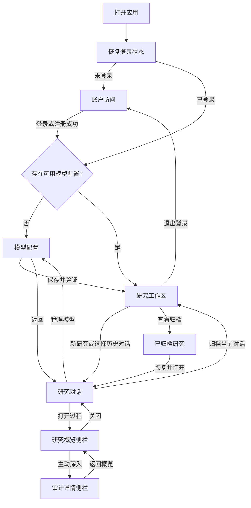

# 前端产品说明与页面导航草案

- 状态：产品决策与页面结构已确认
- 日期：2026-07-17
- 范围：正式前端 MVP 的产品定位、核心流程、页面清单与导航关系
- 暂不包含：视觉稿、组件规范、技术选型、开发排期

## 一页产品说明

### 一句话定义

Traceable Research 是一个面向严肃信息查证的研究工作区。用户用自然语言提出问题，系统在必要时继续对话，
信息足够后自动检索网页、锁定证据快照并生成带来源的答案；需要复核时，用户可以逐层查看研究概览和审计详情。

它首先是一个“可查证的研究工具”，其次才是一个对话界面，不以模拟通用聊天助手为目标。

### 目标用户

**主要用户**

- 希望获得比普通搜索更完整、比通用聊天更可查证答案的大众消费者。
- 需要调研陌生主题并形成结论的个人用户，例如学生、创作者、产品经理、工程师和独立研究者。
- 在第一版中，用户需要愿意自行配置 OpenAI-compatible 模型服务；前端必须把它设计为清晰的首次设置，
  不能假设用户熟悉 API 概念。

**次要用户**

- 需要复核某次研究覆盖范围、来源选择或失败阶段的审阅者和技术人员。

**当前不优先服务**

- 只需要闲聊、创作或简单问答的普通聊天用户。
- 需要多人实时协作、审批流或企业知识库管理的组织。
- 需要平台代付模型费用、统一提供托管模型且完全不接触模型配置的用户。

### 用户问题

普通搜索会返回大量链接，通用聊天回答又难以判断来源和研究覆盖范围。用户通常面临三个问题：

1. 不知道应该如何把一个模糊问题整理成可研究的问题。
2. 得到结论后，难以判断哪些内容有网页证据支持。
3. 研究失败或结果可疑时，无法复盘系统做过什么。

### 产品目标

MVP 要让用户能够：

1. 用普通语言开始研究，不需要填写研究表单或理解内部工作流。
2. 在一个长期研究对话中连续提出相关问题，并继承已完成轮次的语境。
3. 清楚地区分模型仍在澄清、研究正在运行、研究已完成和研究失败。
4. 阅读结构清晰、来源可访问的最终答案。
5. 按需从答案进入研究概览，再进入审计详情，而不让技术信息干扰正常阅读。
6. 安全地创建、验证和切换自己的模型配置。

### 核心价值

| 价值 | 对用户的含义 | 前端表现 |
| --- | --- | --- |
| 自然 | 不学习内部流程也能开始研究 | 只有普通对话输入，不显示 Research Brief 或“开始研究”按钮 |
| 可查证 | 结论可以回到具体来源 | 答案展示必要来源，来源链接清晰可访问 |
| 可解释 | 能了解研究覆盖了什么 | 右侧研究概览展示问题理解、检索方向、主要来源和综合摘要 |
| 可审计 | 需要时可以进一步复盘 | 审计详情按阶段筛选、分页展示审阅安全事件 |
| 克制 | 技术过程不淹没研究内容 | L1 聊天、L2 概览、L3 审计逐层披露 |

### 核心流程

#### 首次使用

1. 用户注册或登录。
2. 系统发现用户没有可用的模型配置，引导用户进入模型配置页面。
3. 用户填写配置名称、API 地址、模型 ID 和 API Key，并验证连接。
4. 配置可用后，用户进入研究工作区并创建第一条研究对话。
5. 用户输入需要查证的问题。

#### 一轮正常研究

1. 系统接收用户问题，模型返回一条自然语言理解或追问。
2. 如果信息不足，用户继续用普通消息补充或纠正；系统不展示专用澄清表单。
3. 当模型判断信息足够时，系统自动准备并执行研究，不要求用户再次确认。
4. 前端展示真实但克制的运行状态，不伪造百分比或后端没有提供的阶段。
5. 研究完成后，聊天正文显示最终答案和必要来源。
6. 用户可以直接提出下一轮相关问题，也可以打开本轮研究概览。
7. 需要诊断或复盘时，用户从概览切换到审计详情。

#### 失败与恢复

1. 登录失效时，保留明确提示并返回登录页。
2. 模型配置不可用时，说明失败原因并提供“检查模型配置”的直接入口。
3. 对话理解失败但仍允许补充时，输入框继续可用，用户可以纠正或重试表达。
4. 自动研究失败时，本轮显示终止状态，不把失败伪装成空答案；用户可以查看研究概览了解失败阶段，
   然后发起新的研究轮次。

### 产品原则

- 用户只负责表达研究意图，不负责操作内部研究管线。
- Research Brief 是系统内部的结构化工作产物，不是用户表单，也不代表用户确认。
- 主聊天只展示自然对话、紧凑状态、最终答案和必要来源。
- 研究概览和审计详情必须由服务端生成审阅安全投影，前端不负责从原始日志中脱敏。
- 不展示隐藏推理、系统提示词、模型原始输入、API Key、完整网页快照正文或原始事件日志。
- 不用动画、虚构步骤或循环文案暗示后端没有提供的进度。
- 同一个动作在整个流程中使用一致名称，例如“验证连接”“新研究”“研究概览”。

### MVP 不做什么

- 不做通用 AI 助手、联网搜索门户或浏览器替代品。
- 不提供手工编辑 Research Brief、选择固定澄清问题或确认“开始研究”的界面。
- 不把搜索轮数、输入预算、快照上限、答案风格等运行参数暴露给普通用户。
- 不做文件上传、私有知识库、网页收藏夹或文献管理。
- 不做多人共享对话、评论、审批、组织权限和实时协作。
- 不做模型市场、模型费用统计或供应商账户管理。
- 不提供不可逆的界面归档；已归档研究和模型配置必须可查看并恢复。
- 不承诺移动端与桌面端相同的信息密度；移动端优先保证阅读、追问和查看来源。

### MVP 完成标准

- 新用户可以从注册开始，完成模型配置，并得到第一份带来源的研究答案。
- 返回用户可以找到历史研究对话，并继续提出相关问题。
- 用户无需理解 Research Brief、Clarification 或 Research Run 等内部术语即可完成主流程。
- 运行中、完成、澄清中、失败和登录失效状态都具有明确且可恢复的界面表现。
- 正常聊天不请求或展示审计详情；用户主动打开后才加载对应层级的数据。
- 长答案不会把输入区挤出视口，桌面和手机上都能完成主要流程。

## 页面清单

### P0：启动与登录恢复

- **目的**：判断浏览器是否已有有效登录状态，避免工作区闪现未授权内容。
- **主要内容**：品牌标识、非阻塞加载状态。
- **去向**：已登录进入研究工作区；未登录进入账户访问页。
- **备注**：这是过渡状态，不出现在主导航中。

### P1：账户访问

- **建议路径**：`/login`、`/register`
- **目的**：登录已有账户或创建账户。
- **主要内容**：登录表单、注册表单、字段错误、认证失败提示。
- **主要动作**：登录、创建账户、在登录与注册之间切换。
- **成功去向**：有模型配置时进入研究工作区；没有模型配置时进入首次模型配置。

### P2：研究工作区

- **建议路径**：`/research`
- **目的**：承载研究对话列表、空状态和当前研究对话。
- **固定区域**：左侧研究列表、中间工作区、顶部操作区、底部账户入口。
- **无当前对话时**：显示“开始一项研究”的单一主动作。
- **有历史对话时**：默认恢复最近访问或最近更新的对话。
- **手机端**：研究列表收进左侧抽屉。

### P3：研究对话

- **建议路径**：`/research/:conversationId`
- **目的**：完成提问、自然澄清、研究等待、答案阅读和后续追问。
- **主要内容**：对话标题、当前模型、历史研究轮次、答案、来源、固定输入区。
- **主要动作**：发送消息、重命名、切换后续轮次使用的模型、打开研究概览、归档对话。
- **约束**：同一对话只有一个未完成研究轮次；阻塞期间输入框按真实状态禁用或切换为补充消息。

### P4：模型配置

- **建议路径**：`/settings/models`、`/settings/models/:profileId`
- **目的**：添加、编辑、验证、设为默认和归档模型配置。
- **主要内容**：可用与已归档配置、配置表单、连接验证状态、密钥不可回显说明。
- **主要动作**：保存配置、验证连接、设为默认、归档或恢复配置、返回研究工作区。
- **建议**：正式版采用可直接访问的独立页面；窄屏和首次使用时比复杂弹窗更稳定。

### S1：研究概览侧栏

- **所属页面**：研究对话。
- **目的**：展示当前研究轮次的 L2 概览。
- **主要内容**：问题理解、检索轮次与方向、来源数量、主要来源、综合摘要或失败摘要。
- **打开方式**：对话顶部入口，或从答案的证据入口打开。
- **行为**：按研究轮次切换；关闭后回到原来的阅读位置。
- **手机端**：作为全高抽屉，不与正文并排压缩。

### S2：审计详情侧栏

- **所属页面**：研究对话，与研究概览共用侧栏容器。
- **目的**：展示当前轮次的 L3 审阅安全事件。
- **主要内容**：阶段筛选、服务端返回的审阅安全事件、事件详情与理由、分页加载、失败信息。
- **打开方式**：先打开研究概览，再主动切换到“审计详情”。
- **约束**：不提供原始日志下载，不展示受保护的内部输入和隐藏推理。

### P5：已归档研究

- **建议路径**：`/research/archived`
- **目的**：查找和恢复已归档的研究对话。
- **主要内容**：已归档对话列表、搜索、原模型与轮次数量等识别信息。
- **主要动作**：恢复研究对话；恢复成功后可以直接打开。
- **空状态**：说明当前没有已归档研究，并提供返回研究工作区的入口。

### P6：未找到与不可访问

- **建议路径**：任意无效路径或当前用户无权访问的资源。
- **目的**：避免暴露资源是否属于其他账户，同时给出可恢复路径。
- **主要动作**：返回研究工作区。
- **文案原则**：资源不存在和无权访问使用相同的用户可见结果。

## 导航关系



### 主导航结构

```text
研究工作区
├─ 新研究
├─ 搜索研究对话
├─ 历史研究对话
│  └─ 研究对话
│     ├─ 自然对话与答案
│     ├─ 研究概览（侧栏）
│     │  └─ 审计详情（侧栏标签）
│     └─ 对话操作：重命名、切换模型、归档
├─ 已归档研究
│  └─ 恢复研究对话
└─ 账户入口
   ├─ 模型配置
   │  └─ 已归档模型配置
   └─ 退出登录
```

### 导航规则

- 登录是唯一的公开入口；研究、模型配置和 Trace 均要求已认证账户。
- 研究工作区是登录后的默认首页，不增加仪表盘或营销式欢迎页。
- 新建对话后直接进入对话，不再增加“创建研究”表单页。
- 研究概览默认关闭并懒加载；审计详情只有在用户主动切换后才加载。
- 更换对话时关闭研究侧栏，避免把上一条对话的 Trace 错认为当前内容。
- 模型配置返回时恢复此前对话和滚动位置；首次配置完成则进入空研究工作区。
- 外部来源在新标签页打开，并明确表现为站外链接。
- 归档属于离开当前对象的操作，需要确认；完成后回到研究工作区，用户可以在“已归档研究”中恢复。
- 手机端的左侧研究列表和右侧研究过程不能同时打开。

## 名称与界面用语

| 内部领域名称 | 面向用户的建议用语 | 说明 |
| --- | --- | --- |
| Research Conversation | 研究对话 | 可持续进行多轮相关研究 |
| Research Turn | 第 N 轮 / 本轮研究 | 只在区分轮次时出现 |
| Clarification | 不单独命名 | 表现为普通自然对话 |
| Research Brief | 不展示 | 系统内部工作产物 |
| Research Run | 研究中 / 本轮研究 | 避免向普通用户解释执行模型 |
| Research Overview | 研究概览 | 右侧 L2 信息层 |
| Audit Detail | 审计详情 | 右侧 L3 信息层 |
| Model Profile | 模型配置 | 用户可识别、可管理的连接配置 |

## 已确认决策

1. **目标用户**：第一版面向大众消费者。
2. **模型配置责任**：每个用户自行提供模型 API 地址和密钥。
3. **首次使用**：注册后直接进入模型配置，但允许退出登录；验证成功后进入工作区。
4. **默认落点**：返回用户恢复最近访问或最近更新的研究对话。
5. **归档行为**：已归档研究与模型配置必须可查看和恢复；需要后端增加相应列表和恢复接口。
6. **模型切换**：允许切换后续轮次使用的模型；已经开始的轮次保留实际使用的模型且不可改变。
7. **移动端优先级**：保证完整流程可用，不追求与桌面端相同的审计信息密度。
8. **产品名称**：用户界面使用 `Traceable Search`。
