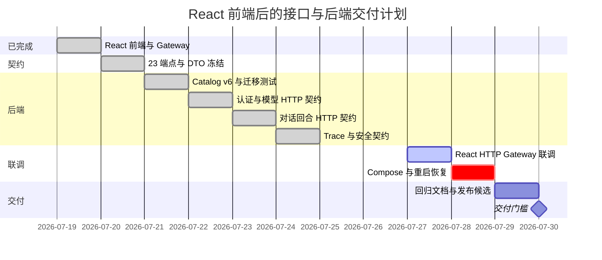

# React 前端接口与后端交付计划

> 基线日期：2026-07-19
> 计划基线：当前工作区，而不只以 `HEAD` 为准
> 人力假设：1 名熟悉 Rust、Axum、SQLite 和 React 的全栈工程师
> 剩余投入：8 个工作日，2026-07-20 至 2026-07-29
> 状态说明：当前后端改动是未提交的候选实现，代码存在不等于契约已经验收

## 1. 结论

前端已经基本完成，后续不应再围绕页面结构设计后端。当前真正需要冻结的是 React
`WorkspaceGateway` seam 背后的 23 个 HTTP 接口，以及这些接口的持久化、所有权、幂等、错误和公开数据边界。

当前工作区已经具备：

- 单一 React 正式入口、React Router、TanStack Query 和基于 Lucide 的 UI。
- `WorkspaceGateway` Interface，以及真实 HTTP Adapter 和内存 Demo Adapter 两个 Adapter。
- 登录、模型配置、Conversation、Turn、Dialogue、归档恢复、轮询、Trace L2/L3 和错误状态的前端流程。
- Demo Host 的 23 条候选路由、Catalog v6、归档恢复、持久化幂等记录和 L1/L2/L3 投影。
- `docs/workspace-http-api.md` 和数据库迁移 `0003` 至 `0006`。

因此交付工作按以下 Gate 推进；其中 1 至 3 已完成，4 除跨存储崩溃对账外已完成，5 仍待环境验收：

1. 冻结请求、响应、状态码、错误码和状态不变量。
2. 为 23 个端点建立 Router 级 HTTP 契约测试矩阵。
3. 用真实 HTTP Adapter 联调 React，不再只依赖 Demo Adapter。
4. 验证 SQLite 升级、进程中断、幂等重试、所有权隔离和归档恢复。
5. 使用 Compose 完成端到端、重启恢复和交付验收。

### 1.1 2026-07-19 开发进展

- 23 条业务路由已经穿过真实 Axum Router、Host/Origin、body limit 和
  `no-store` 中间件测试；认证、模型、Conversation、Turn、Dialogue、Trace、
  跨账号 404、归档恢复和并发 in-progress 旅程已覆盖。
- Catalog 已升级到 v6：活动 Model Profile 名称部分唯一、claim token fencing、
  单 Conversation 单非终态 Turn，以及 Conversation/Profile/Turn 的事务内状态复验。
- Model Profile PATCH 和异步验证使用 revision CAS，避免并发覆盖凭据或把旧验证结果写入新 revision；
  Turn 状态与 Conversation 活动时间在同一 `IMMEDIATE` 事务中提交，终态不可回退。
- 公网 Model Profile 在每次模型请求前重新解析并校验全部地址，连接固定到已校验地址且不使用代理或重定向。
- 非法 JSON、非数值 Trace query、坏 Turn 状态、未知 API 路由和 SPA 深链接已统一处理。
- React 19 开发入口默认使用真实 HTTP Gateway；Demo Gateway 仅在显式
  `?demo=...` 时启用，Vite `/api` 通过同源代理访问 Demo Host。
- 未关闭 Gate：Runtime/文件系统副作用与幂等 completion 之间仍缺跨存储崩溃
  reconciliation；Compose、真实 Brave/模型和进程重启旅程仍待环境验收。

## 2. 当前验证基线

| 层级 | 当前证据 | 结论 |
| --- | --- | --- |
| React 前端 | TypeScript 检查、61 个 Vitest、3 个 Node 测试和生产构建通过 | UI、Gateway 行为和 Demo 场景可用 |
| 研究核心 | `cargo test --all-targets`：116 项通过，1 项 live test 按设计忽略 | 研究链与 Model endpoint 安全边界通过回归 |
| Demo Host | `cargo test --manifest-path demo-host/Cargo.toml`：55 项通过 | Catalog v6、并发保护、投影、迁移与 Router 契约均有覆盖 |
| HTTP 契约 | 23 个业务端点均穿过真实 Router 和生产中间件矩阵 | 契约、所有权、错误形状和数据最小化 Gate 已通过 |
| 真实前后端联调 | 正式入口默认使用 HTTP Gateway；注册、会话恢复与列表旅程已验证 | 依赖真实模型/Brave 的完整研究旅程仍待验收 |
| Compose 验收 | 本轮未执行完整用户旅程与进程重启 | 交付前必须补齐 |

## 3. 前端 Interface 与运行约束

前端只通过 `web/src/react/data/workspace-gateway.tsx` 调用后端。React 视图不得直接调用 `fetch`，也不得理解
Cookie、幂等 Header、HTTP 错误解析或 DTO 投影细节。

### 3.1 Module 划分

| Module | Interface | Adapter / Implementation | 责任 |
| --- | --- | --- | --- |
| 前端数据 seam | `WorkspaceGateway` | `httpWorkspaceGateway`、`createDemoWorkspaceGateway` | 为 React 提供认证、模型、对话和 Trace 操作 |
| HTTP Client | `ResearchWorkspaceClient` | Fetch + same-origin Cookie | URL、Header、JSON、Abort、公开错误归一化 |
| 浏览器状态 | Query hooks / Action hooks | TanStack Query | 缓存、轮询、失效、乐观局部更新和登录过期清理 |
| Browser BFF | 23 个 HTTP 端点 | Axum `workspace_api` | 所有权、公开 DTO、稳定错误、后台研究调度 |
| 持久化 | `DemoCatalog` | SQLite | 账户、Cookie Session、Model、Conversation、Turn、归档和幂等 |
| 研究执行 | Runtime 公开 Interface | 当前 Core 实现 | Clarification、Research Run、搜索、快照、合成和 Trace |

这个划分的原则是：前端和测试跨越同一个 `WorkspaceGateway` seam；HTTP 层隐藏 Catalog 和 Runtime 的组合复杂度；
研究核心不感知浏览器 DTO。

### 3.2 前端依赖的行为

- `GET ConversationDetail` 是唯一轮询资源。
- Dialogue `thinking` 时前台每 3 秒轮询；Turn `ready/running` 时每 5 秒轮询；页面隐藏时降为 15 秒。
- Trace Summary 仅在打开右侧概览后读取；Trace Audit 仅在切到审计详情后按 `stage + cursor` 分页读取。
- 前端对相同失败写请求复用原 `Idempotency-Key`，只有请求内容改变或请求成功后才生成新 Key。
- `401 authentication_required` 会清空账户 Query、草稿和本地幂等状态并回到登录页。
- `dialogue_revision_conflict` 和 `turn_not_accepting_messages` 会触发 Conversation 重新读取。
- MVP 不使用 SSE 或 WebSocket，不显示虚构百分比进度。

## 4. 需要冻结的 23 个业务接口

除注册、登录和健康检查外，所有接口要求有效的同源 `traceable_login` Cookie。表中的成功状态以当前候选实现和
`docs/workspace-http-api.md` 为准。

### 4.1 认证（4）

| Method | Path | Request | Success | 前端用途 |
| --- | --- | --- | --- | --- |
| `GET` | `/api/auth/me` | 无 | `200 UserAccount` | 启动恢复登录态 |
| `POST` | `/api/auth/register` | `email, password, display_name` | `200 UserAccount` | 注册并进入工作区 |
| `POST` | `/api/auth/login` | `email, password` | `200 UserAccount` | 登录并进入工作区 |
| `POST` | `/api/auth/logout` | 无 | `204` | 撤销 Cookie Session |

### 4.2 Model Profile（8）

| Method | Path | Request | Success | 特殊规则 |
| --- | --- | --- | --- | --- |
| `GET` | `/api/model-profiles` | 无 | `200 ModelProfile[]` | 只列出活动配置，默认项稳定排序 |
| `POST` | `/api/model-profiles` | `display_name, api_base_url, model_id, api_key, make_default?` | `200 ModelProfile` | 强制 `Idempotency-Key`；响应不得返回 API Key |
| `PATCH` | `/api/model-profiles/{profile_id}` | 可编辑字段，`api_key` 可省略 | `200 ModelProfile` | 更新后清空 `verified_at`；活动 Turn 占用时返回稳定冲突 |
| `POST` | `/api/model-profiles/{profile_id}/default` | 无 | `204` | 同一账户只能有一个默认配置 |
| `POST` | `/api/model-profiles/{profile_id}/verify` | 无 | `204` | 后端验证已保存的加密凭据和端点 |
| `DELETE` | `/api/model-profiles/{profile_id}` | 无 | `204` | 语义为归档，不物理删除 |
| `GET` | `/api/archives/model-profiles` | 无 | `200 ArchivedModelProfile[]` | 按 `archived_at DESC` |
| `POST` | `/api/model-profiles/{profile_id}/restore` | 无 | `200 ModelProfile` | 原 ID、凭据和历史不变；名称冲突返回 409 |

### 4.3 Research Conversation（7）

| Method | Path | Request | Success | 特殊规则 |
| --- | --- | --- | --- | --- |
| `GET` | `/api/conversations` | 无 | `200 ConversationSummary[]` | 只列活动项，按 `updated_at DESC` |
| `POST` | `/api/conversations` | `model_profile_id?` | `200 ConversationDetail` | 强制 `Idempotency-Key` |
| `GET` | `/api/conversations/{conversation_id}` | 无 | `200 ConversationDetail` | 返回全部公开 Turn，用于刷新与轮询 |
| `PATCH` | `/api/conversations/{conversation_id}` | `title?`, `model_profile_id?` | `200 ConversationSummary` | 活动 Turn 期间允许改名，禁止切换模型 |
| `DELETE` | `/api/conversations/{conversation_id}` | 无 | `204` | 活动 Turn 期间禁止归档 |
| `GET` | `/api/archives/conversations` | 无 | `200 ArchivedConversationSummary[]` | 包含 `model_profile_available` |
| `POST` | `/api/conversations/{conversation_id}/restore` | `model_profile_id?` | `200 ConversationSummary` | 原模型已归档时必须选择活动替代模型 |

### 4.4 Turn 与 Dialogue（2）

| Method | Path | Request | Success | 特殊规则 |
| --- | --- | --- | --- | --- |
| `POST` | `/api/conversations/{conversation_id}/turns` | `question, answer_style` | `200 ChatResearchTurn` | 强制 `Idempotency-Key`；同一 Conversation 只允许一个非终态 Turn |
| `POST` | `/api/conversations/{conversation_id}/turns/{turn_id}/messages` | `revision, message` | `200 ChatResearchTurn` | 强制 `Idempotency-Key`；旧 revision 返回 409 |

### 4.5 Research Trace（2）

| Method | Path | Request | Success | 特殊规则 |
| --- | --- | --- | --- | --- |
| `GET` | `/api/conversations/{conversation_id}/turns/{turn_id}/trace/summary` | 无 | `200 ResearchTraceSummary` | L2 白名单投影，包含该 Turn 锁定的 `model_id` |
| `GET` | `/api/conversations/{conversation_id}/turns/{turn_id}/trace/audit` | `stage?`, `cursor?`, `limit?` | `200 ResearchTraceAuditPage` | L3 白名单投影；`limit=1..100`，默认 40 |

`GET /api/health` 是部署健康检查，不计入 23 个产品端点。

## 5. 公共 DTO 与跨接口规则

### 5.1 错误形状

所有错误统一返回 JSON：

```ts
interface ApiErrorResponse {
  code: string;
  message: string;
  retryable: boolean;
}
```

必须冻结的错误包括：

| HTTP | Code | 场景 |
| --- | --- | --- |
| `400` | `invalid_json` | JSON 格式或 schema 不合法 |
| `400` | `invalid_*` | 邮箱、密码、名称、URL、标题、问题、消息、分页参数越界 |
| `401` | `authentication_required` | Cookie 缺失、失效或已撤销 |
| `404` | `not_found` | 不存在或属于其他账户，防止资源枚举 |
| `409` | `profile_name_already_exists` | 活动模型配置重名 |
| `409` | `model_profile_in_use_by_active_turn` | 模型被非终态 Turn 锁定 |
| `409` | `model_profile_in_use_by_conversation` | 模型仍被活动 Conversation 使用 |
| `409` | `conversation_has_active_turn` | 重复开始 Turn、切换模型或归档冲突 |
| `409` | `conversation_model_profile_archived` | 恢复 Conversation 时原模型不可用 |
| `409` | `conversation_model_profile_changed` | 创建 Turn 期间 Conversation 模型发生变化 |
| `409` | `model_profile_changed` | 异步操作或 Turn 锁定期间模型 revision 变化 |
| `409` | `dialogue_revision_conflict` | 补充消息使用旧 revision |
| `409` | `turn_not_accepting_messages` | Turn 已研究或已终态 |
| `409` | `idempotency_key_reused` | 同 Key 对应不同请求摘要 |
| `409` | `idempotency_request_in_progress` | 同请求仍执行中，`retryable=true` |
| `500` | `internal_error` | 不泄漏内部错误，`retryable=true` |

错误码命名在契约冻结日统一一次；前端只依赖已列出的稳定码，禁止通过错误文案分支。

### 5.2 幂等

以下四个写操作强制携带 `Idempotency-Key`：

1. 创建 Model Profile。
2. 创建 Conversation。
3. 创建 Turn。
4. 提交 Dialogue Message。

作用域为 `user_id + method + resource_scope + key`。completion 记录成功持久化后，相同 Key 和相同请求重放首次状态码与
JSON，且不再次执行 handler；相同 Key 和不同请求返回冲突；执行中返回可重试冲突。记录至少保留 24 小时，5 分钟无进展的
claim 可被接管，过期记录惰性清理。副作用已提交但 completion 尚未持久化时的进程退出窗口仍属于未关闭 Gate。

### 5.3 数据最小化

- L1 `ChatResearchTurn` 只包含用户问题、公开 Dialogue、答案 Markdown、必要来源和时间状态。
- L1 禁止返回 `run_id`、Research Brief、模型端点、API Key、知识草稿、Claim rationale、Snapshot ref 或原始 Trace。
- L2/L3 只返回审阅安全投影，不返回系统提示词、隐藏推理或完整快照正文。
- Model Profile 只返回 `has_api_key`，任何读取、错误或日志都不得回显明文密钥。

### 5.4 状态不变量

- `completed` Turn 必须有答案；`ready/running` 不得有完成答案。
- `clarifying` Turn 必须有 Dialogue；前端只接受已声明的 Turn/Dialogue 状态组合。
- Conversation 最多有一个非终态 Turn。
- Turn 锁定 Model Profile ID、revision、model ID 和 answer style，后续配置编辑不得改变正在运行的研究。
- 归档和恢复保留资源 ID、Turn 顺序和答案历史。

## 6. 后端当前状态与缺口

### 6.1 当前工作区已有的候选实现

- `workspace_api.rs` 已注册全部 23 条业务路由。
- `catalog.rs` 已升级到 schema v6，并有归档列表、原位恢复、幂等 claim/complete/replay/conflict/fencing 和单活动 Turn 约束。
- `workspace_api.rs` 已有 L1/L2/L3 投影、稳定冲突映射和自动研究恢复逻辑。
- `main.rs` 已有 `/api` no-store、Host/Origin 校验、Cookie 策略、16 KiB body limit 和静态资源托管。
- Containerfile 已构建 React 生产包并由 Demo Host 同源托管。

这些实现仍处在脏工作区中，必须通过下面的交付门槛后才能标记完成。

### 6.2 需要补齐的工作

| 优先级 | 缺口 | 交付物 |
| --- | --- | --- |
| P0 | 四类幂等写仍有跨 Catalog/Runtime 的进程退出窗口 | 确定性 operation/resource ID + outbox 或可重放 reconciliation |
| P0 | 真实 HTTP 仅完成不依赖外部模型的浏览器旅程 | 使用真实模型与 Brave 的首轮、补充消息、多轮和 Trace 验收 |
| P0 | Compose 尚未验收进程重启与研究恢复 | App + Brave API 冒烟、重启、轮询恢复记录 |
| P1 | 当前大量改动尚未形成可审查提交 | 按契约、Catalog、HTTP、联调拆分提交 |

## 7. 改动范围

### 7.1 本期允许修改

| 文件 / Module | 允许的改动 |
| --- | --- |
| `demo-host/src/catalog.rs` | 迁移、归档恢复、幂等、所有权、稳定冲突和测试 |
| `demo-host/src/workspace_api.rs` | 23 端点、公开 DTO、错误映射、后台调度和 Router 测试 |
| `demo-host/src/main.rs` | 私有 App 组装测试 seam、no-store、JSON rejection、Host/Origin/Cookie 策略 |
| `demo-host/src/security.rs` | 仅修复契约测试暴露的凭据或 Session 安全问题 |
| `docs/database/0003-*.sql` 至 `0006-*.sql` | schema v3-v6 和索引，不新增独立数据库系统 |
| `docs/workspace-http-api.md` | 冻结的公共 HTTP 契约 |
| `web/src/research-workspace-client.ts` | 只修请求/响应、Header、Abort 和错误码不一致 |
| `web/src/react/data/*` | 只修 Gateway、缓存或幂等联调问题 |
| `compose.yaml`、`demo-host/Containerfile` | 仅同源部署、健康检查和运行配置 |
| 新增测试文件 | HTTP 契约 fixture、Router harness、Compose smoke 记录 |

Router 测试使用私有 App 组装 seam，不为测试暴露新的生产 HTTP Interface，也不让测试绕过真实中间件。

### 7.2 明确不修改

- React 页面结构、当前视觉、滚动条、回合导航和 Inspector 交互。
- `src/runtime.rs`、Clarification、Research Run、搜索、抓取、Snapshot、Trace v7 和答案合成算法。
- SSE、WebSocket、百分比进度、消息队列或独立任务系统。
- 文件上传、私有知识库、组织权限、多人协作、计费和模型市场。
- 为临时 Demo 响应增加兼容层；以冻结后的正式契约为准。
- 额外的 ORM、Web 框架、状态管理框架或数据库。

## 8. 开发阶段与交付 Gate

### 阶段 0：前端基线（已完成）

- React 视图、Gateway Interface、HTTP/Demo 两个 Adapter、Query 状态和 E2E 场景齐备。
- Gate：前端检查、测试、构建通过；之后 UI 默认冻结。

### 阶段 1：契约冻结（已完成）

- 逐项核对 23 端点与 `WorkspaceGateway` 的方法、DTO 和错误码。
- 固定成功状态码、时间格式、排序、分页、Cookie 和幂等规则。
- 为 L1/L2/L3 和错误响应保存最小 JSON fixture。
- Gate：前后端评审只看 Interface，不允许实现细节泄漏进 DTO。

### 阶段 2：Catalog 与迁移 Gate（已完成）

- 覆盖空库、v1、v2、v3、v4、v5、重复启动和不支持版本。
- 覆盖归档原位恢复、所有权、名称冲突和模型替代。
- 覆盖幂等 claim、replay、reuse、in-progress、超时接管和失败释放。
- Gate：SQLite 测试全部通过，失败后没有半提交资源。

### 阶段 3：HTTP 契约矩阵（已完成）

- 第 1 天：认证和 Model Profile 12 个端点。
- 第 2 天：Conversation、Turn 和 Dialogue 9 个端点。
- 第 3 天：Trace 2 个端点、跨账户 404、no-store、invalid JSON、敏感字段 allowlist。
- 每个端点至少验证认证要求、成功状态、Content-Type、错误形状、所有权和副作用。
- Gate：23 端点矩阵全部通过，文档与序列化 fixture 一致。

### 阶段 4：React HTTP 联调（部分完成）

- 关闭 Demo Adapter，使用同源真实 HTTP Adapter。
- 走通注册、模型配置、创建 Conversation、首轮、补充消息、多轮、刷新和 Trace。
- 验证 3/5/15 秒轮询、Abort、401 清理、409 刷新和幂等重试。
- Gate：浏览器网络面板没有未声明端点，页面不读取内部字段。

### 阶段 5：Compose 与恢复（2026-07-28，1 天）

- 构建 App，验证 Brave API 配置、`/api/health` 和静态资源缓存策略。
- 在 `ready/running` 期间重启 App，确认恢复或安全终态化，不重复创建 Turn/Run。
- 验证 Catalog 和研究数据卷持久化、Cookie/Origin/Host 配置和健康检查。
- Gate：完整用户旅程和重启恢复有可复现记录。

### 阶段 6：回归与交付（2026-07-29，1 天）

- 执行 Rust、Web、Compose 和浏览器门槛。
- 更新 README、HTTP 契约、架构文档和运行配置示例。
- 按主题整理提交，确保不混入无关用户改动。
- Gate：Definition of Done 全部满足，形成发布候选。

## 9. 甘特图



## 10. HTTP 契约测试矩阵

### 10.1 每个端点的通用断言

1. 未认证请求按契约返回 `401 authentication_required`。
2. 合法请求返回冻结的状态码、JSON/空响应和 `Cache-Control: no-store`。
3. 非法 JSON、超长字段和非法 query 返回结构化 `400`。
4. 其他账户的资源统一返回 `404 not_found`。
5. 响应字段使用 allowlist，不包含凭据、内部 ID、Brief、Snapshot 或原始 Trace。
6. 数据库副作用与响应一致，失败请求不留下半完成记录。

### 10.2 必须单独覆盖的场景

- 同一幂等 Key 的成功重放、不同 payload 冲突、并发 in-progress、失败释放和超时接管。
- 更新 Model Profile 后 `verified_at` 清空，API Key 省略时保留原密钥。
- 活动 Turn 锁定模型和 Conversation；改名允许，切模型和归档拒绝。
- 归档列表排序、空列表、跨账户不可见、原位恢复和替代模型恢复。
- Dialogue 旧 revision、已开始研究后补充消息和重复创建 Turn。
- `completed` 无答案、`clarifying` 无 Dialogue 等坏数据不能被投影成正常空态。
- Trace stage/cursor/limit 校验、分页终止和 L2/L3 字段最小化。
- Host/Origin 拒绝、Cookie 属性、body limit、静态入口 no-store 和哈希资源长期缓存。

## 11. 端到端验收旅程

1. 注册账户，刷新后仍能通过 Cookie 恢复。
2. 创建模型配置，验证连接，设置默认，确认响应不含 API Key。
3. 创建 Conversation，发送问题，经历澄清或自动开始研究，轮询到终态。
4. 继续多轮对话，确认历史 Turn、回合跳转和模型锁定信息正确。
5. 打开 Trace 概览和审计详情，验证懒加载、筛选和分页。
6. 在失败写请求后重试，确认复用同一幂等 Key 且不产生重复资源。
7. 归档并恢复 Model Profile 和 Conversation，确认 ID 与历史不变。
8. 在研究中重启 App，确认恢复后不会重复创建 Turn、Run 或答案。
9. 登出后刷新，确认受保护接口返回 401 且前端清空账户状态。

## 12. 风险与控制

| 风险 | 影响 | 控制方式 |
| --- | --- | --- |
| 当前工作区同时有大量未提交前后端改动 | 难以审查和回滚 | 先冻结契约，再按 Catalog、HTTP、联调拆分提交 |
| Router 契约后续发生回归 | 前后端行为再次漂移 | 52 项 Demo Host 测试持续覆盖 23 端点和生产中间件 |
| DTO 收敛导致前后端类型漂移 | 联调期出现运行时缺字段 | JSON fixture + Rust 投影测试 + TypeScript Client 同步核对 |
| 幂等 claim 遇到进程中断 | 接管请求无法判断前一 owner 是否已提交跨存储副作用 | fencing 只阻止旧 owner 覆盖；关闭 Gate 仍需确定性 operation/resource ID + outbox/reconciliation |
| 长时间研究导致浏览器误重试 | 重复 Turn 或 Message | Idempotency-Key + 只轮询 GET + POST 不自动无保护重试 |
| 真实模型或 Brave 不稳定 | E2E 难复现 | 契约测试用替身；live smoke 只作为环境验收 |
| 为测试暴露新的生产 Interface | 增加浅模块和维护面 | 使用私有 App 组装 seam，测试跨越真实 Router |

## 13. 执行命令与 Definition of Done

```text
cargo fmt --all -- --check
cargo clippy --all-targets -- -D warnings
cargo test --all-targets
cargo test --manifest-path demo-host/Cargo.toml
npm --prefix web run check
npm --prefix web test
npm --prefix web run build
docker compose config
docker compose up -d --build
```

## 14. 2026-07-19 Continuation Update

The backend continuation has now landed in the shared worktree:

- Catalog schema v7 persists an immutable operation ID, keeps takeover fencing,
  serializes one active Turn per Conversation, and migrates legacy in-progress
  rows to fail-closed blocked records.
- The four protected writes reserve stable operation/resource IDs. Runtime
  conversation and clarification logs reopen reserved seeds, repair torn tails,
  and avoid duplicate TurnStarted or UserMessageReceived events.
- Catalog resource mutation and the completed response snapshot are committed in
  one fenced SQLite transaction. Stale owners cannot complete a successor.
- Verification is green: root Rust 122 tests, Demo Host 59 tests, clippy,
  format, and diff checks all pass. The live external-service test remains
  intentionally ignored.

The remaining delivery gate is environmental: fault-injected process restart,
Compose restart recovery, and a live Brave/model browser journey still need
to be run. A provider without request idempotency can still receive a duplicate
billable call if the process exits after its response and before local outcome
durability; local state does not claim to solve that external limitation.

完成标准：

- 23 个业务端点全部有 Router 级契约测试并通过。
- 前端使用真实 HTTP Adapter 完成全部核心旅程，不依赖硬编码 Demo 数据。
- 四类受保护写操作可安全重试，不产生重复 Model、Conversation、Turn 或 Message。
- 归档恢复保持资源 ID 和历史，跨账户资源始终不可枚举。
- L1/L2/L3 和 Model Profile 响应不泄漏敏感或内部数据。
- 页面刷新、登录失效、网络失败、409 冲突、进程重启和恢复都有明确行为。
- Rust、Web、Compose 和桌面/移动浏览器验收全部通过。
- HTTP 契约、数据库迁移、README 和架构文档与最终代码一致。
