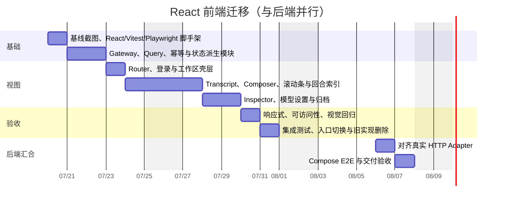

# React 前端迁移计划

> 基线日期：2026-07-19
> 上游契约：`docs/plans/2026-07-19-frontend-api-backend-development-plan.md`
> 范围：仅 `web/` 与本计划文档
> 人力假设：1 名前端工程师，与后端开发并行
> 预计投入：10 个前端工作日 + 2 个联合联调工作日
> 实施状态：前端阶段 1–4 已完成；真实后端联调阶段待后端实现就绪（2026-07-19）
> 后端状态：本次迁移未修改后端代码、数据库或 HTTP 契约
> 提交边界：`research-workspace-client.ts` 只读复用，其并行契约改动归上游后端/API 任务提交

## 1. 迁移目标

将当前原生 TypeScript 工作区迁移到 React，同时保持现有产品能力、视觉设计和后端契约不变。

迁移完成后应达到：

- 只有一个 React 正式入口，不再维护静态 Demo 和原生 TypeScript 两套渲染实现。
- React 视图不直接调用 `fetch`，也不理解缓存失效、轮询间隔和幂等重试细节。
- 服务端状态、路由状态和临时界面状态各自有明确归属。
- 当前棱角化视觉、左右信息层级、自定义滚动条、回合快速跳转和响应式行为保持一致。
- 后端正在实现的 23 个业务端点无需为 React 改名、增加包装路由或修改响应。

## 2. 当前前端基线

当前工作区的实际状态已经不同于早期静态 Demo：

- `web/index.html` 当前加载 `web/src/main.ts`。
- `main.ts` 约 1420 行，已经包含登录恢复、模型配置、归档恢复、Conversation/Turn、轮询、Trace 和幂等请求状态。
- `research-workspace-client.ts` 约 400 行，已经是浏览器 HTTP Client 的主要实现。
- `styles.css` 与 `demo.css` 合计约 2370 行；`main.ts` 同时导入两者，当前正式页面已经复用 Demo 视觉。
- `demo.ts` 仍保留约 870 行静态演示逻辑，但已不是正式入口。
- 当前测试只有少量 Node 测试，尚不能覆盖工作区状态组合、React 交互和真实浏览器布局。

迁移应以当前 `main.ts + styles.css + demo.css` 的真实页面为行为与视觉基线，而不是回到旧版 `demo.ts`。

## 3. 范围约束

### 3.1 允许修改

- `web/package.json`
- `web/package-lock.json`
- `web/tsconfig.json`
- `web/index.html`，仅在最终切换入口时修改
- `web/src/` 下的前端源代码和样式
- `web/test/` 及新增的前端测试目录
- 与前端迁移直接相关的前端文档

### 3.2 禁止修改

- `demo-host/` 下的所有代码、Cargo 配置和迁移
- 根目录 `src/` 研究运行时
- `docs/database/`
- `compose.yaml` 与 Brave Search API 部署配置
- 正在实施的 `2026-07-19-frontend-api-backend-development-plan.md`
- 后端接口路径、DTO、错误码和轮询契约

发现后端契约与计划不一致时，只记录为联调问题，不在 React 迁移提交中修改后端。

## 4. 技术选型

### 4.1 生产依赖

- `react`、`react-dom`
- `react-router-dom`
- `@tanstack/react-query`
- `lucide-react`
- `react-markdown`、`remark-gfm`

### 4.2 开发依赖

- `@vitejs/plugin-react`
- `vitest`
- `@testing-library/react`
- `@testing-library/user-event`
- `jsdom`
- `@playwright/test`

### 4.3 明确不引入

- 不引入 Redux、Zustand 或 MobX。远程数据交给 React Query，临时界面状态使用局部 state 或小型 Context。
- 不引入 Next.js。当前应用由 Axum 同源托管 Vite SPA，不需要 SSR。
- 不引入 Tailwind、CSS-in-JS 或新的 UI 组件库。迁移阶段保留现有 CSS 和类名。
- 不引入 WebSocket/SSE Client，继续使用既定轮询契约。

## 5. 模块与 seam

迁移不按“一个旧函数对应一个 React 组件”的方式机械拆分。目标是让复杂行为位于少量深模块中，视图只消费稳定 Interface。

```text
web/src/react/
├── main.tsx                         # Composition root
├── app/
│   ├── App.tsx
│   ├── providers.tsx                # Router、QueryClient、Gateway 注入
│   └── router.tsx
├── contracts/
│   └── workspace.ts                 # 与冻结 HTTP DTO 一致的类型
├── data/
│   ├── workspace-gateway.ts         # 远程工作区 Interface
│   ├── http-workspace-gateway.ts    # 生产 HTTP Adapter
│   ├── query-keys.ts                # 唯一 Query Key 定义
│   └── workspace-queries.ts         # 查询、写入、轮询、失效、幂等
├── domain/
│   ├── turn-presentation.ts         # Turn/Dialogue -> 界面状态
│   └── composer-decision.ts         # 新 Turn 或补充消息决策
├── features/
│   ├── auth/
│   ├── models/
│   ├── research/
│   ├── trace/
│   └── archives/
├── shared/
│   ├── hooks/
│   │   ├── use-custom-scroll-indicator.ts
│   │   ├── use-turn-navigator.ts
│   │   └── use-document-visibility.ts
│   ├── markdown/
│   └── ui/
└── styles/
    └── app.css                       # 最终统一入口；迁移初期继续导入现有 CSS
```

### 5.1 远程数据 seam

定义 `WorkspaceGateway` Interface，生产使用 HTTP Adapter，测试使用内存 Adapter。它负责 HTTP 传输和错误归一化，不负责 React 渲染。

```ts
interface WorkspaceGateway {
  auth: AuthOperations;
  models: ModelOperations;
  conversations: ConversationOperations;
  trace: TraceOperations;
}
```

视图不直接使用这个低层 Interface，而是通过 `workspace-queries` 暴露的查询和用户动作使用它。由该深模块统一承担：

- Query Key 与账户隔离。
- 写操作后的精确缓存更新和失效。
- `AbortSignal` 传递与网络错误归一化。
- Idempotency Key 的生成、保留和重试复用。
- 活动 Turn 的轮询间隔与停止条件。
- 登录失效后的缓存和草稿清理。

### 5.2 界面状态 seam

`turn-presentation.ts` 是纯模块，以 `ResearchTurn` 为输入，返回界面可直接消费的状态：

```ts
type TurnPresentation =
  | { kind: "understanding"; canSubmit: false; pollAfterMs: 3000 }
  | { kind: "awaiting_user"; canSubmit: true; pollAfterMs: null }
  | { kind: "researching"; canSubmit: false; pollAfterMs: 5000 }
  | { kind: "completed"; canSubmit: true; pollAfterMs: null }
  | { kind: "failed" | "cancelled" | "contract_error"; canSubmit: boolean; pollAfterMs: null };
```

所有 Turn/Dialogue 组合判断集中在这个模块中。React 视图不得重复判断状态字符串。

### 5.3 状态归属

| 状态类别 | 归属 | 示例 |
| --- | --- | --- |
| 服务端状态 | React Query | Account、Profiles、Conversation、Turn、Trace、Archive |
| URL 状态 | React Router | 当前 Conversation、设置页、归档页 |
| 临时界面状态 | 局部 state/Context | 主题、侧栏、Inspector 页签、回合索引展开 |
| 表单草稿 | 表单局部状态 + `sessionStorage` | 当前问题、模型配置未提交字段 |
| 布局测量 | 专用 hook | 自定义滚动条、当前回合、拖拽状态 |

不建立一个包含全部字段的全局 `WorkspaceState`，避免复制当前原生实现的集中式重绘问题。

## 6. 路由计划

```text
/login
/register
/research
/research/:conversationId
/research/archived
/settings/models
```

- 启动阶段先恢复 Account，不在未确认登录时闪现工作区。
- 已登录但没有可用 Model Profile 时导航到模型设置。
- `/research` 恢复最近访问或服务端最近更新的 Conversation。
- 无权访问与资源不存在使用相同页面结果，不暴露资源归属。
- Axum 已有 SPA fallback，React 迁移不要求新增后端路由。

## 7. React 视图拆分

```text
AppShell
├── ConversationSidebar
│   ├── ConversationSearch
│   └── ConversationList
├── ResearchWorkspace
│   ├── WorkspaceHeader
│   ├── ConversationTranscript
│   │   ├── ResearchTurnView
│   │   ├── ResearchAnswer
│   │   └── TurnNavigator
│   └── ResearchComposer
└── ResearchInspector
    ├── TraceOverview
    └── TraceAudit

独立页面/表面
├── AuthPage
├── ModelSettingsPage
├── ArchivedResearchPage
└── NotFoundPage
```

拆分原则：

- 一个 React 视图只接收渲染所需 props 和明确的用户动作，不接收完整 QueryClient 或全局 Store。
- Conversation Transcript 以 `turn_id` 为稳定 key，不使用数组索引。
- Inspector 数据保持懒加载；关闭时不请求 L2/L3，打开概览不自动请求 L3。
- Markdown 不启用原始 HTML；外部来源只允许 `http:` 和 `https:`。
- Lucide 图标使用 React 包，不再运行 DOM 扫描式 `createIcons()`。

## 8. 视觉迁移策略

1. 迁移前使用当前正式入口保存桌面和移动端基线截图。
2. React 初期原样导入 `styles.css` 与 `demo.css`，保留现有 DOM 层级和类名。
3. 通过内存 Adapter 提供 complete、running、empty、error、多轮和长内容 fixture。
4. 每完成一个区域就做几何和截图对照，不等所有页面完成后再处理视觉偏差。
5. 自定义滚动条和 Turn Navigator 使用专用 hook，固定轨道尺寸，避免 hover 引发内容布局抖动。
6. 视觉与功能通过后再将重复 CSS 汇总到 `styles/app.css`；CSS 清理不是切换入口的前置条件。

迁移不是重新设计。任何颜色、间距、字号、侧栏宽度或交互形式变化都应作为单独视觉任务处理。

## 9. 并行迁移与切换方式

### 9.1 并行阶段

- React 代码只新增在 `web/src/react/`，不立即改写当前 `main.ts`。
- 增加临时 `web/react.html` 作为开发预览入口，当前 `/` 继续运行原生页面。
- 使用冻结 DTO fixture 和内存 Adapter 开发，不等待后端完成。
- `research-workspace-client.ts` 在后端契约稳定前只读复用，避免与并行工作发生冲突。

### 9.2 最终切换

满足验收条件后一次性完成：

1. `web/index.html` 改为加载 React `main.tsx`。
2. 删除临时 `react.html`。
3. 删除旧 `demo.ts` 与原生 `main.ts`。
4. 在确认样式没有引用后删除或合并旧 CSS。
5. 删除被 React Query 替代的旧 Audit Cache；若仍有价值则收进 Trace 数据模块并改写测试。

不要在 React 迁移中长期保留“旧入口兼容层”。切换前并行，切换后单一实现。

## 10. 用户动作与远程数据规则

### 10.1 查询

- Account 成功后并行加载活跃 Profiles 与 Conversations。
- Conversation 详情按 `accountId + conversationId` 缓存。
- `clarifying/thinking` 每 3 秒刷新，`ready/running` 每 5 秒刷新。
- 页面后台暂停或降到 15 秒；重新可见立即刷新一次。
- 每次请求结束后再安排下一次，不产生重叠轮询。

### 10.2 写入

- 创建 Profile、Conversation、Turn 和 Message 时生成一次 Idempotency Key。
- 同一用户动作的手动重试复用原 Key；用户修改请求内容后生成新 Key。
- Turn/Message 先显示本地发送中状态，失败保留原文和重试入口。
- 写成功后优先用响应更新 Query Cache，只失效响应无法确定的数据。
- 登出无论网络结果如何都清除账户数据、Trace、草稿和待发送消息。

### 10.3 Trace

- L2 和 L3 使用独立 Query Key。
- Audit Key 包含 Account、Conversation、Turn 和 stage。
- cursor 作为分页参数原样传回，不在前端加减或解释。
- 切换 Turn 或 Conversation 时关闭 Inspector，避免展示上一个对象的数据。

## 11. 测试计划

### 11.1 纯模块测试

- 所有合法和非法 `Turn.status + Dialogue.status` 组合。
- Composer 选择创建 Turn 或提交 Message 的规则。
- Idempotency Key 生命周期。
- 外部来源 URL 白名单与 Markdown 安全渲染。
- Query Key 的账户隔离和缓存失效矩阵。

### 11.2 React 集成测试

使用内存 `WorkspaceGateway` Adapter 覆盖：

- 登录、注册、登录恢复和首次 Model Profile 设置。
- Conversation 列表、选择、创建、重命名、归档和恢复。
- 创建 Turn、模型追问、补充消息、研究中、完成、失败和取消。
- 网络错误、401、404、409 revision 冲突和幂等冲突。
- Inspector 懒加载、Audit 分页和阶段切换。
- 登出与账户切换时的数据清理。

### 11.3 浏览器测试

Playwright 验证以下视口：

- `1440 x 900`
- `1280 x 800`
- `390 x 844`

重点检查：

- 自定义滚动条轨道、悬停展开和拖拽。
- Turn Navigator 的当前索引、悬停展开、点击跳转和短刻度比例。
- 用户问题靠右、研究回答靠左，多轮历史不折叠。
- Inspector 打开时不遮挡正文，移动端侧栏互斥。
- 长标题、长问题、长答案和中文字体清晰度。
- 截图内容有效、无重叠、无横向溢出。

### 11.4 真实后端联调

后端达到契约测试绿灯后，运行完整旅程：

1. 注册并恢复登录。
2. 创建、验证、切换和归档/恢复 Model Profile。
3. 创建 Conversation，完成自然澄清与自动研究。
4. 多轮追问、页面刷新、进程重启恢复。
5. 查看 L2、L3 和 Audit 分页。
6. 归档/恢复 Conversation。
7. 模拟断网、revision 冲突、登录失效和安全重试。

## 12. 甘特图

React 前端可在冻结契约和内存 Adapter 上独立完成；最后两天与正在进行的后端计划汇合。



## 13. 实施阶段与交付物

### 阶段 1：脚手架与 seam

- 安装 React 与测试依赖，建立临时预览入口。
- 定义 Workspace Gateway、内存 Adapter、Query 模块和纯状态派生模块。
- 交付物：可独立运行的 React 空壳、稳定 Interface、首批单元测试。

### 阶段 2：主工作区迁移

- 按当前 DOM 与 CSS 迁移 App Shell、Sidebar、Transcript、Composer、Scrollbar 和 Turn Navigator。
- 交付物：使用 fixture 可展示所有主工作区状态的 React 页面。

### 阶段 3：次级流程迁移

- 迁移 Auth、Model Settings、Archive Manager、Trace Overview 和 Audit。
- 交付物：内存 Adapter 下可完成完整用户旅程。

### 阶段 4：质量与切换

- 完成 React 集成测试、Playwright 几何/交互/截图验证和响应式修复。
- 切换正式入口并删除原生渲染实现。
- 交付物：单一 React 前端，不再存在双实现。

### 阶段 5：后端联调

- 只调整 HTTP Adapter 与前端错误落点来匹配已冻结契约。
- 后端不一致项反馈给后端任务处理，不在本任务越界修复。
- 交付物：真实 Compose 环境完整 E2E 通过。

## 14. 风险与控制

| 风险 | 影响 | 控制方式 |
| --- | --- | --- |
| 后端与前端在同一工作区并行修改 | 文件覆盖或提交混杂 | React 初期只新增 `web/src/react/`，后端文件保持只读 |
| 当前 `main.ts` 正在继续变化 | 迁移基线漂移 | 启动时记录 commit/diff，切换前只吸收已确认行为，不逐行追随 |
| 迁移导致视觉回退 | 已确认的细节丢失 | 保留类名与 CSS、逐区域截图、Playwright 几何检查 |
| React Query 与本地 Store 重复 | 双数据源导致闪烁 | 服务端状态只进 Query Cache，不再复制到全局 Context |
| 幂等重试实现散落 | 重试产生重复 Turn/Message | 统一封装在写入模块，视图只调用用户动作 Interface |
| jsdom 不支持真实布局 | 滚动条和跳转测试失真 | 布局交互只在 Playwright 真实浏览器验收 |
| 长期保留新旧入口 | 修复需要改两份 | 验收后一次性切换并删除旧实现 |

## 15. Definition of Done

- `web/index.html` 只加载 React 入口。
- `demo.ts` 和原生 `main.ts` 不再参与构建，且没有重复正式实现。
- React 视图中不存在直接 `fetch`；所有远程行为通过 Workspace Gateway 和 Query 模块。
- 现有登录、模型、Conversation、Turn、Trace、归档、轮询和幂等行为全部保留。
- 当前主题、布局、滚动条、Turn Navigator 和移动端行为通过截图及交互验收。
- 所有 Turn/Dialogue 状态组合、缓存失效和错误落点有自动化测试。
- 前端 `check`、单元测试、React 集成测试、Playwright 和生产构建全部通过。
- 与真实后端完成 Compose E2E，且 React 迁移未修改任何后端文件。

## 16. 实施记录（2026-07-19）

- [x] 阶段 1：React/Vite/Vitest/Playwright 脚手架、Workspace Gateway 与内存 Adapter。
- [x] 阶段 2：工作区、Transcript、Composer、自定义滚动条与 Turn Navigator。
- [x] 阶段 3：认证、模型配置、归档恢复、Trace Overview 与 Audit。
- [x] 阶段 4：正式入口切换、旧渲染实现删除、响应式与浏览器验收。
- [ ] 阶段 5：真实 HTTP/Compose 联调；等待后端计划完成，不在 React 迁移中修改接口。

前端验收覆盖：

- `?demo=complete|running|empty|error|long|setup` 场景；生产构建裁剪全部 Demo Adapter 数据。
- 数据层 Interface 测试覆盖幂等 Key 生命周期、缓存更新、401、revision 409、归档与登出清理。
- React 集成测试覆盖登录、注册、首次模型设置、Conversation/Turn/Message、归档恢复和 Audit 分页。
- Playwright 覆盖 `1440 x 900`、`1280 x 800`、`900 x 800` 与 `390 x 844`，包含滚动条拖拽、回合跳转、长中文内容和移动抽屉互斥。
