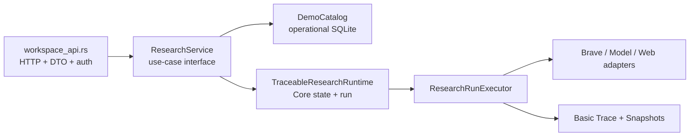

# 后端范围收敛与主链交付计划

> 状态：提议执行
> 日期：2026-07-20
> 基线：`web-search` 分支，提交 `d3b1b94`
> 目标：先交付一条稳定的多用户研究主链，再决定是否做持久化重构

## 1. 结论

当前项目的主要问题不是部署服务太多，而是代码同时承载了完整审计、恢复、归档、
多用户、三层 Trace 投影和多套状态模型。第一版不应继续扩大范围。

本计划把交付目标收敛为一条主链：

```text
注册/登录
  -> 配置并验证模型
  -> 创建 Conversation
  -> 提交研究问题
  -> Clarification 判断
  -> Brave 搜索
  -> 公网页面抓取
  -> 生成答案
  -> 刷新页面后恢复结果
```

收敛原则：

1. 先减少公开行为和编排入口，不先迁移持久化格式。
2. 保留安全底线、Brave、模型、Snapshot hash 和基础 Trace。
3. `ResearchService` 必须是一个有深度的 Module：吸收真实用例编排，而不是给现有
   `runtime.rs` 再包一层转发。
4. 先完成真实 WSL/Brave smoke test，再决定是否删除更多内部机制。

## 2. 当前基线

| 项目 | 当前状态 |
| --- | --- |
| Core | `src/` 约 10,442 行（含测试）；`cargo test --all-targets` 109 passed，1 个 live E2E ignored |
| Demo Host | `demo-host/src/` 约 9,427 行（含测试）；59 passed |
| Browser | React 19；Node tests 3 passed，Vitest 61 passed |
| 运行拓扑 | 目标 Compose 只有一个 App 容器和一个数据卷 |
| WSL 实例 | 仍运行旧 `traceable-search-dev-app` 和 SearXNG；Brave 镜像已构建但尚未替换 |
| 真实外部验证 | 缺少可用 `BRAVE_SEARCH_API_KEY` 时不能完成真实搜索 smoke test |

当前代码已经具备完整功能的雏形，收敛不是从零重写，而是把已实现能力分成“现在交付”和
“后续版本”。

## 3. 范围决策

### 3.1 第一版必须保留

- 多用户注册、登录、Cookie Session 和所有权隔离；
- Model Profile、API Key AES-GCM 加密、模型验证；
- Conversation、一个活动 Turn、Clarification；
- 固定 `web_first` answer style；
- Brave Search API；
- public URL/DNS/SSRF 防护、页面抓取和 Snapshot content hash；
- 后台 Research Run；
- `completed`、`failed`、`cancelled` 三种终态；
- L1 聊天答案和基础 Trace；
- 基础 `Idempotency-Key`，避免重复创建资源；
- 页面刷新后读取已完成 Turn。

### 3.2 第一版冻结，不再扩展

以下能力暂时保留代码兼容性，但不作为当前交付门槛：

- Model Profile 和 Conversation archive/restore；
- L2 Research Overview 和 L3 Audit HTTP 投影；
- `knowledge_first`；
- Browser queue、fork、restart；
- 多副本部署和分布式锁；
- 任意崩溃点自动续跑；
- provider-level exactly-once；
- 更多旧 Trace schema 兼容；
- 全局 JSONL/SQLite 事务。

### 3.3 不删除的安全能力

不能为了减重删除：

- Model endpoint public DNS/SSRF 校验；
- 公网页面 SSRF、redirect 和 body limit；
- API Key 加密；
- Snapshot hash 验证；
- Brave/model/web Adapter 的测试 seam；
- 基础 terminal Trace。

## 4. 目标模块结构



### 4.1 `ResearchService` 的 Interface

目标 Interface 只暴露业务结果，不暴露 Catalog claim、JSONL 文件、fencing token 或内部
状态 reducer：

```text
create_conversation(context, input) -> ConversationView
start_turn(context, conversation_id, input) -> TurnView
submit_message(context, conversation_id, turn_id, input) -> TurnView
load_conversation(context, conversation_id) -> ConversationView
```

后台执行由 Service 内部处理：

```text
start_turn / submit_message
  -> validate ownership and model revision
  -> call Runtime
  -> commit operational Catalog state
  -> schedule execution when ready
  -> return public TurnView
```

这个 Module 的深度来自它真正吸收以下复杂性：所有权、Profile revision、幂等、
Clarification/Turn 映射、补偿和后台调度。若实现结果只是把四个方法逐个转发给
`TraceableResearchRuntime`，则不要引入它。

### 4.2 第一阶段不合并存储

目标形态仍暂时是：

```text
Catalog SQLite       = operational state and public ownership
Core JSONL + Trace   = research lifecycle and audit facts
Snapshot SQLite      = immutable Web body
```

把 Conversation JSONL、Clarification JSONL、Trace JSONL 和 Catalog 一次性合并，会触发
数据迁移、旧 Trace replay、恢复语义和大量测试重写；这不是当前收敛的必要条件。

## 5. 分阶段执行

### 阶段 0：范围冻结

目标：停止新增非主链功能，形成唯一 Definition of Done。

- [ ] 在开发计划中标记 archive/restore、L2/L3、`knowledge_first`、高级恢复为 deferred。
- [ ] 固定新 Turn 使用 `web_first`。
- [ ] 定义第一版只支持一个活动 Turn 的行为和错误码。
- [ ] 从 README、架构文档和前端计划中删除“当前版本必须完成”的过宽表述。
- [ ] 把 `docs/backend-architecture.md` 作为后端入口，旧历史文档只做背景材料。

完成条件：新功能请求可以明确判断为“主链必须做”或“后续版本”，不再进入当前实现。

### 阶段 1：真实主链验收

目标：不改核心存储，先证明当前代码能在目标环境完成一次真实研究。

- [ ] 在 WSL 配置 `BRAVE_SEARCH_API_KEY`，不写入仓库或聊天。
- [ ] 提取并复用现有 `DEMO_CREDENTIAL_ENCRYPTION_KEY`。
- [ ] 使用 `localhost/traceable-search-demo:brave-wsl` 替换旧 App。
- [ ] 保留现有数据卷，验证旧 Model Profile 可以解密。
- [ ] 验证 `/api/health`、登录、Profile verify、创建 Conversation、提交问题。
- [ ] 验证 Brave 搜索、页面 Snapshot、最终答案和刷新恢复。
- [ ] 真实验证通过后，删除旧 SearXNG 容器和缓存卷。

完成条件：一条真实的 `register -> model -> conversation -> research -> refresh` 路径通过。

### 阶段 2：收拢编排 Interface

目标：降低 `workspace_api.rs` 和 `runtime.rs` 之间的理解成本，不改变公开 HTTP 契约。

- [ ] 新增 `demo-host/src/research_service.rs`，先迁移创建 Turn 和补充消息两个用例。
- [ ] 将 ownership、Profile revision、Clarification 映射、后台调度集中到 Service。
- [ ] Handler 只保留请求解析、认证、调用 Service、响应映射。
- [ ] Catalog 继续封装 SQL；Service 不直接拼 SQL。
- [ ] Runtime 继续封装 Core JSONL、Trace 和 Research Run；Service 不直接写 JSONL。
- [ ] 使用 Service Interface 测试主链，不让新测试穿透到内部 reducer。
- [ ] 旧 Handler 与新 Service 行为一致后，删除重复的非 durable 路径。

完成条件：创建 Turn 和补充消息各自只有一个业务入口；Router 测试只验证 HTTP 契约，
Service 测试验证跨 Catalog/Core/后台任务的可观察结果。

### 阶段 3：收窄公开行为

目标：让第一版产品行为和代码范围一致。

- [ ] 前端默认只使用 `web_first`，不再暴露 `knowledge_first` 控件。
- [ ] 暂停 L2/L3 inspector 的新需求和新字段；保留内部 Trace 写入。
- [ ] 归档/恢复接口标记为后续版本，前端不再把它作为主流程依赖。
- [ ] 失败后只支持创建下一 Turn；不在第一版承诺任意点续跑。
- [ ] 将 `running` 重启后的行为定义为“进入可见失败并可重新研究”，而不是隐式重跑。
- [ ] 保留基础幂等 replay；复杂 takeover/fencing 只保留实现安全所需的最小部分。

完成条件：前端、HTTP 文档和后端状态不再展示当前版本不会稳定保证的能力。

### 阶段 4：清理重复实现

目标：主链稳定后再减少代码量。

- [ ] 删除没有路由引用的旧 Handler、DTO 和 projector 分支。
- [ ] 删除只服务于 deferred 功能的前端状态和测试。
- [ ] 删除旧的非 durable 幂等入口，统一走 Service 的 durable write。
- [ ] 合并重复的错误映射和 Turn/Clarification 状态投影函数。
- [ ] 更新后端架构文档，记录实际保留的 seam 和 deferred 能力。

完成条件：`rg` 不再找到死路由、重复公开 Interface 或仅用于 deferred 功能的主路径代码。

## 6. 第一版 Definition of Done

### 功能

- [ ] 新用户可以注册、登录、配置并验证一个模型。
- [ ] 用户可以创建 Conversation 并提交研究问题。
- [ ] 模型可以决定继续对话或自动开始研究。
- [ ] Brave 搜索、网页抓取和答案合成可以完成。
- [ ] 研究失败时显示稳定失败状态，用户可以创建下一 Turn。
- [ ] 刷新页面后可以恢复 Conversation 和已完成答案。

### 安全

- [ ] API Key 不进入 Browser、Trace、响应或镜像。
- [ ] 模型端点和网页 URL 的 SSRF 测试通过。
- [ ] 未授权账户无法读取其他账户资源。
- [ ] Host/Origin、Cookie、body limit 和未知 JSON 字段校验通过。

### 可靠性

- [ ] 同一个 Idempotency-Key 重试不会创建第二个本地资源。
- [ ] 同一个 Conversation 不会同时创建两个非终态 Turn。
- [ ] Brave、模型、空结果、超时和错误响应都有 typed failure。
- [ ] 进程重启后的行为是明确的，不把本地 exactly-once 误写成外部 provider exactly-once。

### 验证

- [ ] `cargo test --all-targets`
- [ ] `cargo test --manifest-path demo-host/Cargo.toml`
- [ ] `npm --prefix web run check`
- [ ] `npm --prefix web test`
- [ ] `npm --prefix web run build`
- [ ] WSL Compose health check
- [ ] 一次真实 Brave + Model smoke test

## 7. Deferred backlog

以下项目不阻塞第一版发布，单独建立后续计划：

1. 合并或重设计 Core JSONL 与 Catalog 的跨存储事务。
2. 完整的 process restart / fault injection / Compose recovery 验收。
3. Trace L2/L3 的完整审计 UI 和字段扩展。
4. Model Profile、Conversation 的归档恢复完整体验。
5. provider idempotency key 和重复计费控制。
6. 多副本部署、分布式锁和共享数据卷协调。
7. 任意半轮安全恢复和更细粒度 checkpoint。
8. Browser queue、cancel、restart、fork。

Deferred 不等于删除：接口和数据格式需要保留兼容说明，但不再向当前主链添加分支。

## 8. 风险与回滚

| 风险 | 控制方式 |
| --- | --- |
| Service 变成浅层转发 Module | 先迁移真实 ownership、幂等和调度逻辑；若没有明显 locality 就取消新增 Module |
| 收窄公开接口影响现有 Browser | 先冻结 HTTP 契约；通过 feature flag 或保留兼容读接口过渡 |
| 删除 deferred 分支误伤恢复 | 先保留数据读取和 terminal projection，确认 live smoke 后再删写路径 |
| WSL 替换失败 | 先保留旧容器和数据卷；新 App 健康后再删除 SearXNG |
| 用户已有 Profile 无法解密 | 永远复用原 `DEMO_CREDENTIAL_ENCRYPTION_KEY`，不执行 `down -v` |
| 外部服务造成重复调用 | Trace 明确记录 attempt；不宣称 provider exactly-once |

每个阶段都应形成独立提交，不能把 Service 重构、数据迁移和公开接口变更放进同一个提交。

## 执行记录（2026-07-20）

- 已新增 `demo-host/src/research_service.rs`，并将 Turn 创建与补充消息两条路由切换到该 Module。
- 已将 Conversation 创建/读取、Turn 创建/补充消息、所有权、Model Profile revision、Clarification 补偿、Catalog durable commit、后台调度/恢复和公开投影集中到 `ResearchService`。
- 新 Turn 的执行策略固定为 `web_first`；请求字段暂保留用于兼容，但不再选择 `knowledge_first`。
- 已删除旧的 Conversation/Turn/Message Handler 实现、重复 projector 和旧幂等 helper；durable claim/replay 的 HTTP 包装仍暂留 Handler，作为下一切片。
- 验证：`cargo test --manifest-path demo-host/Cargo.toml`（59 passed）。

## 9. 计划外事项

本计划不包含：

- 更换 Brave 之外的搜索供应商；
- 新增 Python/crawl4ai/browser 抓取服务；
- 重新设计 React 视觉系统；
- 引入微服务、消息队列或 Kubernetes；
- 在没有真实 WSL 配置的情况下声称部署验收通过。

## 10. 关联文档

- [当前后端架构](../backend-architecture.md)
- [Workspace HTTP API](../workspace-http-api.md)
- [前端 API/后端开发计划](2026-07-19-frontend-api-backend-development-plan.md)
- [React 前端迁移计划](2026-07-19-react-frontend-migration-plan.md)
- [Brave/Search API 供应商决策](../decisions/2026-07-20-search-api-provider-comparison.md)
