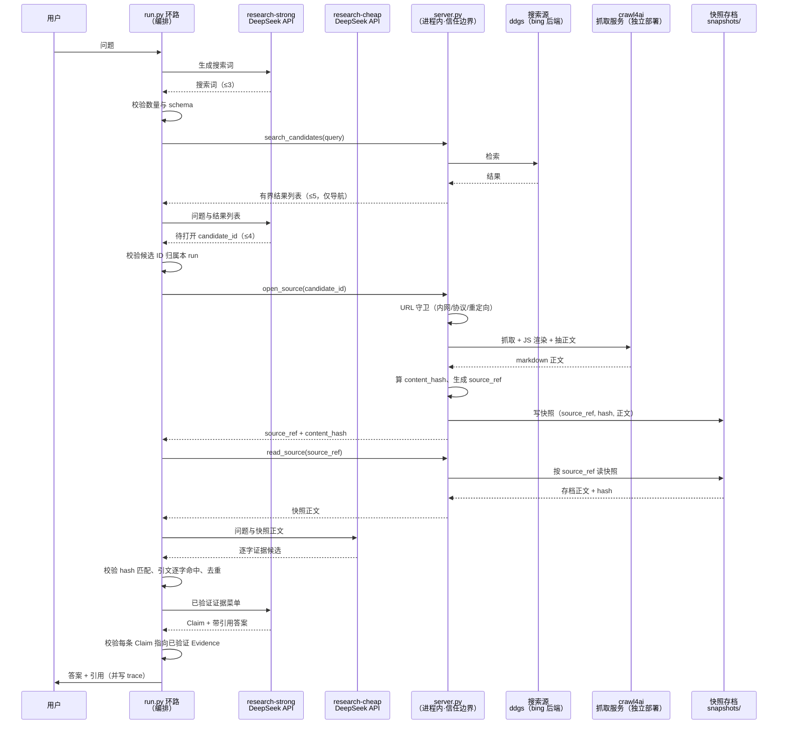

# 验证版设计（PoC）

> 状态：Draft
>
> 日期：2026-07-10
>
> 目的：以最小实现验证架构 B（Web Search）的**可行性**与**回答质量**，不追求产品完整度。

## 1. 只回答两个问题

1. **可行性**：固定环路 `生成查询 → 选候选 → 存档快照 → 逐字取证 → 形成 Claim → 带引用答案` 能否端到端稳定跑通？
2. **质量**：产出的答案在事实准确、引用忠实、可溯源上，能否显著优于普通向量 RAG？

其余一切（多租户、鉴权、扩缩容、持久编排、前端）都不在本版范围。得到这两个问题的数据后再决定是否投入 `architecture.md` 的完整实现。

## 2. 从完整架构裁剪到 PoC

完整架构的组件在 PoC 中大幅塌缩为单进程，唯独审计底线保留：

| 完整架构组件            | PoC 处理                          |
| ----------------- | ------------------------------- |
| API Service       | 去掉，改 CLI 或单函数入口                  |
| 微服务拆分 / 部署编排       | 去掉，单进程                           |
| 鉴权 / 会话 / 多租户      | 去掉                              |
| 持久任务编排（LangGraph 等） | 去掉，用普通 Python 顺序 + 循环           |
| Model API Gateway | 保留（直连 New API，无需自研）             |
| Source Module（B）  | **保留**，实现为薄 Web Search MCP server |
| Evidence 逐字校验     | **保留**，可审计底线，不可裁                 |
| Trace             | **保留**，落地为本地 JSONL              |
| PostgreSQL / 对象存储  | 降级为本地 SQLite + 本地文件目录           |

`ponytail:` PoC 用本地文件与 SQLite 顶替数据库与对象存储；当验证通过、进入产品实现时再换 PostgreSQL + 对象存储。裁掉的都是可后加的工程层，留下的都是决定"可行性与质量"的最小闭环。

## 3. PoC 结构

```text
poc/
├─ run.py                # 单进程环路：编排 + 强/廉模型调用 + 校验
├─ search_mcp/           # 自建薄 Web Search MCP server
│  └─ server.py          # search_candidates / open_source / read_source
├─ snapshots/            # open 时存档的网页快照（正文 + meta + hash）
├─ trace/                # 每个 run 一份 JSONL 审计链
├─ store.sqlite          # Evidence / Claim / Run 状态
└─ eval/
   ├─ gold.jsonl         # 金标题集（问题 + 参考答案 + 权威来源）
   └─ score.py           # 指标计算
```

模型调用经统一入口，PoC 不在业务逻辑里绑定具体供应商。阶段 1 为直测方便直连 DeepSeek 官方 API（`run.py` 的 `CONFIGS` 写死 `deepseek-v4-flash` / `deepseek-v4-pro` 四配置），New API 别名（`research-strong` / `research-cheap`）抽象留待后续拆分运行时时接入：

```text
research-strong  → 生成搜索词、选候选、生成 Claim 与带引用答案
research-cheap   → 在授权快照内提取逐字证据
```

## 4. Web Search MCP server

B 的 Source 契约 `list_candidates / open / read` 映射为三个 MCP tool。三工具签名：

```text
search_candidates(query, k)      → [{candidate_id, title, snippet, url}]   # 仅导航，非证据
open_source(candidate_id)        → {source_ref, source_uri, fetched_at, content_hash}  # 抓取并存档快照
read_source(source_ref, max_chars)  → {source_ref, source_uri, content_hash, truncated, text}  # 读取快照正文
```

### 4.1 模块职责与边界

open 一步会依赖外部服务，但每个外部件只做一件事，信任相关的动作全部收在 `server.py` 内。三方边界：

| 模块 | 只负责 | 不负责 / 可替换 |
| --- | --- | --- |
| `ddgs`（DuckDuckGo）| `search_candidates`：返回候选标题、摘要、URL | 不产证据、不抓正文；可换任意搜索源 |
| crawl4ai 服务 | `open_source` 中的一步：抓取、JS 渲染、正文抽取，返回 markdown | 不校验、不算哈希、不落盘；作为纯抓取后端可替换为其它爬虫 |
| `server.py` | 信任边界：候选记账、URL 校验、哈希、`source_ref` 生成、快照存档 | 这些不外包，换掉即溯源链失效 |

搜索与抓取都可以接公网服务或第三方爬虫，但**候选归属校验、`content_hash`、`source_ref` 生成、URL 守卫、快照落盘必须在本 server 内完成**，这是审计信任边界的根。

### 4.2 server.py 内的确定性职责

- 校验 `candidate_id` 属于本 run 已返回的结果列表，拒绝集合外 URL；抓取前后各做一次 `_is_public_http`，阻止内网地址、非 HTTP(S)、重定向越界、超限响应。
- 抓取正文（经 crawl4ai）后计算 `content_hash`，生成稳定 `source_ref`（如 `source:web/<snapshot_id>`），写入 `snapshots/`。
- 快照一经存档即冻结；`read_source` 从存档读取，进程重启则从磁盘回补，读取时哈希须与存档时一致。
- 网页内容一律视为不可信数据，不执行其中指令（防提示注入）。

## 5. 统一受控工作流（run.py）

PoC 的核心不是某个模型或某个工具，而是一条**由程序掌控、所有问题共用**的研究环路。"统一"指不做简单/复杂分流，任何专业问题都走同一条路；"受控"指模型不掌控流程，它只在每一步产出结构化候选，能否通过由程序判定。

### 5.1 环路十步

```text
1. 读取问题
2. research-strong 生成有界搜索词（数量上限固定）
3. 每个搜索词 → search_candidates → 有界结果列表
4. research-strong 从结果列表中选 candidate_id（不得自造 URL）
5. open_source 存档快照，得到 source_ref
6. 对每个 source_ref：research-cheap 只读该快照，返回证据候选
7. Evidence 校验：source_ref 存在、hash 匹配、引文逐字命中原文、去重
8. research-strong 读已验证证据 → Claim 候选 + 带引用答案草稿
9. 校验每条事实性 Claim 都指向已验证 Evidence
10. 输出答案 + 引用；全过程写 trace/<run_id>.jsonl
```

对应时序。PoC 里 `run.py` 即 Runtime，编排环路，`server.py` 的三工具进程内 import（非 stdio）；模型（DeepSeek API）、crawl4ai（独立抓取服务）、搜索源是环路之外的独立服务，由 `server.py` 或环路按需调用；快照存档是 `server.py` 独占读写的持久层。为看清主干，下图画单次取证的线性流程（搜索词、候选实际会重复多次，此处不展开）：



与 [`architecture.md` §7](architecture.md) 的完整时序同构，仅把 API / Research Runtime 合并进单进程 `run.py`，`list_candidates / open / read` 落地为 `search_candidates / open_source / read_source`。

### 5.2 为什么统一

所有专业问题进入同一受控流程，不按"简单/复杂"二级分流。理由：分流本身要靠模型判断，一旦判错，简单题被草率作答、复杂题走不到取证，都会绕过审计底线。统一环路让每道题都经过同样的存档与逐字校验，可溯源性不依赖分流判断的准确性。两版架构（A 结构化索引库 / B Web Search）也共享同一 `search_candidates / open_source / read_source` 契约与 `source_ref` 语义，只有原文来源不同，本 PoC 落地 B 版。

### 5.3 为什么受控

模型只产出结构化候选——搜索词、选哪个候选、逐字引文、Claim——而系统状态与控制流由 `run.py` 掌握。模型不能决定跳过校验，也不能引用未存档的内容。环路里四道校验全部由程序执行，任一不过即拒绝：

1. **候选归属**：`open_source` 只接受本 run 已返回的 `candidate_id`，拒绝集合外 URL；
2. **哈希匹配**：读取的正文必须与存档时的 `content_hash` 一致；
3. **引文逐字命中**：廉价模型摘出的每条引文必须在快照正文中逐字连续出现（`quote in text`）；
4. **Claim 有据**：答案里每个事实性 Claim 必须挂到一条通过前三关的 Evidence，否则视为悬空断言剔除。

强模型（research-strong）担任研究者，负责需要判断的活（生成搜索词、选候选、写带引用答案）；廉价模型（research-cheap）担任取证助手，只在已存档快照内摘逐字引文。取证与研究分离，是为了让"找证据"这步不受研究者主观发挥影响，证据真伪由程序判定而非模型自说自话。

任一模型调用均**无状态**：不依赖对话历史，输入由已持久化的对象（快照、Evidence、Claim）在每步重建。这样每一步都可独立重放与审计，也为后续把单进程拆成分布式运行时留出边界。

> `ponytail:` 现为单趟线性环路（每题跑一遍即出答）。`architecture.md` 描述的「逐层选枝循环」（多轮固定迭代、每轮用上轮已验证证据引导下轮查询，模拟架构 A 的索引下钻）尚未落地，待后续版本增补；网页来源缺乏数据库那样的层级导航，是该循环需要解决的核心难点。

## 6. 评测

### 6.1 金标题集

`eval/gold.jsonl`，每条：

```json
{
  "qid": "law-001",
  "question": "劳动合同被违法解除，劳动者可主张哪些救济？",
  "reference_answer": "……",
  "authoritative_sources": ["劳动合同法 第48条", "第87条"],
  "must_cite_facts": ["违法解除可请求继续履行或二倍经济补偿金"]
}
```

单领域起步（如中国劳动法），题量 30–50 条即可暴露主要问题。

### 6.2 指标

| 指标         | 定义                                   | 采集方式               |
| ---------- | ------------------------------------ | ------------------ |
| 引用忠实度      | 事实性句子中，引文确实逐字存在于对应快照的比例              | 程序校验（已在环路第 7 步内建）  |
| 事实准确率      | 答案关键事实与参考答案一致的比例                     | 强模型判分 + 人工抽检       |
| 来源覆盖率      | 成功作答（存档到权威原文、取到逐字证据并产出带引用答案）的题数 / 总题数 | 程序统计               |
| 必答点命中率     | `must_cite_facts` 在答案中出现且有引用支撑的比例    | 程序 + 人工            |
| Trace 完整率  | 每条最终 Claim 可回放到 Evidence→快照→原文的比例    | 程序遍历 trace         |
| 单次成本       | 每问的强/廉模型 token 与调用次数                 | New API 用量统计       |
| 对照         | 同题集下普通向量 RAG 的引用忠实度与事实准确率            | 另跑一个最小向量基线         |

### 6.3 成功阈值（占位，待首轮数据校准）

- 引用忠实度 ≥ `TBD%`（PoC 目标接近 100%，因由程序强校验）。
- 事实准确率显著高于向量 RAG 基线（差值 `TBD`）。
- 来源覆盖率 ≥ `TBD%`；覆盖率过低说明 Web Search 召回不足，转而验证架构 A。
- 单次成本 ≤ `TBD`，验证"低成本"假设。

阈值在第一轮跑通后依据实际分布填定，不预设过严门槛阻塞验证。

## 7. 预期暴露的风险

- **召回**：公网搜索能否稳定返回权威、可抓取来源；若不足，是架构 A（结构化索引库）的价值信号。
- **选择**：强模型能否稳定从候选中选对网页，而非被 SEO 内容误导。
- **取证**：廉价模型逐字引文的命中率与幻觉率。
- **快照稳定性**：登录墙、动态渲染、反爬导致无法存档快照的比例。
- **成本**：固定环路的实际 token 消耗是否落在可接受区间。

## 8. 与完整架构的关系

PoC 只验证架构 B 且共享同一 `list_candidates / open / read` 契约与 `source_ref` 语义。验证通过后：

- 单进程环路 → 拆出 API Service + Thin Research Runtime；
- 本地 SQLite / 文件 → PostgreSQL + 对象存储；
- 若 Web Search 召回或稳定性不足 → 按同契约增补架构 A 的结构化索引 Source，评测框架与指标不变。

PoC 的代码结构刻意贴合完整架构的边界，使其成为最小可扩展起点，而非一次性抛弃的原型。
