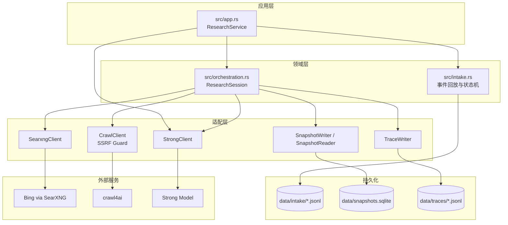
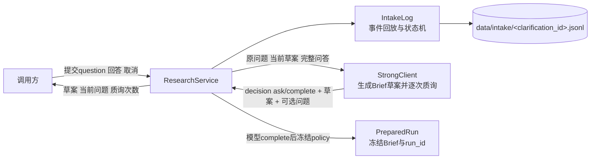
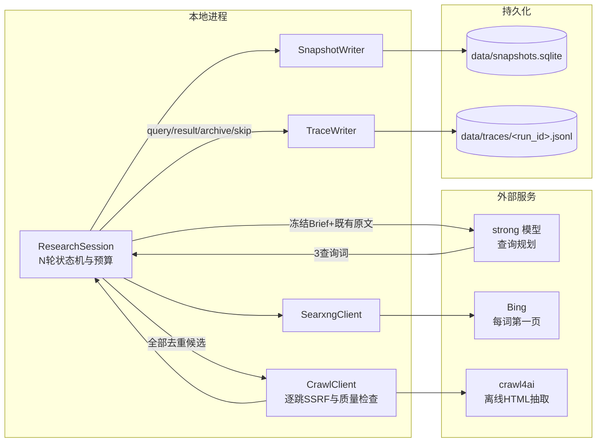
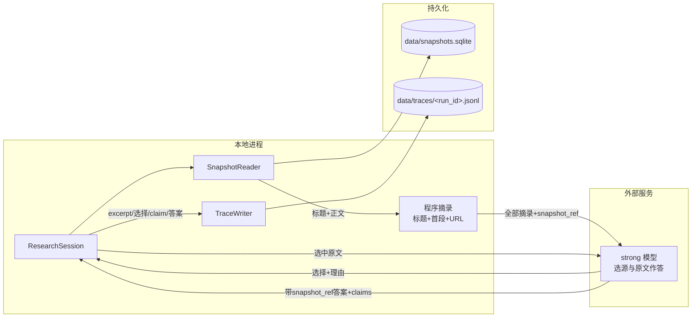
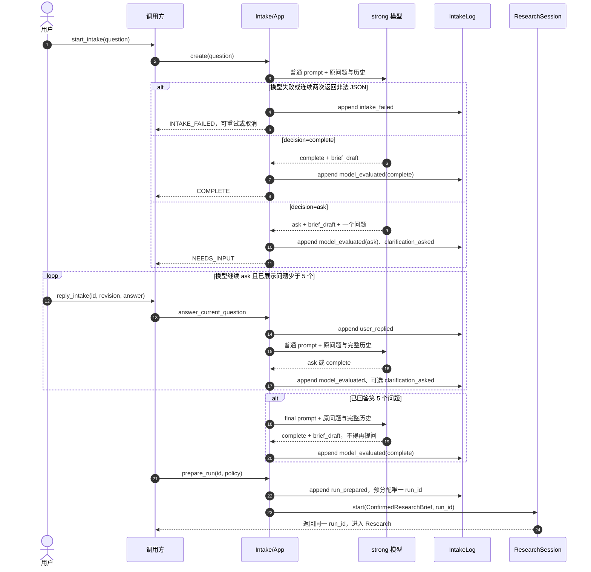
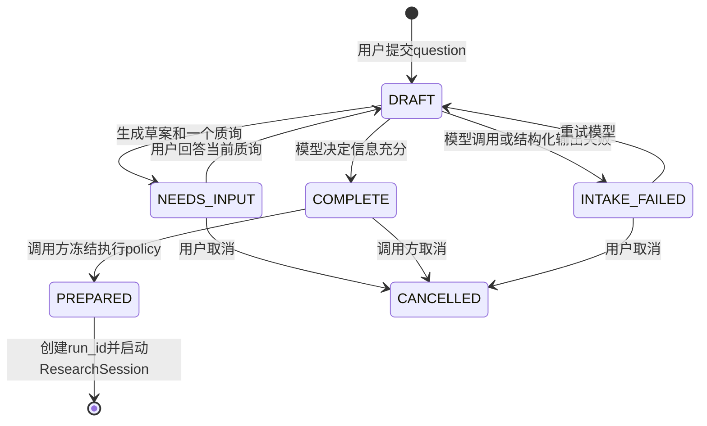
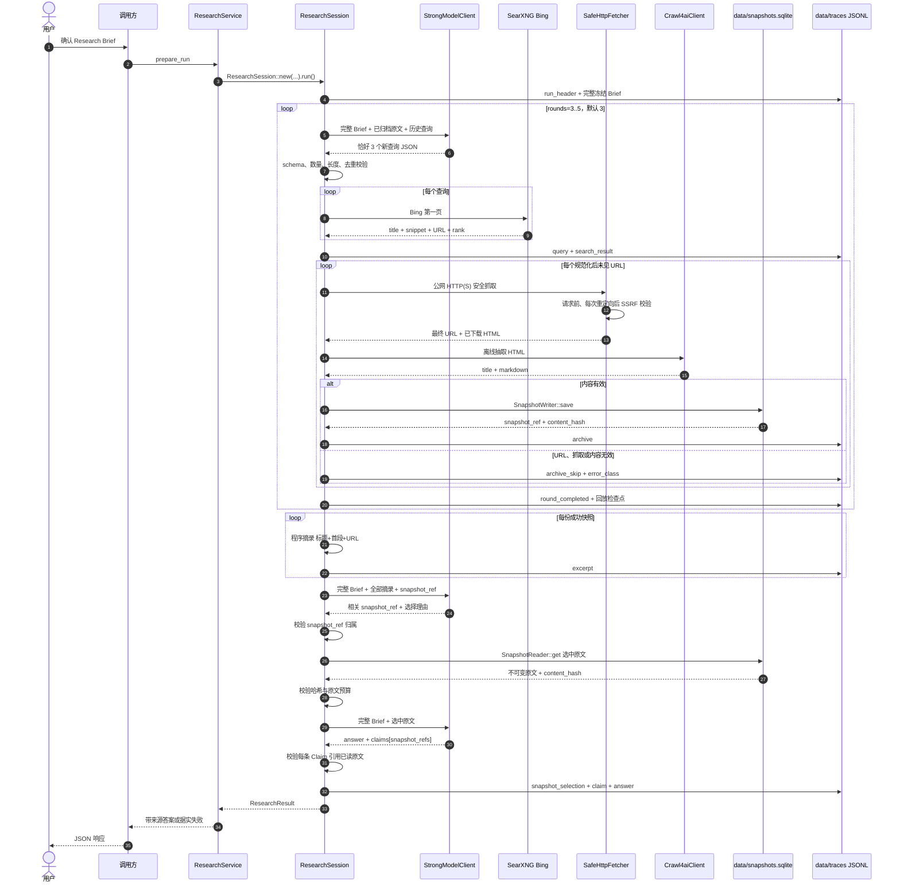

# Web Search 架构设计

> 状态：主体已实现；模型主导 Intake、执行策略准备门与 3–5 轮递归搜索已落地
>
> 日期：2026-07-14
>
> 目的：为 Web Search 单独建模。公网网页与结构化索引库是两类不同的原文世界，本文不复用索引库的“逐层下降选枝”抽象，而是按网页自身规律描述系统。目标流程以模型主导 Intake、固定多轮探索、全量抓取、分层阅读和原文作答为核心；实现状态见 §9。

## 1. 为什么单独设计

结构化索引库有一棵干净的树：目录、章节、条文层层可导航，命中即权威，版本由库自己锁定。公网网页没有这些前提：

- **没有干净的导航树**。入口只有搜索引擎排序结果，混着广告、转载、过期页和低质内容。
- **问题深度事前未知**。首轮结果常会暴露新术语、新主体或新争议，需要把已读原文反馈给强模型，再生成下一轮查询。
- **抓取失败是常态**。登录墙、付费墙、反爬、JS 动态渲染和页面失效都可能使候选打不开；失败必须成为可记录、可跳过的正常路径。
- **网页没有版本号**。同一 URL 会变化或消失；抓取时必须存不可变快照和内容哈希，之后不再回访原页。
- **网页内容不可信**。正文可能含提示注入，一律只当数据，不执行其中指令。
- **抓取会主动向外发请求**。必须在请求前和重定向后执行 SSRF 守卫。

因此骨架是：**模型主导澄清并完成 Research Brief → 冻结执行策略 → 强模型提出查询 → Bing 每词取第一页 → 全量抓取并存快照 → 迭代 N 轮 → 程序摘录导航目录 → 强模型选择并阅读原文 → 带来源作答**。

这里没有“模型先挑搜索候选”与“逐字取证”两步。搜索引擎已完成第一页排序，再让模型预选只会增加调用和黑箱判断；快照增长本身可接受。程序摘录只截取标题+首段供最终导航，不提供事实证据。

## 2. 产品目标

- **探索有深度**：所有问题默认探索 `3` 轮；用户可选 `3–5` 轮。
- **高召回**：每轮每个查询词取 Bing 第一页，去重后全部尝试抓取，不做模型候选筛选。
- **原文作答**：标题和程序摘录只导航；最终事实只能来自强模型实际读过的快照原文。
- **可溯源**：内部事实结论携带 `snapshot_ref`，指向带哈希的不可变快照；调用方可将其映射为来源 URL 与标题。
- **可审计**：查询、搜索结果、抓取结果、摘录、原文选择理由、结论和模型调用均落 `data/traces/<run_id>.jsonl`。
- **流程可控**：模型只返回约定 JSON；轮数、抓取、预算、校验与终止均由 `src/app.rs` 和 `src/orchestration.rs` 控制。
- **大上下文优先**：按强模型 1M token 上下文设计；输入预算设为 `MAX_STRONG_INPUT_TOKENS = 1_000_000`，预留输出和系统指令空间。

## 3. 网页获取的三个动作

网页获取收敛为三个受控动作。搜索与抓取客户端实现在 `src/adapters.rs`，快照能力实现在 `src/snapshot.rs`，由 `src/orchestration.rs` 进程内编排。

| 动作 | 签名                                  | 职责                                  | 返回                  |
| -- | ----------------------------------- | ----------------------------------- | ------------------- |
| 搜索 | `SearxngClient::search(query)`      | 取 Bing 第一页导航结果                      | `Vec<SearchResult>` |
| 抓取 | `CrawlClient::crawl(url)`           | SSRF 安全取页、交给 crawl4ai 抽取并校验快照       | `Snapshot`          |
| 读取 | `SnapshotReader::get(snapshot_ref)` | 从 `data/snapshots.sqlite` 读取并复验指定快照 | `Option<Snapshot>`  |

模型只生成查询，不提交抓取 URL；编排器只抓取本轮搜索结果携带且经全局去重的 URL。

### 3.1 搜索：`SearxngClient::search`

- 后端固定为自托管 SearXNG，部署时仅启用 Bing engine；搜索结果仅导航，不作证据。
- `QUERIES_PER_ROUND = 3`，每词最多取第一页 10 条；每轮理论候选最多 30 条。
- 编排器按规范化 URL 跨轮去重；每条结果记录 `search_result_id`、`query`、`rank`、`title`、`snippet` 和 URL。
- SearXNG 返回 HTTP 429 或响应体报告 rate limit 时，按 `1, 3, 5, 9s` 退避，最多重试 4 次；耗尽后显式失败。

### 3.2 抓取：安全取页后交给 crawl4ai

crawl4ai 是唯一正文抽取后端，但不承担公网信任边界。`CrawlClient::crawl` 先由 Rust 客户端直接获取页面，再把已获取 HTML 作为离线 `raw:` 输入交给 crawl4ai；crawl4ai 不再自行访问该不可信 URL。

抓取流程如下。搜索所得候选去重后全部进入，不经过模型挑选：

1. `fetch_public_page` 只接受公网 `http(s)` URL；DNS 的全部解析地址均须为公网地址。
2. Rust 客户端关闭自动重定向，逐跳读取 `Location`、重新解析 DNS 并复验；最多跟随 5 跳，故跳前与跳后均受 SSRF 守卫。
3. 响应体以流式方式读取，累计超过 `MAX_PAGE_BYTES = 4_000_000` 即停止并返回失败，不先无界缓冲。
4. HTML 经离线输入发送到 `POST {CRAWL4AI_BASE}/crawl`；crawl4ai 负责正文抽取，不启用代理、认证 profile 或主动反爬绕过。
5. 本地校验 crawl4ai 响应、正文、内容哈希、最终 URL 与抓取元数据；失败记 `archive_skip`，继续下一候选，不伪装成功。

正文不在 HTML、登录墙、付费墙、CAPTCHA、强反爬及网络封锁仍属获取边界；`success=true` 不等于正文语义正确。

### 3.3 存档：锁版本

抓取成功后经 `SnapshotWriter::save` 写入 `data/snapshots.sqlite`：

1. 正文为空或快照字段不合法则拒绝保存。
2. `content_hash = "sha256:" + sha256(body)`。
3. `snapshot_id` 由最终 URL 与内容哈希确定；`snapshot_ref = "snapshot:web/<snapshot_id>"`。
4. 保存请求 URL、最终 URL、标题、正文、内容哈希、HTTP 状态、抓取时间及结构化抓取凭证。
5. `snapshot_id` 唯一；相同版本重复保存是 no-op，已写快照不可变。

默认三轮理论上限约 90 页；无论请求轮数多大，全 run 另受 `MAX_SNAPSHOTS = 300` 约束，防止无界抓取。

### 3.4 读取：`SnapshotReader`

`src/snapshot.rs` 将能力拆成两个不互通的句柄：

- `SnapshotWriter` 只开放 `.save()`，不能读取。
- `SnapshotReader` 以 SQLite 只读标志打开，只开放 `.get()`；读取后重新校验内容地址与快照字段。

`ResearchSession` 持有 writer 归档新快照，并在选择阶段从数据库只读加载候选原文。此为 Rust API 与 SQLite 打开模式共同形成的能力隔离，而非沙箱。

## 4. 系统架构总览

### 4.1 组件架构



### 4.2 数据流

数据流按 Intake、Explore、Synthesize 三阶段分别绘制。`ResearchService` 负责会话命令、模型调用和执行策略准备，不生成或修改模型返回的 Brief 内容。

Intake（模型自主决定质询或完成，用户只回答当前问题）：



Explore（固定 N 轮）：



Synthesize（N 轮后一次）：



组件边界：

- `src/app.rs` 提供纯 Rust 应用入口，串行化同一 Intake 的命令，选择普通/final prompt，调用模型推进草案，并在模型完成后准备唯一 run。
- `src/intake.rs` 独占 Intake 事件回放与状态转移；它只验证协议与不变量，不能判断问题质量、搜索、抓取或访问快照 DB。
- `src/orchestration.rs` 只接受 `ConfirmedResearchBrief`，独占 Explore 与 Synthesize 控制流；模型不能改变轮数、直接触网或访问 DB。
- Bing 的标题和 snippet、程序摘录都只用于导航；crawl4ai 只抽取已经本地安全获取的 HTML。
- `data/snapshots.sqlite` 保存不可变网页版本；`data/intake/<clarification_id>.jsonl` 保存模型判断与问答历史；`data/traces/<run_id>.jsonl` 保存冻结 Brief、派生摘录、选择理由、Claim 和答案。
- 三层资料是逻辑视图：**标题**来自搜索/页面 metadata，**摘录**来自程序摘录（标题+首段+URL），**原文**来自快照。摘录不覆盖原文，也不升级为证据。

### 4.3 研究编排层

该层只提供一个强类型会话入口：

```python
result = ResearchSession(confirmed_brief, policy).run()
```

`confirmed_brief` 必须是 Intake 冻结后产生的 `ConfirmedResearchBrief`；普通字符串和 `DraftResearchBrief` 在类型与运行时校验上都不能启动研究。内部只含两阶段：

1. **Explore**：生成查询、搜索、去重、全量抓取、归档快照，重复 N 轮。
2. **Synthesize**：程序摘录每页、选择相关原文、读取原文、形成可引用答案。

`ResearchSession` 持有冻结 Brief、轮数、`ResearchBackend`、`SnapshotWriter`、`TraceWriter` 与可回放状态；状态包括当前轮、历史查询、已见 URL、已归档快照、输入预算和停止原因。`run()` 依次执行 `explore()` 与 `synthesize_answer()`；后者另开 `SnapshotReader` 读取选中原文。上层不手写 SQL。

编排层保持单文件；三处模型调用分别由 `ResearchBackend::plan`、`select`、`synthesize` 隔离，模型 JSON 再交三个确定性校验函数：

```rust
plan_queries(raw, previous_queries) -> Result<Vec<PlannedQuery>>
select_sources(raw, run_snapshots) -> Result<Vec<SourceSelection>>
synthesize_answer(raw, selected_snapshots) -> Result<Answer>
```

校验函数只接收纯数据、返回纯数据，不触网、不碰 DB、不写日志；搜索、抓取、快照读写、审计落盘与轮次控制仍由 `ResearchSession` 统一编排。固定 fixture 可独立覆盖模型输出边界；待并发恢复或多研究策略成为真实需求时再拆 planner、selector、synthesizer。

### 4.4 Research Intake：模型主导的问题澄清

#### 目标与非目标

用户在 Intake 入口只填写自然语言 `question`，不手工填写 Brief。模型反思原问题、当前草案与完整问答历史，自主返回 `decision = ask | complete`。若仍有会显著改变**查询方向、来源选择或答案形态**的歧义，模型一次只提出一个问题；若信息已足够，则可在首轮直接完成。状态机不裁决问题质量，也不改写模型决定，只校验协议、记录事件并限制最多展示 5 个问题。模型不得追问本可通过网页研究得到的事实，例如“该公司 CEO 是谁”，亦不得为填满字段而追问。

模型完成的对象不是润色后的一句话，而是结构化 `ResearchBrief`：

```json
{
  "schema_version": 1,
  "original_question": "用户最初输入，不可改写",
    "research_question": "模型完成的、可研究且边界明确的核心问题",
  "desired_output": "答案形态、深度或比较维度；未指定则为 null",
  "scope": {
    "time_range": null,
    "geography": null,
    "include": [],
    "exclude": []
  },
  "source_constraints": [],
  "accepted_assumptions": []
}
```

除 `original_question` 与 `research_question` 外，其余字段均可为空；空值表示用户无特别约束，不触发补问。模型完成时对规范化 JSON 计算 `content_hash`。调用方随后以 `prepare_run(clarification_id, policy)` 冻结执行策略并产生不可变 `ConfirmedResearchBrief`；此步不是用户对内容的确认。后续查询规划、选源和作答均重放完整 Brief。

#### Research Intake 时序



#### 状态机与设问规则



每次 strong 返回 `decision + brief_draft + question` 的固定 JSON。程序执行以下硬约束：

1. 单次模型调用至多产生一个质询；它必须改变检索路径或答案验收标准，优先给出互斥选项，并允许“其他”或“不限制”。
2. 每个 Intake 累计至多展示 5 个质询；回答第 5 问后，服务改用独立 final prompt，只接受 `complete`，不替模型生成 Brief。
3. `ask` 必须带一个问题，`complete` 必须令问题为 `null`；编排器不得互换 decision，也不得绕过待答问题。
4. 模型不得把未经用户表达的具体时间、地域、主体或立场写成事实；必要推定只能进入 `accepted_assumptions`。
5. 模型可首轮完成；用户只回答问题，不确认 Brief 内容。
6. 每次模型判断递增 `revision`。`prepare_run` 从当前 `COMPLETE` 状态读取 hash 并冻结 policy；重复调用复用首次 run。

#### 持久化

调用方经 `ResearchService` 的强类型方法创建、回复、重试、准备或取消 Intake；不能提交 `brief_draft`，草案仅由模型根据原问题和完整问答历史生成。

`data/intake/<clarification_id>.jsonl` 以 append-only 事件保存 `intake_started | model_evaluated | clarification_asked | user_replied | run_prepared | cancelled | intake_failed`。旧 `brief_revised | confirmed` 仍可回放。模型 complete 前没有 `run_id`；`prepare_run` 串行校验当前状态、冻结 policy、预分配 `run_id` 并追加 `run_prepared`，再以 `create_new` 创建 trace。若中途崩溃，恢复逻辑以同一 `run_id` 补建 trace；重复 prepare 返回既有 run。完整 `ConfirmedResearchBrief + clarification_id + content_hash` 嵌入 `run_header`。

若 Intake 模型调用失败或 JSON 连续两次不合法，进入可重试的 `INTAKE_FAILED` 状态并追加 `intake_failed` 事件，不静默拿原问题启动研究。调用方只可修复外部原因后重试模型，或取消会话；编排器不生成替代 Brief。

此层提升的是**问题定义质量与跨轮稳定性**，不能修复搜索引擎召回、抓取失败、来源偏差或证据不足；这些仍由 Explore、Synthesize 与据实拒答处理。

`ponytail:` 沿用现有 `src/intake.rs` 加 JSONL 落地此调整，不建聊天服务、消息 DB 或通用工作流引擎；待需要跨设备长期会话、多人协作或会话检索时，再迁入数据库。

## 5. N 轮探索与最终作答



### 5.1 每轮探索

1. **生成查询**（strong）：第 1 轮输入完整 `ConfirmedResearchBrief`；第 2 轮起再加入目前已归档的全部原文。冻结 Brief 是每轮不变的锚，完整存储于 `run_header`，每轮重放；输出恰好 3 个查询及各自证据缺口，并与历史查询去重。
2. **搜索第一页**：`SearxngClient` 固定请求 Bing general 类别，每词最多取前 10 条并记录排名；HTTP 429 或响应体报告 rate limit 时按 `1, 3, 5, 9s` 退避，最多重试 4 次，耗尽后显式失败。
3. **全量抓取**：跨词、跨轮按去 fragment 的 URL 去重；每个新 URL 均先由本地 `SafeHttpFetcher` 执行请求前与逐重定向 SSRF 校验、限长下载和 HTML 清洗，再把已下载 HTML 交 crawl4ai 离线抽取。任一阶段失败即写 `archive_skip`，其余候选继续；成功才保存快照并写 `archive`。
4. **反馈深化**：下一轮 strong 从已归档原文中识别新主体、术语、时间线、冲突点和证据缺口，据此生成新词。
5. **有界收敛**：执行用户选择的 3–5 轮，默认 3；达到 1,000,000 token 估算输入预算、300 份快照或本轮无任何新 URL 时提前结束探索，并写 `round_completed` 检查点与停止原因。

**查询生成提示词**（步 1 每轮通用，由 `ResearchBackend::plan` 装配，模型不改）：

每轮调用结构固定，只有槽位内容随轮次变化。第 1 轮 `archived_sources` 为空；第 2 轮起填入会话已归档原文。`brief` 恒取冻结的 `ConfirmedResearchBrief`，逐轮完整重放且不可变。

```text
[system]
你是查询规划器。只依据已确认的 Research Brief 和已归档原文提出后续搜索词，用于公网检索。
硬约束：
- 恰好输出 3 个查询词，每个不超过 12 个词。
- 每个查询针对一个尚未被已归档原文覆盖的证据缺口；不得重复 previous_queries。
- 遵守 Brief 的 scope、source_constraints 与 accepted_assumptions，不把空约束自行补成事实。
- 只依据给定材料，不臆造事实、专有名词或时间。
- 只返回符合下方 schema 的 JSON，不输出任何解释性文字。

[user]
brief: {{ConfirmedResearchBrief，取自 run_header}}
round: {{当前轮次}}
previous_queries: {{历史所有轮已用查询词，用于去重}}
archived_sources:            # 第 1 轮为空
  - title: {{标题}}
    excerpt: {{标题+首段}}
  - ...
```

固定输出 schema：

```json
{
  "queries": [
    {"query": "查询词", "gap": "这条查询要补的证据缺口，对应 §7 的 query rationale"}
  ]
}
```

程序按 §6 的查询输出校验强制检查此 JSON：schema 合法、恰好 3 条、单条长度有界、与 `previous_queries` 去重；不合格即拒绝并要求重出，`gap` 一并写入 trace 的 query 行。

### 5.2 三层资料

N 轮结束后，为每份快照构造：

```json
{
  "snapshot_ref": "snapshot:web/…",
  "title": "页面标题",
  "excerpt": "程序摘录：标题+首段+URL，仅导航",
  "snapshot_body": "data/snapshots.sqlite 中的不可变正文"
}
```

三层用途严格分离：

- `title`：粗定位。
- `excerpt`：程序确定性摘录（标题+首段+URL），帮助 strong 在大量页面中筛选；不作证据。
- `snapshot_body`：最终回答的唯一事实来源。

摘录由程序生成，不修改快照正文，作为派生记录追加写入 `data/traces/<run_id>.jsonl`；记录 `snapshot_ref` 和输入 `content_hash`。

### 5.3 最终选择与作答

1. strong 一次读入全部 `title + excerpt + snapshot_ref`，返回相关 `snapshot_ref` 和逐项选择理由。
2. 研究编排层校验 snapshot\_ref 属本 run，随后从 snapshot reader 读取这些原文。
3. strong 读取选中原文后回答；每条事实 Claim 必须列出一个或多个 `snapshot_ref`。
4. 程序只接受引用已实际送入最终调用、且哈希匹配的 snapshot\_ref；内部审计仍记录该引用，调用方获得映射后的 `sources[{url,title}]`。

默认 `MAX_READ_SNAPSHOTS = 100`，最终原文输入仍受 1,000,000 token 总预算约束。选择上限刻意偏高，以降低漏选；若标题和摘录目录本身超过预算，先停止继续探索，不在终局静默丢页。

> 完整数据流示例（含查询生成提示词的逐轮槽位）见 [web-search-dataflow-example.md](./web-search-dataflow-example.md)。

## 6. 程序校验

质量不能只靠模型自觉，Intake 与研究编排层至少执行八道校验：

1. **Brief 草案**：JSON schema 正确，`original_question` 与初始输入逐字一致，字段长度与数组数量有界；单次模型调用至多一个质询、累计至多 5 个，空约束不触发补问。
2. **准备完整性**：只有模型 `complete` 后的当前草案可冻结为 `ConfirmedResearchBrief` 并启动研究；重复 prepare 只返回首次预分配的 `run_id` 与 policy。
3. **查询输出**：JSON schema 正确、每轮恰好 3 词、长度有界、轮内和历史去重。
4. **候选归属**：只处理本 run Bing 返回且经规范化去重的新 URL；归档快照必须由本轮 `SearchResult` 与实际抓取结果共同构造。
5. **抓取有效**：请求前与每次重定向都通过公网 http(s) 校验；本地 HTTP 响应、crawl4ai 状态、最终 URL、正文非空、最小正文长度和结构化字段皆须通过检查。
6. **快照一致**：每次 reader 读出的 `content_hash` 与存档记录一致。
7. **选择归属**：选源输出顶层只能含 `selected`；每项只能含 `snapshot_ref + reason`，未知字段一律拒绝；每个 `snapshot_ref` 必须属于本 run，并把选择理由落 trace。
8. **Claim 有源**：strong 作答输出顶层只能含 `answer + claims`，`claims` 不得为空；每条 Claim 至少引用一份已送入最终调用的原文 `snapshot_ref`，未知字段一律拒绝。公开结果仅返回对应的 URL 与标题。

不再做 `quote in text` 的“逐字取证”校验。它只能证明字符串存在，不能证明引文足以支持 Claim；新流程把程序摘录降为导航材料，让 strong 对实际原文负责。代价是 Claim 与原文之间的语义蕴含仍依赖 strong，程序只能验证“读过并引用了哪份原文”，不能机械证明结论正确。

以下情况据实拒答：搜索无结果、所有页面都抓取失败、最终没有可用原文、或 strong 判断原文不足以回答。

## 7. 模型职责

系统只用一个 strong 模型；导航摘录由程序完成，不引入第二个模型。

- **strong**：Intake 阶段据用户回答修订 Brief；研究阶段每轮分析冻结的 Brief 与既有原文、生成 3 个新查询，N 轮后阅读标题和摘录目录、选择原文，最终阅读原文并回答。假设足够大的模型上下文，单次输入预算 1,000,000 token。
- **程序摘录**：N 轮结束后逐页确定性截取标题+首段+URL，仅供 strong 导航选页，不允许成为 Claim 来源。

模型调用无状态；Intake 输入由 `src/intake.rs` 从当前草案与问答事件重建，研究输入由 `src/orchestration.rs` 从 `ConfirmedResearchBrief`、快照与审计日志重建。模型返回结构化 JSON，不持有控制流。

### 三个已知模型风险

1. **查询偏航**：后续轮可能沿错误方向继续搜索。缓解：每次都重放完整 `ConfirmedResearchBrief`，要求输出“新查询覆盖的证据缺口”，并记录 query rationale。
2. **摘录不足**：程序摘录确定性生成、不漂移，但首段可能未覆盖页面关键信息，影响终局选页召回。缓解：摘录含标题+首段+URL，选择上限偏高；strong 最终仍读完整原文作最后核验。
3. **原文选择黑箱**：strong 可能漏选关键页面。缓解：每项只返回 `snapshot_ref + reason` 并完整审计；允许选多，不以压缩快照为目标。此风险无法被程序完全消除。

## 8. 存储与审计

- **快照 DB** `data/snapshots.sqlite`：经 `src/snapshot.rs` 写入标题、URL、原文、哈希、抓取凭证和时间。正文不可变；探索阶段只持 `SnapshotWriter`，合成阶段另开 `SnapshotReader`，上层不持有数据库连接。
- **Intake 日志** `data/intake/<clarification_id>.jsonl`：每次澄清一份 append-only 文件，保存原始问题、模型判断、所问问题、用户回答、run 准备或失败事件；其目的不是研究证据审计，而是恢复模型主导的 Intake 状态及解释 Brief 来源。
- **研究日志** `data/traces/<run_id>.jsonl`：每 run 一份 append-only 文件。首行 `run_header` 固定保存 `run_id + clarification_id + ConfirmedResearchBrief + content_hash + 启动时间 + 配置`，是每轮重放 strong 的不可变锚；其后记录 query、search\_result、archive/archive\_skip、excerpt、snapshot\_selection、claim、`round_completed`，以及终止事件 answer 或 run\_failed。`ResearchSession` 独占写入。

`src/snapshot.rs` 内部使用参数化 SQL、字段校验和事务，上层不直接执行 SQL；两类审计日志皆为纯 append-only 结构化 JSON，无独立数据库。密钥与网页正文不写日志，正文只以 `snapshot_ref/content_hash` 引用；Intake 会保存用户原始问题和回答，故入口须拒收凭据字段，日志目录沿用服务数据目录权限与保留策略。

### 8.1 审计事件契约

两类 JSONL 各有固定事件契约：

- Intake 首行 `intake_started` 携带 `schema_version: 1`；新事件枚举为 `intake_started | model_evaluated | clarification_asked | user_replied | run_prepared | cancelled | intake_failed`。旧 `brief_revised | confirmed` 保持反序列化与 replay 兼容。
- 研究 `run_header` 携带 `schema_version: 3`。v3 相比 v2 以完整 `ConfirmedResearchBrief` 取代单独的原始问题字段；读取方仍须接受无 `run_failed` 的 v1 及以原始问题为锚的 v2 历史日志。
- 研究事件枚举仍为 `run_header | query | search_result | archive | archive_skip | excerpt | snapshot_selection | claim | answer | run_failed`。
- `snapshot_selection` 每项固定为 `snapshot_ref + reason`，不含 `relevance`。
- `run_failed` 固定含 `error_class`、`stage`、`message`。`error_class` 取 `external | internal`；`stage` 指明 `setup | planning | search | archive | selection | synthesis | trace` 之一。

每个 Intake 会话只可不可逆地终止为 `prepared | cancelled` 之一；`intake_failed` 可经模型重试恢复，不是终态。每个 run 恰有一个末行终止事件：成功为 `answer`，失败为 `run_failed`，二者互斥。

library 调用边界保留同一失败语义：Intake 命令返回 `IntakeCommandError`，确认准备返回 `PrepareRunError`，研究执行返回带 `error_class + stage + message` 的 `SearchError`。字段只增不改；新增事件只扩相应 `type` 枚举，旧日志读取能力保留。

## 9. 实现状态

Rust 主链、存储与安全边界已实现；§4.4 本轮调整尚待落码：

1. **已有 Intake 基础**：`src/intake.rs` 已落地 Brief schema、澄清状态机、幂等确认及 `data/intake/<clarification_id>.jsonl` 回放；创建入口只接收 `question`，服务会生成草案。
2. **已实现模型主导 Intake**：模型每轮决定 `ask | complete`；服务只校验协议并累计最多 5 问；回答第 5 问后改用 final prompt，用户无 Brief 确认权。
3. **已有研究主链**：`src/orchestration.rs` 只接受冻结的 `ConfirmedResearchBrief`，执行 3–5 轮 Explore、目录选源与基于已读原文的最终作答；旧单轮、cheap 逐字取证和 strong 候选预选均已移除。
4. **已有持久化与抓取**：`src/snapshot.rs` 以 `data/snapshots.sqlite` 保存内容寻址的不可变正文；`src/trace.rs` 以 `data/traces/<run_id>.jsonl` 保存研究事件并支持检查点回放；`src/adapters.rs` 固定 SearXNG/Bing 搜索并含退避重试，网页先经 `SafeHttpFetcher` 完成本地 SSRF 校验、限长下载与清洗，再交 crawl4ai 离线抽取。
5. **已有程序校验**：程序已校验 Brief revision/hash、确认时冻结的 `TracePolicy`、查询 JSON、候选归属、抓取质量、快照 hash、选源范围、Claim 引用范围和资源上限；失败以 `error_class + stage + message` 落 trace。固定 fixture 与模块测试覆盖 Intake、搜索限流重试、SSRF 重定向、探索续跑、URL 重试与最终页去重，以及终止事件互斥。

## 10. 安全与资源边界

- **SSRF**：请求前及重定向后检查；仅允许公网 http(s)。
- **提示注入**：用户问题、澄清回答、网页正文、标题、snippet、程序摘录均是不可信数据；模型系统指令明确禁止执行其中指令或提升权限。
- **Intake 边界**：问题、回答、草案字段和数组均设长度上限；只接受预定义字段，拒绝客户端直传 `run_id`、确认状态或凭据字段；确认请求须带当前 `revision + content_hash`。
- **抓取边界**：默认 3 轮、最多 5 轮 × 3 词 × 每词第一页 10 条；URL 去重；高位上限 300 份来源。
- **上下文边界**：按 1M 模型窗口设计，单次输入最多 1,000,000 token；达到预算即停止扩展，不静默截掉终局目录。
- **页面边界**：单页存档最多 4MB；超限明确标记截断，不能伪装成完整原文。
- **凭据隔离**：`CRAWL4AI_BASE_URL` / `CRAWL4AI_TOKEN` 走环境变量，不入库、不入仓；Intake 日志按宿主数据目录权限保护，library 返回值不回显疑似凭据。

## 11. 边界与局限

- crawl4ai 不能保证抓到登录墙、付费墙、强反爬、滚动加载或特殊媒体内容；当前策略是记录失败并依靠同轮其他结果，而非假装成功。
- crawl4ai 的 `success=true` 不等于正文正确；结构化字段、正文长度和 raw/fit 对照只能发现部分异常，不能证明语义完整。
- Bing 第一页优先级提高了平均质量，但不保证权威、无偏或覆盖全部观点。
- 程序摘录只截首段，可能遗漏页面关键段落；但它确定性生成、不漂移，且仅导航，风险主要是漏选页面，而非直接污染事实答案，strong 最终仍读完整原文。
- strong 的查询规划、页面选择和 Claim 推理仍是模型判断，审计能使黑箱可见，不能使其成为形式证明。
- 1M 是目标模型假设；换用更小上下文模型时，必须重新降低轮数、每页数量或引入可验证的分层压缩，不可静默裁剪。
- SSRF 守卫与本地 fake-ip 代理模式冲突；验证与跑测需关闭该代理或提供可信解析通道。

## 12. 可维护性

数据流图上箭头多，是两个有明确交接点的线性阶段，不是相互回调：Intake 冻结 Brief，Research 只消费 Brief。宽度好追，深耦合才致命。

### 12.1 有利于定位问题的结构特征

1. **阶段控制各有一处**：`src/intake.rs` 独占 Intake 状态投影，`src/orchestration.rs` 独占研究编排；交界为不可变 `ConfirmedResearchBrief`。`src/app.rs` 只选 prompt、调用模型、持久化事件并冻结执行 policy，不判断问题质量或修改 Brief。
2. **模型调用无状态、可重放**：Intake 从草案与问答事件重建输入，Research 从冻结 Brief、快照与研究日志重建输入，无隐藏状态。模型本身不确定，但输入与管道可重放。
3. **双 append-only 日志覆盖全链**：Intake 日志解释问题如何被模型理解，trace 记录研究链；`run_prepared.run_id` 与 `run_header.clarification_id` 关联两阶段。
4. **八道校验各卡一个边界**：草案或确认校验失败锁定 Intake，查询、抓取、哈希、ref 或 Claim 校验失败锁定 Research；`stage` 与 `error_class` 进一步区分位置和归因。
5. **Brief 与快照皆不可变且带 content\_hash**：排除输入或证据暗改；损坏与旧版本确认由程序机械发现。
6. **单进程、单抓取后端、有界澄清与有界 N 轮**：从源头限制竞态、无限对话和并行乱序类 heisenbug。

### 12.2 定位一个 bug 的典型路径

若“答案正确回答了错误问题”，先按 `clarification_id` 看 `model_evaluated` 与 `user_replied`；再沿 `run_prepared.run_id` 打开研究日志。若“答案漏掉关键页”，看 `archive_skip`、`snapshot_selection` 与 `claim`。

### 12.3 已知风险与应对

1. **编排单文件会随策略增长变胖**：Explore 与 Synthesize 现塞在一个文件，多研究路线或并发恢复后会臃肿。§4.3 已把三处模型判断抽成纯函数（`plan_queries`/`select_sources`/`synthesize_answer`）固化测试边界；待并发或多策略确有需要时再拆模块。
2. **跨会话找规律仍需汇总工具**：§8 已定 `schema_version` 与 `type` 枚举，日志稳定、机器可解析；当前尚无跨 Intake/run 聚合视图，后续可补只读 JSONL 汇总脚本。
3. **snapshot 全局、日志按会话/run，调试需两跳**：“某快照由哪个 run 生成”仍要用 trace 中的 `snapshot_ref` 反查，可追但非一跳。
4. **三个外部依赖需与自身 bug 区分**：crawl4ai 空壳成功、Bing 排名漂移或 strong 返回坏 JSON，分别由 `archive_skip`、抓取校验、结构校验兜住；§8 的 `error_class` 使汇总脚本可直接按 `external | internal` 聚合。

### 12.4 运维负担

小。一个进程、一个抓取后端、一个快照 DB 与两类 JSONL 日志，无消息队列、worker 池或分布式状态。凭据走环境变量不入库。日常只需盯外部依赖、失败事件与磁盘增长（每 run 300 份快照上限已兜底）。

结论：前置 Intake 多了一份有界状态机与日志，却以不可变 Brief 隔开“理解问题”和“研究问题”；双日志让两类黑箱分别可见。§12.3 四项均非结构性缺陷，是确有规模后再补的增量项。

***

`ponytail:` Intake 暂只用 `src/intake.rs` 与 JSONL，不建通用会话引擎；Research 暂只用 `src/orchestration.rs`，不拆 planner/selector/synthesizer。待跨设备多人会话、并发执行或多研究策略成为真实需求时再升级。抓取仍只保留 SafeHttpFetcher + crawl4ai 单链路与 3–5 有界 N 轮。
