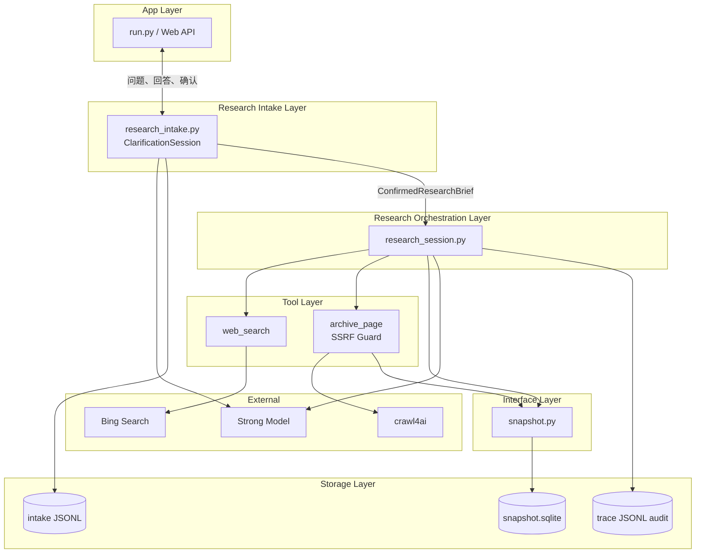
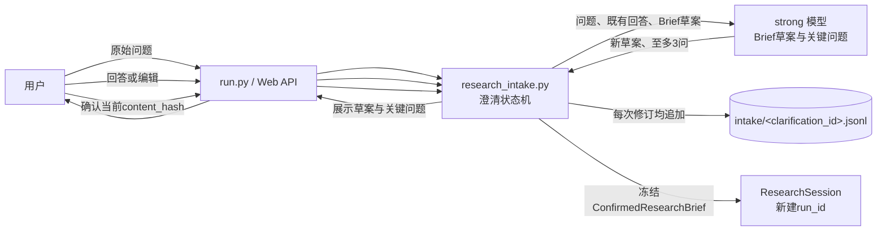
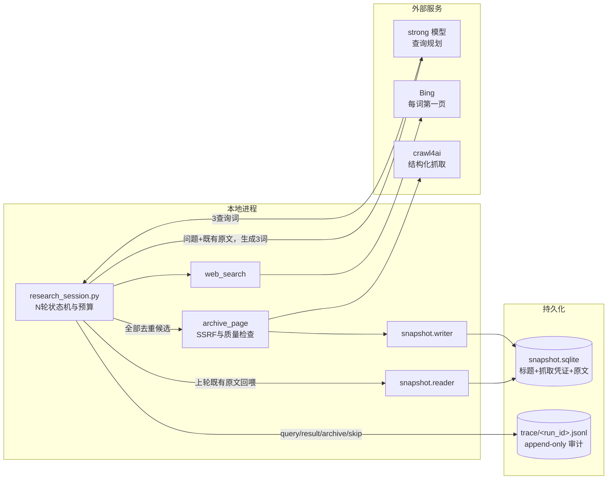
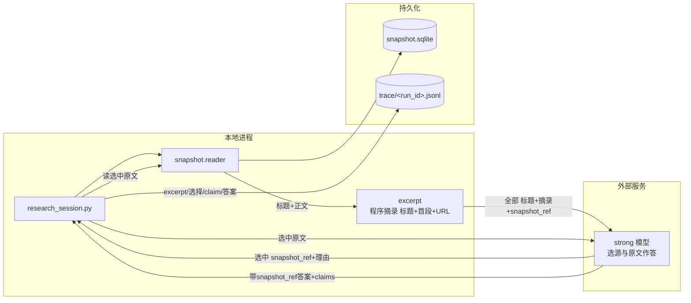
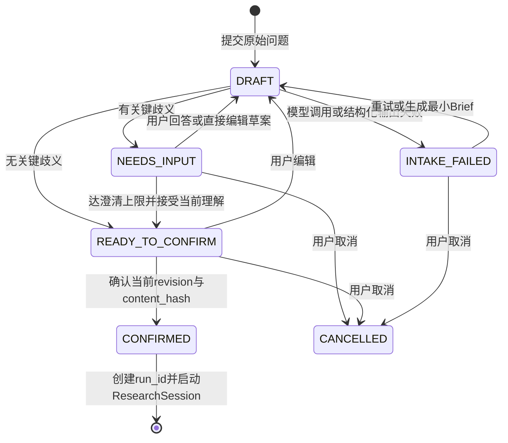
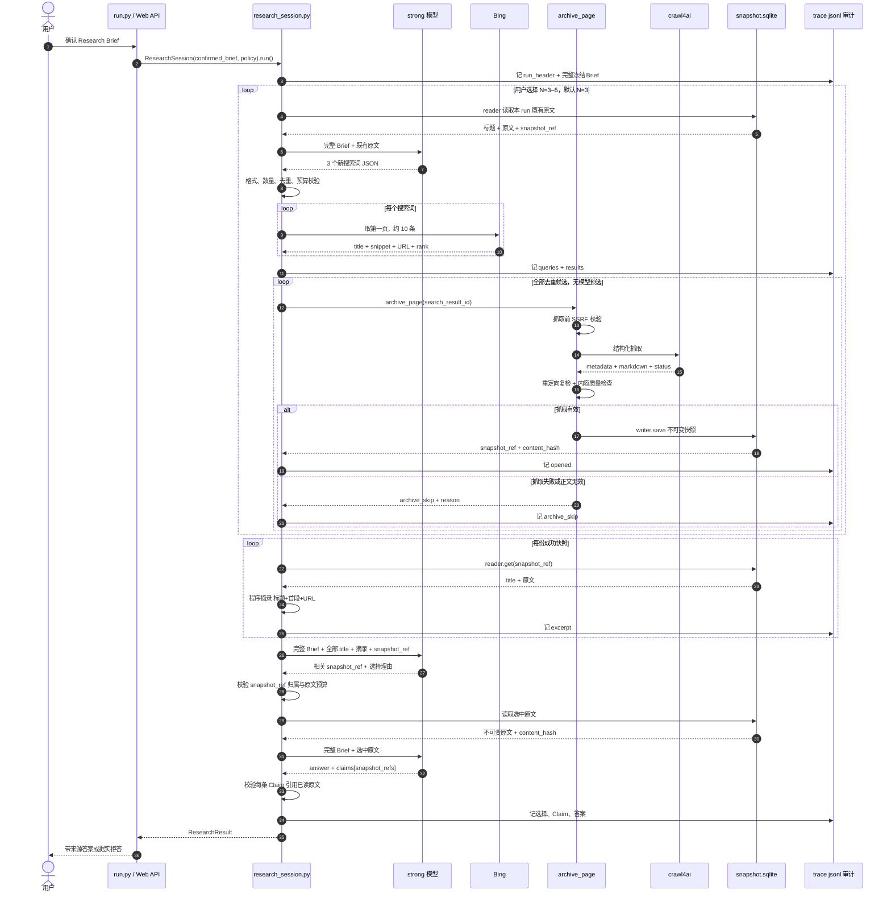

# Web Search 架构设计

> 状态：Target Design（当前 PoC 尚未完全实现）
>
> 日期：2026-07-11
>
> 目的：为 Web Search 单独建模。公网网页与结构化索引库是两类不同的原文世界，本文不复用索引库的“逐层下降选枝”抽象，而是按网页自身规律描述系统。目标流程以固定多轮探索、全量抓取、分层阅读和原文作答为核心；当前实现差距见 §9。

## 1. 为什么单独设计

结构化索引库有一棵干净的树：目录、章节、条文层层可导航，命中即权威，版本由库自己锁定。公网网页没有这些前提：

- **没有干净的导航树**。入口只有搜索引擎排序结果，混着广告、转载、过期页和低质内容。
- **问题深度事前未知**。首轮结果常会暴露新术语、新主体或新争议，需要把已读原文反馈给强模型，再生成下一轮查询。
- **抓取失败是常态**。登录墙、付费墙、反爬、JS 动态渲染和页面失效都可能使候选打不开；失败必须成为可记录、可跳过的正常路径。
- **网页没有版本号**。同一 URL 会变化或消失；抓取时必须存不可变快照和内容哈希，之后不再回访原页。
- **网页内容不可信**。正文可能含提示注入，一律只当数据，不执行其中指令。
- **抓取会主动向外发请求**。必须在请求前和重定向后执行 SSRF 守卫。

因此骨架是：**澄清并确认 Research Brief → 强模型提出查询 → Bing 每词取第一页 → 全量抓取并存快照 → 迭代 N 轮 → 程序摘录导航目录 → 强模型选择并阅读原文 → 带来源作答**。

这里没有“模型先挑搜索候选”与“逐字取证”两步。搜索引擎已完成第一页排序，再让模型预选只会增加调用和黑箱判断；快照增长本身可接受。程序摘录只截取标题+首段供最终导航，不提供事实证据。

## 2. 产品目标

- **探索有深度**：所有问题默认探索 `N > 1` 轮；用户可选 `3–5` 轮，默认 `3` 轮。
- **高召回**：每轮每个查询词取 Bing 第一页，去重后全部尝试抓取，不做模型候选筛选。
- **原文作答**：标题和程序摘录只导航；最终事实只能来自强模型实际读过的快照原文。
- **可溯源**：内部事实结论携带 `snapshot_ref`，指向带哈希的不可变快照；WebUI/API 对外将其映射为来源 URL 与标题，不暴露内部引用。
- **可审计**：查询、搜索结果、抓取结果、摘录、原文选择理由、结论和模型调用均落 trace/\<run\_id>.jsonl。
- **流程可控**：模型只返回约定 JSON；`run.py` 仅作薄入口，轮数、抓取、预算、校验与终止均由研究编排层控制。
- **大上下文优先**：按强模型 1M token 上下文设计；输入预算设为 `MAX_STRONG_INPUT_TOKENS = 1_000_000`，预留输出和系统指令空间。

## 3. 网页获取的三个动作

网页获取收敛为三个受控动作，实现在 `poc/retrieval/retrieval_server.py`。它们以 FastMCP 声明，也可由研究编排层进程内直调；PoC 走后者。

| 动作    | 签名                               | 职责                                | 返回                                                                                |
| ----- | -------------------------------- | --------------------------------- | --------------------------------------------------------------------------------- |
| 搜索    | `web_search(query, k=10)`        | 取 Bing 第一页导航结果                    | `[{search_result_id, query, rank, title, url, snippet}]`                          |
| 抓取+存档 | `archive_page(search_result_id)` | SSRF 校验、crawl4ai 抓取、结构检查、锁版本      | `{snapshot_ref, page_url, title, content_hash, char_len, fetched_at, crawl_meta}` |
| 读取    | `reader.get(snapshot_ref)`       | 从 `snapshot.sqlite` 读取指定快照原文及抓取字段 | `{snapshot_ref, page_url, title, content_hash, crawl_meta, text}`                 |

`archive_page` 只接受当前 run 中 `web_search` 登记过的 `search_result_id`。模型不能提交任意 URL。

### 3.1 搜索：`web_search`

- 后端固定为自托管 SearXNG，且仅启用 Bing engine；SearXNG 抓取 Bing 搜索页而非调用官方 Bing Search API。搜索结果仅导航，不作证据。
- `MAX_QUERIES_PER_ROUND = 3`，每词 `RESULTS_PER_QUERY = 10`，即第一页规模。
- 每轮理论候选最多 30 条；按规范化 URL 去重。三轮理论上限约 90 条，重复 URL 通常会使实际数量更少。
- 每条结果记录 `query`、页内 `rank`、`title`、`snippet` 和 URL，便于回放 Bing 当时如何排序。
- `search_result_id = sha1(query|url)[:12]`，登记进 run 内候选表。
- 429 / ratelimit 按 `1, 3, 5, 9s` 退避，最多 4 次。

### 3.2 抓取：crawl4ai

crawl4ai 是唯一抓取后端，但不是可信边界。职责边界一句话：crawl4ai 只把 DOM 变成结构化数据，`archive_page` 负责准入、判真伪、认边界和存档。

**crawl4ai 能做（DOM 可达即可取）**：JS 渲染（Playwright，Chromium/Firefox/WebKit）、无限滚动 `scan_full_page`、懒加载、iframe 内容、clean/fit markdown 去噪，以及 `status_code`、`final_url`、`metadata`、links、media 等结构化字段。

**crawl4ai 边界外（重试无益，只能记失败）**：正文不在 DOM（如正文在 OSS 的 `.docx/.ofd`，仅拿到 SPA 壳）、交互式登录墙、付费墙、CAPTCHA、强反爬（如 Cloudflare challenge）、被网络层封锁。且 `success=true` 不等于正文语义正确。

**默认不主动对抗反爬**：crawl4ai 虽有 session/proxy/stealth 可硬闯登录与反爬，但这类内容本就在边界外，硬闯与“据实拒答、不伪装成功”的立场冲突。默认只开 JS 渲染和 `scan_full_page`（设滚动次数上限防卡死），保留 `raw_markdown` 与 `fit_markdown` 两份；不启用 stealth、代理或认证 profile 去绕过登录与反爬。

抓取流程如下。搜索所得候选去重后全部进入 `archive_page`，不经过模型挑选：

1. 由 `search_result_id` 取 URL；未知 id 拒绝。
2. 抓取前 `_is_public_http` 校验 scheme、DNS 与所有解析地址，拦截内网、环回、link-local、保留和组播地址。
3. `archive_page` 装配抓取 config（默认 JS 渲染 + `scan_full_page` 上限，不对抗反爬），`POST {CRAWL4AI_BASE}/crawl`，由 crawl4ai 完成请求、JS 渲染和正文抽取。
4. 校验 `results[0].success`、正文非空及最低质量信号；命中登录/付费/反爬/正文不在 DOM 等边界情形或校验不过，记 `archive_skip` 并继续下一条，不重试、不伪装成功。
5. 对最终 URL 再执行 `_is_public_http`，防止重定向越界。
6. 接收 crawl4ai 的结构化字段，而非只取一段 markdown：至少保留 `status_code`、`final_url`、页面 `metadata`、`raw_markdown` / `fit_markdown` 长度及实际采用的正文类型。

其失败不终止整轮；其返回必须由本地程序校验后才能存档。

### 3.3 存档：锁版本

抓取成功后经 `snapshot.writer.save()` 写 `snapshot.sqlite`：

1. 正文为空或低于质量下限则不存；单页最大 `MAX_BYTES = 4_000_000`。
2. `content_hash = "sha256:" + sha256(text)`。
3. `snapshot_id = sha1(final_url|content_hash)[:16]`，`snapshot_ref = "snapshot:web/<snapshot_id>"`。
4. 保存 URL、标题、正文、内容哈希、抓取时间及 §3.2 的结构化抓取凭证。
5. `snapshot_id` 唯一；相同版本不重复写。正文与抓取凭证一经写入即不可变。

快照膨胀不是正常流程中的筛选理由；真正的约束是磁盘配额和模型上下文预算。默认三轮约 90 页，另设高位安全阈值 `MAX_TOTAL_SNAPSHOTS = 300`，防止配置错误造成无界抓取。

### 3.4 读取：`snapshot.reader`

`research_session.py` 只持有 `snapshot.make_reader()` 返回的 reader；`retrieval_server.py` 的 `archive_page` 只持有 writer；`run.py` 两者都不持有。三者均不直接访问 SQLite：

- `reader.get(snapshot_ref)`：读取一份原文。
- `reader.list_run_sources(run_id)`：列出本 run 已归档的标题、哈希和抓取元数据，供组装模型输入。
- reader 无 `.save()`；writer 无 `.get()`。

这是能力对象隔离，不是 Python 沙箱。安全边界来自接口最小化、数据库文件权限与进程部署，而非可绕过的调用栈白名单。

## 4. 系统架构总览

### 4.1 组件架构



### 4.2 数据流

数据流按 Intake、Explore、Synthesize 三阶段分别绘制，避免单图过载。`run.py / Web API` 只在边界透传，不生成 Brief、不理解 N 轮细节。

Intake（零至两轮澄清，再显式确认）：



Explore（固定 N 轮）：



Synthesize（N 轮后一次）：



组件边界：

- `run.py / Web API` 是薄入口：转交原始问题、澄清回答和确认动作；不生成 Brief，不理解 N 轮细节，不持有快照读写能力。
- `research_intake.py` 独占确认前状态，只能产出草案或冻结的 `ConfirmedResearchBrief`；它不能搜索、抓取、访问快照 DB 或启动未确认草案。
- `research_session.py` 只接受 `ConfirmedResearchBrief`，独占 Explore 与 Synthesize 控制流；模型不能改变轮数、直接触网或访问 DB。
- Bing 的标题和 snippet、程序摘录都只用于导航。
- crawl4ai 是不可信外部抓取器；`archive_page` 保留 SSRF 与质量检查责任。
- `snapshot.sqlite` 保存不可变网页版本；`intake/<clarification_id>.jsonl` 保存确认前修订史；`trace/<run_id>.jsonl` 保存冻结 Brief、派生摘录、选择理由、Claim 和答案。
- 三层资料是逻辑视图：**标题**来自搜索/页面 metadata，**摘录**来自程序摘录（标题+首段+URL），**原文**来自快照。摘录不覆盖原文，也不升级为证据。

### 4.3 研究编排层

该层只提供一个强类型会话入口：

```python
result = ResearchSession(confirmed_brief, policy).run()
```

`confirmed_brief` 必须是 Intake 冻结后产生的 `ConfirmedResearchBrief`；普通字符串和 `DraftResearchBrief` 在类型与运行时校验上都不能启动研究。内部只含两阶段：

1. **Explore**：生成查询、搜索、去重、全量抓取、归档快照，重复 N 轮。
2. **Synthesize**：程序摘录每页、选择相关原文、读取原文、形成可引用答案。

`ResearchSession` 仅维护 `run_id`、冻结 Brief、轮次、已见查询与 URL、`snapshot_ref`、预算和停止原因。它调用既有工具与接口，不自行实现搜索或抓取；快照经 `snapshot.reader` 读取，审计经 append-only `trace/<run_id>.jsonl` 直接落盘，两者都不经手写 SQL。

编排层保持单文件，但把三处模型判断抽成无副作用的纯函数，作为独立测试边界：

```python
plan_queries(brief, archived_sources, previous_queries) -> list[Query]   # §5.1 步 1 生成查询
select_sources(brief, excerpts) -> list[snapshot_ref]                    # §5.3 选源
synthesize_answer(brief, original_texts) -> Answer                       # §5.3 作答
```

三者只接收纯数据、返回纯数据，不触网、不碰 DB、不写日志；抓取、快照读写、审计落盘与轮次控制仍由 `run()` 统一编排。收益是每处模型判断都能用固定 fixture 独立测试，而控制流不散到多文件。真出现并发或多研究策略时，再把纯函数提成独立模块，那时接缝已被测试固化。暂不拆分 planner、selector、synthesizer 为独立组件（见文末 `ponytail:`）。

### 4.4 Research Intake：问题澄清与确认

#### 目标与非目标

Intake 不负责研究事实，也不保证模型“猜中”意图；它只把会显著改变**查询方向、来源选择或答案形态**的隐含分歧显式化，经用户确认后冻结为稳定输入。模型不得追问本可通过网页研究得到的事实，例如“该公司 CEO 是谁”；不得为了填满字段而追问。清晰问题直接形成草案并进入一次确认的快路，模糊问题才进入多轮澄清。

确认对象不是模型润色的一句话，而是结构化 `ResearchBrief`：

```json
{
  "schema_version": 1,
  "original_question": "用户最初输入，不可改写",
  "research_question": "经确认、可研究且边界明确的核心问题",
  "desired_output": "答案形态、深度或比较维度；未指定则为 null",
  "scope": {
    "time_range": null,
    "geography": null,
    "include": [],
    "exclude": []
  },
  "source_constraints": [],
  "accepted_assumptions": []
}
```

除 `original_question` 与 `research_question` 外，其余字段均可为空；空值表示用户无特别约束，不触发补问。确认时对规范化 JSON 计算 `content_hash`，并附加 `clarification_id`、`confirmed_at`，得到不可变 `ConfirmedResearchBrief`。后续所有查询规划、选源和作答调用都重放**完整 Brief**，不只重放改写后的问题。

#### 状态机与设问规则



每次 strong 返回 `brief_draft + questions + ready_to_confirm` 的固定 JSON。程序执行以下硬约束：

1. 每轮只问会改变检索路径或答案验收标准的问题，优先给出互斥选项并允许“其他/不限制”；一次至多 3 问。
2. 最多 2 个澄清轮次、累计 5 问；禁止模型自行延长。到限后必须让用户选择“按当前理解研究”“继续手工编辑”或“取消”，不能无限追问。
3. 模型不得把未经用户表达的具体时间、地域、主体或立场写成事实；必要推定只能进入 `accepted_assumptions`，并展示给用户确认。
4. 无论模型判断多清晰，均须用户显式确认当前草案；清晰问题仅省去问答轮次，不省确认。
5. 每次修订递增 `revision`。确认请求必须携带当前 `revision + content_hash`；若草案已变化则返回 `409 stale_brief`，防止并发页面确认旧版本。

#### API 与持久化

HTTP 边界只需四个写端点：

```text
POST /api/research/intakes
  {question, policy} -> {clarification_id, revision, status, brief_draft, questions}

POST /api/research/intakes/{clarification_id}/reply
  {revision, answers, edited_brief?} -> {revision, status, brief_draft, questions}

POST /api/research/intakes/{clarification_id}/confirm
  {revision, content_hash} -> {run_id}

POST /api/research/intakes/{clarification_id}/cancel
  {revision} -> {status: "CANCELLED"}
```

`intake/<clarification_id>.jsonl` 以 append-only 事件保存 `intake_started | clarification_asked | user_replied | brief_revised | confirmed | cancelled | intake_failed`，使服务重启后仍可恢复待确认会话。确认前没有 `run_id`，不创建快照，也不写研究 trace。确认时由单进程串行执行幂等协议：校验 `revision + content_hash`，预分配 `run_id`，追加含 `run_id + ConfirmedResearchBrief` 的 `confirmed` 事件，再以 `create_new` 创建 `trace/<run_id>.jsonl` 并写 `run_header`；若中途崩溃，恢复逻辑从 `confirmed` 事件补建同一 `run_id`，重复确认则返回既有 `run_id`，绝不启动第二次研究。两个 JSONL 不伪装成跨文件事务。完整 `ConfirmedResearchBrief + clarification_id + content_hash` 同时嵌入 `run_header`，故研究 trace 单文件即可回放，Intake 日志则保留“为何如此理解”的对话史。

若 Intake 模型调用失败或 JSON 连续两次不合法，进入可重试的 `INTAKE_FAILED` 状态并追加 `intake_failed` 事件，不静默拿原问题启动研究。用户可显式选择“跳过模型澄清并按原问题生成最小 Brief”，但该动作仍须预览与确认。

此层提升的是**问题定义质量与跨轮稳定性**，不能修复搜索引擎召回、抓取失败、来源偏差或证据不足；这些仍由 Explore、Synthesize 与据实拒答处理。

`ponytail:` 首版用 `research_intake.py` 加 JSONL 即可，不建聊天服务、消息 DB 或通用工作流引擎；待需要跨设备长期会话、多人协作或会话检索时，再迁入数据库。

## 5. N 轮探索与最终作答



### 5.1 每轮探索

1. **生成查询**（strong）：第 1 轮输入完整 `ConfirmedResearchBrief`；第 2 轮起再加入目前已归档的全部原文。冻结 Brief 是每轮不变的锚，完整存储于 trace `run_header`（见 §8），每轮重放注入，使 strong 同时遵守核心问题、范围、输出要求与已接受假设，并对照原文识别新主体、防止偏航（识别项见步 4）。输出恰好 3 个查询词；应寻找新事实面，避免重复旧词。每轮用同一个固定提示词约束输入与输出格式，见下方「查询生成提示词」。
2. **搜索第一页**：每词取 Bing 前 10 条，记录排名，跨词、跨轮按规范化 URL 去重。
3. **全量抓取**：所有新候选均尝试 `archive_page`（无模型候选选择）。`archive_page` 装配默认 config（JS 渲染 + `scan_full_page` 上限，不对抗反爬）交 crawl4ai 抓取，再由本地校验成败与质量；命中登录/付费/反爬/正文不在 DOM 等边界或校验不过，记 `archive_skip` 并跳过，不重试、不伪装成功。
4. **反馈深化**：下一轮 strong 从已读原文中识别新主体、术语、时间线、冲突点和证据缺口，据此生成新词。
5. **固定收敛**：完整执行用户选择的 3–5 轮；若达到 1,000,000 token 输入预算、300 份快照或没有任何新 URL，程序提前结束探索并进入汇总。

**查询生成提示词**（步 1 每轮通用，由 `research_session.py` 装配，模型不改）：

每轮调用结构固定，只有槽位内容随轮次变化。第 1 轮 `archived_sources` 为空；第 2 轮起填入 `reader.list_run_sources` 的已归档原文。`brief` 恒取自 trace `run_header`，逐轮完整重放且不可变。

```text
[system]
你是查询规划器。只依据已确认的 Research Brief 和已归档原文提出后续搜索词，用于公网检索。
硬约束：
- 恰好输出 3 个查询词，每个不超过 12 个词。
- 每个查询针对一个尚未被已归档原文覆盖的证据缺口；不得重复 previous_queries。
- 遵守 Brief 的 scope、source_constraints 与 accepted_assumptions，不把空约束自行补成事实。
- 只依据给定材料，不臆造事实、专有名词或时间。
- 只返回符合下方 schema 的 JSON，不输出任何解释性文字。

[user]
brief: {{ConfirmedResearchBrief，取自 run_header}}
round: {{当前轮次}}
previous_queries: {{历史所有轮已用查询词，用于去重}}
archived_sources:            # 第 1 轮为空
  - title: {{标题}}
    excerpt: {{标题+首段}}
  - ...
```

固定输出 schema：

```json
{
  "queries": [
    {"query": "查询词", "gap": "这条查询要补的证据缺口，对应 §7 的 query rationale"}
  ]
}
```

程序按 §6 的查询输出校验强制检查此 JSON：schema 合法、恰好 3 条、单条长度有界、与 `previous_queries` 去重；不合格即拒绝并要求重出，`gap` 一并写入 trace 的 query 行。

### 5.2 三层资料

N 轮结束后，为每份快照构造：

```json
{
  "snapshot_ref": "snapshot:web/…",
  "title": "页面标题",
  "excerpt": "程序摘录：标题+首段+URL，仅导航",
  "snapshot_body": "snapshot.sqlite 中的不可变正文"
}
```

三层用途严格分离：

- `title`：粗定位。
- `excerpt`：程序确定性摘录（标题+首段+URL），帮助 strong 在大量页面中筛选；不作证据。
- `snapshot_body`：最终回答的唯一事实来源。

摘录由程序生成，不修改快照正文，作为派生记录追加写入 `trace/<run_id>.jsonl`；记录 `snapshot_ref` 和输入 `content_hash`。

### 5.3 最终选择与作答

1. strong 一次读入全部 `title + excerpt + snapshot_ref`，返回相关 `snapshot_ref` 和逐项选择理由。
2. 研究编排层校验 snapshot\_ref 属本 run，随后从 snapshot reader 读取这些原文。
3. strong 读取选中原文后回答；每条事实 Claim 必须列出一个或多个 `snapshot_ref`。
4. 程序只接受引用已实际送入最终调用、且哈希匹配的 snapshot\_ref；内部审计仍记录该引用，WebUI/API 响应则按引用映射为 `sources[{url,title}]`。

默认 `MAX_READ_SNAPSHOTS = 100`，最终原文输入仍受 1,000,000 token 总预算约束。选择上限刻意偏高，以降低漏选；若标题和摘录目录本身超过预算，先停止继续探索，不在终局静默丢页。

> 完整数据流示例（含查询生成提示词的逐轮槽位）见 [web-search-dataflow-example.md](./web-search-dataflow-example.md)。

## 6. 程序校验

质量不能只靠模型自觉，Intake 与研究编排层至少执行八道校验：

1. **Brief 草案**：JSON schema 正确，`original_question` 与初始输入逐字一致，字段长度与数组数量有界；单轮至多 3 问、累计至多 5 问，空约束不触发补问。
2. **确认完整性**：`revision + content_hash` 必须指向当前 `READY_TO_CONFIRM` 草案；只有冻结的 `ConfirmedResearchBrief` 能启动研究；重复确认只能返回首次预分配的同一 `run_id`。
3. **查询输出**：JSON schema 正确、每轮恰好 3 词、长度有界、轮内和历史去重。
4. **候选归属**：`archive_page` 只接收本 run Bing 返回的 `search_result_id`。
5. **抓取有效**：HTTP/crawl 状态、最终 URL、正文非空、最小正文长度和结构化字段通过检查。
6. **快照一致**：每次 reader 读出的 `content_hash` 与存档记录一致。
7. **选择归属**：选源输出顶层只能含 `selected`；每项只能含 `snapshot_ref + reason`，未知字段一律拒绝；每个 `snapshot_ref` 必须属于本 run，并把选择理由落 trace。
8. **Claim 有源**：strong 作答输出顶层只能含 `answer + claims`，`claims` 不得为空；每条 Claim 至少引用一份已送入最终调用的原文 `snapshot_ref`，未知字段一律拒绝。WebUI/API 公开 DTO 不返回该字段，仅返回对应的 URL 与标题。

不再做 `quote in text` 的“逐字取证”校验。它只能证明字符串存在，不能证明引文足以支持 Claim；新流程把程序摘录降为导航材料，让 strong 对实际原文负责。代价是 Claim 与原文之间的语义蕴含仍依赖 strong，程序只能验证“读过并引用了哪份原文”，不能机械证明结论正确。

以下情况据实拒答：搜索无结果、所有页面都抓取失败、最终没有可用原文、或 strong 判断原文不足以回答。

## 7. 模型职责

系统只用一个 strong 模型；导航摘录由程序完成，不引入第二个模型。

- **strong**：Intake 阶段据用户回答修订 Brief；研究阶段每轮分析冻结的 Brief 与既有原文、生成 3 个新查询，N 轮后阅读标题和摘录目录、选择原文，最终阅读原文并回答。假设足够大的模型上下文，单次输入预算 1,000,000 token。
- **程序摘录**：N 轮结束后逐页确定性截取标题+首段+URL，仅供 strong 导航选页，不允许成为 Claim 来源。

模型调用无状态；Intake 输入由 `research_intake.py` 从当前草案与问答事件重建，研究输入由 `research_session.py` 从 `ConfirmedResearchBrief`、快照与审计日志重建。模型返回结构化 JSON，不持有控制流。

### 三个已知模型风险

1. **查询偏航**：后续轮可能沿错误方向继续搜索。缓解：每次都重放完整 `ConfirmedResearchBrief`，要求输出“新查询覆盖的证据缺口”，并记录 query rationale。
2. **摘录不足**：程序摘录确定性生成、不漂移，但首段可能未覆盖页面关键信息，影响终局选页召回。缓解：摘录含标题+首段+URL，选择上限偏高；strong 最终仍读完整原文作最后核验。
3. **原文选择黑箱**：strong 可能漏选关键页面。缓解：每项只返回 `snapshot_ref + reason` 并完整审计；允许选多，不以压缩快照为目标。此风险无法被程序完全消除。

## 8. 存储与审计

- **快照 DB** `snapshot.sqlite`：经 `snapshot.py` 写入标题、URL、原文、哈希、抓取凭证和时间。正文不可变；`retrieval_server.py` 只持 writer，`research_session.py` 只持 reader，`run.py` 均不持有。
- **Intake 日志** `intake/<clarification_id>.jsonl`：每次澄清一份 append-only 文件，保存原始问题、草案修订、所问问题、用户回答、确认或失败事件；`research_intake.py` 独占写入。其目的不是研究证据审计，而是恢复确认前状态及解释“为何冻结成此 Brief”。
- **研究日志** `trace/<run_id>.jsonl`：每 run 一份 append-only 文件。首行 `run_header` 固定保存 `run_id + clarification_id + ConfirmedResearchBrief + content_hash + 启动时间 + 配置`，是每轮重放 strong 的不可变锚；其后记录 query、search\_result、archive/archive\_skip、excerpt、snapshot\_selection、claim，以及终止事件 answer 或 run\_failed。`research_session.py` 独占写入，HTTP 层不写。

`snapshot.py` 内部使用参数化 SQL、字段校验和事务，上层不直接执行 SQL；两类审计日志皆为纯 append-only 结构化 JSON，无独立数据库。密钥与网页正文不写日志，正文只以 `snapshot_ref/content_hash` 引用；Intake 会保存用户原始问题和回答，故入口须拒收凭据字段，日志目录沿用服务数据目录权限与保留策略。

### 8.1 审计事件契约

两类 JSONL 各有固定事件契约：

- Intake 首行 `intake_started` 携带 `schema_version: 1`；事件枚举为 `intake_started | clarification_asked | user_replied | brief_revised | confirmed | cancelled | intake_failed`。`confirmed` 固定含 `run_id + revision + content_hash + ConfirmedResearchBrief`。
- 研究 `run_header` 携带 `schema_version: 3`。v3 相比 v2 以完整 `ConfirmedResearchBrief` 取代单独的原始问题字段；读取方仍须接受无 `run_failed` 的 v1 及以原始问题为锚的 v2 历史日志。
- 研究事件枚举仍为 `run_header | query | search_result | archive | archive_skip | excerpt | snapshot_selection | claim | answer | run_failed`。
- `snapshot_selection` 每项固定为 `snapshot_ref + reason`，不含 `relevance`。
- `run_failed` 固定含 `error_class`、`stage`、`message`。`error_class` 取 `external | internal`；`stage` 指明 `setup | planning | search | archive | selection | synthesis | trace` 之一。

每个 Intake 会话只可不可逆地终止为 `confirmed | cancelled` 之一；`intake_failed` 是可经 `DRAFT` 新事件恢复的失败状态，不是会话终止事件。每个 run 恰有一个末行终止事件：成功为 `answer`，失败为 `run_failed`，二者互斥。选源后的抓取与快照持久化不回滚；故后续失败时，内容寻址快照可保留以供审计，但本 run 仍由 `run_failed` 明确终止，不伪装成部分答案。

HTTP 层将同一失败语义映射为 JSON `error_class + stage + message`；空问题或非法回答为 400、未知会话/run 为 404、旧 `revision/content_hash` 或并发修改为 409。字段只增不改；新增事件只扩相应 `type` 枚举，旧日志读取能力保留。

## 9. 实现状态与迁移

本文描述目标态。当前 PoC 仍是单轮流程，并含“strong 先选候选、cheap 逐字取证、程序校验逐字引文”的旧实现。迁移按最短路径进行：

1. 新增 `research_intake.py`，先落 `ResearchBrief` schema、纯状态转移与 `intake/<clarification_id>.jsonl`；Web API 接入 `POST /api/research/intakes` 及其 `reply`、`confirm`、`cancel` 三个命令端点，保留旧直接研究入口为内部兼容路径。
2. 新增 `research_session.py`，把现有研究流程从 `run.py` 移入；其公开构造只接受 `ConfirmedResearchBrief`。`run.py / Web API` 只转交 Intake 命令、配置与结果，不生成或修改 Brief。
3. 确认路径启用 `content_hash` 与预分配 `run_id` 的幂等协议；研究 `run_header` 升为 v3，同时保留 v1/v2 只读回放。兼容入口待 UI 全面走确认流后删除。
4. 把单轮控制改为固定 N 轮，后续轮输入已有快照原文。
5. `web_search` 默认每词取 10 条；删除 strong 候选选择和 `MAX_ARCHIVE = 4`。
6. 所有去重候选直接进入 `archive_page`；补 crawl4ai 结构化字段存档与质量检查。
7. 删除 cheap 逐字取证；改为 N 轮后程序确定性摘录（标题+首段+URL），并把摘录追加进审计日志。
8. 新增“目录选择原文”和“基于所选原文作答”两次 strong 调用。
9. 删除引文 substring 校验，改为 snapshot\_ref 归属、哈希和 Claim 引用范围校验。
10. 移除 `store.sqlite` 审计 DB 与 `store.py`；审计统一为 `intake/<clarification_id>.jsonl` 与 `trace/<run_id>.jsonl`。

Intake 应先以固定 fixture 测试七条边界：明确问题零追问但仍须确认、歧义问题进入追问、达到轮次上限后停止追问、任一待确认状态均可取消、旧 hash 确认返回 409、模型连续返回坏 JSON 后进入可恢复的 `INTAKE_FAILED`、确认崩溃后补建同一 `run_id`。通过后再将生产入口切至新 API，避免把澄清层与 N 轮重构一次性上线。

## 10. 安全与资源边界

- **SSRF**：请求前及重定向后检查；仅允许公网 http(s)。
- **提示注入**：用户问题、澄清回答、网页正文、标题、snippet、程序摘录均是不可信数据；模型系统指令明确禁止执行其中指令或提升权限。
- **Intake 边界**：问题、回答、草案字段和数组均设长度上限；只接受预定义字段，拒绝客户端直传 `run_id`、确认状态或凭据字段；确认请求须带当前 `revision + content_hash`。
- **抓取边界**：默认 3 轮、最多 5 轮 × 3 词 × 每词第一页 10 条；URL 去重；高位上限 300 份来源。
- **上下文边界**：按 1M 模型窗口设计，单次输入最多 1,000,000 token；达到预算即停止扩展，不静默截掉终局目录。
- **页面边界**：单页存档最多 4MB；超限明确标记截断，不能伪装成完整原文。
- **凭据隔离**：`CRAWL4AI_BASE_URL` / `CRAWL4AI_TOKEN` 走环境变量，不入库、不入仓；Intake 日志按服务数据目录权限保护，API 响应不回显疑似凭据。

## 11. 边界与局限

- crawl4ai 不能保证抓到登录墙、付费墙、强反爬、滚动加载或特殊媒体内容；当前策略是记录失败并依靠同轮其他结果，而非假装成功。
- crawl4ai 的 `success=true` 不等于正文正确；结构化字段、正文长度和 raw/fit 对照只能发现部分异常，不能证明语义完整。
- Bing 第一页优先级提高了平均质量，但不保证权威、无偏或覆盖全部观点。
- 程序摘录只截首段，可能遗漏页面关键段落；但它确定性生成、不漂移，且仅导航，风险主要是漏选页面，而非直接污染事实答案，strong 最终仍读完整原文。
- strong 的查询规划、页面选择和 Claim 推理仍是模型判断，审计能使黑箱可见，不能使其成为形式证明。
- 1M 是目标模型假设；换用更小上下文模型时，必须重新降低轮数、每页数量或引入可验证的分层压缩，不可静默裁剪。
- SSRF 守卫与本地 fake-ip 代理模式冲突；验证与跑测需关闭该代理或提供可信解析通道。

## 12. 可维护性

数据流图上箭头多，是两个有明确交接点的线性阶段，不是相互回调：Intake 冻结 Brief，Research 只消费 Brief。宽度好追，深耦合才致命。

### 12.1 有利于定位问题的结构特征

1. **阶段控制各有一处**：`research_intake.py` 独占确认前状态机，`research_session.py` 独占确认后研究编排；交界只有不可变 `ConfirmedResearchBrief`。`run.py / Web API` 两端透传，不生成或修改 Brief；模型不改状态、不触网、不碰 DB。
2. **模型调用无状态、可重放**：Intake 从草案与问答事件重建输入，Research 从冻结 Brief、快照与研究日志重建输入，无隐藏状态。模型本身不确定，但输入与管道可重放。
3. **双 append-only 日志覆盖全链**：`intake/<clarification_id>.jsonl` 解释问题如何被理解，`trace/<run_id>.jsonl` 记录确认后研究链；`confirmed.run_id` 与 `run_header.clarification_id` 双向关联，阶段内各是一会话一文件。
4. **八道校验各卡一个边界**：草案或确认校验失败锁定 Intake，查询、抓取、哈希、ref 或 Claim 校验失败锁定 Research；`stage` 与 `error_class` 进一步区分位置和归因。
5. **Brief 与快照皆不可变且带 content\_hash**：排除输入或证据暗改；损坏与旧版本确认由程序机械发现。
6. **单进程、单抓取后端、有界澄清与有界 N 轮**：从源头限制竞态、无限对话和并行乱序类 heisenbug。

### 12.2 定位一个 bug 的典型路径

若“答案正确回答了错误问题”，先按 `clarification_id` 看 `brief_revised` 与 `user_replied`，判断歧义来自用户回答还是 Brief 修订；再沿 `confirmed.run_id` 打开研究日志。若“答案漏掉关键页”，看 `archive_skip`，再看 `snapshot_selection`，最后看 `claim`。问题定义与证据处理分段定位，不必混读整条链。

### 12.3 已知风险与应对

1. **编排单文件会随策略增长变胖**：Explore 与 Synthesize 现塞在一个文件，多研究路线或并发恢复后会臃肿。§4.3 已把三处模型判断抽成纯函数（`plan_queries`/`select_sources`/`synthesize_answer`）固化测试边界；待并发或多策略确有需要时再拆模块。
2. **跨会话找规律仍需汇总工具**：§8 已定 `schema_version` 与 `type` 枚举，日志稳定、机器可解析；当前跨 Intake/run 聚合仍靠 grep，后续可补只读 JSONL 汇总脚本。
3. **snapshot 全局、日志按会话/run，调试需两跳**：“某快照由哪个 run 生成”仍要用 trace 中的 `snapshot_ref` 反查，可追但非一跳。
4. **三个外部依赖需与自身 bug 区分**：crawl4ai 空壳成功、Bing 排名漂移或 strong 返回坏 JSON，分别由 `archive_skip`、抓取校验、结构校验兜住；§8 的 `error_class` 使汇总脚本可直接按 `external | internal` 聚合。

### 12.4 运维负担

小。一个进程、一个抓取后端、一个快照 DB 与两类 JSONL 日志，无消息队列、worker 池或分布式状态。凭据走环境变量不入库。日常只需盯外部依赖、失败事件与磁盘增长（每 run 300 份快照上限已兜底）。

结论：前置 Intake 多了一份有界状态机与日志，却以不可变 Brief 隔开“理解问题”和“研究问题”；双日志让两类黑箱分别可见。§12.3 四项均非结构性缺陷，是确有规模后再补的增量项。

***

`ponytail:` Intake 暂只用 `research_intake.py` 与 JSONL，不建通用会话引擎；Research 暂只用 `research_session.py`，内部以三个纯函数固化测试边界，不拆 planner/selector/synthesizer。待跨设备多人会话、并发恢复或多研究策略成为真实需求时再升级。抓取仍只保留 crawl4ai 单后端与 3–5 有界 N 轮。
