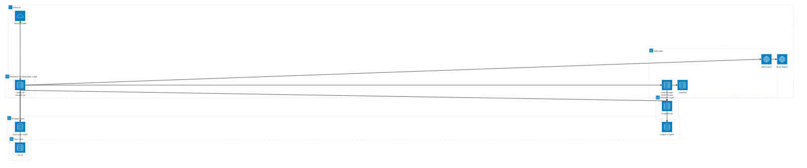
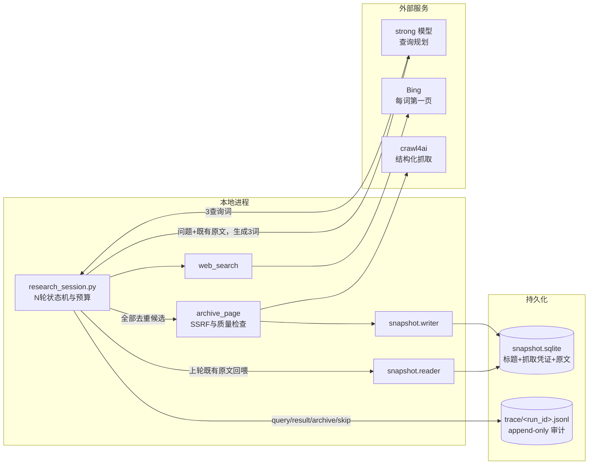
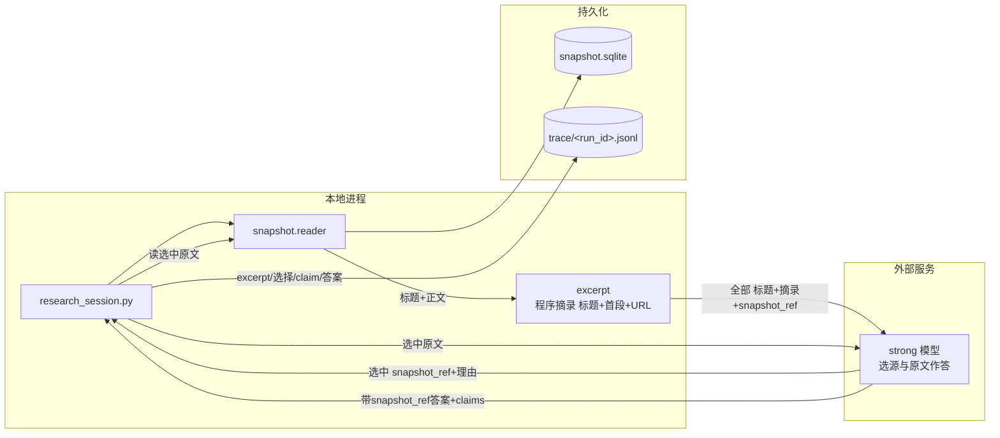
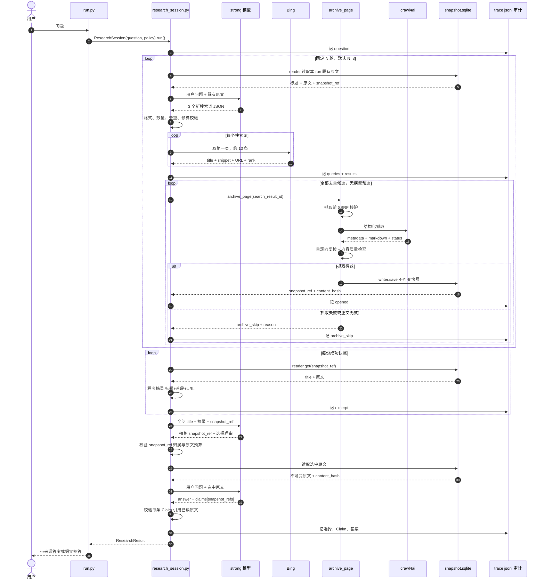

# Web Search 架构设计

> 状态：Target Design（当前 PoC 尚未完全实现）
>
> 日期：2026-07-11
>
> 目的：为 Web Search 单独建模。公网网页与结构化索引库是两类不同的原文世界，本文不复用索引库的“逐层下降选枝”抽象，而是按网页自身规律描述系统。目标流程以固定多轮探索、全量抓取、分层阅读和原文作答为核心；当前实现差距见 §9。

## 1. 为什么单独设计

结构化索引库有一棵干净的树：目录、章节、条文层层可导航，命中即权威，版本由库自己锁定。公网网页没有这些前提：

- **没有干净的导航树**。入口只有搜索引擎排序结果，混着广告、转载、过期页和低质内容。
- **问题深度事前未知**。首轮结果常会暴露新术语、新主体或新争议，需要把已读原文反馈给强模型，再生成下一轮查询。
- **抓取失败是常态**。登录墙、付费墙、反爬、JS 动态渲染和页面失效都可能使候选打不开；失败必须成为可记录、可跳过的正常路径。
- **网页没有版本号**。同一 URL 会变化或消失；抓取时必须存不可变快照和内容哈希，之后不再回访原页。
- **网页内容不可信**。正文可能含提示注入，一律只当数据，不执行其中指令。
- **抓取会主动向外发请求**。必须在请求前和重定向后执行 SSRF 守卫。

因此骨架是：**强模型提出查询 → Bing 每词取第一页 → 全量抓取并存快照 → 迭代 N 轮 → 程序摘录导航目录 → 强模型选择并阅读原文 → 带来源作答**。

这里没有“模型先挑搜索候选”与“逐字取证”两步。搜索引擎已完成第一页排序，再让模型预选只会增加调用和黑箱判断；快照增长本身可接受。程序摘录只截取标题+首段供最终导航，不提供事实证据。

## 2. 产品目标

- **探索有深度**：所有问题默认探索 `N > 1` 轮；暂定 `MAX_ROUNDS = 3`。
- **高召回**：每轮每个查询词取 Bing 第一页，去重后全部尝试抓取，不做模型候选筛选。
- **原文作答**：标题和程序摘录只导航；最终事实只能来自强模型实际读过的快照原文。
- **可溯源**：事实结论携带 `snapshot_ref`，指向带哈希的不可变快照。
- **可审计**：查询、搜索结果、抓取结果、摘录、原文选择理由、结论和模型调用均落 trace/<run_id>.jsonl。
- **流程可控**：模型只返回约定 JSON；`run.py` 仅作薄入口，轮数、抓取、预算、校验与终止均由研究编排层控制。
- **大上下文优先**：按强模型 1M token 上下文设计；输入预算设为 `MAX_STRONG_INPUT_TOKENS = 800_000`，预留输出和系统指令空间。

## 3. 网页获取的三个动作

网页获取收敛为三个受控动作，实现在 `poc/retrieval/retrieval_server.py`。它们以 FastMCP 声明，也可由研究编排层进程内直调；PoC 走后者。

| 动作 | 签名 | 职责 | 返回 |
| --- | --- | --- | --- |
| 搜索 | `web_search(query, k=10)` | 取 Bing 第一页导航结果 | `[{search_result_id, query, rank, title, url, snippet}]` |
| 抓取+存档 | `archive_page(search_result_id)` | SSRF 校验、crawl4ai 抓取、结构检查、锁版本 | `{snapshot_ref, page_url, title, content_hash, char_len, fetched_at, crawl_meta}` |
| 读取 | `reader.get(snapshot_ref)` | 从 `snapshot.sqlite` 读取指定快照原文及抓取字段 | `{snapshot_ref, page_url, title, content_hash, crawl_meta, text}` |

`archive_page` 只接受当前 run 中 `web_search` 登记过的 `search_result_id`。模型不能提交任意 URL。

### 3.1 搜索：`web_search`

- 后端固定 Bing（`ddgs`，`backend="bing"`）；搜索结果仅导航，不作证据。
- `MAX_QUERIES_PER_ROUND = 3`，每词 `RESULTS_PER_QUERY = 10`，即第一页规模。
- 每轮理论候选最多 30 条；按规范化 URL 去重。三轮理论上限约 90 条，重复 URL 通常会使实际数量更少。
- 每条结果记录 `query`、页内 `rank`、`title`、`snippet` 和 URL，便于回放 Bing 当时如何排序。
- `search_result_id = sha1(query|url)[:12]`，登记进 run 内候选表。
- 429 / ratelimit 按 `1, 3, 5, 9s` 退避，最多 4 次。

### 3.2 抓取：crawl4ai

crawl4ai 是唯一抓取后端，但不是可信边界。职责边界一句话：crawl4ai 只把 DOM 变成结构化数据，`archive_page` 负责准入、判真伪、认边界和存档。

**crawl4ai 能做（DOM 可达即可取）**：JS 渲染（Playwright，Chromium/Firefox/WebKit）、无限滚动 `scan_full_page`、懒加载、iframe 内容、clean/fit markdown 去噪，以及 `status_code`、`final_url`、`metadata`、links、media 等结构化字段。

**crawl4ai 边界外（重试无益，只能记失败）**：正文不在 DOM（如正文在 OSS 的 `.docx/.ofd`，仅拿到 SPA 壳）、交互式登录墙、付费墙、CAPTCHA、强反爬（如 Cloudflare challenge）、被网络层封锁。且 `success=true` 不等于正文语义正确。

**默认不主动对抗反爬**：crawl4ai 虽有 session/proxy/stealth 可硬闯登录与反爬，但这类内容本就在边界外，硬闯与“据实拒答、不伪装成功”的立场冲突。默认只开 JS 渲染和 `scan_full_page`（设滚动次数上限防卡死），保留 `raw_markdown` 与 `fit_markdown` 两份；不启用 stealth、代理或认证 profile 去绕过登录与反爬。

抓取流程如下。搜索所得候选去重后全部进入 `archive_page`，不经过模型挑选：

1. 由 `search_result_id` 取 URL；未知 id 拒绝。
2. 抓取前 `_is_public_http` 校验 scheme、DNS 与所有解析地址，拦截内网、环回、link-local、保留和组播地址。
3. `archive_page` 装配抓取 config（默认 JS 渲染 + `scan_full_page` 上限，不对抗反爬），`POST {CRAWL4AI_BASE}/crawl`，由 crawl4ai 完成请求、JS 渲染和正文抽取。
4. 校验 `results[0].success`、正文非空及最低质量信号；命中登录/付费/反爬/正文不在 DOM 等边界情形或校验不过，记 `archive_skip` 并继续下一条，不重试、不伪装成功。
5. 对最终 URL 再执行 `_is_public_http`，防止重定向越界。
6. 接收 crawl4ai 的结构化字段，而非只取一段 markdown：至少保留 `status_code`、`final_url`、页面 `metadata`、`raw_markdown` / `fit_markdown` 长度及实际采用的正文类型。

其失败不终止整轮；其返回必须由本地程序校验后才能存档。

### 3.3 存档：锁版本

抓取成功后经 `snapshot.writer.save()` 写 `snapshot.sqlite`：

1. 正文为空或低于质量下限则不存；单页最大 `MAX_BYTES = 4_000_000`。
2. `content_hash = "sha256:" + sha256(text)`。
3. `snapshot_id = sha1(final_url|content_hash)[:16]`，`snapshot_ref = "snapshot:web/<snapshot_id>"`。
4. 保存 URL、标题、正文、内容哈希、抓取时间及 §3.2 的结构化抓取凭证。
5. `snapshot_id` 唯一；相同版本不重复写。正文与抓取凭证一经写入即不可变。

快照膨胀不是正常流程中的筛选理由；真正的约束是磁盘配额和模型上下文预算。默认三轮约 90 页，另设高位安全阈值 `MAX_TOTAL_SNAPSHOTS = 300`，防止配置错误造成无界抓取。

### 3.4 读取：`snapshot.reader`

`research_session.py` 只持有 `snapshot.make_reader()` 返回的 reader；`retrieval_server.py` 的 `archive_page` 只持有 writer；`run.py` 两者都不持有。三者均不直接访问 SQLite：

- `reader.get(snapshot_ref)`：读取一份原文。
- `reader.list_run_sources(run_id)`：列出本 run 已归档的标题、哈希和抓取元数据，供组装模型输入。
- reader 无 `.save()`；writer 无 `.get()`。

这是能力对象隔离，不是 Python 沙箱。安全边界来自接口最小化、数据库文件权限与进程部署，而非可绕过的调用栈白名单。

## 4. 系统架构总览

### 4.1 组件架构



### 4.2 数据流

数据流按两阶段分别绘制，避免单图过载。`run.py` 只在两端透传、不变换数据，故数据流图省略，仅在架构图作入口保留。

Explore（固定 N 轮）：



Synthesize（N 轮后一次）：



组件边界：

- `run.py` 是薄入口：接收问题、读取配置、启动 `ResearchSession`、返回结果；不理解 N 轮细节，不持有快照读写能力。
- `research_session.py` 独占研究控制流，内部只有 Explore 与 Synthesize 两阶段；模型不能改变轮数、直接触网或访问 DB。
- Bing 的标题和 snippet、程序摘录都只用于导航。
- crawl4ai 是不可信外部抓取器；`archive_page` 保留 SSRF 与质量检查责任。
- `snapshot.sqlite` 保存不可变网页版本；`trace/<run_id>.jsonl`（append-only 审计日志）保存派生摘录、选择理由、Claim 和答案。
- 三层资料是逻辑视图：**标题**来自搜索/页面 metadata，**摘录**来自程序摘录（标题+首段+URL），**原文**来自快照。摘录不覆盖原文，也不升级为证据。

### 4.3 研究编排层

该层只提供一个会话入口：

```python
result = ResearchSession(question, policy).run()
```

内部只含两阶段：

1. **Explore**：生成查询、搜索、去重、全量抓取、归档快照，重复 N 轮。
2. **Synthesize**：程序摘录每页、选择相关原文、读取原文、形成可引用答案。

`ResearchSession` 仅维护 `run_id`、轮次、已见查询与 URL、`snapshot_ref`、预算和停止原因。它调用既有工具与接口，不自行实现搜索或抓取；快照经 `snapshot.reader` 读取，审计经 append-only `trace/<run_id>.jsonl` 直接落盘，两者都不经手写 SQL。

编排层保持单文件，但把三处模型判断抽成无副作用的纯函数，作为独立测试边界：

```python
plan_queries(question, archived_sources, previous_queries) -> list[Query]   # §5.1 步 1 生成查询
select_sources(question, excerpts) -> list[snapshot_ref]                    # §5.3 选源
synthesize_answer(question, original_texts) -> Answer                       # §5.3 作答
```

三者只接收纯数据、返回纯数据，不触网、不碰 DB、不写日志；抓取、快照读写、审计落盘与轮次控制仍由 `run()` 统一编排。收益是每处模型判断都能用固定 fixture 独立测试，而控制流不散到多文件。真出现并发或多研究策略时，再把纯函数提成独立模块，那时接缝已被测试固化。暂不拆分 planner、selector、synthesizer 为独立组件（见文末 `ponytail:`）。

## 5. N 轮探索与最终作答



### 5.1 每轮探索

1. **生成查询**（strong）：第 1 轮输入用户问题；第 2 轮起输入用户问题和目前已归档的全部原文。用户问题是每轮不变的锚，单独存储于 trace run header（见 §8），每轮重放注入，是 strong 对照原文识别新主体、防止偏航的依据（识别项见步 4）。输出恰好 3 个查询词；应寻找新事实面，避免重复旧词。每轮用同一个固定提示词约束输入与输出格式，见下方「查询生成提示词」。
2. **搜索第一页**：每词取 Bing 前 10 条，记录排名，跨词、跨轮按规范化 URL 去重。
3. **全量抓取**：所有新候选均尝试 `archive_page`（无模型候选选择）。`archive_page` 装配默认 config（JS 渲染 + `scan_full_page` 上限，不对抗反爬）交 crawl4ai 抓取，再由本地校验成败与质量；命中登录/付费/反爬/正文不在 DOM 等边界或校验不过，记 `archive_skip` 并跳过，不重试、不伪装成功。
4. **反馈深化**：下一轮 strong 从已读原文中识别新主体、术语、时间线、冲突点和证据缺口，据此生成新词。
5. **固定收敛**：默认完整执行 3 轮；若达到 800k 输入预算、300 份快照或没有任何新 URL，程序提前结束探索并进入汇总。

**查询生成提示词**（步 1 每轮通用，由 `research_session.py` 装配，模型不改）：

每轮调用结构固定，只有槽位内容随轮次变化。第 1 轮 `archived_sources` 为空；第 2 轮起填入 `reader.list_run_sources` 的已归档原文。`question` 恒取自 trace run header，逐轮重放不变。

```text
[system]
你是查询规划器。只依据用户问题和已归档原文提出后续搜索词，用于公网检索。
硬约束：
- 恰好输出 3 个查询词，每个不超过 12 个词。
- 每个查询针对一个尚未被已归档原文覆盖的证据缺口；不得重复 previous_queries。
- 只依据给定材料，不臆造事实、专有名词或时间。
- 只返回符合下方 schema 的 JSON，不输出任何解释性文字。

[user]
question: {{原始用户问题，取自 run header}}
round: {{当前轮次}}
previous_queries: {{历史所有轮已用查询词，用于去重}}
archived_sources:            # 第 1 轮为空
  - title: {{标题}}
    excerpt: {{标题+首段}}
  - ...
```

固定输出 schema：

```json
{
  "queries": [
    {"query": "查询词", "gap": "这条查询要补的证据缺口，对应 §7 的 query rationale"}
  ]
}
```

程序按 §6 校验 1 强制校验此 JSON：schema 合法、恰好 3 条、单条长度有界、与 `previous_queries` 去重；不合格即拒绝并要求重出，`gap` 一并写入 trace 的 query 行。

### 5.2 三层资料

N 轮结束后，为每份快照构造：

```json
{
  "snapshot_ref": "snapshot:web/…",
  "title": "页面标题",
  "excerpt": "程序摘录：标题+首段+URL，仅导航",
  "snapshot_body": "snapshot.sqlite 中的不可变正文"
}
```

三层用途严格分离：

- `title`：粗定位。
- `excerpt`：程序确定性摘录（标题+首段+URL），帮助 strong 在大量页面中筛选；不作证据。
- `snapshot_body`：最终回答的唯一事实来源。

摘录由程序生成，不修改快照正文，作为派生记录追加写入 `trace/<run_id>.jsonl`；记录 `snapshot_ref` 和输入 `content_hash`。

### 5.3 最终选择与作答

1. strong 一次读入全部 `title + excerpt + snapshot_ref`，返回相关 `snapshot_ref` 和逐项选择理由。
2. 研究编排层校验 snapshot_ref 属本 run，随后从 snapshot reader 读取这些原文。
3. strong 读取选中原文后回答；每条事实 Claim 必须列出一个或多个 `snapshot_ref`。
4. 程序只接受引用已实际送入最终调用、且哈希匹配的 snapshot_ref。

默认 `MAX_READ_SNAPSHOTS = 100`，最终原文输入仍受 800k token 总预算约束。选择上限刻意偏高，以降低漏选；若标题和摘录目录本身超过预算，先停止继续探索，不在终局静默丢页。

> 完整数据流示例（含查询生成提示词的逐轮槽位）见 [web-search-dataflow-example.md](./web-search-dataflow-example.md)。

## 6. 程序校验

质量不能只靠模型自觉，研究编排层至少执行六道校验：

1. **查询输出**：JSON schema 正确、每轮至多 3 词、长度有界、轮内和历史去重。
2. **候选归属**：`archive_page` 只接收本 run Bing 返回的 `search_result_id`。
3. **抓取有效**：HTTP/crawl 状态、最终 URL、正文非空、最小正文长度和结构化字段通过检查。
4. **快照一致**：每次 reader 读出的 `content_hash` 与存档记录一致。
5. **选择归属**：strong 选择的每个 snapshot_ref 必须属于本 run，并把选择理由落 trace。
6. **Claim 有源**：每条 Claim 只能引用已送入最终 strong 调用的原文 snapshot_ref。

不再做 `quote in text` 的“逐字取证”校验。它只能证明字符串存在，不能证明引文足以支持 Claim；新流程把程序摘录降为导航材料，让 strong 对实际原文负责。代价是 Claim 与原文之间的语义蕴含仍依赖 strong，程序只能验证“读过并引用了哪份原文”，不能机械证明结论正确。

以下情况据实拒答：搜索无结果、所有页面都抓取失败、最终没有可用原文、或 strong 判断原文不足以回答。

## 7. 模型职责

系统只用一个 strong 模型；导航摘录由程序完成，不引入第二个模型。

- **strong**：每轮分析问题与既有原文、生成 3 个新查询；N 轮后阅读标题和摘录目录、选择原文；最终阅读原文并回答。假设 1M token 上下文，单次输入预算 800k。
- **程序摘录**：N 轮结束后逐页确定性截取标题+首段+URL，仅供 strong 导航选页，不允许成为 Claim 来源。

模型调用无状态；每次输入由 `research_session.py` 从问题、快照与审计日志重建。模型返回结构化 JSON，不持有控制流。

### 三个已知模型风险

1. **查询偏航**：后续轮可能沿错误方向继续搜索。缓解：每次都重放原始问题，要求输出“新查询覆盖的证据缺口”，并记录 query rationale。
2. **摘录不足**：程序摘录确定性生成、不漂移，但首段可能未覆盖页面关键信息，影响终局选页召回。缓解：摘录含标题+首段+URL，选择上限偏高；strong 最终仍读完整原文作最后核验。
3. **原文选择黑箱**：strong 可能漏选关键页面。缓解：返回 snapshot_ref、选择理由和相关性等级并完整审计；允许选多，不以压缩快照为目标。此风险无法被程序完全消除。

## 8. 存储与审计

- **快照 DB** `snapshot.sqlite`：经 `snapshot.py` 写入标题、URL、原文、哈希、抓取凭证和时间。正文不可变；`retrieval_server.py` 只持 writer，`research_session.py` 只持 reader，`run.py` 均不持有。
- **审计日志** `trace/<run_id>.jsonl`：单一 append-only 文件，每 run 一份。首行为 `run header`，记 `run_id`、**原始用户问题**、启动时间与配置；原始用户问题在此单独、不可变地存储，是每轮重放注入 strong、识别新主体的锚，与 strong 生成的 `query` 行语义分离。其后逐行记录 round、query、search_result、archive/archive_skip、excerpt、snapshot_selection、claim、answer 及预算变化，供回放与问题定位。`research_session.py` 启动即写首行并追加后续，`run.py` 不写。

`snapshot.py` 内部使用参数化 SQL、字段校验和事务，上层不直接执行 SQL；审计日志是纯 append-only 结构化 JSON，无独立数据库。密钥与正文不写审计日志，正文只以 `snapshot_ref/content_hash` 引用。

### 8.1 审计事件契约

`trace/<run_id>.jsonl` 每行是一个事件对象，字段契约固定，供回放与后续汇总脚本依赖：

- `schema_version`：run header 记一次，日志格式演进时递增；读取方据此兼容旧 run。
- `type`：事件类型枚举，取值 `run_header | query | search_result | archive | archive_skip | excerpt | snapshot_selection | claim | answer`。
- `error_class`：失败类事件（如 `archive_skip`、查询或作答校验失败）标注归因，取 `external`（crawl4ai 空壳成功、Bing 排名漂移、strong 返回坏 JSON 等外部抖动）或 `internal`（本系统 bug）；让日志天然区分“锅在谁”，省去线上排查最费时的一步。

字段只增不改：新增事件类型只扩 `type` 枚举、不改旧行；`schema_version` 保证读取方始终知道按哪版解析。

## 9. 实现状态与迁移

本文描述目标态。当前 PoC 仍是单轮流程，并含“strong 先选候选、cheap 逐字取证、程序校验逐字引文”的旧实现。迁移按最短路径进行：

1. 新增单一 `research_session.py`，把现有研究流程从 `run.py` 移入；`run.py` 只保留参数解析、配置加载、启动会话和输出结果。
2. 把单轮控制改为固定 N 轮，后续轮输入已有快照原文。
3. `web_search` 默认每词取 10 条；删除 strong 候选选择和 `MAX_ARCHIVE = 4`。
4. 所有去重候选直接进入 `archive_page`；补 crawl4ai 结构化字段存档与质量检查。
5. 删除 cheap 逐字取证；改为 N 轮后程序确定性摘录（标题+首段+URL），并把摘录追加进审计日志。
6. 新增“目录选择原文”和“基于所选原文作答”两次 strong 调用。
7. 删除引文 substring 校验，改为 snapshot_ref 归属、哈希和 Claim 引用范围校验。
8. 移除 `store.sqlite` 审计 DB 与 `store.py`；审计统一写 `trace/<run_id>.jsonl`。

## 10. 安全与资源边界

- **SSRF**：请求前及重定向后检查；仅允许公网 http(s)。
- **提示注入**：网页正文、标题、snippet、程序摘录均是不可信数据；模型系统指令明确禁止执行页面内指令。
- **抓取边界**：默认 3 轮 × 3 词 × 每词第一页 10 条；URL 去重；高位上限 300 份来源。
- **上下文边界**：按 1M 模型窗口设计，单次输入最多 800k token；达到预算即停止扩展，不静默截掉终局目录。
- **页面边界**：单页存档最多 4MB；超限明确标记截断，不能伪装成完整原文。
- **凭据隔离**：`CRAWL4AI_BASE_URL` / `CRAWL4AI_TOKEN` 走环境变量，不入库、不入仓。

## 11. 边界与局限

- crawl4ai 不能保证抓到登录墙、付费墙、强反爬、滚动加载或特殊媒体内容；当前策略是记录失败并依靠同轮其他结果，而非假装成功。
- crawl4ai 的 `success=true` 不等于正文正确；结构化字段、正文长度和 raw/fit 对照只能发现部分异常，不能证明语义完整。
- Bing 第一页优先级提高了平均质量，但不保证权威、无偏或覆盖全部观点。
- 程序摘录只截首段，可能遗漏页面关键段落；但它确定性生成、不漂移，且仅导航，风险主要是漏选页面，而非直接污染事实答案，strong 最终仍读完整原文。
- strong 的查询规划、页面选择和 Claim 推理仍是模型判断，审计能使黑箱可见，不能使其成为形式证明。
- 1M 是目标模型假设；换用更小上下文模型时，必须重新降低轮数、每页数量或引入可验证的分层压缩，不可静默裁剪。
- SSRF 守卫与本地 fake-ip 代理模式冲突；验证与跑测需关闭该代理或提供可信解析通道。

## 12. 可维护性

数据流图上箭头多，是“步骤宽”的线性流水线，不是“依赖深”的相互回调。宽度好追，深耦合才致命，而本设计把耦合压得很低。

### 12.1 有利于定位问题的结构特征

1. **控制流只有一个家**：`research_session.py` 独占编排；`run.py` 两端透传不变换数据；模型无状态、不改轮数、不触网、不碰 DB。流程 bug 只可能在这一个文件里。
2. **模型调用无状态、可重放**：每次模型输入都由 session 从问题、快照与审计日志重建，无隐藏状态。复现 bug 等于用同样输入重放；模型本身不确定，但管道确定。
3. **append-only trace 是主要调试手段**：`trace/<run_id>.jsonl` 逐行记全链（`run_header → query → search_result → archive/archive_skip → excerpt → snapshot_selection → claim → answer`）。一个 run 一个文件，打开即见当轮实况，无需插桩或复现环境。
4. **六道校验各卡一个阶段**：校验失败即锁定阶段——schema 错对应查询步，哈希不符对应快照读取，ref 越权对应选源步。错误分类天然对应位置。
5. **快照不可变加 content_hash**：排除“数据在脚下变了”这类最难查的 bug；损坏由校验机械发现。
6. **单抓取后端、固定 N 轮、无并发**：从源头排除竞态与并行乱序类 heisenbug。

### 12.2 定位一个 bug 的典型路径

以“某问题答案漏掉关键页”为例：`grep` 该 `run_id` 的 jsonl，先看 `archive_skip` 行（抓取阶段丢的？），无 skip 再看 `snapshot_selection`（strong 没选？），选了却没进 `claim`（作答漏引？）。三跳定位到具体阶段，全程一个文件、无需重跑。

### 12.3 已知风险与应对

1. **编排单文件会随策略增长变胖**：Explore 与 Synthesize 现塞在一个文件，多研究路线或并发恢复后会臃肿。§4.3 已把三处模型判断抽成纯函数（`plan_queries`/`select_sources`/`synthesize_answer`）固化测试边界，独立测试的收益不必靠拆文件即得；拆 planner/selector/synthesizer 为独立模块降为文末 `ponytail:` 记账的债务，待并发或多策略确有需要时再做，非隐患。
2. **跨 run 找规律仍需汇总工具**：§8.1 已定 `schema_version` 与 `type` 枚举，日志格式稳定、机器可解析；单 run 调试极易。剩余缺口只是跨 run 聚合——目前多 run 找规律仍靠手工 grep，后续补一个只读 jsonl 汇总脚本即可，成本低，且已有稳定 schema 可依赖。
3. **snapshot 全局、trace 按 run，调试需两跳**：“某快照由哪个 run 生成”要用快照时间戳与 trace 交叉查，可追但非一跳。
4. **三个外部依赖需与自身 bug 区分**：多数线上异常其实是 crawl4ai 空壳成功、Bing 排名漂移或 strong 返回坏 JSON，分别由 `archive_skip`、校验 3、校验 1 兜住。§8.1 的 `error_class` 字段已要求失败事件标注 `external`（外部抖动）或 `internal`（我方 bug），日志天然区分归因，不再靠人逐行判读；汇总脚本据此可直接按 `error_class` 聚合。

### 12.4 运维负担

小。一个进程、一个抓取后端、两份存储（`snapshot.sqlite` 与 `trace/<run_id>.jsonl`），无消息队列、worker 池或分布式状态。凭据走环境变量不入库。日常只需盯外部依赖健康度与快照磁盘增长（每 run 300 份上限已兜底）。

结论：本设计为可审计牺牲了模型侧的简洁（单 strong、去掉 cheap 与逐字校验），换来的正是可维护性——trace 让黑箱可见。§12.3 四项均非结构性缺陷，是“长大了才需要”的增量项。

***

`ponytail:` 编排层暂只用一个 `research_session.py`，内部以三个纯函数（`plan_queries`/`select_sources`/`synthesize_answer`，见 §4.3）固化测试边界，不拆 planner/selector/synthesizer 为独立组件；待并发恢复或多研究策略确有需要时再提成独立模块。抓取仍只保留 crawl4ai 单后端与固定 N 轮。
