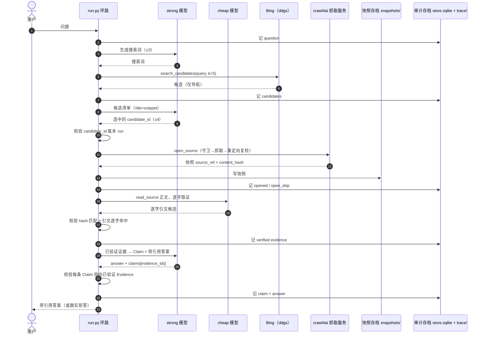

# Web Search 架构设计

> 状态：Draft
>
> 日期：2026-07-10
>
> 目的：为 Web Search 单独建模。公网网页与结构化索引库是两类不同的原文世界，本文不复用索引库那套"逐层下降选枝"的抽象，而是按网页自身的规律描述系统。内容贴合当前 PoC 代码（`poc/run.py` 与 `poc/search_mcp/server.py`）。

## 1. 为什么单独设计

结构化索引库有一棵干净的树：目录、章节、条文层层可导航，命中即权威，版本由库自己锁定。公网网页没有这些前提，套用同一套抽象只会把网页的真实难点藏起来。网页的现实是：

- **没有干净的导航树**。入口只有搜索引擎的排序结果，混着广告、转载、过期页和低质内容，权威性得由模型逐条判断，而不是顺着结构下降。
- **抓取失败是常态，不是异常**。登录墙、付费墙、反爬、JS 动态渲染、页面失效，任何一条候选都可能打不开。系统必须把"打不开就换下一条"当作正常路径，而非错误分支。
- **网页没有版本号**。同一 URL 今天和明天可能不同，原页随时会变或消失。唯一可靠的版本锁定手段是"抓下来的那一刻存一份快照 + 内容哈希"，之后一切引用都指向快照，不再回访原页。
- **网页内容不可信**。正文里可能夹带针对模型的注入指令，必须一律当数据处理，不执行。
- **抓取会主动向外发请求**。URL 由搜索结果和模型给出，存在打到内网、被重定向越界的风险，需要 SSRF 守卫。

因此 Web Search 的骨架是：**搜索拿候选 → 存档抓快照 → 只在快照里逐字取证 → 程序校验 → 带引用作答**。这条链只有一层（网页），不存在索引库的多层树。

## 2. 产品目标

- **高质量**：答案基于抓取存档的网页原文，不靠模型记忆或摘要相似度。
- **可溯源**：每条事实结论都能定位到一份带哈希的快照中的逐字原文。
- **可审计**：搜索、选择、抓取、取证、结论、模型调用全过程逐步落 trace，可回放。
- **可控**：模型只产出结构化候选（搜索词、candidate_id、引文、Claim），系统控制流由程序把持，模型不决定流程。
- **低成本**：有界的搜索词数、候选数、抓取数，加上强/廉两档模型分工，压住调用量。

## 3. 网页取证的三个动作

Web Search 的原文获取收敛成三个纯函数，实现在 `poc/search_mcp/server.py`。它们用 FastMCP 声明（`@mcp.tool()`），因此既能作为 MCP 工具挂到 Claude Desktop / Cline 等客户端，也能被 `run.py` 在进程内直接 `import` 调用。PoC 阶段走的是后者——进程内直调，不启 stdio。

| 动作 | 签名 | 职责 | 返回 |
| --- | --- | --- | --- |
| 搜索 | `search_candidates(query, k=6)` | 拿有界候选，仅供导航 | `[{candidate_id, title, url, snippet}]` |
| 存档 | `open_source(candidate_id)` | 抓取正文、存快照、算哈希 | `{source_ref, source_uri, title, content_hash, char_len, fetched_at}` |
| 读取 | `read_source(source_ref)` | 读回已存档的快照正文 | `{source_ref, source_uri, content_hash, truncated, text}` |

关键约束：`open_source` 只接受本次会话里 `search_candidates` 产生过的 `candidate_id`，拒绝任何集合外的 URL。模型不能凭空造 URL 让系统去抓。

### 3.1 搜索：`search_candidates`

- 后端固定 Bing（经 `ddgs` 库，`backend="bing"`），对国内网络友好、无需 API key。搜索源可换，因为它只产导航结果，不产证据。
- 免费后端对密集请求会限流。命中 429 / ratelimit 时按 `1, 3, 5, 9s` 指数退避重试，最多 4 次，末次仍失败才报错。
- 每条候选按 `sha1(query|url)` 生成 12 位 `candidate_id`，登记进会话内候选表 `_candidates`。
- 标题和摘要**只用于让模型判断该不该打开，绝不能当事实证据**。证据只能来自存档后的快照正文。

### 3.2 存档：`open_source`

这是网页架构最重的一步，也是信任边界所在。流程严格按序：

1. 用 `candidate_id` 取出 URL；未知 id 直接拒绝。
2. **抓取前 SSRF 守卫** `_is_public_http`：解析 URL，只允许 http(s)，DNS 解析后逐个地址检查，拦掉内网、环回、link-local、保留、组播地址。
3. 经 crawl4ai 抓取：`POST {CRAWL4AI_BASE}/crawl`，带 `Bearer` token，body `{"urls": [url]}`。crawl4ai 在服务器端完成抓取、JS 渲染、正文抽取，直接给 markdown。crawl4ai 是唯一抓取后端；遇到它也爬不动的资源（登录墙/付费墙），按"弃取"处理，不硬扛。
4. 判 `results[0].success`。不成功即视为反爬或失效，放弃这条候选。
5. **抓取后重定向复检**：对最终落点 URL 再跑一次 `_is_public_http`，防止跳转越界打到内网。
6. 取 markdown 正文（若为 dict 取 `raw_markdown`），截到 `MAX_BYTES = 4_000_000`。正文为空视为动态渲染失败或登录墙，放弃。
7. **存档并锁版本**：`content_hash = "sha256:" + sha256(text)`，`snap_id = sha1(final_url|content_hash)[:16]`，`source_ref = "source:web/<snap_id>"`。快照写入 `snapshots/<snap_id>.json`，含 url、title、正文、哈希、抓取时间。

存档之后，这份快照就是不可变的原文版本。后续取证、校验、引用全部只认 `source_ref` 和 `content_hash`，不再触网。

### 3.3 读取：`read_source`

按 `source_ref` 从快照记录里读回正文，供廉价模型取证。读的是存档，不是原页。

## 4. 受控工作流（`poc/run.py`）

一次问答是一个 `run`，走固定的单趟线性环路 `run_once(question, strong_cfg)`。当前为单趟（未迭代），迭代循环见 §8。

步骤要点：

1. **生成搜索词**（strong）：输出 JSON 数组，最多 `MAX_QUERIES = 3` 个，覆盖问题的关键事实点。
2. **搜索取候选**：每个词调 `search_candidates(k=MAX_CANDIDATES=5)`，候选按 `candidate_id` 去重汇总。
3. **选候选**（strong）：从候选清单里选最可能含权威依据的，最多 `MAX_OPEN = 4` 个，只能从给定 id 里选。
4. **存档快照**：逐个 `open_source`。**打不开就跳过**（`open_skip`，记原因），继续下一个——这是网页架构的正常路径。
5. **逐字取证**（cheap）：对每份快照正文，只摘"能回答问题的、正文里连续原样出现的"引文片段，不改写、不拼接、不翻译。
6. **形成 Claim + 带引用答案**（strong）：只依据已验证证据作答，每条事实句必须挂至少一个 `evidence_id`。

三处据实拒答（不臆测）：搜索无候选、所有候选都存档失败、无任何逐字命中的证据。任一发生就明确说明无法作答，而不是编。

## 5. 四道程序校验

质量不靠模型自觉，靠程序在关键节点卡死。全部在 `run.py` 里执行：

1. **候选归属**：`open_source` 只接受本 run `search_candidates` 产生过的 `candidate_id`，杜绝模型自造 URL。
2. **快照哈希匹配**：取证时校验 `read_source` 读回正文的 `content_hash` 与存档时一致，确保读的就是当初存的那份。
3. **引文逐字命中**：`quote in text`——引文必须是快照正文里连续原样出现的片段，否则判不通过。
4. **Claim 有据**：每条 Claim 的 `evidence_ids` 必须都指向已通过前三关的 Evidence，否则该 Claim 不成立。

四道全过的事实句才进最终答案；证据不足宁可拒答。

## 6. 模型分工

两档模型，各司其职（DeepSeek v4，经 OpenAI 兼容接口调用）：

- **strong**（规划与综合）：生成搜索词、选候选、写 Claim 和带引用答案。有 4 个待对比配置：`{flash, pro} × {思考, 非思考}`，默认 `flash-nothink`。同一 model id 靠 `extra_body.thinking` 切思考模式；非思考模式设 `temperature = 0` 求可复现。
- **cheap**（逐字取证）：只在授权快照里摘原文引文。这是机械活，思考无增益且更贵，固定 `deepseek-v4-flash` 非思考。

模型全程无状态，每次调用的输入都由持久对象重建；模型只产结构化候选，不碰控制流。

## 7. 存储与审计

两层持久化，职责分开：

- **快照存档** `snapshots/<snap_id>.json`：抓下来的网页原文版本，取证和引用的唯一依据。
- **审计存档**：
  - `store.sqlite` 三表 `run / evidence / claim`：一次问答的状态与结论。
  - `trace/<run_id>.jsonl`：逐步流水（question、queries、candidates、picked、opened/open_skip、evidence_check、claim、answer、abort），供事后回放与审计。

Evidence、Claim、原文都以 `source_ref` / `content_hash` 引用，不把正文复制进运行态。

## 8. 迭代循环（规划中，未落地）

结构化索引库靠"树的深度"深入，一层查不够就往下钻。网页没有可下降的层级，对应手段是**迭代查询**：用上一轮已验证的证据，反馈生成下一轮更精准的搜索词，固定轮数上限收敛（初步定 3 轮）。当前 PoC 是单趟线性、尚未实现迭代，这是 Web Search 相对索引库最需要专门解决的点，留待后续设计与验证。

## 9. 安全边界

- **SSRF 守卫**：抓取前校验 URL，抓取后对重定向落点复检，拦内网/环回/非 http(s)/越界跳转。
- **内容不可信**：网页正文一律当数据，不执行其中的任何指令（防提示注入）。
- **有界资源**：搜索词 ≤3、每词候选 ≤5、全 run 抓取 ≤4、单页正文 ≤4MB，压住成本与被滥用面。
- **凭据隔离**：crawl4ai 地址与 token 走环境变量（`CRAWL4AI_BASE_URL` / `CRAWL4AI_TOKEN`），不入库、不入仓。

## 10. 边界与局限

- crawl4ai 是唯一抓取后端，登录墙/付费墙类资源仍可能爬不动，按弃取处理，遇到再逐步调整。
- 搜索后端 Bing 免费额度有限流，靠退避缓解，非彻底消除。
- 迭代循环未实现，深度不足的问题当前靠单趟多候选近似。
- SSRF 守卫与本地 fake-ip 代理模式冲突（会把公网域名解析到 `198.18.x.x` 而被误拦），验证与跑测需关闭该类代理。

***

`ponytail:` 本文只描述网页这一层的取证链，贴合当前单趟 PoC；迭代循环（§8）与非 crawl4ai 抓取后端属未落地设计，落地时补。与结构化索引库（`architecture.md`）各自独立，不共用抽象。
