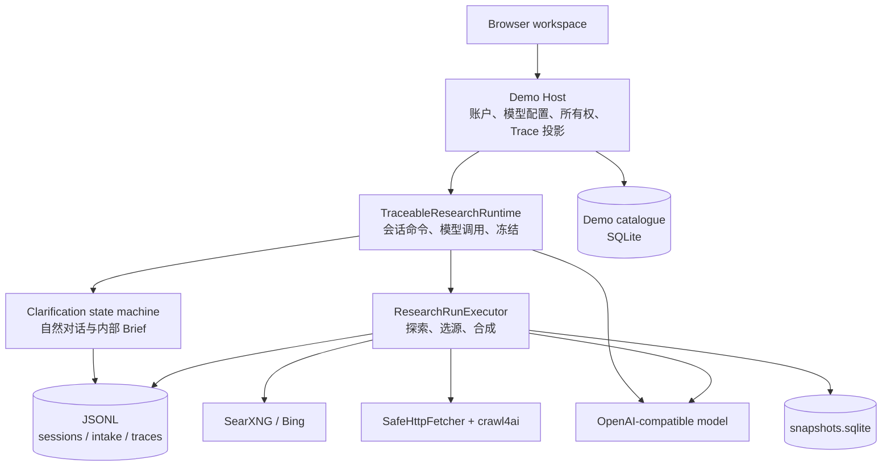
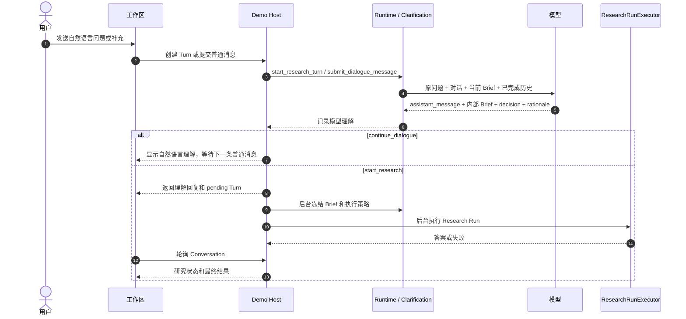
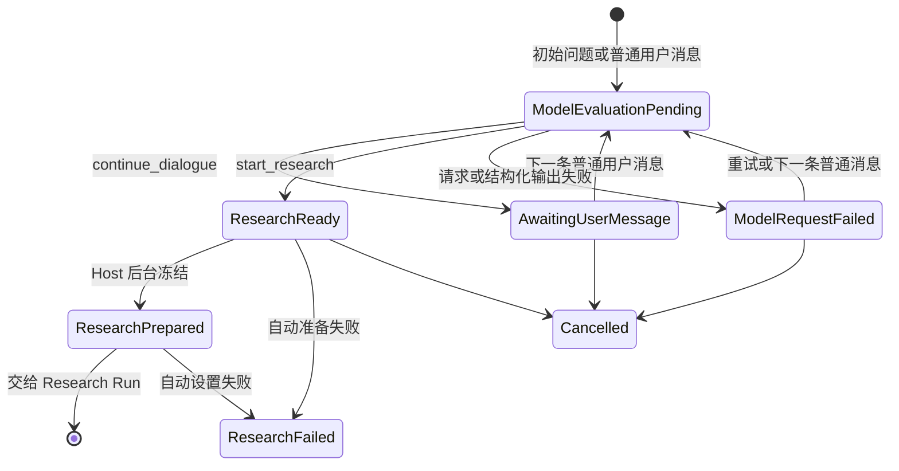

# Web Search 架构设计

> 状态：当前实现契约
>
> 更新日期：2026-07-16
>
> 本文描述模型主导自然对话、自动研究和三级 Trace 展示后的运行时行为。旧 `ask | complete`
> 澄清题、用户确认 Brief、手动执行研究和聊天内完整 Trace 均不是当前契约。

## 1. 领域语言与边界

| 名称 | 含义 | 不是什么 |
| --- | --- | --- |
| Research Conversation | 一个用户可恢复的长期研究会话；只把已完成 Turn 的问题与答案带入下一轮上下文 | 一次研究运行，也不是浏览器 Cookie |
| Research Turn | Conversation 中从用户问题开始、以自然对话或一次研究结束的单个工作单元 | 一个通用聊天消息 |
| Clarification | 一个 Turn 内由模型主导的“理解并决定是否研究”的生命周期 | 用户填写的表单或固定问答流程 |
| Research Brief | 模型提示词输出的结构化内部语义产物 | 用户可见、可编辑或需确认的后台表单 |
| Research Run | 已冻结 Brief 与执行策略后的检索、抓取、选源和作答过程 | 长期 Conversation |
| Trace | 为回放和审阅保存的追加式事实、决定摘要和证据事件 | 模型隐藏推理或系统提示词 |

系统的核心目标是在不打断自然聊天的前提下，使一次 Web 研究从问题理解到证据、来源和答案都可复查。模型负责理解意图和生成受限 JSON；程序负责状态机、外部请求、资源上限、快照、权限和日志。模型不能直接抓取 URL、修改轮数、访问数据库或跳过校验。

## 2. 组件与职责



### 2.1 Demo Host

`demo-host/` 是浏览器的边界，负责：

- 账户、登录 Cookie、模型 Profile、Conversation 所有权和 Turn 投影；
- 用部署主密钥加密保存用户填写的 OpenAI-compatible API key；浏览器只在创建或更新 Profile 时提交密钥，之后永不读回；
- 从已拥有的 Profile 取出模型访问配置后调用核心运行时；
- 在模型决定开始研究时自动准备并执行，浏览器没有第二个“确认”或“执行”命令；
- 将核心 JSONL 的审计数据投影为 L2 概览和分页 L3 详情，不把未过滤原始 Trace 整体交给浏览器。

Demo Host 的 catalogue 是账户、所有权、用户可见 ID、Profile 选择和答案恢复的权威来源；核心运行时的日志与快照是研究过程和证据的权威来源。两者分开，避免身份生命周期改写审计回放契约。

### 2.2 Core runtime

`src/runtime.rs` 的 `TraceableResearchRuntime` 串行化一个进程内的 Conversation / Clarification 命令，冻结每个 Turn 启动时的已完成历史，并协调模型调用和运行准备。它不裁决问题质量、不改写模型 Brief，也不暴露 HTTP 或身份接口。

- `ResearchInfrastructureConfig`：进程级 SearXNG、crawl4ai 和研究数据目录。
- `ModelAccessConfig`：一个用户选定 Profile 的 API 基址、密钥和模型 ID；每个 Turn 独立传入。
- `src/conversation.rs`：长期 Conversation 的 append-only 回放与 Turn 编号不变量。
- `src/clarification.rs`：自然对话、模型理解、Brief 哈希和自动研究准备的状态机。
- `src/research_run.rs`：有界的搜索、抓取、快照、选源和答案合成。

## 3. 数据流

### 3.1 自然对话校准与自动开始

用户只发送普通聊天文本。首次文本是 `original_question`；后续文本不是对系统问题的“回答”，而是对当前意图的自然补充、修正或继续表达。模型每次评估都必须同时返回：

```json
{
  "decision": "continue_dialogue | start_research",
  "rationale": "面向审阅的简短理由",
  "assistant_message": "面向用户的自然语言理解回复",
  "brief_draft": { "...": "内部结构化 ResearchBrief" }
}
```

`assistant_message` 进入聊天流；`brief_draft` 只用于后续研究，正常聊天 UI 不显示它。`rationale` 是 8–480 字的审阅摘要，而不是隐藏思维链。



状态转换由 `ClarificationState` 验证，而非由前端猜测：



没有“最多五问”、final prompt、专用选项、确认按钮、编辑 Brief 或手动开始 API。模型可以在自然语言回复中表达仍不确定的地方，但无需把回复强制格式化为一个系统问题。模型判断信息足够时，Host 立即返回 pending Turn，并在后台等待并发配额、准备和执行研究；`ResearchReady` 仅是可观察状态，不需要用户点击。

### 3.2 Brief 的内部完整性

结构化 `ResearchBrief` 保留原问题、可研究问题、期望输出、范围、来源约束和已接受假设。运行时将它规范化并计算内容哈希；模型以 `start_research` 决定后，`prepare_research_run_with_answer_style` 把该版本与 `TracePolicy`、答案风格和唯一 `run_id` 一起冻结。

代码中的 `FrozenResearchBrief` 是不可变、哈希已校验的内部类型名；其 `frozen_at` 记录模型批准的 Brief 成为可执行输入的时间，不代表用户曾看到或确认内容。模型不得改变 `original_question`，也不得把未表达的时间、地域、立场或主体当作事实；不可避免的解释只能记录在 `accepted_assumptions`。

### 3.3 Explore 与 Synthesize

Research Run 只接收冻结的内部 Brief，按以下顺序运行：

1. 生成一份只依赖模型知识和已完成会话上下文的 `ModelKnowledgeDraft`，记录其不确定性和审阅摘要。
2. 每轮由模型生成恰好三个、与历史查询不重复的查询及各自证据缺口。
3. 搜索结果按规范化 URL 跨轮去重；每轮候选都尝试经过安全抓取，而不是让模型先挑 URL。
4. 成功正文写为内容寻址的不可变快照。程序只把标题和导航摘录给选源步骤；最终模型只读取被选快照的原文。
5. 模型返回来源选择理由、带来源归因的主张，以及模型知识和网页证据的比较说明。

默认 `TracePolicy` 是 3 轮、1,000,000 输入预算、300 份快照上限。探索会在资源上限、没有新候选或明确失败时终止，并写入可回放检查点。核心 API 支持 `web_first`（知识 20%，网页 80%，默认）和 `knowledge_first`（知识 80%，网页 20%）两种策略；Demo 聊天界面固定使用默认策略，不在自然语言输入旁增加控制项。答案中的每条主张都显式声明其来自模型知识还是网页证据。

## 4. 搜索、抓取与快照

### 4.1 当前搜索实现

当前 `SearxngSearchClient` 首先访问自托管 SearXNG；部署配置只启用 Bing。若 SearXNG 在重试后失败或没有可用 HTTP(S) 结果，客户端会使用 Bing RSS 兜底。标题和 snippet 仅用于导航，不能单独作为最终事实证据。

“Google 优先、SearXNG 内 Bing 回退”仍是单独待办，尚未实现；详见 [2026-07-16-google-first-searxng-search-fallback.md](todo/2026-07-16-google-first-searxng-search-fallback.md)。在该待办完成前，部署说明和 Trace 不应宣称 Google 已参与当前请求。

### 4.2 抓取安全边界

`Crawl4AiSnapshotClient` 不把公网访问权限交给 crawl4ai。它先由 Rust `SafeHttpFetcher`：

1. 只接受公网 `http(s)` URL，并在首次请求和每次重定向后验证 DNS 解析地址；
2. 关闭自动重定向，最多逐跳验证五次；
3. 流式读取，超过 `MAX_PAGE_BYTES = 4_000_000` 即停止；
4. 清洗得到的 HTML 后，以离线 `raw:<html>` 交给 crawl4ai 转为正文；
5. 校验返回正文和元数据，失败记为 `archive_skip`，继续下一个候选。

正文为空、登录墙、付费墙、反爬、CAPTCHA 或网络故障都是可记录的获取失败，不能被伪装成成功。网页内容及其内嵌指令一律是不可信数据，不会改变模型 schema 或程序控制流。

### 4.3 快照不可变性

`SnapshotWriter` 把成功正文写入 `data/snapshots.sqlite`。快照 ID 来自最终 URL 和 SHA-256 内容哈希，引用形式为 `snapshot:web/<snapshot_id>`；同一版本重复保存是 no-op。`SnapshotReader` 只读打开数据库，读取时复验内容地址和字段。写入与读取能力在 Rust API 层分开，研究代码不能借 Writer 读取旧正文。

## 5. 持久化与审计

| 存储 | 内容 | 主要责任 |
| --- | --- | --- |
| `data/sessions/<conversation_id>.jsonl` | Conversation schema v2：起始、Turn 分配、完成答案、取消和失败 | `src/conversation.rs` |
| `data/intake/<clarification_id>.jsonl` | 原问题、用户自然消息、模型理解、自动研究准备、取消和模型失败 | `src/clarification.rs` |
| `data/traces/<run_id>.jsonl` | 运行头、模型调用、知识草稿、查询、搜索、归档、选源、主张、答案和失败 | `src/research_run.rs` / `src/research_trace.rs` |
| `data/snapshots.sqlite` | 不可变网页正文与抓取元数据 | `src/snapshot_store.rs` |
| `demo-catalog.sqlite` | 用户、登录会话、加密模型 Profile、公开 Conversation/Turn 和答案投影 | `demo-host/src/catalog.rs` |

Clarification schema v5 的事件集合是 `intake_started`、`user_message_received`、`model_understanding`、`run_prepared`、`research_preparation_failed`、`research_run_failed`、`cancelled` 和 `intake_failed`。它不会回放或追加旧 v2/v3/v4 生命周期。Research Trace 当前写入 schema v6，也不会把旧 v5 `confirmed_at` Brief wire format 当作当前契约。因此新版本部署必须使用新的数据目录或持久卷；不做原地兼容或迁移。

一个 Run 的首行是 `run_header`，包含冻结 Brief、策略、答案风格、Conversation/Turn 关联和开始时间；终止事件只能是 `answer` 或 `run_failed`。所有日志是 append-only 回放记录，不是加密签名或防篡改账本。

## 6. 三级 Trace 披露

Trace 的存储完整性与浏览器披露范围是两件不同的事。工作区使用以下分层：

| 层级 | 位置 | 内容 | 明确不包含 |
| --- | --- | --- | --- |
| L1 | 聊天正文 | 用户/助手自然消息、研究状态、最终答案、必要来源 | 查询、选源理由、模型知识草稿、原始事件 |
| L2 | 右侧“研究概览” | 理解摘要、检索方向、检索/归档数、最多六个主要来源、综合理由和失败摘要 | 原始事件列表、每项搜索结果、完整快照正文 |
| L3 | 右侧“审计详情” | 按阶段分页的审阅安全事件、可审查理由和必要 URL/摘要 | 系统提示词、隐藏推理、API key、模型原始输入、完整快照正文 |

L2 是服务端白名单投影，不是浏览器拿到原始 JSONL 后自行过滤。L3 的端点同样只生成审阅安全字段，接受 `stage`、`cursor`、`limit`；可用阶段为 `dialogue`、`setup`、`planning`、`search`、`archive`、`selection`、`synthesis` 和 `failure`。两类端点均先验证登录用户拥有 Conversation 和 Turn；未登录为 `401`，他人对象按 `404` 处理。

```text
GET /api/conversations/{conversation_id}/turns/{turn_id}/trace/summary
GET /api/conversations/{conversation_id}/turns/{turn_id}/trace/audit?stage=&cursor=&limit=
```

“理由”始终是面向审阅的简短摘要，解释可观察输入、证据缺口或来源选择；它不等同于 chain-of-thought。L1 不使用“Trace”术语，避免正常对话被过程信息包围。

## 7. 校验、安全与资源限制

- 输入、模型结构化输出、Brief 规范化、内容哈希、revision、状态转换和执行策略均由程序验证。
- 模型输出不得包含未知字段；模型请求失败或连续两次结构化输出无效时，不以原问题偷偷启动研究。
- 搜索、抓取、重定向、URL、正文大小、快照哈希、选中 `snapshot_ref` 和最终主张引用范围均有确定性校验。
- 用户密码以 Argon2id 保存；登录 Cookie 仅保存随机 token，catalogue 只保存其哈希；模型 API key 以 AES-256-GCM 加密，绝不写入响应、Trace、前端存储或日志。
- Host 校验可信 Host 与 Origin，默认拒绝私网模型端点；可信本地部署必须显式设置 `DEMO_ALLOW_PRIVATE_MODEL_ENDPOINTS=true`。
- 外部文本以数据处理并在前端转义，防止网页和模型输出改变 UI 或指令。

## 8. 部署与已知限制

- 生产 / 服务器部署须保留部署主密钥，否则既有 Model Profile 的密钥无法解密。
- Conversation v2、Clarification v5 / Research Trace v6 不是旧 v1/v2/v3/v4/v5 的兼容升级。必须分配新的 runtime 数据目录或卷；不能把旧 session、`intake` 或 trace 日志与新代码混用。
- `scripts/server-demo-up.sh` 默认采用 `traceable-search-server-demo-v5` 运行时目录和
  `traceable-search-server-demo-data-v5` Podman volume；旧存储不会被脚本删除。
- 自动研究不占用创建 Turn 或提交消息的 HTTP 请求。Host 返回 `ready | running` 后继续后台执行，浏览器每五秒读取 Conversation，直到 Turn 完成、失败或取消；并发限制、失败终态和重启恢复仍由 Host 管理。
- 当前同一 Conversation 只允许一个未完成 Turn。研究进行时的后续意图不写入该 Turn；产品若要支持排队、取消重启或分叉，应新增明确的 Turn 生命周期，而不是绕过现有不变量。
- Google 优先的搜索策略尚未实施，见上述待办。

相关架构决策见 [ADR 0006](adr/0006-model-led-dialogue-and-tiered-trace-disclosure.md)。
