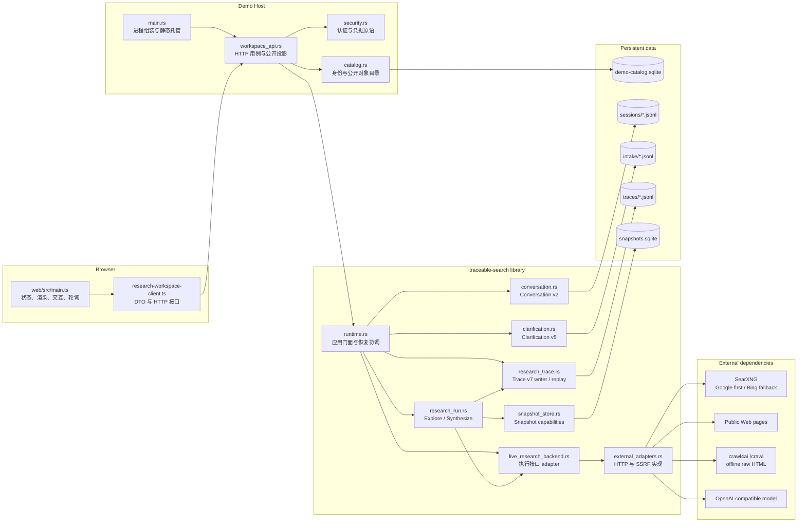
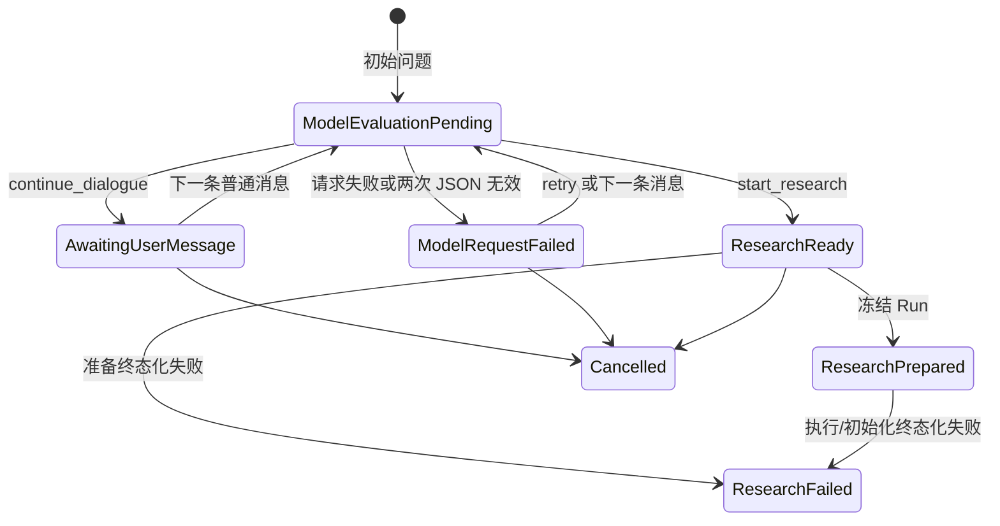
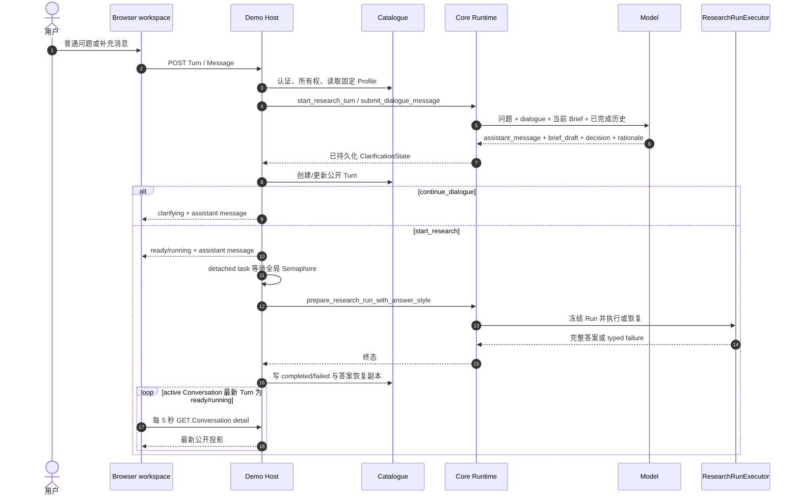
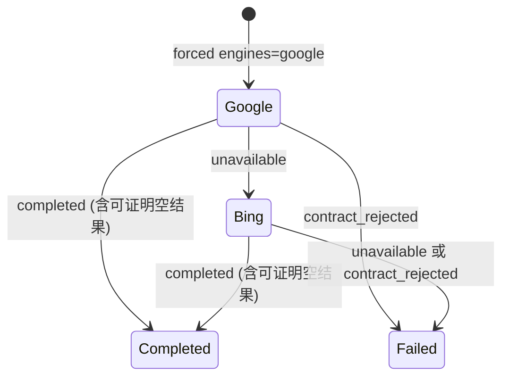

# Web Search 架构设计

> 状态：当前工作区实现契约
>
> 更新日期：2026-07-17
>
> 本文以 `src/`、`web/src/`、`demo-host/Containerfile` 和已接受 ADR 的现状为准，描述已经实现的模块、接口和限制。计划与待办不代表当前能力。

## 1. 目标、语言与设计规则

系统的目标是在不打断自然对话的前提下，让一次 Web 研究从意图理解、检索和正文抓取，到来源选择、答案合成和失败恢复都可复查。模型负责生成受限的结构化建议；程序负责验证、状态转换、外部访问、资源上限、持久化、权限和公开投影。

### 1.1 领域语言

| 名称 | 含义 | 明确不是什么 |
| --- | --- | --- |
| Research Conversation | 一个用户拥有、可恢复的长期研究会话；后续 Turn 只继承已完成 Turn 的问题与最终答案 | 一次 Research Run，也不是登录 Cookie |
| Research Turn | Conversation 中从首条用户问题开始，以完成、失败或取消结束的有序工作单元 | 任意一条聊天消息 |
| Clarification | 一个 Turn 内由模型主导的自然对话状态机，用于形成可执行 Research Brief | 固定问卷、表单或用户确认流程 |
| Research Brief | 模型生成、程序规范化并校验的内部研究语义 | 用户可见、可编辑或需确认的表单 |
| Frozen Research Brief | 带内容哈希、clarification ID 和冻结时间的可执行 Brief | 用户确认过的 Brief |
| Research Run | 对一个 Frozen Research Brief 的一次有界执行 | 长期 Conversation |
| Search Engine Attempt | 对某个查询、某个 SearXNG 引擎的一次显式请求及 typed 结果 | 隐式重试或聚合搜索 |
| Web Snapshot | 从公开网页抓取、经 crawl4ai 转换后保存的内容寻址正文 | 搜索结果 title/snippet |
| Research Trace | 一个 Run 的 append-only v7 审计事件文件 | 调试日志、系统提示词或 chain-of-thought |
| Research Overview | 面向浏览器的 L2 白名单概览 | 原始 Trace 的客户端过滤结果 |
| Audit Detail | 面向浏览器的 L3 分页安全投影 | 原始 JSONL 或完整网页正文 |
| Model Profile | 用户拥有的模型端点、模型 ID、显示名和加密凭据 | 进程级公共模型配置 |

### 1.2 设计规则

1. **模型提议，程序提交。** 模型只能返回结构化文本；它不能直接抓取 URL、访问 SQLite、改变轮数、写 Trace 或绕过校验。
2. **搜索结果只负责导航。** title、snippet 和 navigation excerpt 用于发现与选源；最终 Web 主张只能引用已保存并重新读取的 Snapshot 正文。
3. **历史只负责理解指代。** 已完成 Turn 的问题与答案可帮助理解后续意图，但不自动成为当前 Run 的事实证据。
4. **先完整回放，再恢复或投影。** Research Trace 只能经 `replay_trace` 完整读取，并通过 v7 格式与跨事件校验后被 Runtime 和 Demo Host 使用。
5. **公开面小于内部记录。** Core 保存完整答案与审计事件；浏览器 L1 只拿答案文本和必要 URL/title，L2/L3 由 Host 白名单投影。
6. **身份目录与研究审计分离。** Host Catalogue 管账户和所有权；Core JSONL/SQLite 管研究状态和证据。两者依靠幂等命令、补偿与恢复协调，不共享一个事务。
7. **能力按方向拆分。** Snapshot 写入和读取由不同类型承载；研究外部效果集中在 `ResearchExecutionBackend` 接口后。

## 2. 系统拓扑与依赖方向



依赖方向从 Browser 指向 Host，再指向 Core 和外部 adapter。Core crate 不依赖 Axum、Cookie 或账户目录；Host 不实现检索、抓取、选源和合成算法；Browser 不读取 Core 文件或用户密钥。

当前 Core 内部有一处反向依赖：`research_trace.rs` 为校验 `TracePolicy` 引用了 `research_run.rs` 的资源上限常量。它是现有实现关系，不表示 Trace 应拥有执行策略。

## 3. 模块职责

### 3.1 Core library

| 模块 | 主要接口 | 责任 | 明确不负责 |
| --- | --- | --- | --- |
| `src/lib.rs` | crate root 重导出 | 声明 library-only crate，公开 10 个实现模块，并把主要领域类型、Runtime、Trace 和 Snapshot 接口重导出为平坦调用面 | HTTP、身份、进程启动 |
| `src/research_domain.rs` | `ResearchBrief`、`FrozenResearchBrief`、搜索/快照/答案类型与纯函数 | 维护领域词汇、输入上限、Brief 规范化与哈希、内容寻址公式、搜索尝试结果、答案风格和 claim provenance | I/O、状态机、模型调用 |
| `src/research_error.rs` | `ResearchError`、`ErrorClass`、`ResearchStage` | 统一研究错误；把错误归因为 `external` 或 `internal`；附加 Setup 到 Trace 的首个具体失败阶段；同时保留业务失败与写失败事件的二次失败 | HTTP 状态码、Host 是否重试 |
| `src/conversation.rs` | reducer、`ConversationEventLog`、`replay_conversation`、`ConversationLocks` | 实现 Conversation schema v2、Turn 编号和单 pending Turn 不变量、JSONL 回放及进程内 per-conversation 串行化 | 澄清内容、研究执行、用户所有权 |
| `src/clarification.rs` | reducer、严格模型输出 parser、`ClarificationEventLog`、`ClarificationLocks` | 实现 Clarification schema v5 状态机；管理 dialogue、revision、Brief draft/hash、准备/失败终态；校验模型 JSON 和状态转换 | HTTP DTO、后台调度、Research Run 算法 |
| `src/research_trace.rs` | `TraceWriter`、`replay_trace`、`ReplayedTrace`、`RunReplay`、`TracePolicy` | 定义 Trace v7 事件与 envelope；追加 sequence/time；执行全文件结构与跨事件校验；从已提交检查点投影可恢复状态；隔离旧 schema 目录 | 选择何时搜索或合成；浏览器披露 |
| `src/snapshot_store.rs` | `SnapshotWriter`、`SnapshotReader` | 以 SQLite 保存内容寻址 Snapshot；拆分只写/只读能力；保存和读取时复验 hash、ID 和 ref；读取旧无 crawl metadata 列的数据 | 抓取网页、选源、租户授权 |
| `src/external_adapters.rs` | `SearxngSearchClient`、`Crawl4AiSnapshotClient`、`OpenAiCompatibleModelClient`、`validate_public_web_url` | 实现 SearXNG 单引擎策略、公网页面 SSRF 防护与抓取、离线 crawl4ai 转换、OpenAI-compatible JSON 请求 | Run 状态、Trace 顺序、Host 模型端点所有权 |
| `src/live_research_backend.rs` | `LiveResearchBackend` 与五类 prompt 常量 | 把搜索、抓取、模型 adapter 组合为 `ResearchExecutionBackend`；定义每类模型调用可见的数据形状和“不可信数据”提示契约 | 校验模型 JSON、持久化、资源计数 |
| `src/research_run.rs` | `ResearchExecutionBackend`、`ResearchRunExecutor`、模型输出 parser | 编排有界 Explore/Synthesize；维护跨轮查询与 URL/ref 去重；写 Snapshot/Trace；按最后完成轮恢复；严格校验选源与答案引用 | 具体 HTTP 协议、账户和公开 DTO |
| `src/runtime.rs` | `TraceableResearchRuntime`、配置、准备/执行命令、答案投影 | Core 应用门面与组装根；协调 Conversation/Clarification；冻结 Run；构造 live adapter 和存储；完整回放后恢复终态或继续执行；镜像 Conversation 终态 | HTTP、Cookie、Catalogue、前端状态 |

关键模块接口的设计含义如下：

- `research_domain.rs` 是稳定数据契约所在位置。`search_result_id = sha1(query|url)[:12]`，`content_hash = sha256:<body hash>`，`snapshot_id = sha1(final_url|content_hash)[:16]`，引用为 `snapshot:web/<snapshot_id>`。
- `FrozenResearchBrief` 字段私有，构造和反序列化都会重新规范化并复验内容哈希。Runtime 会做 trim、空 optional 归一化等确定性改写，但不语义补写模型 Brief。
- `conversation.rs` 只把已完成 Turn 的 `question + answer` 投入后续上下文；失败、取消、来源和 Trace 不进入历史。
- `clarification.rs` 第一次遇到无效模型 JSON 会携错误再请求一次；第二次无效或模型请求失败会持久化为 `ModelRequestFailed`，不会用原问题伪造 Brief。
- `research_trace.rs` 是当前唯一 Research Trace 读取接口。Runtime 恢复与 Host L2/L3 投影都必须消费 `ReplayedTrace`，不能直接反序列化单行事件。
- `live_research_backend.rs` 拥有 prompt 和 adapter 组合，`research_run.rs` 拥有确定性解析与控制流。提示词约束不是程序已经证明的事实，程序只验证可观察结构和引用集合。
- `runtime.rs` 在 Conversation 关联的整个 `execute_prepared_research` 期间持有该 Conversation 的进程内锁；同一 Runtime 实例不会并发执行同一 Conversation。

### 3.2 Demo Host

| 模块 | 主要接口 | 责任 | 明确不负责 |
| --- | --- | --- | --- |
| `demo-host/src/main.rs` | Axum 进程入口、`DemoHostState`、统一公开错误 | 从环境组装 Runtime、Semaphore、Catalogue、CredentialCipher；启动恢复任务；挂载 `/api`、静态文件、Host/Origin 中间件和 16 KiB body limit | 业务 SQL、研究算法、页面状态 |
| `demo-host/src/workspace_api.rs` | 路由、HTTP DTO、用例函数、Trace projector | 认证、所有权、Profile/Conversation/Turn 用例；调用 Core；后台准备/执行/恢复；L1/L2/L3 白名单投影 | 搜索与抓取实现、密码学算法 |
| `demo-host/src/catalog.rs` | `DemoCatalog` 与 record/input 类型 | Host 身份和公开对象的权威目录；管理账户、登录会话、Profile、公开 Conversation/Turn 映射、状态和完整答案恢复副本 | Core JSONL、Snapshot 正文、Trace 事件 |
| `demo-host/src/security.rs` | `CredentialCipher`、密码和 token 函数 | 密码哈希/校验、随机登录 token、token SHA-256、AES-256-GCM API key 加解密；AAD 绑定 user/profile | Cookie 策略、SQL、授权判断 |
| `docs/database/0001-demo-catalog.sql` | Catalogue schema v1 | 建立 STRICT 账户、登录会话、模型 Profile、Conversation、Turn 表及约束 | Core schema |
| `docs/database/0002-research-turn-answer-style.sql` | Catalogue schema v2 | 为每个 Turn 冻结 `web_first | knowledge_first` | UI 的风格选择控件 |

`DemoCatalog` 使用单个 `rusqlite::Connection` 加进程内 `Mutex`，启用 foreign keys、WAL 和 5 秒 busy timeout。它保存公开 UUID 到 Core ID 的映射，并在 Turn 中固定 Profile ID、Profile revision、API base URL、model ID 和 answer style；API key 不复制到 Turn。继续 dialogue 或恢复未完成自动执行时，当前 Profile 必须仍存在且 revision 相同；读取已完成 Turn 的 L1 答案只依赖 `answer_json` 与 Clarification，不要求旧 Profile 仍可用。

### 3.3 Browser workspace

| 模块 | 主要接口 | 责任 | 明确不负责 |
| --- | --- | --- | --- |
| `web/index.html` | `#app` 挂载点 | 页面语言、viewport、title 和 TypeScript 入口 | 客户端路由、服务端状态 |
| `web/src/research-workspace-client.ts` | DTO、`ResearchWorkspaceClient`、`ResearchWorkspaceRequestError` | 浏览器唯一 HTTP 接口；封装路径、方法、JSON body、same-origin Cookie 和统一错误形状 | UI 状态、重试策略、渲染 |
| `web/src/main.ts` | `WorkspaceState`、render/command/event 函数 | 单文件前端编排；维护内存状态、全量 HTML 渲染、事件委托、Profile/Conversation/Turn 命令、Trace 缓存和五秒轮询 | 持久化本地状态、服务端授权、研究算法 |
| `web/src/styles.css` | CSS token 与响应式规则 | 固定 `100dvh` 工作区、transcript 滚动、桌面多栏、移动端 sidebar/inspector 抽屉和 reduced-motion | 数据与交互状态 |
| `web/src/vite-env.d.ts` | Vite 类型引用 | 为 `import.meta.env` 提供类型 | 运行逻辑 |
| `web/package.json`、`web/tsconfig.json` | `check`、`build`、`dev` | strict TypeScript 和 Vite 构建；Lucide 是唯一运行时前端依赖 | 后端进程 |

Browser 没有客户端路由和 local/session storage。刷新页面会从 `/auth/me`、Profile 和 Conversation 接口重建状态；模型密钥、Trace 正文和 Draft 不进入浏览器存储。`VITE_API_BASE_URL` 可改变请求前缀，但请求使用 `credentials: same-origin`，Host 也未启用 CORS，因此当前部署契约是同源托管。

### 3.4 构建、部署与验证模块

| 模块 | 责任 |
| --- | --- |
| `demo-host/Containerfile` | Node 22 构建 `web/dist`，Rust 1.96 构建 Host，Debian final image 只带 CA、Host 二进制和静态文件 |
| `tests/live_e2e.rs` | 默认 ignored 的真实 SearXNG/crawl4ai/model 快乐路径测试；当前不能作为日常构建门禁 |

仓库不维护环境专用的 up/down、服务器替换、搜索探针或 Host HTTP 集成验证脚本。镜像编排、依赖探活、密钥生成、数据卷代际、替换和回滚由部署环境负责。

## 4. 对外接口设计

### 4.1 Core 命令接口

`TraceableResearchRuntime` 是 Host 和 Rust 调用方应使用的主接口。命令按责任分组如下：

| 分组 | 命令 | 契约 |
| --- | --- | --- |
| 配置 | `ResearchInfrastructureConfig::from_env` | 读取 SearXNG、crawl4ai 和 Core 数据目录；进程级共享 |
| 模型 | `ModelAccessConfig::new/from_env` | 一个调用方选定模型的 base URL、密钥和 model ID；每个 Turn 传入 |
| Conversation | `create_conversation`、`load_conversation` | 创建/回放长期 Conversation |
| Clarification | `start_research_turn`、`submit_dialogue_message`、`retry_clarification`、`load_clarification`、`cancel_clarification` | 在 revision 检查下驱动自然对话 |
| 准备 | `prepare_research_run[_with_answer_style]` | 首次只接受 `ResearchReady`；幂等重入接受匹配的 `ResearchPrepared` 并复用已冻结值 |
| 执行 | `execute_prepared_research` | 完整回放已有 Trace，恢复终态或从检查点继续，再返回完整 Core 答案 |
| 失败终态化 | `terminalize_research_preparation_failure`、`terminalize_prepared_research_failure` | Host 内部使用；把无法准备或无法继续的自动研究同步为 Clarification/Conversation 失败 |
| 公开投影 | `project_chat_research_answer` | 把完整答案缩减为 L1 的 answer + 去重 URL/title |

`PreparedResearchRun` 暴露 run ID、冻结 Brief、Conversation 关联和历史；policy 与 answer style 保持私有，避免调用方在准备后改写执行契约。

### 4.2 Research execution 接缝

`ResearchExecutionBackend` 是 Run 的外部效果接口，也是主要测试接缝：

| 方法 | 可见输入 | 期望输出 |
| --- | --- | --- |
| `generate_search_queries` | Brief、已完成历史、当前 Run 已抓 Snapshot、历史查询 | 严格 JSON，恰好 3 个 query + evidence gap |
| `search_web` | 单个 query | 含 engine attempts 和 completion 的 `WebSearchExecution` |
| `capture_web_snapshot` | 一个候选 URL | 已构造并内容寻址的 `Snapshot` |
| `select_evidence_snapshots` | Brief、历史、全部 navigation excerpts | 只引用本 Run SnapshotRef 的选择与理由 |
| `generate_model_knowledge_draft` | Brief、历史，不含 Web 数据 | 独立知识草稿、不确定性和依据摘要 |
| `synthesize_composed_answer` | Brief、历史、被选正文、知识草稿、答案风格 | 带 provenance、SnapshotRef 和理由的完整答案 |

这些方法当前按顺序执行，没有 query、搜索或抓取 fan-out。

### 4.3 Demo Host HTTP 接口

所有路径都挂在 `/api` 下：

| 路径 | 方法 | 责任 |
| --- | --- | --- |
| `/auth/register`、`/auth/login`、`/auth/logout`、`/auth/me` | POST/GET | 账户和登录 Cookie |
| `/model-profiles`、`/model-profiles/{id}` | GET/POST/PATCH/DELETE | Profile 列表、创建、更新、归档 |
| `/model-profiles/{id}/default`、`/verify` | POST | 设置默认 Profile；实际调用模型验证端点 |
| `/conversations`、`/conversations/{id}` | GET/POST/PATCH/DELETE | 公开 Conversation 列表、详情、更新、归档 |
| `/conversations/{id}/turns` | POST | 以 `{question, answer_style}` 创建 Turn；answer style 默认 `web_first` |
| `/conversations/{id}/turns/{turn_id}/messages` | POST | 以 `{revision, message}` 继续 Clarification |
| `/conversations/{id}/turns/{turn_id}/trace/summary` | GET | L2 Research Overview |
| `/conversations/{id}/turns/{turn_id}/trace/audit` | GET | L3 Audit Detail，支持 `stage/cursor/limit` |
| `/health` | GET | 仅返回进程存活，不探测外部依赖 |

不存在 confirm、Brief edit 或 execute HTTP 命令。模型决定 `start_research` 后，Host 自动调度。

统一错误响应为 `{code, message, retryable}`。内部错误详情只写 Host 日志，公开消息保持有界。Browser 当前只特殊处理 `401`；`code/retryable` 尚未驱动自动重试。

主要公开 DTO 是显式白名单，而不是 Catalogue/Core 类型的直接序列化：

| DTO | 公开字段 |
| --- | --- |
| Account | `user_id`、email、display name、created time |
| Model Profile | ID、display name、API base URL、model ID、revision、default/key/verified 状态与时间；不含 API key |
| Conversation summary/detail | 公开 Conversation ID、title、Profile ID/name、Turn count/latest status、时间；detail 另含 Turn 列表 |
| Turn L1 | Turn ID/number、user question、status、`answer:{answer,sources}`、dialogue 与时间；不含 run/model/answer-style metadata |
| L2 summary | `run_id`、Clarification/Research rationale audit status、understanding、rounds、归档/跳过数、selected sources、synthesis rationale、failure |
| L3 page | `run_id`、`next_cursor`、entries；每项含 nullable sequence/time、stage、label、detail、rationale |

## 5. 状态模型

### 5.1 Conversation v2

Conversation 事件为 `session_started`、`turn_started`、`turn_completed`、`turn_cancelled` 和 `turn_failed`。Reducer 保证：

- 首事件必须创建匹配的 Conversation；ID 是最多 128 bytes 的可移植 ASCII 文件名片段。
- Turn number 单调递增；当前同一 Conversation 最多一个 pending Turn。
- 完成、失败、取消必须匹配 pending Turn；重复相同终态可幂等接受。
- 下轮历史只由已完成 Turn 的原问题和答案组成。

### 5.2 Clarification v5



模型每次评估必须精确返回：

```json
{
  "decision": "continue_dialogue | start_research",
  "rationale": "8 到 480 字的审阅摘要",
  "assistant_message": "面向用户的自然语言回复",
  "brief_draft": { "schema_version": 1 }
}
```

嵌套对象同样拒绝未知字段。成功的 `ModelUnderstanding` 才增加 revision；用户消息、准备和失败事件携带当前 revision，调用方提交旧 revision 会被拒绝。

### 5.3 Host Turn 投影

Host Catalogue 使用更粗的状态。Clarification 表示理解/准备状态，Catalogue Turn 还表示异步执行终态，因此两者不是永久一对一；准备阶段的默认映射与执行覆盖如下：

| Clarification 状态 | Catalogue Turn 状态 | Browser dialogue 状态 |
| --- | --- | --- |
| `ModelEvaluationPending` | `clarifying` | `thinking` |
| `AwaitingUserMessage` | `clarifying` | `awaiting_message` |
| `ModelRequestFailed` | `clarifying` | `failed`，仍可提交下一条消息 |
| `ResearchReady` | `ready` | `research_started` |
| `ResearchPrepared`，执行未终止 | `running` | `research_started` |
| `ResearchPrepared`，执行成功 | `completed` | `research_started`，另有 L1 answer |
| `ResearchFailed` | `failed` | `failed` |
| `Cancelled` | `cancelled` | `cancelled` |

Profile、Conversation 的修改/归档在存在 `clarifying | ready | running` Turn 时会冲突，避免改变在途 Turn 的身份或模型配置。

## 6. 自动研究时序



创建 Turn 的 HTTP 请求会等待本轮 Clarification 模型调用，但不会等待 Research Run。`start_research` 决定持久化后，Host 立即返回 pending Turn，并在 detached task 中等待并发配额。

## 7. Research Run 设计

### 7.1 准备与冻结

`prepare_research_run_with_answer_style` 校验 `ResearchReady`、revision、content hash 和 `TracePolicy`，然后把规范化 Brief、policy、answer style、run ID 与 Conversation/Turn 关联写入 Clarification，再创建 Trace `run_header`。

重复准备会复用第一次持久化的 run ID、policy 和 answer style。若进程在 `run_prepared` 已写入但 Trace 文件尚未创建时退出，下一次准备会用同一个 header 修复该窗口。

`TracePolicy` 范围为：

- `rounds = 3..=5`，默认 3；
- `input_budget = 1..=1_000_000`，默认 1,000,000；
- `max_snapshots = 1..=300`，默认 300。

`input_budget` 不是模型实际总 token。当前只按 Snapshot 正文字符数除以 4 估算，并在每轮开始和选源后检查；它不计 prompt、Conversation 历史、搜索结果 metadata 或模型输出。

### 7.2 Explore

每轮按以下顺序执行：

1. 依据 Brief、历史、当前已抓 Snapshot 和历史查询，生成恰好 3 个查询。查询跨轮不能重复，每个查询最多 200 字符和 12 个空白分词，并带 8 到 480 字的 evidence gap。
2. 对每个查询执行 Google-first 搜索；每个查询必须产生 typed completed 或 failed。正常空结果也是 completed。
3. 记录 Search Attempt、可选 fallback 和 Search Result；任一查询的 search completion 为 failed 会终止整个 Run。
4. 对本轮新 URL 顺序抓取。本轮 requested URL 去 fragment 后去重；只有成功抓取的 normalized final URL 和 SnapshotRef 进入跨轮集合。抓取失败的候选可在后轮重试；已成功 final URL 或 SnapshotRef 重复时写 `archive_skip`。
5. 成功正文先写 `snapshots.sqlite`，再写 `archive`；单页抓取失败只写 `archive_skip`，继续下一个候选。
6. 写 `RoundCompleted`，它是恢复时唯一的轮提交检查点。

探索最终恰好写一个 `ExplorationStopped`，原因是：

- `completed_rounds`：完成 policy 指定轮数；
- `input_budget`：进入下一轮前达到正文估算预算；
- `snapshot_limit`：达到 Snapshot 上限；
- `no_new_urls`：某轮没有新的可抓 URL。

### 7.3 Selection、独立知识草稿与 Synthesis

物理执行顺序是：完整 Explore、生成全部 navigation excerpts、选源、从 SQLite 重读被选正文、生成独立知识草稿、最终综合。

知识草稿虽然在选源后惰性生成，但其接口只接收 Frozen Brief 和已完成 Conversation 历史，不接收搜索结果、excerpt 或 Snapshot 正文，因此仍是与本 Run Web 证据独立的模型知识输入。

选源和合成遵守以下不变量：

- 没有任何 Snapshot 时以 `NoUsableSource` 失败。
- 模型只看到 title、首段导航摘要和 URL 来选择来源；最多选择 100 个本 Run SnapshotRef。
- `SnapshotReader` 从只读 SQLite 重新加载所选正文，并再次验证内容地址与 excerpt 记录的 hash。
- `web_first` 给提示词 20% knowledge / 80% Web；`knowledge_first` 为 80% / 20%。程序固定 provenance 规则，但百分比本身由模型提示词执行，不是确定性数值计算。
- 完整 Core 答案必须至少有一条无 SnapshotRef 的 `model_knowledge` claim，以及一条只引用 supplied SnapshotRef 的 `web_evidence` claim。
- 每条 claim 和最终 comparison 都必须有 8 到 480 字的审阅理由。

Catalogue 的 `answer_json` 保存完整 `ResearchAnswerResponse` 以便恢复。Browser L1 不接收 claims、knowledge draft、comparison、answer style 或 run/model metadata，只接收最终 answer 和被 Web claim 引用后去重的 URL/title。

## 8. Google-first 搜索策略



`SearxngSearchClient` 对每个 query 最多发送两次请求：

1. 首次显式发送 `engines=google`。
2. 只有 transport failure、15 秒 timeout、408、429、5xx，或 Google 没有有效结果且被 `unresponsive_engines` 报告为未响应时，才发送一次 `engines=bing`。同一响应若已有可验证 Google 结果，结果优先，不回退。
3. Google 成功或可证明的正常空结果会结束该 query，不触发 Bing。
4. 普通 4xx、无效 JSON、缺少 `results`/`unresponsive_engines`、或结果不能证明来自所选引擎，属于 contract rejected，不回退，并使整个 Run 在 Search 阶段失败。
5. Bing 的结果替代 Google 尝试，不混合排序；每个引擎最多保留 10 个有效 HTTP(S) 结果。

应用不直连 Google/Bing 搜索页或 Bing RSS。SearXNG 是唯一搜索接缝。Trace 顺序记录 `Google attempt -> optional fallback -> Bing attempt -> selected-engine results`；`replay_trace` 会再次验证尝试顺序、fallback reason、结果 engine/count/rank 和 `search_result_id`。

## 9. 公网页面抓取、crawl4ai 与 Snapshot

### 9.1 公网页面获取

当前代码没有名为 `SafeHttpFetcher` 的类型。安全获取实现是 `external_adapters.rs` 内部的 `resolve_public_url`、`fetch_public_page` 和 `read_page_body`，由 `Crawl4AiSnapshotClient` 调用。

它执行：

- 只允许无嵌入凭据的 `http(s)` URL；显式阻止代码内域名黑名单。
- 域名的所有 DNS 结果必须是公网地址；请求把解析结果 pin 到客户端。
- 关闭代理和自动重定向；最多手动跟随 5 次，每一跳重新解析并校验。
- 原始响应按流读取，超过十进制 `4_000_000` bytes 即失败。
- HTML 经 allowlist 清洗，移除属性、脚本、媒体和 URL，再以 `raw:<sanitized html>` 交给 crawl4ai 离线转换。

当前获取器不检查页面响应是否为 2xx，也不校验 `Content-Type`。它没有确定性识别登录墙、付费墙、CAPTCHA 或反爬页面；这些页面只有在网络失败、crawl4ai 报失败或最终 markdown 为空时才会成为 `archive_skip`。

### 9.2 crawl4ai adapter

`Crawl4AiSnapshotClient` 只把已获取并清洗的离线 HTML 发给 `/crawl`，因此 crawl4ai 不获得任意公网 URL 访问权。它要求 crawl4ai HTTP 成功、envelope/result `success=true` 且正文非空；优先 raw markdown，空时使用 fit markdown。归档正文上限是 4 MiB，超限时在 UTF-8 边界截断并记录 `truncated=true`。

### 9.3 Snapshot 能力

`Snapshot::new` 从正文和最终 URL 派生 hash、ID 和 ref。`SnapshotWriter` 以 transaction 和 `ON CONFLICT(snapshot_id) DO NOTHING` 保存；`SnapshotReader` 只读打开并复验内容地址。

同 ID 重复保存保留第一条记录，不比较 title、requested URL 或 crawl metadata 是否等价。`snapshots.sqlite` 是当前进程共享存储，没有用户列；用户可见性由拥有 Turn 的 Trace 投影控制，而不是由 Snapshot 表行级授权控制。

## 10. 持久化、回放与一致性

### 10.1 存储权威

| 存储 | Schema / 格式 | 内容与权威责任 | 写入模块 | 回放/读取 |
| --- | --- | --- | --- | --- |
| `data/sessions/<core_conversation_id>.jsonl` | Conversation v2 | Core Conversation、Turn 序号与终态 | `conversation.rs` | `replay_conversation` |
| `data/intake/<clarification_id>.jsonl` | Clarification v5 | dialogue、model understanding、Brief draft/hash、准备和失败 | `clarification.rs` | `replay_clarification` |
| `data/traces/<run_id>.jsonl` | Research Trace v7 | 执行事实、理由、搜索流、SnapshotRef、答案或失败 | `research_trace.rs` / `research_run.rs` | 仅 `replay_trace` |
| `data/snapshots.sqlite` | STRICT SQLite table | Web Snapshot 正文与抓取 metadata | `snapshot_store.rs` | `SnapshotReader` |
| `demo-catalog.sqlite` | Catalogue v2 | 账户、登录、加密 Profile、公开 ID/所有权、Turn 状态、完整答案恢复副本 | `catalog.rs` | Host SQL 查询 |

Catalogue 是账户和公开所有权的权威来源；Core Conversation/Clarification/Trace 是研究生命周期的权威来源；Snapshot store 是 Web 正文的权威来源。Catalogue 的 `answer_json` 是公开工作区恢复副本，不替代 Trace 与 Snapshot。

### 10.2 Trace v7

Trace 目录必须包含 `.trace-schema-v7` marker。存在其他 schema marker 或未标记 JSONL 时，v7 writer 拒绝创建/恢复，防止新旧格式混写。

每行是扁平 `TraceEventEnvelope`：

```json
{
  "sequence": 1,
  "occurred_at": "2026-07-17T00:00:00Z",
  "type": "run_header"
}
```

`replay_trace` 会验证：

- 文件以换行结束，逐行 JSON 可解析；
- 第一行是匹配 schema v7 的 `run_header`；
- sequence 从 1 连续，`occurred_at` 不倒退；
- 不允许第二个 header、终态后的事件或无效理由；
- Search Query、Google/Bing attempt、fallback、result 与 `RoundCompleted` 顺序一致；
- answer 前已有 `ExplorationStopped` 和唯一 Knowledge Draft；
- 终态只能是文件末尾的 answer 或 `run_failed`。

这是全文件格式、理由和已实现跨事件关系的校验，不会重新执行所有生成期答案语义校验。特别是 replay 不重新证明 answer/claims 非空、两类 provenance 都存在，或 Web ref 属于当时 supplied selection；这些不变量由 `research_run.rs` 在生成终态前校验，恢复时另通过 SnapshotReader 重建可见来源。

Trace 写入每事件 flush，但没有 fsync、签名、hash chain 或防篡改账本语义。Conversation 与 Clarification JSONL 也不是加密日志。

### 10.3 跨存储协调

系统没有覆盖 JSONL、Core SQLite 和 Catalogue SQLite 的全局事务，使用以下顺序与补偿：

1. **创建 Conversation：** Core 先创建 Conversation，Host 再保存公开 Conversation 映射。Host 后续只通过 Catalogue 暴露已登记对象。
2. **创建 Turn：** Core 创建 Clarification 并在 Conversation 预留 Turn，完成首次模型评估；Host 再重查 Conversation/Profile revision 并创建 Catalogue Turn。Catalogue 写失败或配置竞态被当前请求捕获时，Host 调用 `cancel_clarification` 补偿。
3. **准备 Run：** Clarification 先写 `run_prepared`，再创建 Trace header。重复 prepare 会修复两者之间的崩溃窗口。
4. **执行成功：** Trace 先写 terminal answer，Runtime 再幂等写 Conversation `turn_completed`，Host 最后写 Catalogue `completed + answer_json`。
5. **执行失败：** Executor 尝试写 terminal `run_failed`；Runtime/Host 再把 Conversation、Clarification 和 Catalogue 投影为 failed。
6. **Host 重启：** detached recovery 扫描 Catalogue 的 `ready | running` Turn。Clarification 已是 `ResearchFailed | Cancelled` 时只修复 SQL；`ResearchReady | ResearchPrepared` 会重新进入 prepare/execute。若 Trace 已有 terminal answer/failure，Runtime 在 execute 入口回放终态并幂等修复 Conversation，Host 随后更新 SQL。

Runtime 在恢复前完整回放 Trace。terminal failure 恢复原 error class/stage/message；terminal answer 从最后 answer、Knowledge Draft 和 SnapshotReader 重建。非 terminal Run 只从最后 `RoundCompleted` 恢复累计 query、SnapshotRef、knowledge draft 和 stop reason。

当前启动恢复只扫描已经进入 Catalogue 且状态为 `ready | running` 的 Turn。若进程在 Core 已创建/推进 Clarification、但 Catalogue Turn 尚未创建或仍是 `clarifying` 时退出，恢复扫描不到该对象，可能留下 Core pending Turn 或 Host/Core 状态错位；这是尚未覆盖的跨存储崩溃窗口。

## 11. Trace 披露设计

| 层级 | Browser 位置 | 返回内容 | 明确排除 |
| --- | --- | --- | --- |
| L1 | Conversation transcript | 用户/助手 dialogue、Turn 状态、最终 answer、去重 URL/title | run ID、answer style、模型配置、claims、knowledge draft、comparison、query、Trace |
| L2 | Research Overview | run ID、两类 rationale audit status、最新理解与理由、每轮最多 3 个方向和结果数、归档/跳过数、最多 6 个选中来源及理由、综合理由、失败摘要 | engine attempt、fallback、原始事件、每项结果、完整正文 |
| L3 | Audit Detail | run ID、next cursor，以及 dialogue/setup/planning/search/archive/selection/synthesis/failure 的安全事件；搜索尝试、fallback、停止原因和审阅理由 | Brief、prompt、隐藏推理、API key、模型原始输入、原始 JSONL、完整 Snapshot |

L2/L3 都先认证并用 `user_id + conversation_id + turn_id` 校验所有权；未登录返回 `401`，非拥有对象按 `404` 处理。存在 Research Trace 时，Host 还验证回放 header 的 run ID 和 clarification ID 与拥有 Turn 一致。

L3 的 `sequence/occurred_at` 只属于 v7 Research Trace envelope。Clarification v5 投影项这两个字段为 `null`。`cursor` 是经过 stage 过滤后的投影数组 offset，不是 v7 sequence；默认 `limit=40`，服务端限制为 1 到 100。

## 12. Browser 状态与交互

`WorkspaceState` 同时保存服务端投影、纯 UI 状态、一个全局 `activeOperation`、全局错误，以及按 `turn_id` 缓存的 L2/L3 Map。

- 启动先请求 `/auth/me`，再并行加载 Profile 和 Conversation，并默认打开最近活动 Conversation。
- 没有 Profile 时自动打开模型设置。
- Composer 仅在没有阻塞 Turn，或最后一个 `clarifying` Turn 可继续对话时可用；新 Turn 固定发送 `web_first`。
- 每 5 秒只轮询当前 active Conversation 的最后一个 `ready | running` Turn，并且要求没有其他 `activeOperation`。后台 Conversation、clarifying Turn 和 Trace 不轮询。
- L2/L3 只在 inspector 打开或切换时按需加载；audit 通过 `next_cursor` 追加。Conversation 轮询不会自动失效 Trace cache。成功缓存没有通用刷新入口，通常要重载页面或重建认证状态；只有 Trace 加载失败时 UI 才显示强制重试。
- `401` 会清空账户、Profile、Conversation、active Conversation 和 Trace cache；其他错误只展示消息。普通命令没有自动 retry/backoff/abort。
- 所有动态文本先 `escapeHtml`；来源链接再次限制为 HTTP(S)。答案按纯文本显示，不解析 Markdown。

Host 使用 `ServeDir` 和 `index.html` fallback 提供静态资源，但未知深路径当前返回 `404`，没有客户端深链路由。HTML 响应为 `no-store`，成功的 `/assets/*` 使用一年 immutable cache。

## 13. 安全与资源限制

### 13.1 身份与凭据

- 密码由 `password-auth` 生成 salted password hash。
- 登录 Cookie 保存 32-byte 随机 token，设置 `HttpOnly`、`SameSite=Strict`，`Secure` 可配置；Catalogue 只保存 SHA-256 token hash。会话固定 30 天，不因活跃自动延长。
- API key 以 AES-256-GCM 加密，随机 12-byte nonce，AAD 绑定 `user_id + profile_id`。部署主密钥必须是 base64 编码 32 bytes。
- Profile 响应只返回 `has_api_key`；密钥不写入 HTTP 响应、Trace、Browser storage 或日志。

### 13.2 请求与端点

- Host 校验 trusted Host；带 Origin 的请求必须匹配 trusted Origin。
- 默认只允许 loopback bind；网络 bind 需 `DEMO_ALLOW_NETWORK_BIND=true`。
- JSON body 上限为 16 KiB；输入文本还有字段级长度限制。
- 模型 base URL 必须是无凭据、query、fragment 的 HTTP(S) URL，并规范化尾部 `/`。
- Host 默认要求模型端点解析为公网地址；私网端点需由部署环境显式设置 `DEMO_ALLOW_PRIVATE_MODEL_ENDPOINTS=true`。
- `/verify` 才实际调用 Profile 模型；创建/更新只校验 URL 和保存加密配置。

### 13.3 不可信内容

Conversation 历史、模型输出、搜索 metadata、网页正文和 crawl4ai metadata 都作为数据处理。Prompt 要求模型忽略嵌入指令；程序另外通过严格 JSON、引用集合、URL、hash 和状态机限制可观察控制面。Prompt injection 的语义抵抗仍依赖模型，不能由 schema 校验完全证明。

## 14. 并发、恢复与当前限制

### 14.1 并发模型

- `ConversationLocks` 和 `ClarificationLocks` 是单进程 Tokio mutex map，没有跨进程协调，也不会主动回收 key。
- Host `Semaphore` 只限制全局同时运行的 Research Run 数量，默认 2。
- 同一 Conversation 最多一个 pending Turn；执行期间 Conversation lock 覆盖所有外部网络调用。
- 单个 Run 内的模型、query、搜索和抓取全部顺序执行。
- Catalogue 使用同步 SQLite + `Mutex`；Core JSONL 和 rusqlite 也在 async 路径中执行同步 I/O。

当前正确部署模型是一个 Host 进程挂载一个数据卷。多 Host 共享目录没有分布式锁或跨进程事务保证。

### 14.2 恢复限制

`RoundCompleted` 是唯一完整轮检查点。崩溃发生在半轮时，已写事件不会回滚，恢复状态只投影到上一完整轮，外部请求可能重复。当前 resume 会从文件末尾继续追加；半轮残留再重跑可能与“每轮恰好 3 个 query”的 v7 replay 校验冲突。因此不能把当前实现描述为任意崩溃点都可安全继续。

### 14.3 其他实现限制

- 没有 Browser cancel/restart/queue/fork 命令；Runtime 的 cancel 只用于可取消 Clarification 和 Host 补偿。
- 搜索和模型 adapter 没有通用重试；Google unavailable 到 Bing 是路由策略，不是 retry。
- Web 获取不拒绝非 2xx 页面、不检查 content type，也不识别登录墙/付费墙/CAPTCHA。
- answer style 的 20/80 权重由提示词表达，不是程序执行的数值加权。
- Snapshot insert conflict 不校验非 identity metadata 是否一致。
- Trace 是可校验格式，不是加密签名或防篡改日志。
- `/health` 只证明 Host listener 存活，不证明 SearXNG、crawl4ai、模型或持久卷可用。
- Browser Trace cache 不随 Conversation poll 自动刷新，普通请求没有指数退避或取消控制。

## 15. 部署契约

### 15.1 配置分层

| 配置 | 所有者 | 作用 |
| --- | --- | --- |
| `SEARCH_BASE_URL` | Core process | SearXNG 基础 URL |
| `CRAWL4AI_BASE_URL`、`CRAWL4AI_TOKEN` | Core process | crawl4ai `/crawl` 连接 |
| `TRACEABLE_SEARCH_DATA_DIR` | Core process | sessions/intake/traces/snapshots 根目录 |
| `DEMO_CATALOG_PATH` | Host | Catalogue SQLite 路径 |
| `DEMO_CREDENTIAL_ENCRYPTION_KEY` | Host | Profile API key 加密主密钥 |
| `DEMO_MAX_CONCURRENT_RESEARCH` | Host | 全局 Research Run semaphore |
| `DEMO_BIND`、trusted Host/Origin、Cookie flags | Host | 网络与浏览器安全策略 |
| `STRONG_MODEL_*` | Library/live E2E | `ModelAccessConfig::from_env`；工作区正常 Turn 使用用户 Model Profile，不使用进程默认模型 |

### 15.2 镜像与网络

- Containerfile 的 final image 同源提供 Browser 和 `/api`。
- 仓库不规定容器 network、容器名称、发布地址或替换流程；部署环境必须让 Host 能访问配置的 SearXNG、crawl4ai 和用户 Model Profile 端点。
- 替换实例前应分别强制请求 Google 和 Bing，确认两者返回正确引擎元数据和有效 HTTP(S) 结果，并检查 `unresponsive_engines`。该门禁当前不由仓库自动执行。
- 部署环境负责 dependency health、替换失败保留、替换后 smoke test 和自动回滚。
- 网络部署应启用 Secure Cookie，并仅在明确需要时允许私网模型端点；`.env.example` 的 Demo 默认值不是生产加固基线。

### 15.3 存储代际

Research Trace v7 不兼容旧在线格式。部署必须为本版本分配新的空数据目录或 volume；旧代际可保留用于历史审计，但不得迁移后继续追加或与 v7 混写。部署必须保留 credential encryption key，否则已有 Profile 的 API key 无法解密。本文不声明任何 WSL 或远端服务器已经执行本版本替换。

## 16. 验证边界

| 验证 | 覆盖 |
| --- | --- |
| Core/Host Rust unit tests | reducer、parser、ID/hash、Trace replay、搜索 typed flow、恢复和安全原语 |
| `npm test` | Browser L3 审计缓存按 Turn ID 与 stage 共同隔离，避免跨筛选复用旧页 |
| `npm run check` / `npm run build` | TypeScript 类型和 Vite 产物 |
| `tests/live_e2e.rs` | 需真实依赖的 ignored 流程 |

当前 `tests/live_e2e.rs` 断言所有公开 claim 都有 sources，但 Core 契约要求至少一条 `model_knowledge` claim 无 Web source，因此该 ignored 测试与当前答案契约不一致。它也不验证 Google/Bing 尝试顺序和 Trace v7 replay，不能作为这些设计的证明。

本次文档更新已本地运行 Core 110 项测试、Host 15 项测试、Browser L3 缓存回归测试和 Vite production build，均通过。未执行 Host HTTP 集成验证、真实搜索探针、目标服务器替换、真实外部依赖 E2E 或 Browser 截图，因此这些不属于当前验证证据。

## 17. 相关决策

- [ADR 0001](adr/0001-separate-conversation-clarification-and-research-run-language.md)：分离 Conversation、Clarification 与 Research Run 语言。
- [ADR 0002](adr/0002-separate-host-catalogue-from-research-audit-storage.md)：分离 Host Catalogue 与研究审计存储。
- [ADR 0003](adr/0003-encrypt-user-model-credentials-with-a-server-key.md)：用部署主密钥加密用户模型凭据。
- [ADR 0004](adr/0004-compose-research-answers-from-model-knowledge-and-web-evidence.md)：组合模型知识与 Web 证据。
- [ADR 0005](adr/0005-record-auditable-decision-rationales-without-hidden-reasoning.md)：记录审阅理由而非隐藏推理。
- [ADR 0006](adr/0006-model-led-dialogue-and-tiered-trace-disclosure.md)：模型主导自然对话与三级 Trace 披露。
- [ADR 0007](adr/0007-schedule-model-approved-research-outside-dialogue-requests.md)：在 dialogue HTTP 请求外自动调度研究。
- [ADR 0008](adr/0008-route-google-first-bing-fallback-through-searxng.md)：SearXNG 内 Google-first、Bing fallback。
- [ADR 0009](adr/0009-require-complete-v7-trace-replay-before-projection.md)：投影和恢复前必须完整回放 Trace v7。
