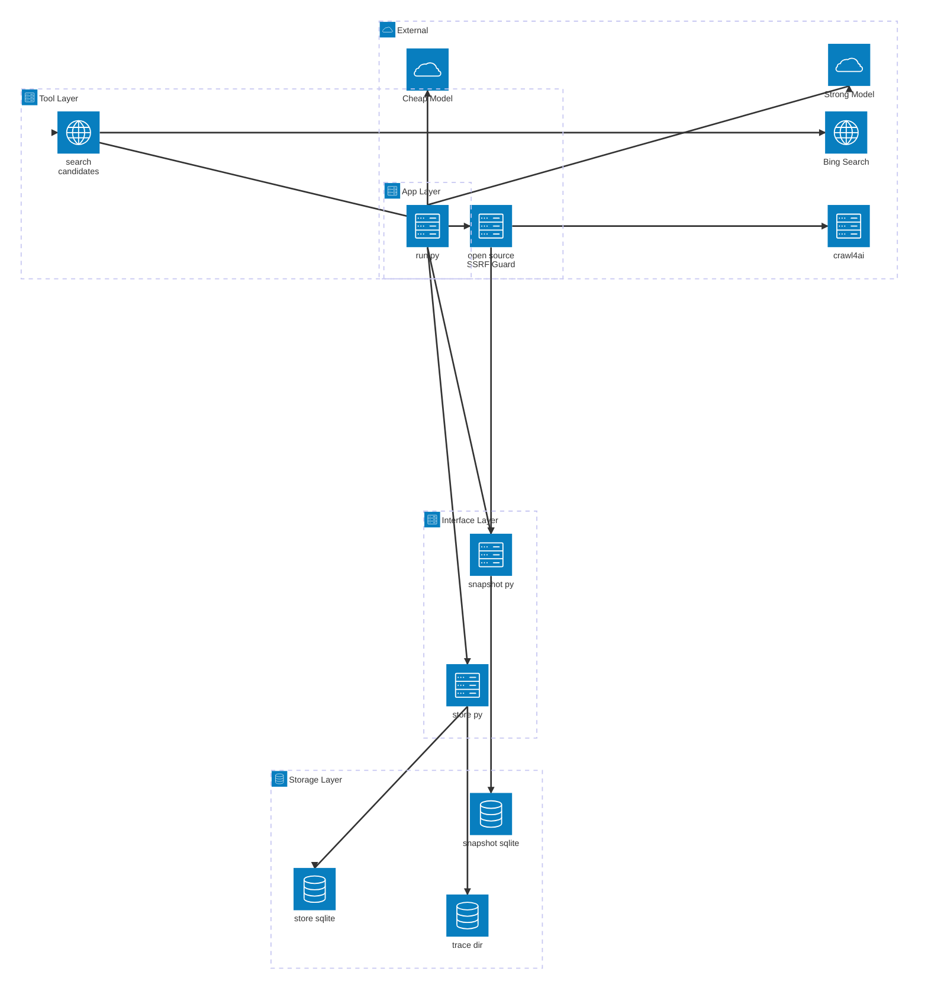
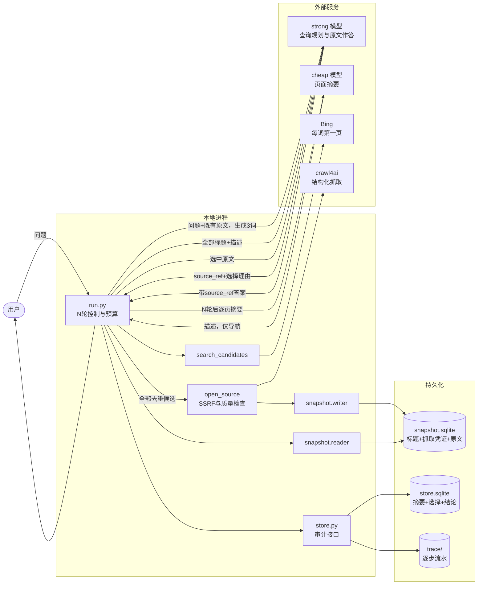
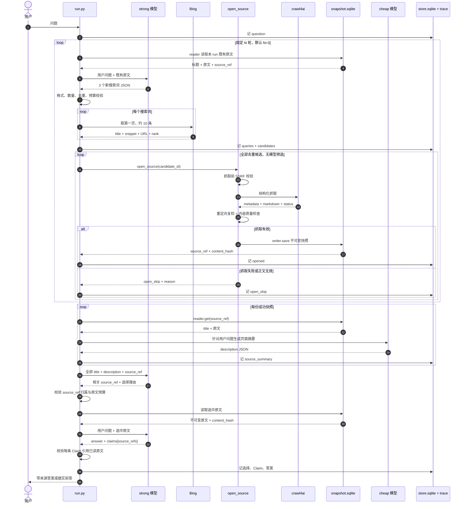

# Web Search 架构设计

> 状态：Target Design（当前 PoC 尚未完全实现）
>
> 日期：2026-07-11
>
> 目的：为 Web Search 单独建模。公网网页与结构化索引库是两类不同的原文世界，本文不复用索引库的“逐层下降选枝”抽象，而是按网页自身规律描述系统。目标流程以固定多轮探索、全量抓取、分层阅读和原文作答为核心；当前实现差距见 §9。

## 1. 为什么单独设计

结构化索引库有一棵干净的树：目录、章节、条文层层可导航，命中即权威，版本由库自己锁定。公网网页没有这些前提：

- **没有干净的导航树**。入口只有搜索引擎排序结果，混着广告、转载、过期页和低质内容。
- **问题深度事前未知**。首轮结果常会暴露新术语、新主体或新争议，需要把已读原文反馈给强模型，再生成下一轮查询。
- **抓取失败是常态**。登录墙、付费墙、反爬、JS 动态渲染和页面失效都可能使候选打不开；失败必须成为可记录、可跳过的正常路径。
- **网页没有版本号**。同一 URL 会变化或消失；抓取时必须存不可变快照和内容哈希，之后不再回访原页。
- **网页内容不可信**。正文可能含提示注入，一律只当数据，不执行其中指令。
- **抓取会主动向外发请求**。必须在请求前和重定向后执行 SSRF 守卫。

因此骨架是：**强模型提出查询 → Bing 每词取第一页 → 全量抓取并存快照 → 迭代 N 轮 → 弱模型生成导航摘要 → 强模型选择并阅读原文 → 带来源作答**。

这里没有“模型先挑搜索候选”与“弱模型逐字取证”两步。搜索引擎已完成第一页排序，再让模型预选只会增加调用和黑箱判断；快照增长本身可接受。弱模型只压缩原文供最终导航，不提供事实证据。

## 2. 产品目标

- **探索有深度**：所有问题默认探索 `N > 1` 轮；暂定 `MAX_ROUNDS = 3`。
- **高召回**：每轮每个查询词取 Bing 第一页，去重后全部尝试抓取，不做模型候选筛选。
- **原文作答**：标题和弱模型摘要只导航；最终事实只能来自强模型实际读过的快照原文。
- **可溯源**：事实结论携带 `source_ref`，指向带哈希的不可变快照。
- **可审计**：查询、搜索结果、抓取结果、摘要、原文选择理由、结论和模型调用均落 trace。
- **流程可控**：模型只返回约定 JSON；轮数、抓取、预算、校验与终止均由 `run.py` 控制。
- **大上下文优先**：按强模型 1M token 上下文设计；输入预算设为 `MAX_STRONG_INPUT_TOKENS = 800_000`，预留输出和系统指令空间。

## 3. 网页获取的三个动作

网页获取收敛为三个受控动作，实现在 `poc/search_mcp/server.py`。它们以 FastMCP 声明，也可由 `run.py` 进程内直调；PoC 走后者。

| 动作 | 签名 | 职责 | 返回 |
| --- | --- | --- | --- |
| 搜索 | `search_candidates(query, k=10)` | 取 Bing 第一页导航结果 | `[{candidate_id, query, rank, title, url, snippet}]` |
| 抓取+存档 | `open_source(candidate_id)` | SSRF 校验、crawl4ai 抓取、结构检查、锁版本 | `{source_ref, source_uri, title, content_hash, char_len, fetched_at, crawl_meta}` |
| 读取 | `reader.get(source_ref)` | 从 `snapshot.sqlite` 读取指定快照原文及抓取字段 | `{source_ref, source_uri, title, content_hash, crawl_meta, text}` |

`open_source` 只接受当前 run 中 `search_candidates` 登记过的 `candidate_id`。模型不能提交任意 URL。

### 3.1 搜索：`search_candidates`

- 后端固定 Bing（`ddgs`，`backend="bing"`）；搜索结果仅导航，不作证据。
- `MAX_QUERIES_PER_ROUND = 3`，每词 `RESULTS_PER_QUERY = 10`，即第一页规模。
- 每轮理论候选最多 30 条；按规范化 URL 去重。三轮理论上限约 90 条，重复 URL 通常会使实际数量更少。
- 每条结果记录 `query`、页内 `rank`、`title`、`snippet` 和 URL，便于回放 Bing 当时如何排序。
- `candidate_id = sha1(query|url)[:12]`，登记进 run 内候选表。
- 429 / ratelimit 按 `1, 3, 5, 9s` 退避，最多 4 次。

### 3.2 抓取：crawl4ai

搜索所得候选去重后全部进入 `open_source`，不经过模型挑选：

1. 由 `candidate_id` 取 URL；未知 id 拒绝。
2. 抓取前 `_is_public_http` 校验 scheme、DNS 与所有解析地址，拦截内网、环回、link-local、保留和组播地址。
3. `POST {CRAWL4AI_BASE}/crawl`，由 crawl4ai 完成请求、JS 渲染和正文抽取。
4. 校验 `results[0].success`、正文非空及最低质量信号；失败记录 `open_skip`，继续下一条。
5. 对最终 URL 再执行 `_is_public_http`，防止重定向越界。
6. 接收 crawl4ai 的结构化字段，而非只取一段 markdown：至少保留 `status_code`、`final_url`、页面 `metadata`、`raw_markdown` / `fit_markdown` 长度及实际采用的正文类型。

crawl4ai 是唯一抓取后端，但不是可信边界。其失败不终止整轮；其返回必须由本地程序校验后才能存档。

### 3.3 存档：锁版本

抓取成功后经 `snapshot.writer.save()` 写 `snapshot.sqlite`：

1. 正文为空或低于质量下限则不存；单页最大 `MAX_BYTES = 4_000_000`。
2. `content_hash = "sha256:" + sha256(text)`。
3. `snap_id = sha1(final_url|content_hash)[:16]`，`source_ref = "source:web/<snap_id>"`。
4. 保存 URL、标题、正文、内容哈希、抓取时间及 §3.2 的结构化抓取凭证。
5. `snap_id` 唯一；相同版本不重复写。正文与抓取凭证一经写入即不可变。

快照膨胀不是正常流程中的筛选理由；真正的约束是磁盘配额和模型上下文预算。默认三轮约 90 页，另设高位安全阈值 `MAX_TOTAL_SOURCES = 300`，防止配置错误造成无界抓取。

### 3.4 读取：`snapshot.reader`

`run.py` 只持有 `snapshot.make_reader()` 返回的 reader；`server.py` 的 `open_source` 只持有 writer。二者均不直接访问 SQLite：

- `reader.get(source_ref)`：读取一份原文。
- `reader.list_run_sources(run_id)`：列出本 run 已归档的标题、哈希和抓取元数据，供组装模型输入。
- reader 无 `.save()`；writer 无 `.get()`。

这是能力对象隔离，不是 Python 沙箱。安全边界来自接口最小化、数据库文件权限与进程部署，而非可绕过的调用栈白名单。

## 4. 系统架构总览

### 4.1 组件架构



### 4.2 数据流



组件边界：

- `run.py` 独占控制流；模型不能改变轮数、直接触网或访问 DB。
- Bing 的标题和 snippet、cheap 的摘要都只用于导航。
- crawl4ai 是不可信外部抓取器；`open_source` 保留 SSRF 与质量检查责任。
- `snapshot.sqlite` 保存不可变网页版本；`store.sqlite + trace/` 保存派生摘要、选择理由、Claim 和答案。
- 三层资料是逻辑视图：**标题**来自搜索/页面 metadata，**描述**来自 cheap 摘要，**原文**来自快照。描述不覆盖原文，也不升级为证据。

## 5. N 轮探索与最终作答



### 5.1 每轮探索

1. **生成查询**（strong）：第 1 轮输入用户问题；第 2 轮起输入用户问题和目前已归档的全部原文。输出恰好 3 个查询词；应寻找新事实面，避免重复旧词。
2. **搜索第一页**：每词取 Bing 前 10 条，记录排名，跨词、跨轮按规范化 URL 去重。
3. **全量抓取**：所有新候选均尝试 `open_source`；无模型候选选择。失败即记录并跳过。
4. **反馈深化**：下一轮 strong 从已读原文中识别新主体、术语、时间线、冲突点和证据缺口，据此生成新词。
5. **固定收敛**：默认完整执行 3 轮；若达到 800k 输入预算、300 份快照或没有任何新 URL，程序提前结束探索并进入汇总。

### 5.2 三层资料

N 轮结束后，为每份快照构造：

```json
{
  "source_ref": "source:web/…",
  "title": "页面标题",
  "description": "cheap 模型针对用户问题生成的导航摘要",
  "original": "snapshot.sqlite 中的不可变正文"
}
```

三层用途严格分离：

- `title`：粗定位。
- `description`：帮助 strong 在大量页面中筛选；可能漂移，不作证据。
- `original`：最终回答的唯一事实来源。

摘要不修改快照正文，作为派生记录经 `store.log_source_summary()` 写审计 DB；记录 `source_ref`、模型、prompt 版本和输入 `content_hash`。

### 5.3 最终选择与作答

1. strong 一次读入全部 `title + description + source_ref`，返回相关 `source_ref` 和逐项选择理由。
2. `run.py` 校验 source_ref 属本 run，随后从 snapshot reader 读取这些原文。
3. strong 读取选中原文后回答；每条事实 Claim 必须列出一个或多个 `source_ref`。
4. 程序只接受引用已实际送入最终调用、且哈希匹配的 source_ref。

默认 `MAX_FINAL_SOURCES = 100`，最终原文输入仍受 800k token 总预算约束。选择上限刻意偏高，以降低漏选；若标题和摘要目录本身超过预算，先停止继续探索，不在终局静默丢页。

## 6. 程序校验

质量不能只靠模型自觉，`run.py` 至少执行六道校验：

1. **查询输出**：JSON schema 正确、每轮至多 3 词、长度有界、轮内和历史去重。
2. **候选归属**：`open_source` 只接收本 run Bing 返回的 `candidate_id`。
3. **抓取有效**：HTTP/crawl 状态、最终 URL、正文非空、最小正文长度和结构化字段通过检查。
4. **快照一致**：每次 reader 读出的 `content_hash` 与存档记录一致。
5. **选择归属**：strong 选择的每个 source_ref 必须属于本 run，并把选择理由落 trace。
6. **Claim 有源**：每条 Claim 只能引用已送入最终 strong 调用的原文 source_ref。

不再做 `quote in text` 的“逐字取证”校验。它只能证明字符串存在，不能证明引文足以支持 Claim；新流程把弱模型摘要降为导航材料，让 strong 对实际原文负责。代价是 Claim 与原文之间的语义蕴含仍依赖 strong，程序只能验证“读过并引用了哪份原文”，不能机械证明结论正确。

以下情况据实拒答：搜索无结果、所有页面都抓取失败、最终没有可用原文、或 strong 判断原文不足以回答。

## 7. 模型分工

- **strong**：每轮分析问题与既有原文、生成 3 个新查询；N 轮后阅读标题和摘要目录、选择原文；最终阅读原文并回答。假设 1M token 上下文，单次输入预算 800k。
- **cheap**：仅在 N 轮结束后逐页生成与问题相关的简短描述。摘要只导航，不允许成为 Claim 来源。

模型调用无状态；每次输入由 `run.py` 从问题、快照与审计对象重建。模型返回结构化 JSON，不持有控制流。

### 三个已知模型风险

1. **查询偏航**：后续轮可能沿错误方向继续搜索。缓解：每次都重放原始问题，要求输出“新查询覆盖的证据缺口”，并记录 query rationale。
2. **摘要漂移或漏点**：会影响终局选页召回。缓解：摘要明确标注“仅导航”，选择上限偏高；最终答案禁用摘要作证据。
3. **原文选择黑箱**：strong 可能漏选关键页面。缓解：返回 source_ref、选择理由和相关性等级并完整审计；允许选多，不以压缩快照为目标。此风险无法被程序完全消除。

## 8. 存储与审计

- **快照 DB** `snapshot.sqlite`：经 `snapshot.py` 写入标题、URL、原文、哈希、抓取凭证和时间。正文不可变；`server.py` 只持 writer，`run.py` 只持 reader。
- **审计 DB** `store.sqlite`：经 `store.py` 记录 run、round、query、candidate、open/open_skip、source_summary、source_selection、claim、answer。run.py 不导入 `sqlite3`。
- **流水** `trace/<run_id>.jsonl`：记录每一步结构化输入输出和预算变化，供回放与问题定位。

`store.py` 与 `snapshot.py` 内部使用参数化 SQL、字段校验和事务；上层不直接执行 SQL。密钥与正文不写 trace，正文只以 `source_ref/content_hash` 引用。

## 9. 实现状态与迁移

本文描述目标态。当前 PoC 仍是单轮流程，并含“strong 先选候选、cheap 逐字取证、程序校验逐字引文”的旧实现。迁移按最短路径进行：

1. 把单轮控制改为固定 N 轮，后续轮输入已有快照原文。
2. `search_candidates` 默认每词取 10 条；删除 strong 候选选择和 `MAX_OPEN = 4`。
3. 所有去重候选直接进入 `open_source`；补 crawl4ai 结构化字段存档与质量检查。
4. 删除 cheap 逐字取证；改为 N 轮后逐页摘要，并保存派生摘要审计记录。
5. 新增“目录选择原文”和“基于所选原文作答”两次 strong 调用。
6. 删除引文 substring 校验，改为 source_ref 归属、哈希和 Claim 引用范围校验。

## 10. 安全与资源边界

- **SSRF**：请求前及重定向后检查；仅允许公网 http(s)。
- **提示注入**：网页正文、标题、snippet、摘要均是不可信数据；模型系统指令明确禁止执行页面内指令。
- **抓取边界**：默认 3 轮 × 3 词 × 每词第一页 10 条；URL 去重；高位上限 300 份来源。
- **上下文边界**：按 1M 模型窗口设计，单次输入最多 800k token；达到预算即停止扩展，不静默截掉终局目录。
- **页面边界**：单页存档最多 4MB；超限明确标记截断，不能伪装成完整原文。
- **凭据隔离**：`CRAWL4AI_BASE_URL` / `CRAWL4AI_TOKEN` 走环境变量，不入库、不入仓。

## 11. 边界与局限

- crawl4ai 不能保证抓到登录墙、付费墙、强反爬、滚动加载或特殊媒体内容；当前策略是记录失败并依靠同轮其他结果，而非假装成功。
- crawl4ai 的 `success=true` 不等于正文正确；结构化字段、正文长度和 raw/fit 对照只能发现部分异常，不能证明语义完整。
- Bing 第一页优先级提高了平均质量，但不保证权威、无偏或覆盖全部观点。
- cheap 摘要可能漂移或遗漏；因其只导航，风险主要是漏选页面，而不是直接污染事实答案。
- strong 的查询规划、页面选择和 Claim 推理仍是模型判断，审计能使黑箱可见，不能使其成为形式证明。
- 1M 是目标模型假设；换用更小上下文模型时，必须重新降低轮数、每页数量或引入可验证的分层压缩，不可静默裁剪。
- SSRF 守卫与本地 fake-ip 代理模式冲突；验证与跑测需关闭该代理或提供可信解析通道。

***

`ponytail:` 暂只保留 crawl4ai 单抓取后端与固定 N 轮；多后端降级、动态停止和摘要交叉校验，待真实失败率或上下文成本证明必要时再加。
